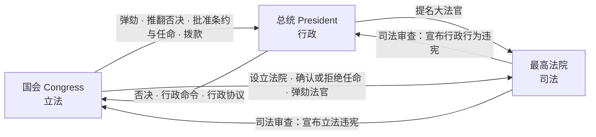

# Unit 2 MOC — Interactions Among Branches of Government

> [!abstract] 概述
> Unit 2 权重 **25–36%**（最重单元），主题：**立法、行政、司法三部门与官僚机构的结构、权力、互动与制衡**。15 个 Topic 覆盖国会、总统、法院、官僚体系四大行为者，以及它们之间的政策互动。本单元关联 **6 份**必考文献：Federalist No. 10 / 51 / 70 / 78、Emancipation Proclamation、Gettysburg Address。必考案例（CED 映射 8 个）：Marbury、McCulloch、Brown、Baker、NYT v. US、Shaw、Lopez、Citizens United。

## 十五个 Topic 导航

| Topic | 官方名称 | 核心问题 | 关联文献 | 关联案例（CED 映射） |
|---|---|---|---|---|
| 2.1 | Congress: The Senate and the House of Representatives | 两院结构与差异？ | 联邦党人 10 | McCulloch、Baker |
| 2.2 | Structures, Powers, and Functions of Congress | 国会的权力类型？ | 联邦党人 10 / 51 | Shaw |
| 2.3 | Congressional Behavior | 议员如何行为？ | 联邦党人 10 / 51 | Baker、Shaw |
| 2.4 | Roles and Powers of the President | 总统的正式与非正式权力？ | 联邦党人 10 / 51 / 70、解放宣言、葛底斯堡演说 | — |
| 2.5 | Checks on the Presidency | 如何制衡总统？ | 联邦党人 10 / 51 / 70、解放宣言 | — |
| 2.6 | Expansion of Presidential Power | 总统权力如何扩张？ | 联邦党人 10 / 51 / 70 | NYT v. US |
| 2.7 | Presidential Communication | 总统如何与公众沟通？ | 联邦党人 70、葛底斯堡演说 | — |
| 2.8 | The Judicial Branch | 法院结构与权力？ | 联邦党人 51 / 70 / 78 | Marbury、NYT v. US |
| 2.9 | The Role of the Judicial Branch | 司法能动 vs 克制？ | 联邦党人 78 | NYT v. US |
| 2.10 | The Court in Action | 最高法院如何运作？ | 联邦党人 51 / 78 | Baker、Lopez |
| 2.11 | Checks on the Judicial Branch | 如何制衡法院？ | 联邦党人 51 / 78 | Marbury、McCulloch、Brown、NYT |
| 2.12 | The Bureaucracy | 官僚机构类型？ | 联邦党人 70 | — |
| 2.13 | Discretionary and Rulemaking Authority | 官僚如何制定规则？ | 联邦党人 70 | Citizens United |
| 2.14 | Holding the Bureaucracy Accountable | 如何问责官僚？ | 联邦党人 51 / 70 | — |
| 2.15 | Policy and the Branches of Government | 分支间政策动态？ | 联邦党人 51 / 70 | Marbury |

## 0 三部门制衡总览

> [!tip] 读图要点
> 每一条箭头都是 FRQ 论证的可引用证据。**Federalist No. 51** 解释这张图为何成立："Ambition must be made to counteract ambition"。

## 1 Topic 2.1 — Congress: The Senate and the House of Representatives

| 特征 | 众议院 | 参议院 |
|---|---|---|
| 席位 | 435 | 100 |
| 任期 | 2 年 | 6 年 |
| 选区 | 国会选区（较小） | 全州（较大） |
| 专属权力 | 岁入法案、弹劾 | 批准任命、条约、弹劾审判 |
| 年龄要求 | 25 岁 | 30 岁 |

> [!tip] 设计逻辑
> 众议院贴近民众（短任期、小选区）；参议院稳定审慎（长任期、大选区）。

> [!note] Federalist No. 70 与 No. 78 的分工
> **No. 70**（Hamilton）论证行政部门的**统一性**——"energy in the executive" 是良好政府的首要特征。**No. 78**（Hamilton）论证司法部门的**独立性**——终身任职使法官不受政治压力。两篇合起来解释 Unit 2 两端的制度设计。

## 2 Topic 2.2 — Structures, Powers, and Functions of Congress

| 权力类型 | 定义 | 示例 |
|---|---|---|
| Enumerated powers（列举权力） | 宪法第一条第八款明确授予 | 征税、开支、管理商业、宣战、铸币 |
| Implied powers（默示权力） | 必要和适当条款引申 | McCulloch v. Maryland；国家银行 |
| Non-legislative powers（非立法权力） | 监督、调查、弹劾、修宪提案 | 听证、弹劾审判 |
| Committee system（委员会制度） | 常设、特别、会议、联合委员会 | 岁入委员会、拨款委员会、规则委员会 |

**立法流程**：两院通过相同形式 + 总统签署（或推翻否决需 2/3）。

## 3 Topic 2.3 — Congressional Behavior

| 概念 | 定义 | 关键点 |
|---|---|---|
| Incumbency advantage（在职优势） | 在职者高票连任 | 知名度、筹款、个案服务、不公正划分；众议院 90%+ 连任率 |
| Filibuster（冗长辩论） | 参议院无限期辩论阻止立法 | 需 60 票终止辩论（cloture） |
| Gerrymandering（不公正划分） | 划线偏袒某党 | 党派与种族（Shaw v. Reno 限制种族不公正划分） |
| Pork-barrel spending（猪肉桶支出） | 议员为选区争取项目资金 | 建立选民支持 |
| Logrolling（滚木立法） | 议员互投赞成票 | 促进联盟构建 |

## 4 Topic 2.4 — Roles and Powers of the President

| 权力类型 | 定义 | 示例 |
|---|---|---|
| Formal/expressed powers（正式权力） | 宪法第二条明确授予 | 总司令、否决、任命法官/部长、赦免、缔约（需参议院）、签署/否决立法 |
| Informal/inherent powers（非正式权力） | 文本未载但总统主张 | 行政命令、行政协议、签署声明、行政特权、 bully pulpit |
| Executive order（行政命令） | 对行政部门具有法律效力的指令 | 解放宣言；DACA；旅行禁令 |
| Veto（否决） | 总统拒绝签署法案 | 常规否决；口袋否决（国会休会） |

> [!note] 联邦党人 70 核心论点
> Hamilton 主张**有力统一行政**：unity（统一）、duration（稳定任期）、adequate provisions（充分保障）、competent powers（充分权力）。反对委员会制行政。

## 5 Topic 2.5 — Checks on the Presidency

| 制衡 | 机制 |
|---|---|
| Congressional override（国会推翻） | 两院各 2/3 可推翻否决 |
| Impeachment（弹劾） | 众议院弹劾；参议院审判并罢免（2/3 票） |
| War Powers Resolution 1973 | 总统须在 **48 小时**内通知国会军事行动；**60 天**内须获授权，否则须在额外 **30 天**撤离窗口内撤军 |
| Judicial review（司法审查） | 法院可宣布行政行为违宪（Youngstown Sheet & Tube v. Sawyer） |
| Senate confirmation（参议院批准） | 参议院须确认总统任命 |

## 6 Topic 2.6 — Expansion of Presidential Power

| 因素 | 如何扩张权力 |
|---|---|
| Executive orders | 总统绕过国会直接制定政策 |
| Executive agreements | 总统与外国达成协议无需参议院批准条约 |
| Signing statements | 总统签署时解释法律，有时挑战条款 |
| Crisis and war | 紧急状态主张扩张权力（Lincoln、FDR、后 9/11） |
| Unitary executive theory | 总统对行政职能有直接控制权 |

> [!warning] 权力扩张规律
> **危机中扩张，平静中收缩**。国会用监督、拨款和《战争决议》制衡总统权力。

## 7 Topic 2.7 — Presidential Communication

| 工具 | 定义 | 目的 |
|---|---|---|
| Bully pulpit（天字讲坛） | 总统用公共平台倡导政策 | 塑造舆论；向国会施压 |
| State of the Union（国情咨文） | 年度国会演讲 | 设定立法议程；报告国家状况 |
| Press conferences（记者招待会） | 总统回答记者提问 | 直接与公众沟通 |
| Social media（社交媒体） | 通过 Twitter 等直接沟通 | 绕过传统媒体；动员支持者 |

## 8 Topic 2.8 — The Judicial Branch

| 概念 | 定义 | 关键点 |
|---|---|---|
| Judicial review（司法审查） | 法院可宣布法律/行政行为违宪 | Marbury v. Madison (1803)；宪法未明载 |
| Court structure（法院结构） | 地区法院（初审）$\to$ 巡回上诉法院 $\to$ 最高法院 | 94 个地区、13 个巡回区、1 个最高法院（9 名大法官） |
| Appointment process（任命程序） | 总统提名；参议院确认 | 高度政治化；终身任职 |
| Jurisdiction（管辖权） | 原始（初审）vs. 上诉（复审） | 最高法院两者皆有；以上诉为主 |

> [!note] 联邦党人 78 核心论点
> Hamilton 称司法为"**最不危险的分支**"（no sword, no purse）。司法审查赋予其巨大权力——法院可宣布立法与行政行为违宪。

## 9 Topic 2.9 — The Role of the Judicial Branch

| 概念 | 定义 | 关键点 |
|---|---|---|
| Judicial activism（司法能动） | 法院应积极解释宪法解决社会问题 | Warren 法院；Brown v. Board |
| Judicial restraint（司法克制） | 法院应尊重民选部门；严格解释 | 原旨主义；文本主义；Scalia、Thomas |
| Stare decisis（遵循先例） | 让判决站立；遵循先例 | 促进稳定；可被推翻（Brown 推翻 Plessy） |
| Rule of law（法治） | 政府与法律受法律原则约束 | 确保可预测性与公平 |

## 10 Topic 2.10 — The Court in Action

| 阶段 | 内容 |
|---|---|
| Certiorari（调卷令） | 当事人申请；9 名大法官中 4 人同意受理（"rule of four"） |
| Briefs（诉状） | 双方提交书面辩论；允许 amicus curiae（法庭之友） |
| Oral argument（口头辩论） | 各方 30 分钟；大法官提问 |
| Conference（会议） | 大法官秘密投票；多数方资深大法官分配意见撰写 |
| Opinion（意见） | 多数意见设先例；协同意见与异议意见可附 |

## 11 Topic 2.11 — Checks on the Judicial Branch

| 制衡 | 机制 |
|---|---|
| Appointment process | 总统提名；参议院确认或拒绝 |
| Impeachment | 国会可因不当行为罢免法官 |
| Jurisdiction stripping | 国会有权限制最高法院的上诉管辖权 |
| Amendment process | 宪法修正案可推翻法院判决 |
| Non-compliance | 其他部门可抵抗或拖延执行法院判决 |

## 12 Topic 2.12 — The Bureaucracy

| 类型 | 定义 | 示例 |
|---|---|---|
| Cabinet departments（内阁部门） | 15 个行政部门 | 国务院、国防部、财政部 |
| Independent agencies（独立机构） | 内阁部门之外的机构 | EPA、SEC、FCC |
| Regulatory commissions（监管委员会） | 监管行业的独立委员会 | FEC、SEC、FCC；两党；固定任期 |
| Government corporations（政府公司） | 类企业政府实体 | USPS、Amtrak |

## 13 Topic 2.13 — Discretionary and Rulemaking Authority

| 概念 | 定义 | 关键点 |
|---|---|---|
| Rule-making（规则制定） | 官僚机构制定具有法律效力的规章 | 行政程序法；通知-评论程序 |
| Discretionary authority（自由裁量权） | 官僚机构决定如何实施法律 | 国会设定目标；官僚选择手段 |
| Implementation（执行） | 官僚机构执行国会通过的法律 | 法律适用中有自由裁量 |
| Iron triangle（铁三角） | 官僚机构 + 国会委员会 + 利益集团 | 相互支持；政策子系统；难以渗透 |
| Issue networks（议题网络） | 对某政策领域感兴趣的松散行为者联盟 | 比铁三角更开放；专家、倡导者、媒体 |

## 14 Topic 2.14 — Holding the Bureaucracy Accountable

| 机制 | 如何运作 |
|---|---|
| Congressional oversight（国会监督） | 听证、调查、预算控制、政府问责办公室 |
| Presidential control（总统控制） | 任命机构首长；行政命令；管理和预算办公室审查 |
| Judicial review（司法审查） | 法院可审查机构行为的合法性与合宪性 |
| Transparency（透明度） | 信息自由法；阳光政府法；公众参与 |
| Whistleblowers（吹哨人） | 内部人员揭露不当行为；受法律保护 |

## 15 Topic 2.15 — Policy and the Branches of Government

| 动态 | 机制 |
|---|---|
| Divided government（分裂政府） | 不同政党控制不同分支；产生僵局；立法更难 |
| Unified government（统一政府） | 同一政党控制各分支；促进行动；仍面临制度摩擦 |
| Unilateral presidency（单边总统制） | 总统在国会僵局时单独行动（行政命令、军事行动） |
| Policy subsystems（政策子系统） | 铁三角与议题网络塑造特定政策领域 |

> [!tip] 核心张力
> "institutional presidency" vs. "unitary executive" 辩论是核心。总统是否对所有行政职能有直接控制权？国会用监督、拨款和国会预算办公室制衡总统权力。

## 相关链接

- [[AP_US_Government_Main_MOC]]
- [[AP_US_Gov_Unit1_Foundations_of_American_Democracy]]
- [[AP_US_Gov_Unit3_Civil_Liberties_and_Civil_Rights]]
- [[AP_US_Gov_Error_Traps]]
