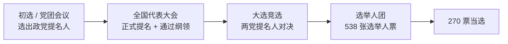

# Unit 5 MOC — Political Participation

> [!abstract] 概述
> Unit 5 权重 20–27%，主题：**公民参与政治的渠道与机制**。13 个 Topic 覆盖投票行为、选举制度、政党、利益集团、竞选、竞选资金与媒体。本单元与 Unit 4 高度联动——意识形态（U4）驱动参与行为（U5）。关联文献：**Federalist No. 10**（5.3–5.7, 5.10, 5.11）、**Letter from Birmingham Jail**（5.7）。关联案例：**Citizens United**（5.6, 5.7）、**Baker v. Carr**（5.1, 5.2）、**Shaw v. Reno**（5.1, 5.2, 5.9）、**NYT v. US**（5.12）、**McDonald v. Chicago**（5.6, 5.7）。

## 十三个 Topic 导航

| Topic | 官方名称 | 核心考点 | 关联文献/案例 |
|---|---|---|---|
| 5.1 | Voting Rights and Models of Voting Behavior | 六条投票权修正案 + 四种投票模型 | Baker v. Carr、Shaw v. Reno |
| 5.2 | Voter Turnout | 影响投票率的因素 | Baker v. Carr、Shaw v. Reno |
| 5.3 | Political Parties | 政党功能与两党制 | Federalist No. 10 |
| 5.4 | How and Why Political Parties Change and Adapt | 政党重组与极化 | Federalist No. 10 |
| 5.5 | Third-Party Politics | 第三党障碍与作用 | Federalist No. 10 |
| 5.6 | Interest Groups Influencing Policymaking | 利益集团策略 | Federalist No. 10、Citizens United |
| 5.7 | Groups Influencing Policy Outcomes | 铁三角与议题网络 | Federalist No. 10、Citizens United、Birmingham Jail |
| 5.8 | Electing a President | 总统选举流程 | — |
| 5.9 | Congressional Elections | 国会选举特征 | Shaw v. Reno |
| 5.10 | Modern Campaigns | 现代竞选特征 | Federalist No. 10、Citizens United |
| 5.11 | Campaign Finance | 竞选资金法律演进 | Federalist No. 10、Citizens United、Buckley |
| 5.12 | The Media | 媒体功能 | NYT Co. v. United States |
| 5.13 | Changing Media | 新媒体生态 | — |

## 1 Topic 5.1 — Voting Rights and Models of Voting Behavior

**LO 5.1.A — 宪法与立法中的投票权保护（EK 5.1.A.1，六条修正案）**：

| 修正案 | 内容 |
|---|---|
| 第 14 修正案 | 授予所有在美出生或归化者公民权，包括曾被奴役者 |
| 第 15 修正案 | 授予非裔美国男性投票权 |
| 第 17 修正案 | 参议员改由人民直选（原由州议会选举） |
| 第 19 修正案 | 授予女性投票权 |
| 第 24 修正案 | 废除人头税（poll tax）这一投票的结构性障碍 |
| 第 26 修正案 | 将投票年龄降至 18 岁 |

**LO 5.1.B — 四种投票行为模型（EK 5.1.B.1）**：

| 模型 | 定义 |
|---|---|
| Rational choice voting（理性选择投票） | 基于自认为最符合自身利益的选择 |
| Retrospective voting（回顾性投票） | 根据在任政党或候选人近期表现，决定是否让其连任 |
| Prospective voting（前瞻性投票） | 基于对政党或候选人未来表现的预测投票 |
| Straight ticket voting（直线投票） | 一张选票上全投同一政党的候选人 |

> [!warning] 三处术语陷阱
> 1. CED 只有 **4 个**投票模型，不是 5 个。
> 2. **pocketbook voting / sociotropic voting 不在 CED 中**（全文 0 命中）——属政治学通识，但 AP 不考该表述。
> 3. **straight ticket voting 是 CED 的第 4 个模型**，常被备考资料漏掉（它们往往误补 pocketbook / sociotropic）。

> [!tip] 与 Unit 3 交叉
> 第 24 修正案（人头税）也出现在 Topic 3.11 与 3.12 的民权脉络中——同一修正案可跨单元命题。

## 2 Topic 5.2 — Voter Turnout

| 因素 | 对投票率的影响 |
|---|---|
| Registration barriers（登记障碍） | 美国须预登记；他国自动登记；降低投票率 |
| Weekday elections（工作日选举） | 美国周二选举；他国用周末/假日 |
| Frequency of elections（选举频率） | 选举越多，机会越多，但也带来选民疲劳 |
| Demographics（人口统计） | 年长、富裕、高教育投票率更高 |
| Competitiveness（竞争性） | 摇摆州和激烈竞争选举投票率更高 |

> [!warning] 投票率事实
> 美国投票率低于多数民主国家。中期选举投票率 $\approx$ 40%；总统选举投票率 $\approx$ 60%。年轻选民和少数族裔投票率更低。

## 3 Topic 5.3 — Political Parties

| 概念 | 定义 | 关键点 |
|---|---|---|
| Party functions（政党功能） | 提名候选人、动员选民、治理、组织政府、提供问责 | 政党连接公民与政府 |
| Two-party system（两党制） | 民主党与共和党主导；第三党面临结构性障碍 | 单一选区制 + 赢者通吃选举人团（Duverger 定律） |
| Party platform（政党纲领） | 政党对议题的正式立场声明 | 全国代表大会通过；指导候选人 |
| National committee（全国委员会） | DNC 和 RNC；协调竞选、筹款和政党战略 | 闭会期间运作 |

> [!tip] Duverger 定律
> 单一选区相对多数制倾向产生**两党制**。美国是典型例证——第三党几乎无法在联邦层级获胜。

## 4 Topic 5.4 — How and Why Parties Change

| 概念 | 定义 | 关键案例 |
|---|---|---|
| Realignment（重组） | 政党联盟和主导议题的重大转变 | 1800（Jefferson）、1860（Lincoln/共和党）、1932（FDR/新政）、1968（南方重组） |
| Dealignment（脱钩） | 选民放弃政党认同；独立选民增加 | 分裂投票；政党忠诚下降 |
| Polarization（极化） | 政党间意识形态距离扩大 | 影响国会、媒体、公众；僵局 |
| Coalition changes（联盟变化） | 政党获得或失去人口群体 | 南方白人转共和党；少数族裔转民主党 |

## 5 Topic 5.5 — Third-Party Politics

| 角色 | 解释 |
|---|---|
| Spoiler effect（搅局效应） | 第三党候选人分走主要政党候选人选票，可能改变结果（Nader 2000, Perot 1992） |
| Issue adoption（议题采纳） | 第三党提出议题后被主要政党采纳（进步党、改革党） |
| Structural barriers（结构性障碍） | 单一选区制、赢者通吃选举人团、选票准入法、辩论排除 |

## 6 Topic 5.6 — Interest Groups Influencing Policymaking

| 概念 | 定义 | 关键点 |
|---|---|---|
| Functions（功能） | 代表成员、教育公众、游说政府、动员参与 | 多元接触点影响政策 |
| Strategies（策略） | 直接游说、草根游说、诉讼、助选、公众运动 | 依议题和资源选策略 |
| PACs（政治行动委员会） | 向竞选捐款的委员会 | 有限捐款（\$5,000/候选人/选举） |
| Super PACs（超级政治行动委员会） | 仅独立支出委员会；无限花钱 | Citizens United 促成；不可与候选人协调 |
| 501(c)(4)（社会福利组织） | 无限捐款、捐赠者匿名 | 暗钱；无须披露 |

> [!tip] Citizens United 的冲击
> **Citizens United v. FEC (2010)** 允许企业/工会无限独立支出 $\to$ 超级政治行动委员会兴起。这是理解现代竞选资金的关键案例。

## 7 Topic 5.7 — Groups Influencing Policy Outcomes

| 机制 | 如何运作 |
|---|---|
| Iron triangles（铁三角） | 机构 + 委员会 + 利益集团；封闭政策子系统；相互支持 |
| Issue networks（议题网络） | 对某政策领域感兴趣的松散行为者联盟；比铁三角更开放 |
| Litigation（诉讼） | 利益集团起诉挑战或捍卫政策（NAACP、NRA） |
| Grassroots mobilization（草根动员） | 组织公民联系议员、抗议或投票 |

## 8 Topic 5.8 — Electing a President

| 阶段 | 内容 | 关键点 |
|---|---|---|
| Primaries and caucuses（初选与党团会议） | 选民选择政党提名人 | 封闭式、开放式或整体初选；部分州用党团会议 |
| National conventions（全国代表大会） | 政党正式提名候选人；通过纲领 | 今多属仪式性；提名人在初选决定 |
| General election（大选） | 政党提名人之间竞选；选举人团决定 | 赢者通吃多数州；摇摆州主导 |
| Electoral College（选举人团） | 每州选举人数 $=$ 众院席位数 $+$ 参院席位数 $+$ DC（共 538；270 票胜） | 候选人可输普选票当选（2000、2016） |

> [!warning] 选举人团三大考点
> 1. **赢者通吃**（除 Maine、Nebraska 按国会选区分配）。
> 2. 选举人票 $\neq$ 普选票：2000 年 Bush、2016 年 Trump 均输普选票而当选。
> 3. 摇摆州（swing states）决定胜负——竞选资源集中于少数州。

## 9 Topic 5.9 — Congressional Elections

| 特征 | 解释 |
|---|---|
| Midterm elections（中期选举） | 非总统年国会选举；总统政党通常失席 |
| Incumbency advantage（在职优势） | 高票连任（90%+ 众院）；知名度、筹款、个案服务 |
| Redistricting（重划选区） | 每十年普查后州重划选区；不公正划分影响结果 |
| Coattail effect（衣尾效应） | 受欢迎总统候选人帮助同党候选人当选 |

## 10 Topic 5.10 — Modern Campaigns

| 要素 | 定义 | 关键点 |
|---|---|---|
| Campaign strategy（竞选策略） | 候选人选择信息、目标与战术 | 聚焦摇摆州与关键人口 |
| Media advertising（媒体广告） | 电视、广播、数字广告 | 负面广告；微目标定位 |
| Campaign finance（竞选资金） | 筹集与花费影响选举 | FECA 1971；Buckley v. Valeo (1976)；Citizens United (2010) |
| Candidate-centered（候选人中心） | 候选人以个人品牌竞选非仅政党 | 政党控制弱；个人筹款 |

## 11 Topic 5.11 — Campaign Finance

| 法律/案例 | 内容 |
|---|---|
| Federal Election Campaign Act (FECA) 1971 | 要求披露；限制开支；创建 PAC |
| Buckley v. Valeo (1976) | 维持捐款限制；推翻开支限制；**金钱 = 言论** |
| Bipartisan Campaign Reform Act (BCRA) 2002 | 禁止软钱；限制选举前议题广告 |
| Citizens United v. FEC (2010) | 允许企业/工会无限独立支出；催生超级政治行动委员会 |
| McCutcheon v. FEC (2014) | 推翻捐款总额限制 |

> [!note] Buckley 核心原则
> **"Money is speech"（金钱即言论）**——限制竞选开支 $=$ 限制言论自由。此原则是此后竞选资金放松监管的宪法基础。

## 12 Topic 5.12 — The Media

| 功能 | 定义 | 关键点 |
|---|---|---|
| Watchdog（看门狗） | 调查政府不当行为 | 第四权力；问责权力 |
| Agenda-setting（议程设置） | 媒体决定人们**想什么** | 非怎么想，而是想什么 |
| Framing（框架） | 新闻呈现方式影响解读 | 同事实 + 不同框架 = 不同结论 |
| Horse race coverage（赛马式报道） | 聚焦民调与谁赢 vs. 政策实质 | 被批肤浅 |
| Partisan media（党派媒体） | 有明确意识形态倾向的媒体 | Fox News、MSNBC；强化极化 |

## 13 Topic 5.13 — Changing Media

| 趋势 | 影响 |
|---|---|
| New media（新媒体） | 社交媒体、博客、播客、在线新闻；受众碎片化；回声室；虚假信息 |
| Decline of newspapers（报纸衰落） | 地方新闻源减少；许多社区成"新闻沙漠" |
| Cable news（有线电视新闻） | 24 小时新闻周期；党派节目；全国性议题地方化 |
| Social media（社交媒体） | 候选人-选民直接沟通；病毒内容；微目标定位；虚假信息 |
| Media consolidation（媒体合并） | 更少所有者控制更多媒体；担忧观点多样性 |

> [!tip] 媒体生态变迁
> 从三大全国网络 $\to$ 碎片化、党派化、数字化的来源。这影响公民获取信息方式与竞选沟通策略。FRQ 常要求分析媒体变化对政治参与的影响。

## 相关链接

- [[AP_US_Government_Main_MOC]]
- [[AP_US_Gov_Unit2_Interactions_Among_Branches]]
- [[AP_US_Gov_Unit4_Political_Ideologies_and_Beliefs]]
- [[AP_US_Gov_Error_Traps]]
