# Complex Inheritance and Human Heredity

> [!abstract] 概述
> 并非所有性状都遵循[[Mendelian Genetics|孟德尔遗传学]]中描述的简单显隐性规律。人类的遗传模式非常复杂，包括不完全显性、共显性、复等位基因、多基因遗传以及环境对表型的影响。此外，通过系谱分析可以追踪家族中的遗传病，而伴性遗传则解释了某些性状与性别相关的现象。

## 1. 基本概念回顾

在探讨复杂遗传之前，需要明确几个基本术语：

| 术语 | 英文 | 定义 | 例子 |
|------|------|------|------|
| **纯合子** | Homozygous | 具有两个相同等位基因的个体 | 真实遗传的黄豌豆 (YY) |
| **杂合子** | Heterozygous | 具有两个不同等位基因的个体，表现出显性性状 | 杂交黄豌豆 |
| **携带者** | Carrier | 携带隐性致病等位基因但表型正常的杂合子个体 | 表型正常但携带白化病基因 |

> [!note] 携带者的意义
> 对于隐性遗传病，携带者本身不表现出症状，但可以在减数分裂时将隐性等位基因传递给后代。如果两个携带者婚配，后代有 $1/4$ 的概率患病。

## 2. 人类遗传的基本模式
Cystic fibrosis（囊性纤维化）
- Albinism（白化病）
- Tay–Sachs disease（泰–萨克斯病）
- Galactosemia（半乳糖血症）
- Huntington’s disease（亨廷顿病）
- Achondroplasia（软骨发育不全）
- Hemophilia（血友病）
- Red–green color blindness（红绿色盲；若需单独列出也可写为 Color blindness, red–green）

### 2.1 隐性遗传病
只有当个体为纯合隐性 ($aa$) 时才会表达的遗传病。

| 疾病名称 | 发病率 (美国) | 病因 | 症状与影响 | 治疗与预防 |
|----------|---------------|------|------------|------------|
| **囊性纤维化** | 1/3500 | 膜蛋白基因缺陷 | 粘液分泌过厚，导致消化和呼吸衰竭 | 物理治疗、药物、胰酶替代 |
| **白化病** | 1/17000 | 无法正常产生黑色素 | 皮肤、毛发、眼睛无色，易受紫外线损伤 | 防晒保护、视力康复 |
| **半乳糖血症** | 1/50,000 - 1/70,000 | 缺乏分解半乳糖的酶 | 智力障碍、肝肿大、肾衰竭 | 限制饮食中的乳糖/半乳糖 |
| **Tay-Sachs病** | 1/2500 (东欧犹太裔) | 缺乏分解神经节苷脂的酶 | 脂肪沉积于大脑，智力退化 | 无法治愈，5岁前死亡 |

### 2.2 显性遗传病
只要存在至少一个显性等位基因 ($A\_$) 就会表达的遗传病。

| 疾病名称 | 发病率 (美国) | 病因 | 症状与影响 | 治疗与预防 |
|----------|---------------|------|------------|------------|
| **亨廷顿舞蹈症** | 1/10,000 | 神经功能基因缺陷 | 中年发病，脑功能逐渐丧失，不自主运动 | 无法治愈或预防 |
| **软骨发育不全** | 1/25,000 | 骨骼生长基因异常 | 四肢短小，头部较大 (侏儒症最常见形式) | 无法治愈，75%由新突变引起 |

> [!warning] 亨廷顿舞蹈症的遗传困境
> 尽管可以通过基因检测查出致病显性等位基因，但由于该病通常在30-50岁才出现症状且无治愈方法，检测阳性会给受试者带来极大的心理和伦理压力。

### 2.3 系谱分析
由于人类不能进行控制杂交实验，遗传学家使用**系谱** 来追踪性状在家族中的传递。

**分析原则**：
- **隐性性状**：两个表型正常的父母生出患病后代，说明父母都是携带者。
- **显性性状**：患病父母的子代中可能出现正常个体（若父母为杂合子），但正常父母不可能生出患病子代。

## 3. 复杂的遗传模式

> [!tip] 与孟德尔遗传的区别
> 孟德尔遗传主要针对单一基因的完全显性。复杂遗传打破了这些限制，表现为中间表型、双重表达、多基因控制或受环境干扰。

### 3.1 不完全显性 (Incomplete Dominance)

**定义**：杂合子的表型介于两种纯合子表型之间，呈现中间性状。与完全显性不同，杂合子不表现显性亲本的性状，而是表现出双亲性状的混合。

#### 核心特征

| 特征 | 描述 |
|------|------|
| **基因型比例** | $1:2:1$ ($AA:Aa:aa$) |
| **表型比例** | $1:2:1$ (与基因型比例相同) |
| **杂合子表现** | 中间表型，介于两个纯合子之间 |
| **与完全显性的区别** | 完全显性杂合子表现显性性状，不完全显性杂合子表现中间性状 |

#### 经典例子

##### 1. 金鱼草花色 (Snapdragon Flower Color)

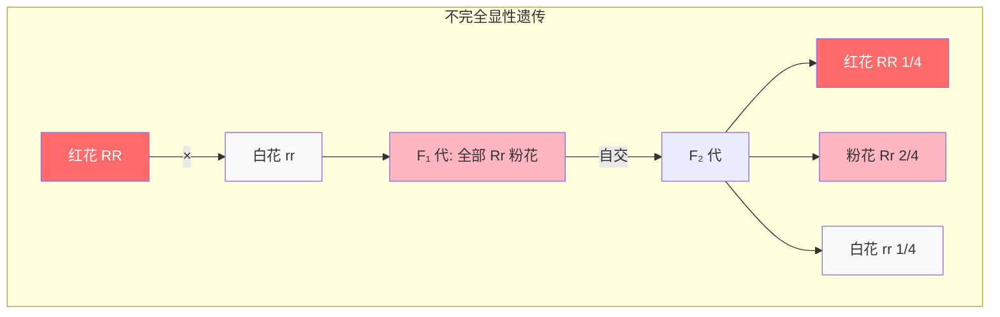

| 世代 | 基因型 | 表型 | 比例 |
|------|--------|------|------|
| P 代 | $RR × rr$ | 红花 × 白花 | - |
| F₁ 代 | $Rr$ | **粉花** (中间型) | 全部 |
| F₂ 代 | $RR:Rr:rr$ | 红花:粉花:白花 | $1:2:1$ |

> [!note] 关键区别
> - **完全显性**：F₂ 代表型比例为 $3:1$ (显性:隐性)
> - **不完全显性**：F₂ 代表型比例为 $1:2:1$ (显性:中间:隐性)

##### 2. 人类家族性高胆固醇血症

| 基因型 | 表型 | 胆固醇水平 |
|--------|------|------------|
| $HH$ | 正常 | 正常范围 |
| $Hh$ | **中等升高** (不完全显性) | 200-300 mg/dL |
| $hh$ | 严重升高 | > 300 mg/dL |

##### 3. 人类头发卷曲度

| 基因型 | 表型 |
|--------|------|
| $CC$ | 直发 |
| $Cc$ | **波浪发** (中间型) |
| $cc$ | 卷发 |

#### 分子机制

不完全显性通常是由于**功能性等位基因剂量效应**导致的：

- **纯合显性 ($AA$)**：产生 100% 正常功能蛋白 → 正常表型
- **杂合子 ($Aa$)**：产生 50% 正常功能蛋白 → **中间表型**
- **纯合隐性 ($aa$)**：无正常功能蛋白 → 隐性表型

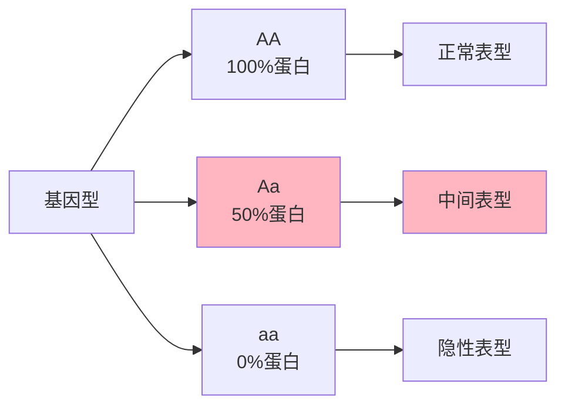

#### 与完全显性的对比

| 特征 | 完全显性 | 不完全显性 |
|------|----------|------------|
| **杂合子表型** | 与显性纯合子相同 | 介于双亲之间 |
| **F₂ 代表型比例** | $3:1$ | $1:2:1$ |
| **表型种类** | 2 种 | 3 种 |
| **基因型与表型关系** | 不完全对应 | 完全对应 |
| **例子** | 豌豆花色、人类耳垂 | 金鱼草花色、人类头发卷曲度 |

### 3.2 共显性
杂合子中，两个等位基因同时表达，没有显隐性之分。
- **例子**：镰刀型细胞贫血症
  - 正常红细胞呈圆盘状，镰刀型细胞呈"C"形，易堵塞血管导致缺氧。
  - 杂合子 ($Hb^A Hb^S$) 同时拥有正常和镰刀型红细胞，能正常生活。
  - **进化优势**：杂合子对疟疾有更高的抵抗力，这解释了为什么该等位基因在疟疾高发区（如非洲中部）保持较高频率。

### 3.3 复等位基因 (Multiple Alleles)

**定义**：在一个种群中，某个基因存在**两个以上的等位基因**形式。然而，由于每个个体只有一对同源染色体，因此每个个体最多只能拥有其中的**两个等位基因**。

#### 核心特征

| 特征 | 描述 |
|------|------|
| **种群水平** | 存在 3 个或更多等位基因 |
| **个体水平** | 每个个体最多拥有 2 个等位基因 |
| **基因型数** | 若 n 个等位基因，基因型数为 $\frac{n(n+1)}{2}$ |
| **表型数** | 取决于等位基因间的显隐性关系 |

#### 人类 ABO 血型系统

人类 ABO 血型是最经典的复等位基因例子，涉及**三个等位基因**：

| 等位基因 | 编码产物 | 血型表现 |
|----------|----------|----------|
| $I^A$ | A 型抗原 | A 型血 |
| $I^B$ | B 型抗原 | B 型血 |
| $i$ | 无抗原 | O 型血 |

##### 等位基因关系

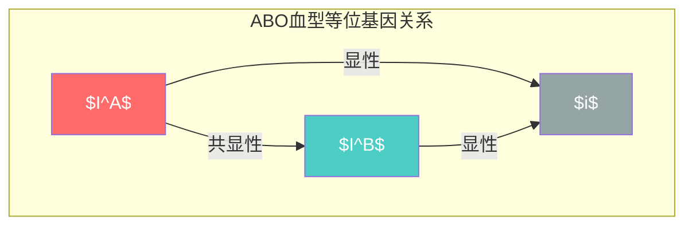

| 关系类型 | 等位基因对 | 说明 |
|----------|------------|------|
| **共显性** | $I^A$ 与 $I^B$ | 同时表达 A 和 B 抗原 |
| **完全显性** | $I^A$ > $i$ | $I^A$ 掩盖 $i$ |
| **完全显性** | $I^B$ > $i$ | $I^B$ 掩盖 $i$ |

##### 基因型与表型

| 表型 | 基因型 | 红细胞表面抗原 | 血清抗体 |
|------|--------|----------------|----------|
| **A 型** | $I^A I^A$ 或 $I^A i$ | A 抗原 | 抗 B 抗体 |
| **B 型** | $I^B I^B$ 或 $I^B i$ | B 抗原 | 抗 A 抗体 |
| **AB 型** | $I^A I^B$ | A 和 B 抗原 | 无抗体 |
| **O 型** | $ii$ | 无抗原 | 抗 A 和抗 B 抗体 |

> [!important] AB 型血的特点
> AB 型血个体被称为**万能受血者**，因为他们没有抗 A 和抗 B 抗体，可以接受任何血型的血液。

##### 遗传规律示例

**杂交 1**：A 型 ($I^A i$) × B 型 ($I^B i$)

| | $I^A$ | $i$ |
|---|---|---|
| **$I^B$** | $I^A I^B$ (AB 型) | $I^B i$ (B 型) |
| **$i$** | $I^A i$ (A 型) | $ii$ (O 型) |

**后代比例**：$1 AB : 1 A : 1 B : 1 O$

**杂交 2**：AB 型 ($I^A I^B$) × O 型 ($ii$)

| | $I^A$ | $I^B$ |
|---|---|---|
| **$i$** | $I^A i$ (A 型) | $I^B i$ (B 型) |
| **$i$** | $I^A i$ (A 型) | $I^B i$ (B 型) |

**后代比例**：$1 A : 1 B$ (不可能出现 AB 型或 O 型后代)

#### 兔子毛色系统

兔子毛色由**四个等位基因**控制，呈现**显性层级**：

$$C > c^{ch} > c^h > c$$

| 等位基因 | 表型 | 描述 |
|----------|------|------|
| $C$ | **全色** (Full color) | 正常色素沉着 |
| $c^{ch}$ | **青紫蓝** (Chinchilla) | 灰色，黑色色素减少 |
| $c^h$ | **喜马拉雅** (Himalayan) | 身体白色，耳、鼻、脚、尾深色 |
| $c$ | **白化** (Albino) | 无色素，纯白色 |

##### 基因型与表型对应

| 表型 | 可能的基因型 | 基因型数 |
|------|--------------|----------|
| 全色 | $CC$, $Cc^{ch}$, $Cc^h$, $Cc$ | 4 种 |
| 青紫蓝 | $c^{ch}c^{ch}$, $c^{ch}c^h$, $c^{ch}c$ | 3 种 |
| 喜马拉雅 | $c^hc^h$, $c^hc$ | 2 种 |
| 白化 | $cc$ | 1 种 |

**总计**：4 个等位基因 → $\frac{4 \times 5}{2} = 10$ 种基因型 → 4 种表型

#### 其他复等位基因例子

| 生物 | 性状 | 等位基因数 | 特点 |
|------|------|------------|------|
| **人类** | Rh 血型 | 2 个主要等位基因 | $D$ (阳性) 对 $d$ (隐性) 显性 |
| **果蝇** | 眼色 | 多个 | 白眼、红眼、杏色眼等 |
| **烟草** | 花冠形状 | 多个 | 不同形状由多个等位基因控制 |
| **人类** | MNS 血型 | 3 个等位基因 | 由 $L^M$, $L^{MN}$, $L^N$ 控制 |

#### 与孟德尔遗传的对比

| 特征 | 孟德尔遗传（一对等位基因） | 复等位基因 |
|------|---------------------------|------------|
| **等位基因数** | 2 个 | ≥ 3 个 |
| **个体携带数** | 2 个 | 2 个 |
| **基因型数** | 3 种 ($AA, Aa, aa$) | $\frac{n(n+1)}{2}$ 种 |
| **表型数** | 2-3 种 | 可变，取决于显隐性关系 |
| **显性关系** | 简单显隐或共显 | 可能更复杂（显性层级、共显等） |
| **例子** | 豌豆花色 | ABO 血型、兔子毛色 |

### 3.4 上位性 (Epistasis)

**定义**：一个基因的表型表达被另一个非等位基因（上位基因, epistatic gene）掩盖或抑制。被掩盖的基因称为**下位基因 (hypostatic gene)**。

> [!note] 上位性 vs 显隐性
> - **显隐性**：同一基因的**两个等位基因**之间的关系（如 $Y$ 对 $y$ 显性）
> - **上位性**：**两个不同基因**之间的相互作用（如 $E$ 基因掩盖 $B$ 基因的表达）

#### 3.4.1 隐性上位 (Recessive Epistasis)

当上位基因的**隐性纯合**状态掩盖下位基因的表达时。

**经典例子**：拉布拉多犬毛色

| 基因 | 功能 | 显性表型 | 隐性表型 |
|------|------|----------|----------|
| $E$ 基因 | 决定色素**有无** | $E\_$ 有色素沉积 | $ee$ 无色素（黄色） |
| $B$ 基因 | 决定色素**深浅** | $B\_$ 黑色 | $bb$ 巧克力色 |

- $E$ 是上位基因：当基因型为 $ee$ 时，无论 $B$ 基因如何，都表现为**黄色**（因为 $ee$ 阻止了色素合成，$B$ 基因无从发挥作用）
- $B$ 是下位基因：其表达依赖于 $E$ 基因的存在

**双杂合子自交**：$EeBb \times EeBb$

| | $EB$ | $Eb$ | $eB$ | $eb$ |
|---|---|---|---|---|
| **$EB$** | $EEBB$ 黑 | $EEBb$ 黑 | $EeBB$ 黑 | $EeBb$ 黑 |
| **$Eb$** | $EEBb$ 黑 | $EEbb$ 巧克力 | $EeBb$ 黑 | $Eebb$ 巧克力 |
| **$eB$** | $EeBB$ 黑 | $EeBb$ 黑 | $eeBB$ 黄 | $eeBb$ 黄 |
| **$eb$** | $EeBb$ 黑 | $Eebb$ 巧克力 | $eeBb$ 黄 | $eebb$ 黄 |

**F₂ 代表型比例**：$9 : 3 : 4$

| 表型 | 基因型 | 数量比例 |
|------|--------|----------|
| 黑色 | $E\_B\_$ | 9 |
| 巧克力色 | $E\_bb$ | 3 |
| 黄色 | $eeB\_$ 或 $eebb$ | 4 |

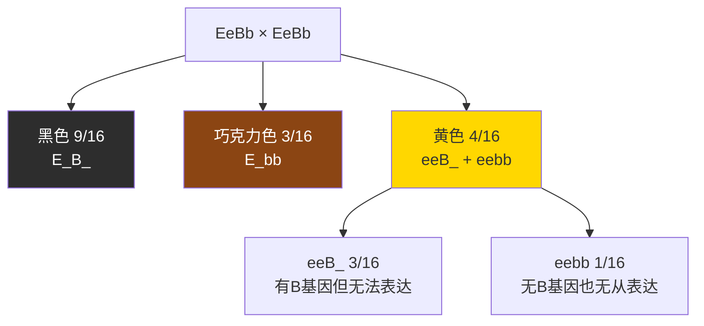

> [!tip] 比例记忆法
> 隐性上位的 F₂ 比例为 **9:3:4**，其中"4"是原本 9:3:3:1 中被 $ee$ 掩盖的两组合并（$3+1=4$）。

#### 3.4.2 显性上位 (Dominant Epistasis)

当上位基因的**显性等位基因**（仅需一个拷贝）即可掩盖下位基因的表达时。

**经典例子**：南瓜果皮颜色

| 基因 | 功能 | 显性表型 | 隐性表型 |
|------|------|----------|----------|
| $W$ 基因（上位基因） | 决定白色 | $W\_$ 白色（抑制色素） | $ww$ 允许色素表达 |
| $Y$ 基因（下位基因） | 决定颜色 | $Y\_$ 黄色 | $yy$ 绿色 |

- 只要存在 $W$，南瓜就是白色，无论 $Y$ 基因如何
- 只有 $ww$ 个体中，$Y$ 基因才能表达

**F₂ 代表型比例**：$12 : 3 : 1$

| 表型 | 基因型 | 数量比例 |
|------|--------|----------|
| 白色 | $W\_Y\_$ 或 $W\_yy$ | 12 |
| 黄色 | $wwY\_$ | 3 |
| 绿色 | $wwyy$ | 1 |

#### 3.4.3 上位性类型总结

| 类型 | 上位基因作用 | F₂ 表型比例 | 例子 |
|------|-------------|-------------|------|
| **隐性上位** | 隐性纯合 ($aa$) 掩盖 | $9:3:4$ | 拉布拉多犬毛色 |
| **显性上位** | 显性 ($A\_$) 掩盖 | $12:3:1$ | 南瓜果皮颜色 |

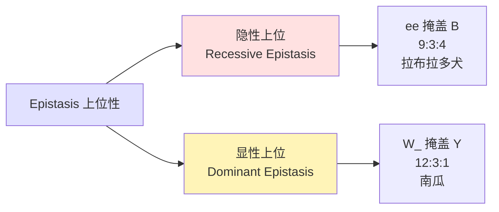

## 4. 性别与遗传

### 4.1 性别决定
- **性染色体**：决定性别的染色体对 (X 和 Y)。
- **常染色体**：除性染色体外的其他22对染色体。
- 人类女性为 **XX**，男性为 **XY**。性别由精子携带的是 X 还是 Y 决定。

### 4.2 剂量补偿 (Dosage Compensation)

**定义**：剂量补偿是一种基因表达调控机制，用于平衡 X 连锁基因在**雌性 (XX)** 和**雄性 (XY)** 之间的表达水平。由于雌性有两条 X 染色体而雄性只有一条，如果不进行调控，雌性的 X 连锁基因产物将是雄性的两倍。

#### 核心问题

| 性别 | 性染色体 | X 连锁基因拷贝数 | 潜在问题 |
|------|----------|------------------|----------|
| 雌性 | XX | 2 条 X | 基因产物过量 |
| 雄性 | XY | 1 条 X | 基因产物正常 |

> [!warning] 基因剂量失衡的后果
> 如果不进行剂量补偿，雌性细胞中 X 连锁基因的表达量将是雄性的 2 倍，这会导致严重的发育异常和功能障碍。

#### 剂量补偿机制

不同生物采用不同的剂量补偿策略：

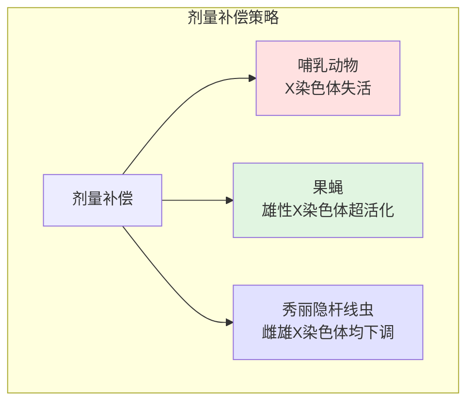

| 生物 | 机制 | 结果 |
|------|------|------|
| **哺乳动物** | 雌性随机失活一条 X 染色体 | 雌性和雄性都只有一条活性 X |
| **果蝇** | 雄性单条 X 染色体表达量加倍 | 雄性和雌性 X 连锁基因表达量相等 |
| **秀丽隐杆线虫** | 雌雄都下调 X 染色体表达 | 两性都只有 0.5 倍的表达量 |

#### 哺乳动物的 X 染色体失活

##### 1. 巴氏小体 (Barr Body)

**定义**：在雌性哺乳动物体细胞间期核中，可以观察到的一个**深染、浓缩、失活**的 X 染色体，位于核膜边缘。

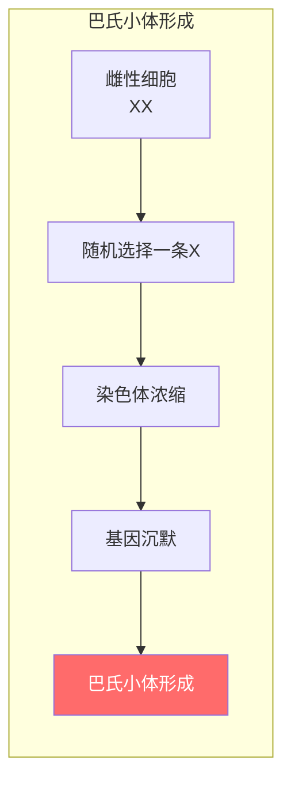

**特征**：
- **位置**：细胞核边缘，贴近核膜
- **形态**：深染、高度浓缩的异染色质
- **大小**：约 1 μm，光学显微镜下可见
- **数量**：正常雌性细胞有 **1 个** 巴氏小体

> [!note] 巴氏小体数量规律
> 巴氏小体数 = X 染色体数 - 1
> - 正常雌性 (XX)：1 个巴氏小体
> - 正常雄性 (XY)：0 个巴氏小体
> - XXX 综合征：2 个巴氏小体
> - XXY (克氏综合征)：1 个巴氏小体

##### 2. X 染色体失活的分子机制

###### X 失活中心 (X-inactivation Center, XIC)

位于 X 染色体长臂 (Xq13) 上的特定区域，包含关键调控基因：

| 基因 | 功能 |
|------|------|
| **XIST** (X-inactive specific transcript) | 产生非编码 RNA，包裹并沉默失活 X 染色体 |
| **TSIX** | XIST 的负调控因子，阻止 XIST 在活性 X 上表达 |
| **XCE** (X-controlling element) | 影响哪条 X 染色体被选择失活 |

###### 失活过程

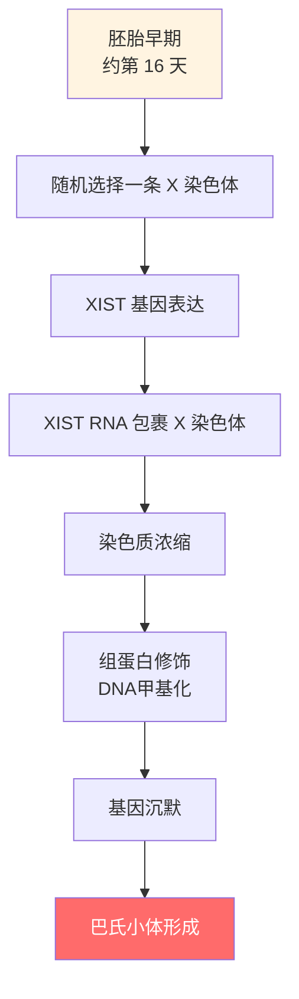

**表观遗传修饰**：

| 修饰类型 | 变化 | 结果 |
|----------|------|------|
| **DNA 甲基化** | CpG 岛高甲基化 | 基因沉默 |
| **组蛋白修饰** | H3K27me3 增加 | 染色质浓缩 |
| **组蛋白变体** | 宏 H2A (macroH2A) 掺入 | 稳定失活状态 |
| **晚期复制** | S 期晚期复制 | 转录抑制 |

##### 3. 随机失活与印记

###### 随机失活 (Random X-inactivation)

- **发生时间**：胚胎发育早期（人类约第 16 天）
- **机制**：每个细胞**随机选择**父源或母源 X 染色体失活
- **结果**：成年雌性成为**嵌合体**——部分细胞表达父源 X，部分表达母源 X

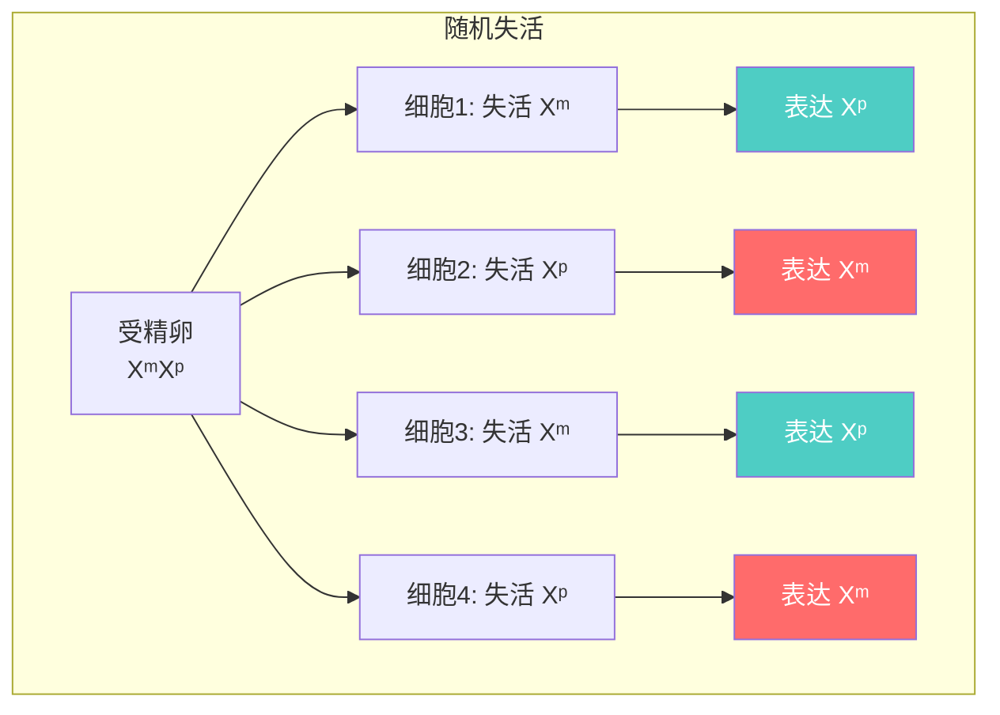

###### 印记失活 (Imprinted X-inactivation)

- **发生部位**：胎盘等特定组织
- **机制**：**非随机**失活，总是失活父源 X 染色体
- **进化意义**：可能与基因组印记和亲本冲突理论有关

#### 经典例子：三花猫的毛色

三花猫（Calico cat）是剂量补偿和 X 染色体失活的经典例子：

##### 遗传基础

| 基因 | 位置 | 功能 |
|------|------|------|
| **O 基因** | X 染色体 | 控制橙色/黑色毛色 |
| **o 等位基因** | X 染色体 | 产生橙色色素 |
| **O 等位基因** | X 染色体 | 产生黑色色素 |

##### 表型形成机制

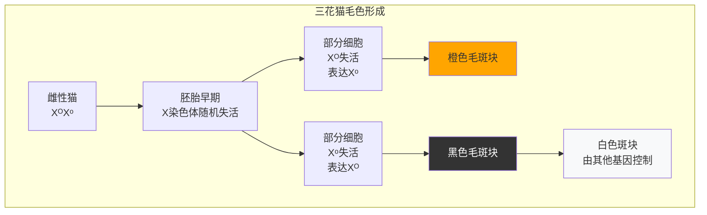

**为什么只有雌性猫是三花色？**

| 基因型 | 性别 | 表型 |
|--------|------|------|
| $X^O X^O$ | 雌性 | 全橙色 |
| $X^o X^o$ | 雌性 | 全黑色 |
| $X^O X^o$ | 雌性 | **三花色** (橙+黑斑块) |
| $X^O Y$ | 雄性 | 全橙色 |
| $X^o Y$ | 雄性 | 全黑色 |

> [!important] 关键结论
> - 雄性猫只有一条 X 染色体，无法同时携带 O 和 o 等位基因
> - 只有杂合雌性 ($X^O X^o$) 才能表现出三花色
> - 每个毛色斑块来源于一个祖先细胞，该细胞在胚胎期随机失活了某条 X 染色体

#### 剂量补偿异常与疾病

| 疾病 | 核型 | 巴氏小体数 | 特征 |
|------|------|------------|------|
| **特纳综合征** | XO | 0 | 女性，身材矮小，性腺发育不全 |
| **克氏综合征** | XXY | 1 | 男性，睾丸发育不全，不育 |
| **XXX 综合征** | XXX | 2 | 女性，通常表型正常，学习困难 |
| **XYY 综合征** | XYY | 0 | 男性，通常表型正常，身材高大 |

#### 剂量补偿的意义

1. **基因剂量平衡**：确保两性 X 连锁基因表达水平相等
2. **发育正常**：防止因基因过量表达导致的发育异常
3. **表观遗传调控**：展示表观遗传修饰在基因表达调控中的重要作用
4. **进化保守性**：不同生物独立演化出不同的剂量补偿机制

### 4.3 伴性遗传
由位于性染色体（通常为 X 染色体）上的基因控制的性状。
- **特点**：由于男性只有一条 X 染色体，隐性 X 连锁性状在男性中表现频率远高于女性（女性需两条 X 都有隐性基因才会表现）。
- **红绿色盲**：
  - 隐性 X 连锁性状。
  - 母亲是携带者 ($X^NX^n$)，父亲正常 ($X^NY$)。
  - 后代中只有**儿子**可能患病 ($X^nY$)，女儿不会患病（但有一半概率是携带者）。
- **血友病**：
  - 另一种隐性 X 连锁疾病，导致血液凝固缓慢。
  - 著名案例：英国维多利亚女王家族（通过女儿将致病基因传给了俄国、德国和西班牙王室）。

## 5. 多基因遗传与环境因素

### 5.1 多基因遗传 (Polygenic Inheritance)

**定义**：多基因遗传是指由**多个基因座（多对基因）**共同控制的性状遗传方式。与孟德尔遗传的单基因控制不同，多基因性状的表型是多个基因效应累加的结果，通常还受到环境因素的影响。

#### 核心特征

| 特征 | 描述 |
|------|------|
| **基因数量** | 由 2 个或更多基因座控制 |
| **等位基因效应** | 每个等位基因贡献**微小、累加**的效应 |
| **表型分布** | 连续变异，呈**正态分布（钟形曲线）** |
| **基因型与表型关系** | 多对基因 → 多种基因型 → 连续表型 |
| **环境影响** | 通常受环境因素显著影响 |

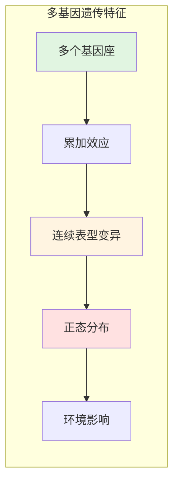

#### 与孟德尔遗传的对比

| 特征 | 孟德尔遗传 | 多基因遗传 |
|------|------------|------------|
| **控制基因数** | 1 对基因 | 多对基因 |
| **等位基因关系** | 显隐性关系 | 累加效应 |
| **表型类别** | 离散、不连续 | 连续、渐变 |
| **表型比例** | 简单比例 (3:1, 9:3:3:1 等) | 正态分布 |
| **环境影响** | 通常较小 | 通常显著 |
| **例子** | 豌豆花色、种子形状 | 身高、肤色、体重 |

#### 多基因遗传的数学模型

##### 基因型与表型的关系

假设某性状由 **n 对基因**控制，每对基因有两个等位基因（显性和隐性）：

| 基因型 | 贡献值 | 表型效应 |
|--------|--------|----------|
| $AABBCC...$ | 最大值 | 极端显性表型 |
| $AaBbCc...$ | 中间值 | 中间表型 |
| $aabbcc...$ | 最小值 | 极端隐性表型 |

**表型值计算公式**：

$$P = G + E$$

其中：
- $P$ = 表型值
- $G$ = 基因型值（所有基因效应的总和）
- $E$ = 环境效应

##### 双基因杂交示例

假设肤色由两对基因 ($A/a$ 和 $B/b$) 控制：

| 基因型 | 显性基因数 | 表型描述 |
|--------|------------|----------|
| $AABB$ | 4 | 最深色 |
| $AABb$, $AaBB$ | 3 | 深色 |
| $AaBb$, $AAbb$, $aaBB$ | 2 | 中等色 |
| $Aabb$, $aaBb$ | 1 | 浅色 |
| $aabb$ | 0 | 最浅色 |

**双杂合子自交 ($AaBb × AaBb$) 的表型分布**：

| 表型 | 基因型 | 比例 |
|------|--------|------|
| 最深色 | $AABB$ | 1/16 |
| 深色 | $AABb$, $AaBB$ | 4/16 |
| 中等色 | $AaBb$, $AAbb$, $aaBB$ | 6/16 |
| 浅色 | $Aabb$, $aaBb$ | 4/16 |
| 最浅色 | $aabb$ | 1/16 |

**表型比例**：$1:4:6:4:1$ (类似于二项式展开)

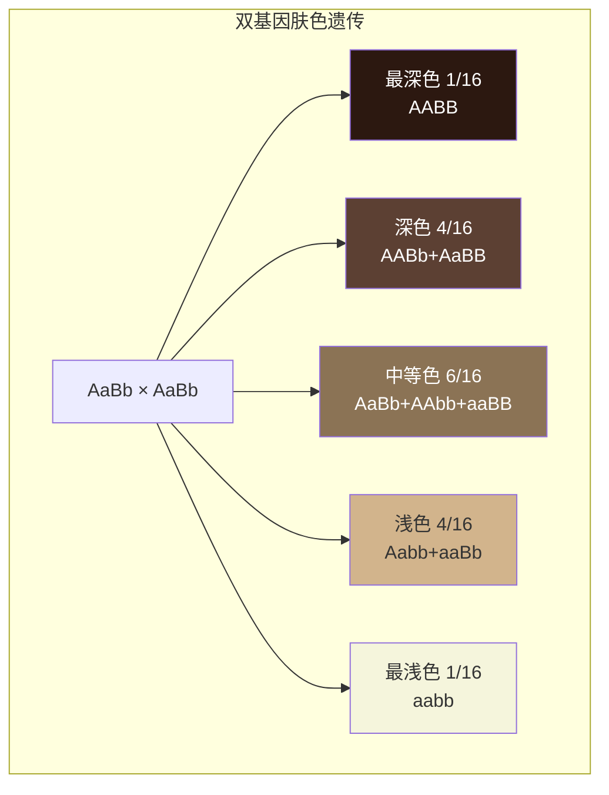

#### 经典例子

##### 1. 人类肤色

人类肤色是最经典的多基因遗传例子，估计由 **3-6 对基因**控制。

| 特征 | 描述 |
|------|------|
| **基因数** | 约 3-6 对基因 |
| **遗传模式** | 累加效应 |
| **环境影响** | 紫外线照射、营养等 |
| **表型范围** | 从极浅到极深的连续变异 |

**肤色遗传示例**：

假设肤色由两对基因控制，纯种黑人与纯种白人婚配：

| 婚配组合 | F₁ 代表型 | F₂ 代表型分布 |
|----------|-----------|---------------|
| 纯黑 × 纯白 | 全部中等肤色 | 连续分布，从浅到深 |

> [!note] 混血儿的肤色
> 不同人种间的混血儿通常表现出介于双亲之间的肤色，且后代呈现连续变异，这正是多基因遗传的特征。

##### 2. 人类身高

| 特征 | 描述 |
|------|------|
| **基因数** | 估计 400+ 个基因位点 |
| **遗传力** | 约 80% (遗传因素贡献) |
| **环境影响** | 营养、健康、运动等 |
| **表型分布** | 正态分布，平均身高附近人数最多 |

**身高遗传特点**：
- 极高父母的孩子通常比父母矮（向平均回归）
- 极矮父母的孩子通常比父母高（向平均回归）
- 这种现象称为**回归均值**

##### 3. 人类体重/肥胖

| 因素 | 贡献 |
|------|------|
| **遗传因素** | 约 40-70% |
| **环境因素** | 饮食、运动、生活方式 |
| **基因数** | 多个基因参与 |

##### 4. 农作物产量

| 作物 | 多基因性状 | 应用 |
|------|------------|------|
| **小麦** | 产量、株高、穗粒数 | 育种选择 |
| **水稻** | 分蘖数、粒重、抗逆性 | 杂交育种 |
| **玉米** | 穗长、行数、百粒重 | 品种改良 |

#### 数量性状位点 (QTL)

**定义**：数量性状位点 (Quantitative Trait Locus, QTL) 是指与多基因性状变异相关的基因组区域。

| 特征 | 描述 |
|------|------|
| **定位方法** | 连锁分析、关联分析 |
| **效应大小** | 主效 QTL（效应大）+ 微效 QTL（效应小） |
| **应用** | 分子标记辅助选择 (MAS) |

#### 表型分布与正态分布

多基因性状的表型在群体中通常呈**正态分布**：

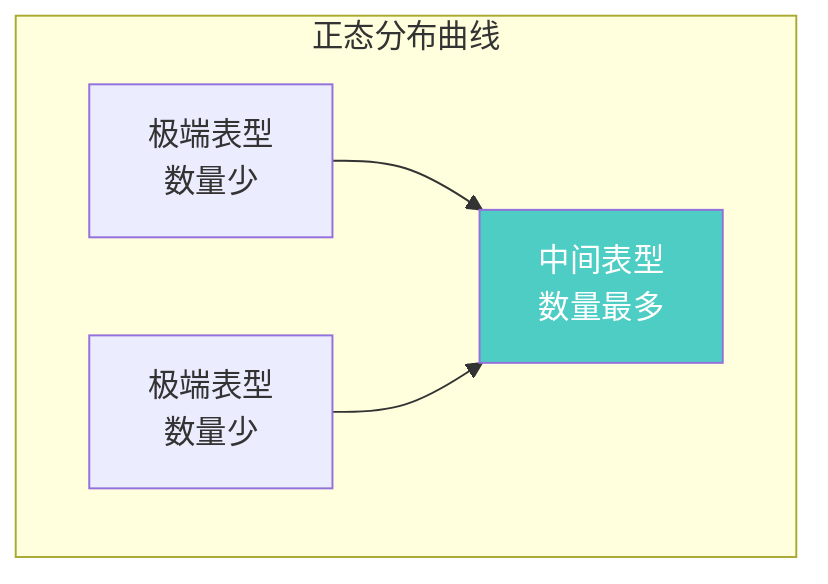

**正态分布特征**：

| 范围 | 占总体的比例 | 描述 |
|------|--------------|------|
| 平均值 ± 1 SD | 68% | 大多数个体 |
| 平均值 ± 2 SD | 95% | 绝大多数个体 |
| 平均值 ± 3 SD | 99.7% | 几乎所有个体 |

#### 遗传力 (Heritability)

**定义**：遗传力是指表型变异中由遗传因素所贡献的比例。

$$h^2 = \frac{V_G}{V_P} = \frac{V_G}{V_G + V_E}$$

其中：
- $h^2$ = 遗传力
- $V_G$ = 遗传方差
- $V_E$ = 环境方差
- $V_P$ = 表型方差

| 遗传力类型 | 定义 | 计算 |
|------------|------|------|
| **广义遗传力** | 总遗传变异 / 表型变异 | $H^2 = V_G / V_P$ |
| **狭义遗传力** | 加性遗传变异 / 表型变异 | $h^2 = V_A / V_P$ |

**常见多基因性状的遗传力**：

| 性状 | 遗传力估计 |
|------|------------|
| 人类身高 | 约 80% |
| 人类智商 | 约 50-80% |
| 人类体重 | 约 40-70% |
| 精神分裂症 | 约 80% |
| 高血压 | 约 30-50% |

> [!warning] 遗传力的误解
> 遗传力**不是**指性状由遗传决定的比例，而是指**群体中表型变异**由遗传变异解释的比例。遗传力是针对群体的统计概念，不适用于个体。

#### 多基因风险评分 (Polygenic Risk Score, PRS)

**定义**：多基因风险评分是通过整合多个基因变异的效应，预测个体患某种复杂疾病的风险。

**应用**：
- 疾病风险预测（如心脏病、糖尿病、精神疾病）
- 个性化医疗
- 药物反应预测

#### 多基因遗传的意义

1. **解释连续变异**：解释了自然界中大多数性状的连续分布
2. **育种应用**：为动植物育种提供理论基础
3. **医学应用**：理解复杂疾病的遗传基础
4. **进化意义**：为自然选择提供丰富的变异材料

### 5.2 环境对表型的影响
基因设定了表型的范围，但环境决定了表型在此范围内的具体表现。
- **阳光与水分**：植物开花需要足够阳光；缺水导致落叶。
- **温度**：
  - 暹罗猫的毛色：控制色素的酶在较低温度下才活跃。因此体温较低的部位（耳朵、鼻子、脚、尾巴）颜色较深，体温较高的躯干颜色浅。

### 5.3 双生子研究
用于区分遗传和环境的相对贡献。
- **同卵双生子**：基因型 100% 相同。
- **异卵双生子**：基因型类似普通兄弟姐妹 (约 50% 相同)。
- **一致性比率**：如果某性状在同卵双生子中同时出现的概率显著高于异卵双生子，说明该性状受遗传影响较大。

## 6. 核心要点总结

1. **隐性遗传病**：需要纯合子 ($aa$) 才发病，杂合子为携带者。
2. **显性遗传病**：杂合子 ($Aa$) 即发病，往往由新突变引起（如软骨发育不全）。
3. **系谱分析**：利用家族图谱推断基因型和遗传方式，隐性病可出现双亲正常但子代患病的情况。
4. **不完全显性**：杂合子表现为中间表型（如粉花）。
5. **共显性**：杂合子同时表达两种等位基因的产物（如 AB 血型、镰刀型细胞杂合子）。
6. **复等位基因**：群体中存在 >2 个等位基因（如 ABO 血型）。
7. **上位性**：一个基因掩盖另一个基因的表达。隐性上位（$9:3:4$，如拉布拉多 $ee$ 掩盖 $B$）和显性上位（$12:3:1$，如南瓜 $W\_$ 掩盖 $Y$）。
8. **伴性遗传**：X 连锁隐性性状在男性中更常见（如色盲、血友病）。
9. **剂量补偿**：雌性失活一条 X 染色体形成巴氏小体。
10. **多基因与环境**：多数性状由多基因控制并受环境修饰，呈连续的正态分布。

## 7. 相关笔记

- [[Mendelian Genetics|孟德尔遗传学]] - 显隐性、分离定律与自由组合定律等基础遗传规律
- [[Meiosis|减数分裂]] - 等位基因分离与非同源染色体自由组合的细胞学基础
