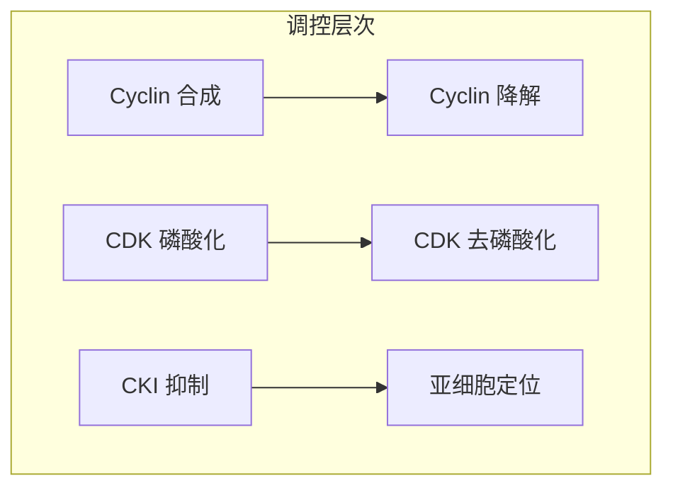
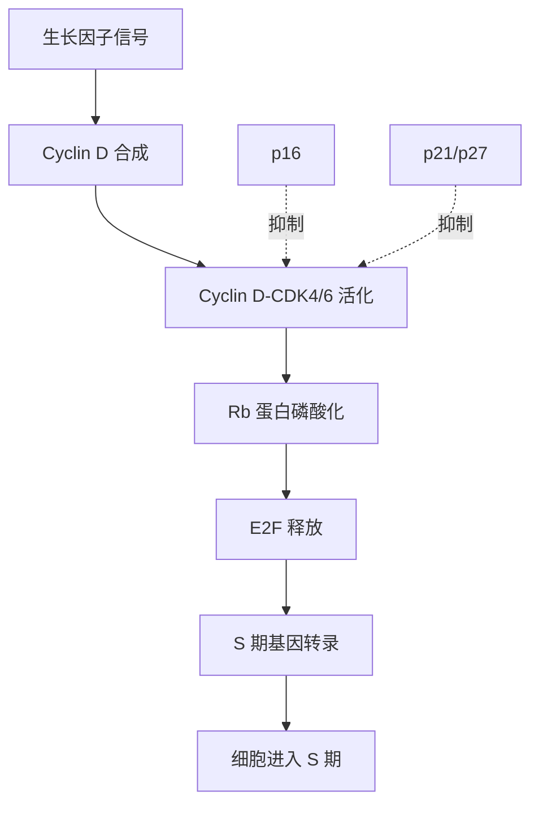

---
tags:
- Biology
- Cell
- Cell Cycle
- Molecular Biology
- 定义性
- 基本原理
title: Cyclin and CDK 细胞周期蛋白与周期蛋白依赖性激酶
created: 2026-04-22T10:00:00
modified: 
---

# Cyclin & CDK 细胞周期蛋白与周期蛋白依赖性激酶

> **核心概念**：Cyclin（细胞周期蛋白）与 CDK（周期蛋白依赖性激酶）是真核细胞周期调控的核心分子机制，通过形成复合物来驱动细胞周期的各个阶段转换。

---

## 1. 基本概念

### 1.1 Cyclin（细胞周期蛋白）

**定义**：一类在细胞周期中周期性合成和降解的蛋白质，其浓度随细胞周期阶段而变化。

**命名由来**：因其浓度呈周期性波动而得名（"Cyclin" = 周期性的）。

**主要特征**：
- 在细胞周期特定阶段合成（转录水平调控）
- 在特定阶段被泛素-蛋白酶体系统降解
- 必须与 CDK 结合才能发挥功能
- 决定 CDK 的底物特异性

### 1.2 CDK（Cyclin-Dependent Kinase）

**定义**：周期蛋白依赖性激酶，是一类丝氨酸/苏氨酸蛋白激酶，必须与 Cyclin 结合后才具有激酶活性。

**主要特征**：
- 激酶活性依赖于与 Cyclin 的结合
- 通过磷酸化靶蛋白来调控细胞周期
- CDK 蛋白水平在细胞周期中保持相对恒定
- 活性主要受 Cyclin 可用性调控

### 1.3 Cyclin-CDK 复合物

$$
\text{Cyclin} + \text{CDK} \rightleftharpoons \text{Cyclin-CDK 复合物} \xrightarrow{\text{磷酸化}} \text{靶蛋白} \rightarrow \text{细胞周期事件}$$

**作用机制**：
1. Cyclin 与 CDK 结合形成活性复合物
2. 复合物磷酸化特定的靶蛋白
3. 靶蛋白的磷酸化状态改变其活性
4. 触发特定的细胞周期事件

---

## 2. 主要 Cyclin-CDK 复合物类型

### 2.1 G₁ 期 Cyclin-CDK

| 复合物 | Cyclin 类型 | CDK 类型 | 主要功能 |
|--------|-------------|----------|----------|
| **G₁-CDK** | Cyclin D (D1, D2, D3) | CDK4, CDK6 | 启动细胞周期，从 G₁ 期向 S 期推进 |
| **G₁/S-CDK** | Cyclin E | CDK2 | 启动 DNA 复制，控制 G₁/S 转换 |

**G₁-CDK 功能详解**：
- 响应细胞外生长因子信号
- 磷酸化 Rb 蛋白（视网膜母细胞瘤蛋白）
- 释放 E2F 转录因子
- 促进 S 期所需基因的转录

### 2.2 S 期 Cyclin-CDK

| 复合物 | Cyclin 类型 | CDK 类型 | 主要功能 |
|--------|-------------|----------|----------|
| **S-CDK** | Cyclin A | CDK2 | 启动和维持 DNA 复制，防止 DNA 重复复制 |

**S-CDK 功能详解**：
- 激活 DNA 复制起始点
- 磷酸化 DNA 复制相关蛋白
- 抑制新的复制起始点形成（防止重复复制）
- 促进组蛋白合成

### 2.3 M 期 Cyclin-CDK

| 复合物 | Cyclin 类型 | CDK 类型 | 主要功能 |
|--------|-------------|----------|----------|
| **M-CDK** | Cyclin B | CDK1 (Cdc2) | 启动有丝分裂，驱动染色体分离 |

**M-CDK 功能详解**：
- 也称为 MPF（Maturation Promoting Factor，成熟促进因子）
- 磷酸化核纤层蛋白，导致核膜解体
- 磷酸化组蛋白，促进染色体浓缩
- 激活 APC/C（后期促进复合物）
- 调控纺锤体组装

### 2.4 复合物总结

---

## 3. Cyclin-CDK 活性调控机制

### 3.1 多层次调控

Cyclin-CDK 活性受到多层次精确调控：

### 3.2 Cyclin 合成与降解

**合成调控**：
- 转录因子（如 E2F）激活 Cyclin 基因转录
- 响应细胞外信号（生长因子）
- 细胞周期依赖性转录

**降解调控**：
- **SCF 复合物**：泛素化降解 G₁/S 期 Cyclin（Cyclin D, E）
- **APC/C 复合物**：泛素化降解 M 期 Cyclin（Cyclin A, B）

### 3.3 CDK 磷酸化调控

**激活磷酸化**：
- CAK（CDK-Activating Kinase）磷酸化 CDK 的 Thr161 位点
- 这是 CDK 完全活化所必需的

**抑制磷酸化**：
- Wee1 激酶磷酸化 Tyr15 位点，抑制 CDK 活性
- Myt1 激酶磷酸化 Thr14 位点，抑制 CDK 活性
- Cdc25 磷酸酶去除这些抑制性磷酸基团，激活 CDK

### 3.4 CDK 抑制蛋白（CKI）

**定义**：CDK Inhibitor，特异性抑制 Cyclin-CDK 复合物的活性。

**两大类别**：

| 类别 | 成员 | 主要靶点 | 功能 |
|------|------|----------|------|
| **CIP/KIP 家族** | p21, p27, p57 | 广谱抑制 | 响应 DNA 损伤，阻止细胞周期 |
| **INK4 家族** | p16, p15, p18, p19 | 特异性抑制 CDK4/6 | 调控 G₁ 期进程 |

**p21 功能**：
- 由 p53 转录激活
- 响应 DNA 损伤
- 抑制多种 Cyclin-CDK 复合物
- 诱导细胞周期停滞，允许 DNA 修复

**p16 功能**：
- 特异性抑制 Cyclin D-CDK4/6
- 阻止 Rb 蛋白磷酸化
- 维持细胞在 G₁ 期停滞
- 是重要的肿瘤抑制因子

---

## 4. 细胞周期检查点与 Cyclin-CDK

### 4.1 G₁ 检查点（限制点）

**位置**：G₁ 期末，进入 S 期之前

**检查内容**：
- 细胞大小是否足够
- 营养物质是否充足
- DNA 是否损伤
- 生长因子信号是否存在

**Cyclin-CDK 作用**：
- Cyclin D-CDK4/6 活性决定细胞是否通过检查点
- Rb 蛋白磷酸化状态是关键调控点
- p53-p21 通路在 DNA 损伤时阻止细胞周期

### 4.2 G₂/M 检查点

**位置**：G₂ 期末，进入 M 期之前

**检查内容**：
- DNA 复制是否完成
- DNA 是否损伤
- 细胞大小是否合适

**Cyclin-CDK 作用**：
- Wee1 和 Cdc25 调控 Cyclin B-CDK1 活性
- DNA 损伤时，Wee1 活性增强，抑制 CDK1
- 修复完成后，Cdc25 激活 CDK1，进入 M 期

### 4.3 纺锤体检查点

**位置**：中期，进入后期之前

**检查内容**：
- 所有染色体是否正确附着在纺锤体上
- 染色体是否排列在赤道板上

**调控机制**：
- Mad2 蛋白在未附着染色体上抑制 APC/C
- 阻止 Cyclin B 降解
- 维持 Cyclin B-CDK1 活性
- 确保染色体正确分离后才进入后期

---

## 5. Cyclin-CDK 与癌症

### 5.1 Cyclin-CDK 失调与癌症

**Cyclin 过表达**：
- Cyclin D1 在许多癌症中过表达（乳腺癌、淋巴瘤）
- Cyclin E 过表达与染色体不稳定性相关
- 导致细胞周期失控，不受限制地增殖

**CDK 活性异常**：
- CDK 过度活化
- 抑制性磷酸化失调
- 导致检查点功能丧失

**CKI 功能丧失**：
- p16 基因缺失是最常见的肿瘤抑制基因突变之一
- p21 和 p27 功能丧失
- 失去对 Cyclin-CDK 的抑制

### 5.2 CDK 抑制剂作为抗癌药物

**治疗策略**：
- 使用小分子抑制剂阻断 CDK 活性
- 恢复细胞周期检查点功能
- 诱导癌细胞周期停滞或凋亡

**主要 CDK 抑制剂**：

| 药物名称 | 靶点 CDK | 应用 |
|----------|----------|------|
| Palbociclib | CDK4/6 | 乳腺癌治疗 |
| Ribociclib | CDK4/6 | 乳腺癌治疗 |
| Abemaciclib | CDK4/6 | 乳腺癌治疗 |

---

## 6. 关键分子机制详解

### 6.1 Rb-E2F 通路

**Rb 蛋白状态**：
- **低磷酸化 Rb**：结合 E2F，抑制 S 期基因转录
- **高磷酸化 Rb**：释放 E2F，激活 S 期基因转录

### 6.2 APC/C 与 Cyclin B 降解

**后期促进复合物（APC/C）**：
- E3 泛素连接酶
- 识别并泛素化 Cyclin B
- 导致 Cyclin B 被蛋白酶体降解
- 是退出有丝分裂的关键

**调控**：
- Cdc20 激活 APC/C（中期到后期转换）
- Cdh1 维持 APC/C 活性（后期到 G₁ 期）

---

## 7. 实验技术与研究方法

### 7.1 检测 Cyclin-CDK 活性

**常用方法**：
- **Western Blot**：检测 Cyclin 和 CDK 蛋白水平
- **激酶活性测定**：使用放射性 ATP 或荧光底物
- **免疫沉淀**：分离特定 Cyclin-CDK 复合物
- **质谱分析**：鉴定磷酸化位点

### 7.2 功能研究

**基因操作**：
- 基因敲除/敲低（Knockout/Knockdown）
- 过表达（Overexpression）
- 突变体分析

**化学抑制剂**：
- 使用特异性 CDK 抑制剂
- 研究特定 CDK 的功能

---

## 8. 关键术语

| 英文 | 中文 | 定义 |
|------|------|------|
| Cyclin | 细胞周期蛋白 | 在细胞周期中周期性合成和降解的蛋白质 |
| CDK | 周期蛋白依赖性激酶 | 必须与 Cyclin 结合才有活性的蛋白激酶 |
| Cyclin-CDK Complex | Cyclin-CDK 复合物 | Cyclin 与 CDK 结合形成的活性复合物 |
| CAK | CDK 活化激酶 | 磷酸化并激活 CDK 的激酶 |
| CKI | CDK 抑制蛋白 | 抑制 Cyclin-CDK 活性的蛋白质 |
| APC/C | 后期促进复合物 | 泛素连接酶，降解 M 期 Cyclin |
| Rb | 视网膜母细胞瘤蛋白 | 肿瘤抑制蛋白，调控 G₁/S 转换 |
| E2F | E2F 转录因子 | 激活 S 期基因转录的转录因子 |
| MPF | 成熟促进因子 | Cyclin B-CDK1 复合物，启动有丝分裂 |
| SCF | SCF 泛素连接酶 | 降解 G₁/S 期 Cyclin 的 E3 连接酶 |

---

## 9. 核心要点总结

1. **Cyclin-CDK 是细胞周期的核心调控者**，通过形成复合物驱动细胞周期进程
2. **不同类型的 Cyclin-CDK 复合物**调控细胞周期的不同阶段（G₁、S、G₂、M）
3. **多层次调控机制**确保细胞周期的精确控制：Cyclin 合成/降解、CDK 磷酸化、CKI 抑制
4. **检查点机制**监控细胞周期进程，在异常时阻止周期进行
5. **Cyclin-CDK 失调**是癌症发生的重要原因，CDK 抑制剂是重要的抗癌药物
6. **Rb-E2F 通路**是 G₁/S 转换的关键调控节点
7. **APC/C 介导的 Cyclin B 降解**是退出有丝分裂的必要条件

---

## 10. 相关笔记

- [[Mitosis|有丝分裂]] - 有丝分裂的详细过程，包含 Cyclin-CDK 简要介绍
- [[Cellular Growth|细胞生长]] - 细胞周期与间期的详细内容
- [[Meiosis|减数分裂]] - 产生配子的减数分裂过程

---

## 11. 参考资料

- Morgan, D. O. (2007). The Cell Cycle: Principles of Control. New Science Press.
- Alberts, B., et al. (2015). Molecular Biology of the Cell (6th ed.). Garland Science.
- Malumbres, M., & Barbacid, M. (2009). Cell cycle, CDKs and cancer: a changing paradigm. Nature Reviews Cancer, 9(3), 153-166.
