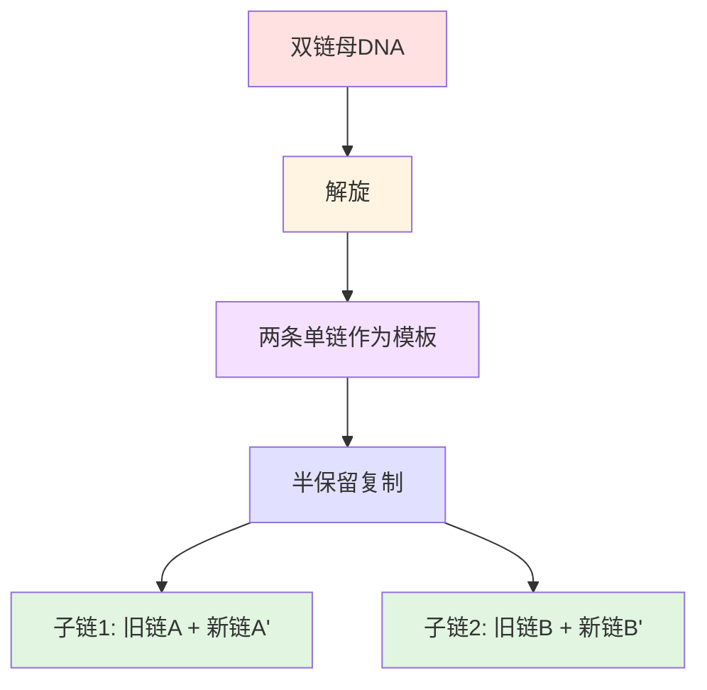
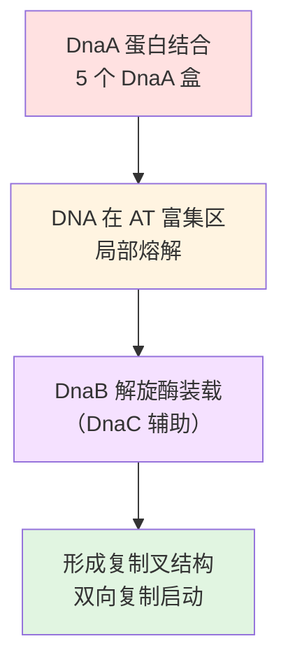
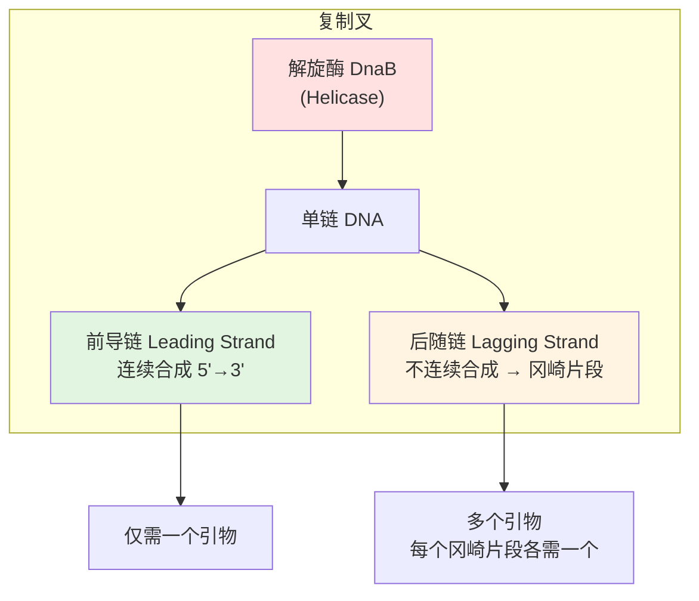
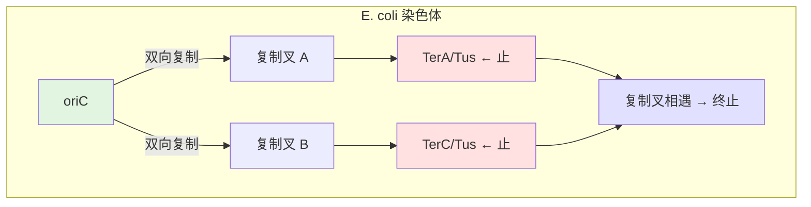
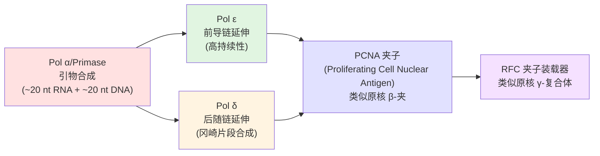
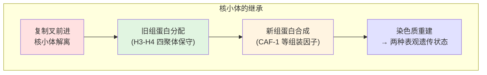
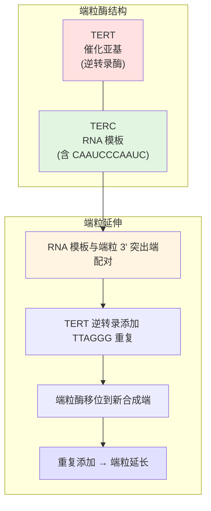
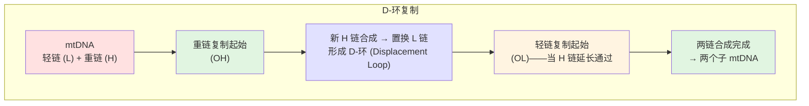
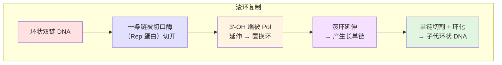
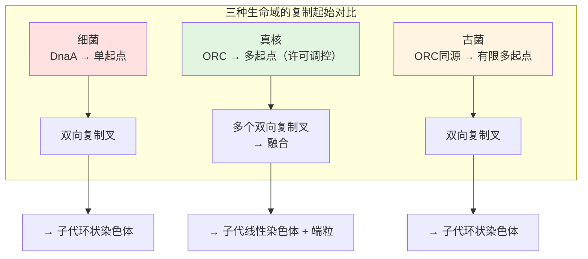

---
tags:
  - Biology
  - Genetics
  - Molecular Biology
  - 定义性
  - 基本原理
title: DNA Replication DNA复制
created: 2026-06-07
modified:
---

# DNA Replication DNA复制

> [!abstract] 概述
> **DNA 复制 (DNA Replication)** 是生物体在细胞分裂前将双链 DNA 精确拷贝一份的分子过程，是遗传信息代际传递的基础。所有生物都使用**半保留复制 (Semiconservative Replication)** 机制——每条新合成的双链 DNA 分子含一条旧链和一条新链。不同生物类群（原核、真核、古菌、病毒、细胞器）在复制起始、延伸和终止机制上存在显著差异。



---

## 1. DNA 复制的基本原则

### 1.1 半保留复制的实验证据

**梅塞尔森-斯塔尔实验 (Meselson–Stahl Experiment, 1958)** 以三个关键证据确立了半保留复制模型：

| 世代 | $^{15}\text{N}$ 标记状态 | 离心结果 | 结论 |
|------|--------------------------|----------|------|
| **0 代** | 两条链均为重氮 | 一条重带 | 起始对照 |
| **1 代** | 一条重链 + 一条轻链 | 一条中间带 | **排除了全保留复制** |
| **2 代** | 混合：中间 + 轻 | 两条带（中间 + 轻） | **排除了分散复制，证实半保留** |

```mermaid
graph LR
    subgraph Meselson–Stahl 实验
        A["$^{15}\text{N}/^{15}\text{N}$ 重 DNA"] -->|"转入 $^{14}\text{N}$ 培养基"| B["$^{15}\text{N}/^{14}\text{N}$ 杂合 DNA"]
        B -->|"第二次复制"| C["$^{15}\text{N}/^{14}\text{N}$ <br/>+ <br/>$^{14}\text{N}/^{14}\text{N}$"]
    end

    style A fill:#ffe1e1
    style B fill:#e1e1ff
    style C fill:#e1f5e1
```

> [!note] 三种复制模型
> - **全保留复制 (Conservative)**：母链完整保留，两条新链形成新双螺旋 ❌
> - **半保留复制 (Semiconservative)**：每条子代双链含一条母链 + 一条新链 ✅
> - **分散复制 (Dispersive)**：新旧片段交错分布在两条链上 ❌

### 1.2 复制的一般特征

| 特征 | 说明 |
|------|------|
| **半保留性** | 每条新双链含一条模板链和一条新合成的链 |
| **方向性** | 新链合成方向均为 **5' → 3'** |
| **模板依赖性** | 以单链 DNA 为模板，遵循 A–T、G–C 配对 |
| **引物依赖性** | 需要一段 **RNA 引物 (Primer)** 提供游离 3'-OH |
| **双向复制** | 从复制起始点向两个方向进行（除少数例外） |
| **半不连续合成** | 一条链连续合成（前导链），另一条不连续合成（后随链→冈崎片段） |

### 1.3 参与 DNA 复制的核心酶与蛋白质

| 组分 | 英文 | 功能 |
|------|------|------|
| **DNA 解旋酶** | DNA Helicase | 利用 ATP 水解能量解开 DNA 双螺旋 |
| **单链结合蛋白** | SSB (Single-Strand Binding Protein) | 稳定已解开的单链，防止重新配对 |
| **DNA 拓扑异构酶** | DNA Topoisomerase (Gyrase) | 释放解旋产生的超螺旋张力 |
| **引物酶** | Primase (DnaG) | 合成短 RNA 引物提供 3'-OH 起点 |
| **DNA 聚合酶 III** | DNA Polymerase III | 原核生物主要的 DNA 合成酶（高持续合成能力） |
| **DNA 聚合酶 I** | DNA Polymerase I | 去除 RNA 引物并填补空隙 |
| **DNA 连接酶** | DNA Ligase | 连接冈崎片段，封闭磷酸二酯键缺口 |
| **滑动夹** | Sliding Clamp (β-clamp) | 将 DNA 聚合酶固定在模板上，提高持续合成能力 |
| **夹子装载器** | Clamp Loader (γ-complex) | 利用 ATP 将滑动夹装载到 DNA 上 |

---

## 2. 原核 DNA 复制 (Prokaryotic DNA Replication)

以 **大肠杆菌 (Escherichia coli)** 为模式生物。原核生物通常只有一个**复制起始点 (Origin of Replication)**，命名为 **oriC**。

### 2.1 oriC 的结构

大肠杆菌的 **oriC** 长约 **245 bp**，包含两个关键序列元件：

| 元件 | 序列特征 | 数量 | 结合蛋白 | 功能 |
|------|----------|------|----------|------|
| **DnaA 盒** | 9-mer 重复：TTAT(C/A)CA(C/A)A | **5 个** | DnaA 蛋白 | 复制起始的识别位点 |
| **AT 富集区** | 富含 A–T 的 13-mer 重复序列 | **3 个** | DnaA（协助解链） | 易于解旋的**熔解区 (DNA melting region)** |

```
oriC 结构示意：

5' — [DnaA盒1]—[DnaA盒2]—[13-mer]—[13-mer]—[13-mer]—[DnaA盒3]—[DnaA盒4]—[DnaA盒5]— 3'
                      |← AT富集区 →|
```

### 2.2 起始阶段 (Initiation)



**具体步骤**：

1. **DnaA 识别与结合**：~10-20 个 DnaA 蛋白结合 5 个 DnaA 盒，使 oriC 区域缠绕在 DnaA 复合物上
2. **双链熔解**：AT 富集区（A–T 碱基对仅 2 个氢键）在 DnaA 蛋白的张力下解旋，形成**开放复合物 (Open Complex)**
3. **解旋酶装载**：DnaC（解旋酶装载器）将 **DnaB 解旋酶** 装载到单链 DNA 上（每个复制叉方向各一个）
4. **复制叉建立**：DnaB 沿 5' → 3' 方向移动解旋，形成双向复制叉

> [!warning] DnaB 解旋酶装载是限速步骤
> DnaC 是 DnaB 的分子伴侣，每个 DnaB 六聚体需要 6 个 DnaC 分子协助装载。装载后 DnaC 释放，DnaB 被激活开始解旋。

### 2.3 延伸阶段 (Elongation)

**DNA 聚合酶 III 全酶 (DNA Pol III Holoenzyme)** 是原核复制的主角，包含多种亚基：

| 亚基 | 功能 |
|------|------|
| **α** (DnaE) | **聚合酶活性**——催化磷酸二酯键形成 |
| **ε** (DnaQ) | **3' → 5' 校对外切酶活性**——纠错 |
| **θ** (HolE) | 刺激 ε 的外切酶活性 |
| **β** (DnaN) | **滑动夹 (Sliding Clamp)**——环状，环绕 DNA |
| **γ-复合体** | **夹子装载器 (Clamp Loader)**——将 β 夹装到 DNA/引物接合处 |

#### 前导链与后随链



**前导链 (Leading Strand)** 和 **后随链 (Lagging Strand)** 的协同合成是理解 DNA 复制的核心：

| 特征 | 前导链 | 后随链 |
|------|--------|--------|
| **合成方向** | 与复制叉前进方向 **相同** | 与复制叉前进方向 **相反** |
| **合成方式** | **连续** | **不连续**（冈崎片段 Okazaki Fragments） |
| **引物需求** | 仅起始需要 1 个引物 | 每个冈崎片段需要 1 个引物 |
| **产物片段** | 一条连续长链 | 连接的冈崎片段（原核 ~1,000-2,000 nt） |
| **DNA 聚合酶** | Pol III 持续合成（一条酶分子） | Pol III 反复循环使用的机制 |

```
复制叉结构示意图：

       ┌─ 前导链 Leading ────────────────► 5'
       │     5' ────────────────────────────►
       │     ↑
  3'───┴─────────────────────────── 5'   ← 模板链
  │   ← 解旋酶方向
  │
  5'───┬─────────────────────────── 3'   ← 模板链
        │     ↓
        └─ 后随链 Lagging ────────────────► 5'
            5'  ←[Okazaki]←[Okazaki]←[Okazaki]←
```

#### 冈崎片段的成熟

1. **引物切除**：**DNA 聚合酶 I** 的 **5' → 3' 外切酶活性** 切除 RNA 引物
2. **空隙填补**：DNA 聚合酶 I 同时填补留下的空隙（聚合酶活性）
3. **缺口连接**：**DNA 连接酶 (DNA Ligase)** 封闭最后一个磷酸二酯键——需要 **NAD$^+$**（原核）或 **ATP**（真核）提供能量

> [!important] 后随链合成的关键问题
> **问题**：后随链的模板方向（5' → 3'）与 DNA 聚合酶的合成方向（5' → 3'）相反。
> **解决方案**：模板链形成**环 (Trombone Model)**——后随链模板在 Pol III 处形成一个环，使得 Pol III 可以沿解旋酶前进方向同步合成果片段，同时保持后随链的 5' → 3' 方向性符合聚合酶要求。

### 2.4 终止阶段 (Termination)

原核复制的终止是高度有序的：

1. **Ter 序列 (Terminator Sequences)**：分布于 oriC 对侧约 100 kb 处，含有 **terA–terF** 共 6 个序列
2. **Tus 蛋白 (Terminator Utilization Substance)**：结合 Ter 序列，阻止解旋酶前进
3. **两个复制叉在 Ter–Tus 复合物处相遇并停止**



**终止后的处理**：
- 两个复制叉相遇后留下两个连锁的环状子染色体
- **拓扑异构酶 IV (Topoisomerase IV)** 解开连锁（去拓扑化）
- 分配到两个子细胞

---

## 3. 真核 DNA 复制 (Eukaryotic DNA Replication)

真核 DNA 复制比原核复杂得多：基因组更大、染色质结构、多个复制起点、细胞周期调控。

### 3.1 多起点复制

| 特征 | 原核 | 真核 |
|------|------|------|
| **复制起点数** | 1 (oriC) | **数百到数万** |
| **复制速率** | ~1,000 nt/s | ~50 nt/s（慢，但多起点补偿） |
| **染色体结构** | 裸露环状 DNA | **染色质**（DNA + 组蛋白） |
| **复制时间** | ~40 分钟 | ~8 小时（人类 S 期） |

**复制起点密度**：

| 生物 | 基因组大小 | 复制起点数量 | 平均间距 |
|------|-----------|-------------|----------|
| **酿酒酵母** | 12 Mb | ~400 | ~30 kb |
| **果蝇** | 180 Mb | ~3,000 | ~60 kb |
| **非洲爪蟾** | 3 Gb | ~10,000 | ~300 kb |
| **人类** | 3.2 Gb | ~30,000–50,000 | ~100 kb |

#### 酵母复制起点——自主复制序列 (ARS)

酿酒酵母的复制起点称为 **ARS (Autonomously Replicating Sequence)**，含有一个保守的 **ACS (ARS Consensus Sequence)**：

```
ACS 共有序列: 5' -(A/T)TTTA(T/C)A(T/C)TTT(T/A)- 3'
```

### 3.2 起始许可机制 (Replication Licensing)

真核细胞通过**许可机制**确保每个复制起点在每个细胞周期**只起始一次**。这是真核复制调控的核心。

```mermaid
flowchart TB
    subgraph G1期 — 许可
        A["ORC 结合原点<br/>(Origin Recognition Complex)"] --> B["Cdc6 + Cdt1 招募"]
        B --> C["MCM 解旋酶装载<br/>→ 形成前复制复合物<br/>Pre-RC"]
    end
    
    subgraph S期 — 起始
        C --> D["CDK + DDK 磷酸化"]
        D --> E["MCM 激活<br/>→ Cdc45 + GINS 招募"]
        E --> F["CMG 解旋酶全酶<br/>→ 双链打开"]
        F --> G["复制起始<br/>→ 复制叉建立"]
    end
    
    subgraph S/G2 — 禁止重新许可
        G --> H["CDK 持续活化<br/>→ Cdc6 降解<br/>→ Cdt1 抑制<br/>→ ORC 磷酸化"]
        H --> I["Pre-RC 无法重新形成<br/>→ 每周期只起始一次"]
    end
    
    style A fill:#ffe1e1
    style C fill:#fff4e1
    style F fill:#f5e1ff
    style G fill:#e1f5e1
    style I fill:#ffe1e1
```

**关键蛋白**：

| 蛋白 | 英文 | 功能 |
|------|------|------|
| **ORC** | Origin Recognition Complex | **6 亚基复合物**，永久结合复制起点，作为 Pre-RC 平台 |
| **Cdc6** | Cell Division Cycle 6 | ORC 的辅助因子，协助 MCM 装载 |
| **Cdt1** | Chromatin Licensing and DNA Replication Factor 1 | 与 MCM 结合，促进其装载到染色质 |
| **MCM 复合物** | Mini-Chromosome Maintenance | **6 亚基解旋酶**（MCM2-7），真核复制解旋酶核心 |
| **Cdc45** | Cell Division Cycle 45 | MCM 激活所需的组装因子 |
| **GINS 复合物** | Go-Ichi-Ni-San (5-1-2-3 日语) | MCM 激活所需的组装因子（Sld5, Psf1-3） |
| **CDK** | Cyclin-Dependent Kinase | 驱动 G1→S 转换，磷酸化关键底物 |
| **DDK** | Dbf4-Dependent Kinase (Cdc7) | 磷酸化 MCM 复合物，启动复制 |

> [!important] CDK 的双重角色
> - **G1 晚期**：低 CDK 活性 → 允许 Pre-RC 装配（许可）
> - **S 期早期**：高 CDK 活性 → 激活 Pre-RC 起始复制
> - **S/G2/M**：持续高 CDK 活性 → **抑制 Pre-RC 重新装配**
> - **M/G1 过渡**：CDK 活性骤降 → 允许下一周期的许可
> 
> 这种 CDK 活性的周期振荡是"一次复制"保障机制的核心。

### 3.3 延伸阶段——真核复制叉

真核复制叉使用三种不同的 DNA 聚合酶：

#### 三种 DNA 聚合酶的协作



| 聚合酶 | 亚基 | 功能 | 类似原核 |
|--------|------|------|----------|
| **Pol α** (Pol α-primase) | **4 亚基** | 合成 RNA 引物 + 延伸~20 nt DNA | DnaG（引物酶） |
| **Pol ε** | **4 亚基** | **前导链**持续延伸 | Pol III α 亚基 |
| **Pol δ** | **3-4 亚基** | **后随链**合成冈崎片段 | Pol III α 亚基 |
| **PCNA** | 三聚体环 | **滑动夹**——环绕 DNA，锚定 Pol δ/ε | β-夹 (DnaN) |
| **RFC** | 五亚基复合物 | **PCNA 装载器**——将 PCNA 装载到引物-模板连接处 | γ-复合体 |

#### 真核复制叉的完整蛋白组成

```
真核复制叉（~50+ 种蛋白组成的超分子复合物）:

       ┌──── 前导链 Pol ε ────► 5'
       │    5' ────────────────────►
       │    ↑
  3'───┴──── CMG 解旋酶 ────── 5'   ← 模板链
       │    (MCM2-7 + Cdc45 + GINS)
       │
  5'───┬──── CMG 解旋酶 ────── 3'   ← 模板链
       │    ↓
       └──── 后随链 Pol δ ────► 5'
            Pol α ░░░░ Pol δ ░░░░ Pol δ ░░░░ Pol δ
```

> [!note] CMG 复合体
> **CMG (Cdc45-MCM-GINS)** 是真核复制解旋酶全酶。MCM2-7 六聚体形成两个环，环绕前后随链模板。**Cdc45 和 GINS** 结合在 MCM 环的外表面，稳定并激活解旋酶活性。CMG 沿 **3' → 5'** 方向移动（在拉动前导链模板的方向）。

### 3.4 核小体继承与染色质重建

真核复制面临原核不存在的挑战——DNA 缠绕在组蛋白上形成核小体。



| 过程 | 机制 | 关键蛋白 |
|------|------|----------|
| **核小体解离** | 复制叉前进时核小体从 DNA 上临时剥离 | FACT 复合物 |
| **旧组蛋白回收** | **H3-H4 四聚体整体传递**到子链（半保守分配） | MCM2（结合 H3-H4） |
| **新组蛋白沉积** | 新合成的组蛋白与旧组蛋白混合装配 | CAF-1、ASF1、Rtt106 |
| **表观遗传继承** | 组蛋白修饰密码部分保留 | 读者-写者机制 |

> [!tip] 表观遗传信息的复制
> 组蛋白修饰（如 H3K4me3、H3K27me3）在复制后会被部分稀释。但某些"读者-写者"机制能识别残留的修饰并恢复修饰模式——这是**表观遗传记忆 (Epigenetic Memory)** 的分子基础。

### 3.5 端粒复制 (Telomere Replication)

**端粒 (Telomere)** 是线性染色体末端的保护结构。**末端复制问题 (End-Replication Problem)** 是所有线性基因组面临的固有挑战。

#### 末端复制问题

```
染色体 DNA 末端：

5' - [TTAGGG]n - 3'
3' - [AATCCC]n - 5'   ← 3' 突出端 (3' Overhang)
```

**问题**：当复制叉到达染色体末端时：
1. 前导链可复制到末端（合成完整的子链）
2. 后随链最后一条 RNA 引物被切除后——**无法填补产生的缺口**
3. 每次 DNA 复制使染色体缩短 **~50-200 bp**

$$
\text{染色体每次分裂缩短} \Rightarrow \text{海弗利克极限 (Hayflick Limit)}
$$

#### 端粒酶 (Telomerase)

**端粒酶 (Telomerase)** 是一种特殊的**核糖核蛋白 (RNP)**——含 RNA 模板的逆转录酶：



| 组分 | 全称 | 功能 |
|------|------|------|
| **TERT** | Telomerase Reverse Transcriptase | **催化亚基**——以 RNA 为模板合成 DNA |
| **TERC** | Telomerase RNA Component | 含模板序列的 RNA，确定了端粒重复序列 |
| **Dyskerin** | Dyskerin | 端粒酶复合物稳定性组分 |

**端粒酶的活性差异**：

| 细胞类型 | 端粒酶活性 | 生物学意义 |
|----------|-----------|-----------|
| **生殖细胞** | **高活性** | 确保染色体在世代间不缩短 |
| **干细胞** | 中等活性 | 维持组织再生能力 |
| **体细胞** | **几乎无活性** | → 端粒逐渐缩短 → 细胞衰老/凋亡 |
| **癌细胞** | **~90% 重新激活** | 获得无限增殖潜能 |

> [!important] 端粒与衰老及癌症
> - **衰老 (Senescence)**：端粒缩短到临界长度 → DNA 损伤反应 → 细胞不可逆停止分裂
> - **癌症 (Cancer)**：~90% 的癌细胞重新激活端粒酶 → 获得复制永生
> - **端粒酶激活机制**：**hTERT 基因启动子突变**（C228T、C250T）是多种癌症中最常见的非编码突变

---

## 4. 古菌 DNA 复制 (Archaeal DNA Replication)

古菌 (Archaea) 的 DNA 复制机制展现了有趣的特征——结合了细菌和真核的元素：

| 特征 | 古菌 | 与哪种类似 |
|------|------|-----------|
| **复制起点数** | **单个**（如 *Pyrococcus*）或多个（如 *Sulfolobus*） | 细菌形态，真核复杂性 |
| **复制起始蛋白** | 类似真核 **ORC/Cdc6** | 真核 |
| **MCM 解旋酶** | 存在 MCM 同源物（通常六聚体） | 真核 |
| **聚合酶** | 家族 B DNA 聚合酶（类似真核 Pol δ） | 真核 |
| **PCNA** | 三聚体滑动夹（类似真核） | 真核 |
| **引物酶** | 引发酶与聚合酶偶联（类似真核 Pol α） | 真核 |
| **拓扑异构酶** | 逆转旋转酶 (Reverse Gyrase) + Topo VI | **古菌特有** |
| **染色体结构** | **类组蛋白 (Histone-like)**——形成核小体 | 真核 |

> [!note] 古菌复制的独特之处
> - 某些古菌（如 *Sulfolobus solfataricus*）有 **3 个复制起点**并列分布——不同于细菌的单个或多个分散起点
> - 古菌 DNA 聚合酶具有极高的热稳定性——**PCR 技术中的 Taq 聚合酶就是古菌 DNA 聚合酶的衍生**
> - 古菌逆转旋转酶是唯一能向 DNA 引入正超螺旋的拓扑异构酶

---

## 5. 线粒体 DNA 复制 (Mitochondrial DNA Replication)

**线粒体 DNA (mtDNA)** 是环状双链分子（类似细菌），但使用独特的复制机制。

### 5.1 D-环复制模型 (D-loop Replication / Strand-Displacement Model)

这是哺乳动物 mtDNA 的主要复制方式：



| 特征 | 说明 |
|------|------|
| **复制起始** | **非同步**——重链先起始，轻链后起始（延迟的） |
| **D-环区域** | 一个约 1 kb 的三链结构区域（**控制区**），含 OH（重链复制起点） |
| **聚合酶** | **Pol γ** (DNA Polymerase Gamma)——唯一负责 mtDNA 复制的酶 |
| **解旋酶** | **Twinkle**——线粒体特有的解旋酶 |
| **引物酶** | 线粒体 RNA 聚合酶 **(POLRMT)** 合成引物 |
| **速率** | 非常慢——完成一个 mtDNA 复制约需 **1-2 小时** |

### 5.2 与细菌复制的比较

| 特征 | 线粒体 DNA 复制 | 细菌 DNA 复制 |
|------|---------------|--------------|
| **染色体** | 环状双链 ~16.5 kb | 环状双链 ~4.6 Mb |
| **copy 数** | **多拷贝**（~1,000-10,000/细胞） | 单拷贝（分裂前为 2） |
| **复制起始** | **两个不同时起始的起点** (OH, OL) | 一个起点 (oriC)，双向同步 |
| **聚合酶** | 单一 Pol γ（类似家族 A） | Pol III（复制）+ Pol I（修复） |
| **引物** | POLRMT 合成 RNA | DnaG 引物酶 |
| **拓扑异构酶** | Topo mt | DNA Gyrase (Topo II) |
| **冈崎片段长度** | 无典型冈崎片段 | ~1,000-2,000 nt |

---

## 6. 病毒 DNA 复制 (Viral DNA Replication)

病毒利用宿主细胞的复制机器或自带专门的复制酶。病毒的多样性也体现在其 DNA 复制策略上。

### 6.1 滚环复制 (Rolling Circle Replication, RCR)

常见于噬菌体（如 ΦX174、M13）和某些病毒（如疱疹病毒）：



$$ 
\text{滚环复制产物} = \text{一条新环状双链} + \text{一条线性多联体} \xrightarrow{\text{切割}} \text{多个子代环状 DNA}
$$

### 6.2 双链环状病毒复制

**SV40 (Simian Virus 40)** 是真核病毒复制的经典模型：

- **单一起点**——类似原核，但使用**宿主真核复制机器**
- **大 T 抗原 (Large T Antigen)**——病毒编码的解旋酶，功能类似真核 CMG
- **双向复制**，从单一起点向两个方向进行

### 6.3 逆转录病毒（特殊）

**逆转录病毒 (Retrovirus)** 如 HIV 使用 **RNA → DNA 的逆转录** 而不是 DNA → DNA 复制：

$$
\text{病毒 RNA} \xrightarrow{\text{逆转录酶 (Reverse Transcriptase, RT)}} \text{病毒 DNA} \xrightarrow{\text{整合酶}} \text{整合入宿主基因组}
$$

> [!note] 逆转录酶是重要的药物靶点
> HIV 逆转录酶抑制剂（如 AZT、拉米夫定）是抗 HIV 治疗的基石药物——它们作为链终止类似物抑制病毒 DNA 合成。

### 6.4 各病毒复制策略比较

| 病毒类型 | 基因组类型 | 复制策略 | 例子 |
|----------|-----------|----------|------|
| **噬菌体 ΦX174** | 环状单链 (+)DNA | **滚环复制** | 切→延伸→切割→环化 |
| **噬菌体 λ** | 线性双链 DNA | **θ 型复制**（早期）→ **滚环复制**（晚期） | 溶菌循环 |
| **SV40** | 环状双链 DNA | **θ 型复制**，依赖宿主 Pol α/δ | 双向复制 |
| **疱疹病毒** | 线性双链 DNA | **滚环复制** → 多联体加工 | HSV-1 |
| **腺病毒** | 线性双链 DNA | **蛋白引发复制** | 末端蛋白 (TP) 替代引物 |
| **逆转录病毒** | (+)ssRNA | **逆转录** → 整合 | HIV-1 |
| **乙肝病毒** | 部分双链环状 DNA | **逆转录**（通过前基因组 RNA） | HBV |

---

## 7. 复制的保真度与校对机制

### 7.1 突变率对比

| 复制系统 | 突变率（/bp/复制） | 保真机制 |
|----------|-------------------|----------|
| **DNA 聚合酶本身** | $10^{-5}$–$10^{-6}$ | 碱基选择 + 几何检查 |
| **+ 校对 (Proofreading)** | $10^{-7}$–$10^{-8}$ | 3' → 5' 外切酶活性 |
| **+ 错配修复 (MMR)** | $10^{-9}$–$10^{-10}$ | 识别 + 切除 + 重合成 |
| **RNA 依赖的 RNA 聚合酶** | $10^{-3}$–$10^{-4}$ | 无校对机制（流感病毒） |
| **逆转录酶 (RT)** | $10^{-4}$–$10^{-5}$ | 校对能力弱或无（HIV） |

### 7.2 校对机制

```
校对过程：

新插入的碱基 ──→ 检查 ──→ 正确：继续延伸
                  │
                  └── 错误：3' → 5' 外切切除错误碱基
                            → 重新尝试
```

**DNA 聚合酶的活性位点就像一个"分子筛"**：

| 筛检层次 | 机制 | 保真度提升 |
|----------|------|-----------|
| **1. 碱基选择** | 正确配对（A:T、G:C）热力学更稳定、几何尺寸正确 | ~$10^4$–$10^5$ 倍 |
| **2. 校对 (Proofreading)** | 3' → 5' 外切活性切除错配碱基 | ~$10^2$ 倍 |
| **3. 错配修复 (Mismatch Repair)** | 复制后扫描新链、识别错配、切除并重合成 | ~$10^2$–$10^3$ 倍 |

### 7.3 原核 vs 真核校对对比

| 特征 | 原核 (E. coli) | 真核 (人类) |
|------|---------------|------------|
| **校对外切酶** | Pol III ε 亚基 (DnaQ) | Pol δ/ε 自带 3' → 5' 外切结构域 |
| **错配修复系统** | MutS → MutL → MutH → 解旋酶 → 外切酶 | MSH → MLH/PMS → EXO1 → Pol δ/PCNA |
| **甲基化导向** | **GATC 甲基化**识别母链 | **连续切口**（新链中 PCNA 相关的缺口）识别新链 |
| **错配修复缺陷后果** | 突变频率升高 ~$10^3$ 倍 | **遗传性非息肉性结直肠癌 (HNPCC)** |

---

## 8. 三种生命域的 DNA 复制对比

| 特征 | **细菌** (E. coli) | **真核** (人类) | **古菌** (Sulfolobus) |
|------|-------------------|----------------|----------------------|
| **基因组结构** | 环状双链 DNA | **线性**多染色体 | 环状双链 DNA |
| **复制起点数** | 1 | **数千** | 1–3 |
| **起始识别** | DnaA 蛋白 | **ORC + Cdc6 + Cdt1** | ORC/Cdc6 同源物 |
| **解旋酶** | DnaB (六聚体) | **MCM2-7** + Cdc45 + GINS (= CMG) | MCM 同源物 |
| **引物酶** | DnaG | Pol α-引物酶复合体 | 引发酶-Pol 融合蛋白 |
| **主要 DNA 聚合酶** | Pol III | **Pol ε**（前导链）、**Pol δ**（后随链） | 家族 B Pol |
| **滑动夹** | β-夹 (DnaN) | **PCNA** | PCNA 同源物 |
| **夹子装载器** | γ-复合体 | **RFC** | RFC 同源物 |
| **冈崎片段长度** | ~1,000–2,000 nt | ~100–200 nt | ~100–500 nt |
| **终止机制** | Ter–Tus 复合物 | **端粒酶**解决末端问题 | Ter 样序列? |
| **校对机制** | 3'→5' + MutS/L/H | 3'→5' + MSH/MLH | 3'→5' + MSH 同源物 |
| **拓扑异构酶** | Gyrase (Topo II) | Topo I, IIα, IIβ | 逆转旋转酶 |
| **复制时间** | ~40 min | ~8 h (S 期) | 因物种而异 |



---

## 9. 核心要点总结

1. **半保留复制**：每条新双链含一条旧链 + 一条新链（Meselson–Stahl 实验证实）
2. **DNA 合成方向**：始终 **5' → 3'**，需要 RNA 引物提供游离 3'-OH
3. **半不连续合成**：前导链连续、后随链不连续（冈崎片段→连接）
4. **原核复制**：单起点 (oriC) → DnaA 起始 → DnaB/C 解旋酶 → Pol III 全酶 → Ter/Tus 终止
5. **真核复制**：多起点 → ORC/MCM 许可 → CDK/DDK 激活 → CMG 解旋酶 → Pol α/ε/δ → 端粒酶
6. **线粒体复制**：D-环模型 → Pol γ → 重链先起始、轻链后起始
7. **病毒策略多样**：滚环复制、θ 型复制、蛋白引发、逆转录等
8. **保真度**：聚合酶选择 (10⁻⁵) + 校对 (10⁻⁷) + 错配修复 (10⁻⁹) 共同达到 $10^{-10}$
9. **真核独有挑战**：染色质重建（核小体继承） + 末端复制问题（端粒酶）

## 10. 相关笔记

- [[Genes|基因结构]] — DNA 作为遗传物质的分子基础
- [[Mitosis|有丝分裂]] — DNA 复制后精确分配到子细胞
- [[Meiosis|减数分裂]] — DNA 复制一次，细胞分裂两次
- [[Cyclin and CDK|细胞周期与 CDK]] — 复制起始的细胞周期调控
- [[Cellular Growth|细胞生长]] — 细胞增殖中 DNA 复制的调控
- [[Mendelian Genetics|孟德尔遗传学]] — DNA 复制维护遗传信息的稳定性
