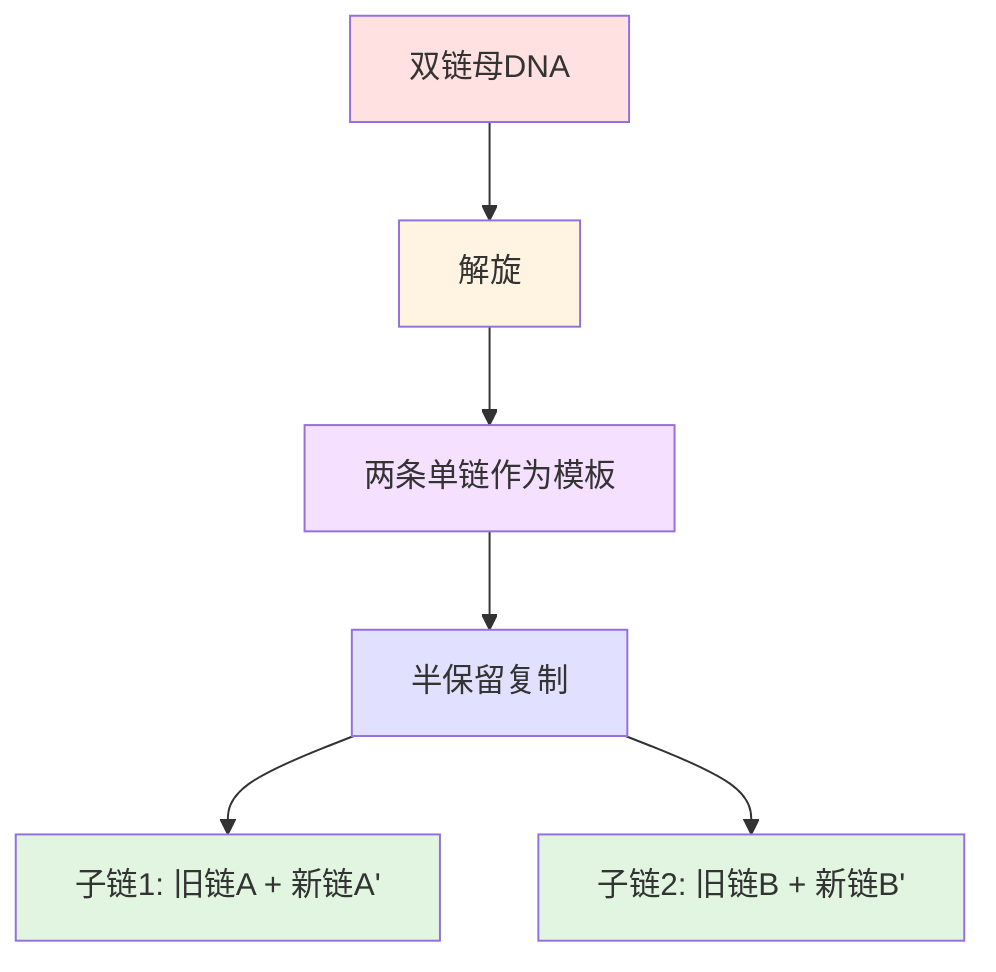
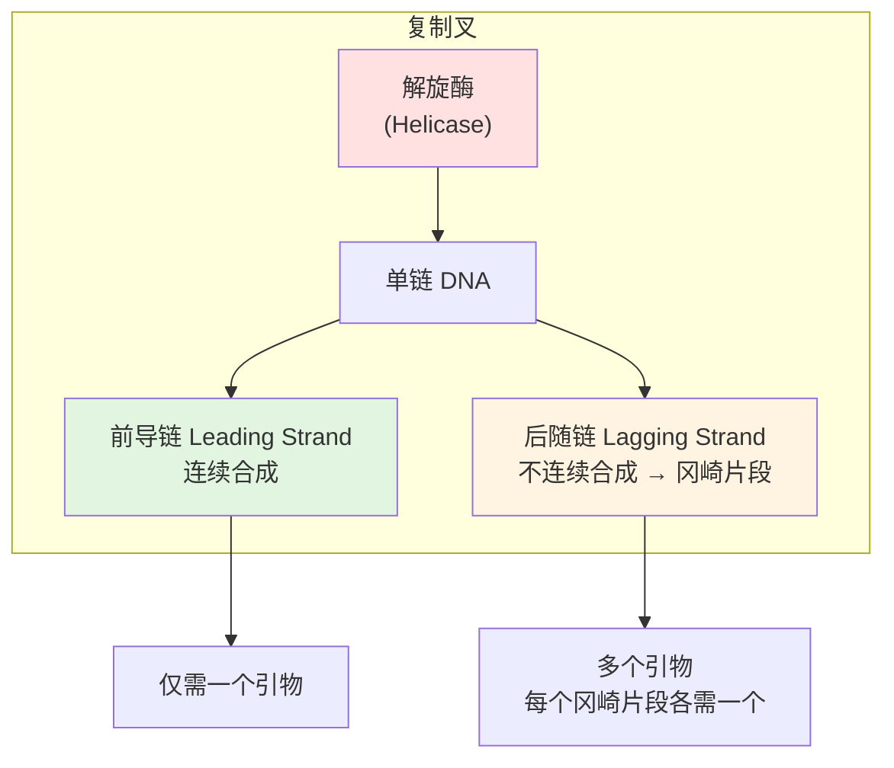
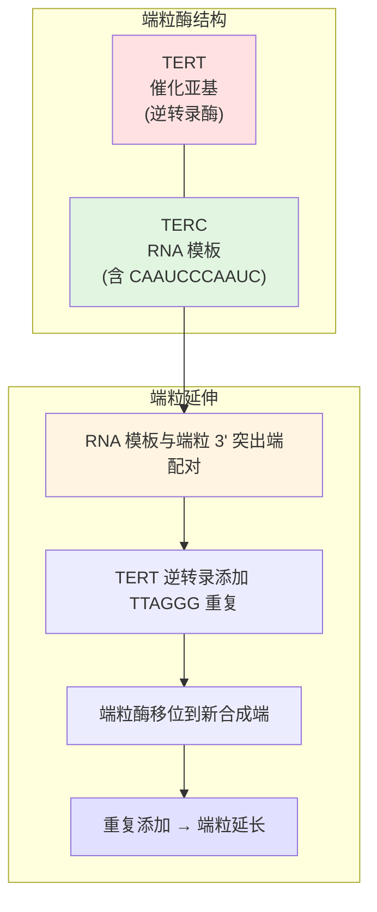

---
tags:
  - Biology
  - Genetics
  - MolecularBiology
  - 定义性
  - 基本原理
title: DNA Replication
created: 2026-06-07
modified:
---

# DNA Replication DNA复制

> [!abstract] 概述
> **DNA 复制 (DNA Replication)** 是生物体在细胞分裂前将双链 DNA 精确拷贝一份的分子过程，是遗传信息代际传递的基础。所有生物都使用**半保留复制 (Semiconservative Replication)** 机制——亲代 DNA 双链分离，各自作为模板，产生含有一条旧链和一条新链的子代 DNA 分子。原核生物和真核生物在复制机制上有共同的基本原理，但在复制起点数量和染色体的结构上存在显著差异。



---

## 1. DNA 复制的基本原则

### 1.1 半保留复制的实验证据

**梅塞尔森-斯塔尔实验 (Meselson–Stahl Experiment, 1958)** 以三个关键证据确立了半保留复制模型：

| 世代 | $^{15}\text{N}$ 标记状态 | 离心结果 | 结论 |
|------|--------------------------|----------|------|
| **0 代** | 两条链均为重氮 | 一条重带 | 起始对照 |
| **1 代** | 一条重链 + 一条轻链 | 一条中间带 | **排除了全保留复制** |
| **2 代** | 混合：中间 + 轻 | 两条带（中间 + 轻） | **排除了分散复制，证实半保留** |

Meselson 和 Stahl 通过将实验结果与三种模型各自的预测结果逐一对比后得出结论：**第一次复制在 ^{14}N 培养基中产生了杂合带（^{15}N–^{14}N），排除了全保留模型；第二次复制同时产生了轻带和杂合带，排除了分散模型，从而确立了半保留模型**。

```mermaid
graph LR
    subgraph Meselson–Stahl 实验
        A["¹⁵N/¹⁵N 重 DNA"] -->|"转入 ¹⁴N 培养基"| B["¹⁵N/¹⁴N 杂合 DNA"]
        B -->|"第二次复制"| C["¹⁵N/¹⁴N<br/>+<br/>¹⁴N/¹⁴N"]
    end

    style A fill:#ffe1e1
    style B fill:#e1e1ff
    style C fill:#e1f5e1
```

> [!note] 三种复制模型
> - **全保留复制 (Conservative)**：母链完整保留，两条新链形成新双螺旋 ❌
> - **半保留复制 (Semiconservative)**：每条子代双链含一条母链 + 一条新链 ✅
> - **分散复制 (Dispersive)**：新旧片段交错分布在两条链上 ❌

### 1.2 复制的一般特征

| 特征         | 说明                                  |
| ---------- | ----------------------------------- |
| **半保留性**   | 每条新双链含一条模板链和一条新合成的链                 |
| **方向性**    | 新链合成方向均为 **5' → 3'**                |
| **模板依赖性**  | 以单链 DNA 为模板，遵循 A–T、G–C 配对           |
| **引物依赖性**  | 需要一段 **RNA 引物 (Primer)** 提供游离 3'-OH |
| **双向复制**   | 从复制起始点向两个方向进行（除少数例外）                |
| **半不连续合成** | 一条链连续合成（前导链），另一条不连续合成（后随链→冈崎片段）     |

### 1.2.1 5' → 3' 方向性

DNA 链的方向由脱氧核糖 (Deoxyribose) 上碳原子的编号决定：

```
5' 端 —PO₄         磷酸基团游离端
      |
      糖 — 碱基
      |
3' 端 —OH          羟基游离端
```

| 端基 | 化学基团 | 功能 |
|------|----------|------|
| **5' 端 (Five-Prime)** | 游离**磷酸基团 (-PO₄)** | 链的"起点" |
| **3' 端 (Three-Prime)** | 游离**羟基 (-OH)** | 新核苷酸在此添加 |

DNA 的两条链方向相反——称为**反向平行 (Antiparallel)**：

```
5' ————→ 3'
3' ←———— 5'
```

> [!note] DNA 聚合酶只能 5' → 3' 合成
> **DNA 聚合酶 (DNA Polymerase)** 只能将新核苷酸添加到已有链的 **3' 端**——因此新链的合成方向始终是 **5' → 3'**。这就是为什么需要 **RNA 引物 (RNA Primer)** 提供游离的 3'-OH 作为合成起点。

这个方向性约束直接导致了前导链和后随链的分工：

```
复制叉前进方向 →

前导链 (Leading Strand)：         5' ——————————————► 3'
（与复制叉同向，连续合成）

后随链 (Lagging Strand)：        3' ◄—— 5'   3' ◄—— 5'   3' ◄—— 5'
（与复制叉反向，分段合成为冈崎片段 Okazaki Fragments）
```

| 链 | 合成方式 | 引物数量 | 产物 |
|----|---------|---------|------|
| **前导链 (Leading Strand)** | 连续 | 1 个 | 一条长链 |
| **后随链 (Lagging Strand)** | 不连续 | 每个冈崎片段 1 个 | 多个冈崎片段 → DNA 连接酶连接 |

### 1.3 参与 DNA 复制的核心酶与蛋白质

| 组分 | 英文 | 功能 |
|------|------|------|
| **DNA 解旋酶** | DNA Helicase | 利用 ATP 水解能量解开 DNA 双螺旋 |
| **单链结合蛋白** | SSB (Single-Strand Binding Protein) | 稳定已解开的单链，防止重新配对 |
| **DNA 拓扑异构酶** | DNA Topoisomerase (Gyrase) | 释放解旋产生的超螺旋张力 |
| **引物酶** | Primase (DnaG) | 合成短 RNA 引物提供 3'-OH 起点 |
| **DNA 聚合酶 III** | DNA Polymerase III | 原核生物主要的 DNA 合成酶（高持续合成能力） |
| **DNA 聚合酶 I** | DNA Polymerase I | 去除 RNA 引物并填补空隙 |
| **DNA 连接酶** | DNA Ligase | 连接冈崎片段，封闭磷酸二酯键缺口 |
| **滑动夹** | Sliding Clamp (β-clamp) | 将 DNA 聚合酶固定在模板上，提高持续合成能力 |
| **夹子装载器** | Clamp Loader (γ-complex) | 利用 ATP 将滑动夹装载到 DNA 上 |

---

## 2. 原核 DNA 复制 (Prokaryotic DNA Replication)

原核生物的 DNA 通常是**环状双链**，存在于细胞质中。以**大肠杆菌 (Escherichia coli)** 为例，复制从单一的**复制起始点 (Origin of Replication)** 开始，向两个方向进行。

DNA 复制的全过程可分为三个阶段：

### 2.1 解旋 (Unwinding)

1. **DNA 解旋酶 (DNA Helicase)** 解开双螺旋，断裂碱基之间的氢键
2. **单链结合蛋白 (Single-Stranded Binding Proteins, SSB)** 结合到已解开的单链上，防止其重新配对
3. **拓扑异构酶 (Topoisomerase)** 在复制叉前方释放超螺旋张力，防止 DNA"打结"
4. **RNA 引物酶 (RNA Primase)** 在每条 DNA 链上添加一段短的 **RNA 引物 (RNA Primer)**——引物酶以亲代 DNA 链为模板，每次添加一个 RNA 核苷酸，合成一段短的互补 RNA 链。新的 DNA 链将从 RNA 引物的 **3' 端**开始延伸，为 DNA 聚合酶提供必需的 3'-OH 起点

### 2.2 碱基互补配对 (Base Pairing)

**DNA 聚合酶 (DNA Polymerase)** 沿 5' → 3' 方向催化新链的合成，按 A-T、C-G 的配对规则添加核苷酸。两条链的合成方式不同：



| 特征 | 前导链 (Leading) | 后随链 (Lagging) |
|------|-----------------|-----------------|
| **合成方式** | 连续合成 | 不连续合成（**冈崎片段 Okazaki Fragments**） |
| **合成方向** | 与复制叉同向 | 与复制叉反向 |
| **引物需求** | 1 个 | 每个冈崎片段 1 个 |

### 2.3 连接 (Joining)

1. **DNA 聚合酶**移除 RNA 引物，并用 DNA 核苷酸填补空隙
2. **DNA 连接酶 (DNA Ligase)** 将冈崎片段连接起来，形成完整的子链

---

## 3. 真核与原核 DNA 复制的比较

### 3.1 不同生物的 DNA 特点与原核 vs 真核的主要区别

DNA 的复制方式与不同生物 DNA 的结构特点密切相关：

| 特征 | 原核生物 (Prokaryote) | 真核生物 (Eukaryote) |
|------|----------------------|---------------------|
| **代表生物** | 大肠杆菌 (E. coli) | 人类、动植物 |
| **DNA 形态** | **环状双链** (Circular) | **线性双链** (Linear，多染色体) |
| **DNA 位置** | 细胞质 (Cytoplasm) | 细胞核 (Nucleus) |
| **复制起点数** | **1 个** | **多个**（数百到数万） |
| **DNA 合成速率** | ~100,000 nt/min | ~50 nt/s |
| **复制时间** | ~30-40 分钟 | ~8 小时（人类 S 期） |
| **冈崎片段长度** | ~1,000–2,000 nt | **~100–200 nt** |

> [!note] 大肠杆菌染色体大小
> 大肠杆菌以约 **100,000 个核苷酸/分钟** 的速度合成 DNA，复制整个基因组约需 **30 分钟**。由此可推算大肠杆菌染色体大小约为：100,000 × 30 = **3,000,000 个核苷酸**，即约 **1,500,000 个碱基对 (bp)**。

```mermaid
graph LR
    subgraph 原核：单一起点
        A["单一起点<br/>环状 DNA"] --> B["两个方向<br/>双向复制"]
    end
    
    subgraph 真核：多起点
        C["多个起点<br/>线性 DNA"] --> D["多个复制泡（Bubbles）<br/>同时复制"]
    end
    
    style A fill:#ffe1e1
    style C fill:#e1f5e1
```

真核 DNA 远长于原核，但通过**多个复制起点同时开工**形成**多个复制泡 (Replication Bubbles)**，每个复制区域长约 10,000 到 1,000,000 个碱基对不等——从而保证在 S 期内完成全部 DNA 的复制。真核的冈崎片段也比原核短得多（约 100-200 nt vs 1,000-2,000 nt），这意味着真核需要更多的引物和更频繁的连接。

### 3.2 端粒复制 (Telomere Replication)

**端粒 (Telomere)** 是线性染色体末端的保护结构。**末端复制问题 (End-Replication Problem)** 是所有线性基因组面临的固有挑战。

#### 末端复制问题

```
染色体 DNA 末端：

5' - [TTAGGG]n - 3'
3' - [AATCCC]n - 5'   ← 3' 突出端 (3' Overhang)
```

**问题**：当复制叉到达染色体末端时：
1. 前导链可复制到末端（合成完整的子链）
2. 后随链最后一条 RNA 引物被切除后——**无法填补产生的缺口**
3. 每次 DNA 复制使染色体缩短 **~50-200 bp**

$$
\text{染色体每次分裂缩短} \Rightarrow \text{海弗利克极限 (Hayflick Limit)}
$$

#### 端粒酶 (Telomerase)

**端粒酶 (Telomerase)** 是一种特殊的**核糖核蛋白 (RNP)**——含 RNA 模板的逆转录酶：



| 组分 | 全称 | 功能 |
|------|------|------|
| **TERT** | Telomerase Reverse Transcriptase | **催化亚基**——以 RNA 为模板合成 DNA |
| **TERC** | Telomerase RNA Component | 含模板序列的 RNA，确定了端粒重复序列 |
| **Dyskerin** | Dyskerin | 端粒酶复合物稳定性组分 |

**端粒酶的活性差异**：

| 细胞类型 | 端粒酶活性 | 生物学意义 |
|----------|-----------|-----------|
| **生殖细胞** | **高活性** | 确保染色体在世代间不缩短 |
| **干细胞** | 中等活性 | 维持组织再生能力 |
| **体细胞** | **几乎无活性** | → 端粒逐渐缩短 → 细胞衰老/凋亡 |
| **癌细胞** | **~90% 重新激活** | 获得无限增殖潜能 |

> [!important] 端粒与衰老及癌症
> - **衰老 (Senescence)**：端粒缩短到临界长度 → DNA 损伤反应 → 细胞不可逆停止分裂
> - **癌症 (Cancer)**：~90% 的癌细胞重新激活端粒酶 → 获得复制永生
> - **端粒酶激活机制**：**hTERT 基因启动子突变**（C228T、C250T）是多种癌症中最常见的非编码突变

---

## 4. 核心要点总结

1. **半保留复制**：亲代 DNA 双链分离为模板，每条子链含一条旧链 + 一条新链（Meselson–Stahl 实验证实）
2. **三阶段**：解旋 (Unwinding) → 碱基互补配对 (Base Pairing) → 连接 (Joining)
3. **关键酶**：DNA 解旋酶、单链结合蛋白 (SSB)、RNA 引物酶、DNA 聚合酶、DNA 连接酶、拓扑异构酶
4. **5' → 3' 合成**：DNA 聚合酶只能将核苷酸添加到 3' 端，新链从 RNA 引物的 3' 端开始延伸
5. **半不连续合成**：前导链连续合成（1 个引物），后随链不连续合成为冈崎片段（多个引物）→ DNA 连接酶连接
6. **原核 vs 真核**：原核环状 DNA、单个起点、~1.5 × 10⁶ bp、约 30 分钟完成；真核线性 DNA、多个起点（形成复制泡）、约 8 小时完成
7. **端粒**：真核线性染色体末端的保护性重复序列，由端粒酶维持——端粒随分裂逐渐缩短，是细胞衰老的"分子时钟"

## 5. 相关笔记

- [[Genes|基因结构]] — DNA 作为遗传物质的分子基础
- [[Mitosis|有丝分裂]] — DNA 复制后精确分配到子细胞
- [[Meiosis|减数分裂]] — DNA 复制一次，细胞分裂两次
- [[Cyclin and CDK|细胞周期与 CDK]] — 复制起始的细胞周期调控
- [[Cellular Growth|细胞生长]] — 细胞增殖中 DNA 复制的调控
- [[Mendelian Genetics|孟德尔遗传学]] — DNA 复制维护遗传信息的稳定性
