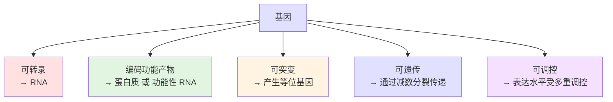
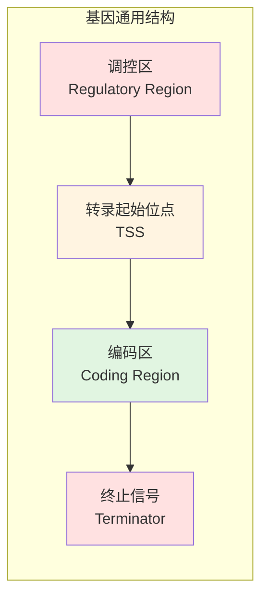
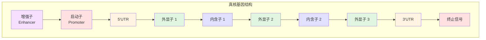
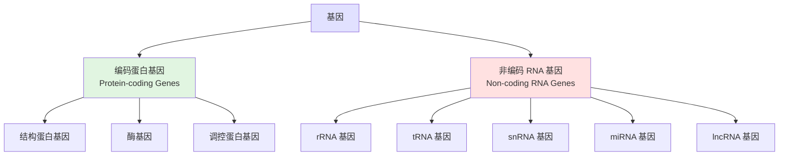
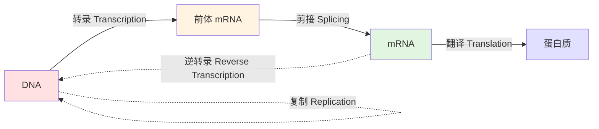
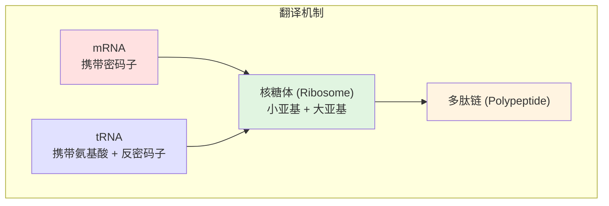
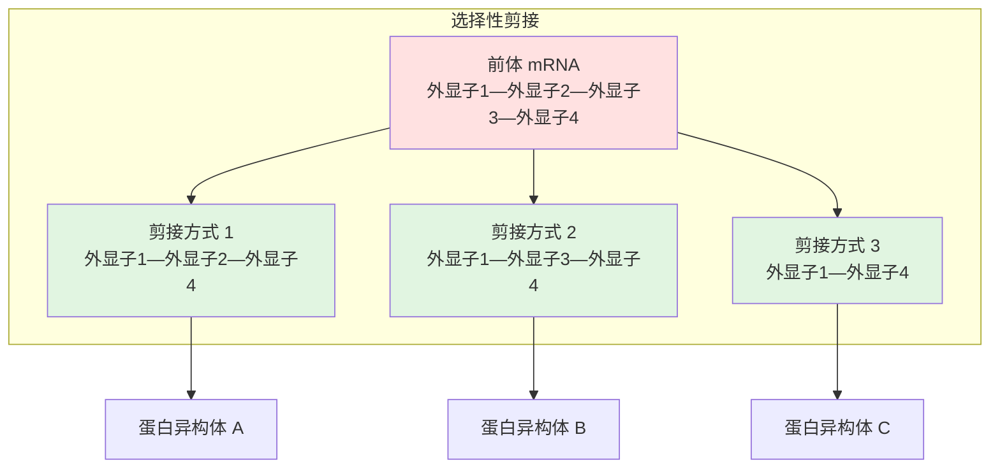

---
tags:
  - Biology
  - Genetics
  - 定义性
  - 基本原理
title: Genes 基因结构
created: 2026-05-21
modified:
---

# Genes 基因结构

> [!abstract] 概述
> **基因 (Gene)** 是遗传信息的基本功能单位——一段编码功能性产物（蛋白质或 RNA）的 DNA 序列。基因的结构决定了它如何被转录、加工和翻译，是分子生物学的核心概念。

## 1. 基因的定义

### 1.1 经典定义 vs 现代定义

| 定义视角 | 定义内容 | 时期 |
|----------|----------|------|
| **孟德尔** | 控制性状的"遗传因子" | 1866 |
| **摩尔根** | 染色体上呈线性排列的遗传单位 | 1910s |
| **"一个基因一个酶"** | 每个基因编码一种特定的酶（比德尔 & 塔特姆） | 1941 |
| **分子定义** | 一段转录为功能性 RNA 或翻译为蛋白质的 DNA 序列 | 当代 |

### 1.2 基因的核心特征



## 2. 基因的化学本质

### 2.1 DNA 的分子结构

**脱氧核糖核酸 (DNA)** 由两条反向平行的多核苷酸链组成双螺旋结构。

#### 核苷酸组成

| 组分 | 类型 | 说明 |
|------|------|------|
| **磷酸基团** | — | 连接相邻核苷酸形成磷酸二酯键 |
| **脱氧核糖** | 五碳糖 | 2' 位脱氧 |
| **含氮碱基** | **嘌呤**: 腺嘌呤 (A)、鸟嘌呤 (G) | 双环结构 |
| | **嘧啶**: 胞嘧啶 (C)、胸腺嘧啶 (T) | 单环结构 |

#### 碱基互补配对

$$
A \equiv T \quad (\text{两个氢键})
$$
$$
G \equiv C \quad (\text{三个氢键})
$$

> [!note] 碱基配对原则
> 嘌呤总是与嘧啶配对，保持 DNA 双螺旋直径恒定（约 2 nm）：
> - $A$ 与 $T$ 配对（2 个氢键，较不稳定）
> - $G$ 与 $C$ 配对（3 个氢键，更稳定）

### 2.2 DNA 的方向性

DNA 链具有 **5' → 3' 方向性**：

```
5' - A T G C G T A C - 3'
    | | | | | | | |
3' - T A C G C A T G - 5'
```

- **5' 端**：磷酸基团游离端
- **3' 端**：羟基 (-OH) 游离端
- 两条链**反向平行 (Antiparallel)**——一条链为 5'→3'，另一条为 3'→5'，方向相反

### 2.3 DNA 与 RNA 的比较

**RNA (Ribonucleic Acid，核糖核酸)** 是与 DNA 相似的核酸，但在结构和功能上有重要区别：

| 特征 | DNA | RNA |
|------|-----|-----|
| **全称** | Deoxyribonucleic Acid 脱氧核糖核酸 | Ribonucleic Acid 核糖核酸 |
| **五碳糖** | **脱氧核糖 (Deoxyribose)** | **核糖 (Ribose)** |
| **碱基** | A、G、C、**T (Thymine)** | A、G、C、**U (Uracil)** |
| **链数** | **双链** (Double-stranded) | **单链** (Single-stranded) |
| **存在位置** | 主要在细胞核 | 细胞核 + 细胞质 |
| **功能** | 储存遗传信息 | 传递遗传信息、参与蛋白质合成 |

> [!note] Uracil (U) 替代 Thymine (T)
> RNA 中用 **尿嘧啶 (Uracil, U)** 替代 DNA 中的胸腺嘧啶 (T)。在碱基配对时，A 与 U 配对（替代 A=T）。

### 2.4 DNA 作为遗传物质的发现

科学家通过一系列关键实验确定了 DNA（而非蛋白质）是遗传物质：

| 实验 | 科学家 | 年份 | 关键发现 |
|------|--------|------|----------|
| **肺炎球菌转化实验** | Fredrick Griffith | 1928 | 加热杀死的致病 S 菌能将非致病的 R 菌**转化 (Transform)** 为致病菌——存在"转化因子" |
| **转化因子鉴定** | Oswald Avery | 1944 | 分离 S 菌的 DNA、蛋白质、脂类分别处理 R 菌——**只有 DNA 能转化 R 菌为 S 菌** |
| **噬菌体标记实验** | Hershey & Chase | 1952 | 用 ^{32}P（标记 DNA）和 ^{35}S（标记蛋白质）追踪噬菌体感染——**DNA 进入细菌并指导新病毒产生**，蛋白质留在外面 |

> [!important] Hershey-Chase 实验的设计逻辑
> - **^{32}P 组**：磷存在于 DNA 中，蛋白质不含磷 → 标记 DNA。结果：标记物进入细菌，新病毒含 ^{32}P
> - **^{35}S 组**：硫存在于蛋白质中，DNA 不含硫 → 标记蛋白质。结果：标记物留在细菌外，新病毒无标记
> - **结论**：**DNA 是遗传物质**，病毒将 DNA 注入宿主细胞以繁殖

## 3. 基因的结构元件

### 3.1 基因的通用结构



### 3.2 真核基因的结构

真核基因的结构比原核基因复杂得多，具有**断裂基因 (Split Gene)** 结构：



#### 各元件功能

| 元件 | 英文 | 位置 | 功能 |
|------|------|------|------|
| **增强子** | Enhancer | 上游/下游/内含子内 | 增强转录，可距离基因很远 |
| **启动子** | Promoter | 紧邻 TSS 上游 | **RNA 聚合酶结合位点**，决定转录起始 |
| **5' UTR** | 5' Untranslated Region | 外显子 1 的起始部分 | 不翻译，影响 mRNA 稳定性和翻译效率 |
| **外显子** | Exon | 编码区内 | **编码序列**，出现在成熟 mRNA 中 |
| **内含子** | Intron | 外显子之间 | 非编码间隔序列，**被剪接除去** |
| **3' UTR** | 3' Untranslated Region | 最后一个外显子末端 | 不翻译，含 poly(A) 信号、调控元件 |
| **终止信号** | Terminator | 3' 端 | **转录终止** |

> [!important] 断裂基因的意义
> 内含子的存在使得**选择性剪接 (Alternative Splicing)** 成为可能——同一个基因可以从相同的前体 mRNA 产生多种不同的成熟 mRNA，从而编码多种蛋白质异构体。这大大增加了蛋白质组的多样性。

### 3.3 启动子的精细结构

启动子是基因表达调控的核心，包含多个保守序列元件：

#### 核心启动子元件

| 元件 | 位置（相对于 TSS） | 共有序列 | 结合因子 |
|------|-------------------|----------|----------|
| **TATA 盒** | -30 ~ -25 | TATAAA | TFIID (TBP) |
| **起始子 (Inr)** | -2 ~ +4 | YYANWYY | TFIID |
| **下游启动子元件 (DPE)** | +28 ~ +32 | RGWYVT | TFIID |
| **CAAT 盒** | -80 ~ -70 | CCAAT | NF-1, C/EBP |
| **GC 盒** | -110 ~ -80 | GGGCGG | Sp1 |

**启动子的结构示意**：

```
          增强子          CAAT盒        TATA盒      TSS
5' ─────[ENHANCER]────[CCAAT]──────[TATAAA]──────► 3'
         -1000~        -80~-70       -30~-25        +1
```

### 3.4 原核基因的结构

原核基因的结构更简洁，通常形成**操纵子 (Operon)** 结构：

```mermaid
graph LR
    subgraph 原核操纵子（以乳糖操纵子为例）
        A[调控基因<br/>lacI] --> B[启动子<br/>Promoter]
        B --> C[操纵基因<br/>Operator]
        C --> D[结构基因 lacZ]
        D --> E[结构基因 lacY]
        E --> F[结构基因 lacA]
    end

    style A fill:#f5e1ff
    style B fill:#ffe1e1
    style C fill:#fff4e1
    style D fill:#e1f5e1
    style E fill:#e1f5e1
    style F fill:#e1f5e1
```

### 3.5 原核与真核基因结构对比

| 特征 | 原核基因 | 真核基因 |
|------|----------|----------|
| **内含子** | 罕见 | **多见**（断裂基因） |
| **操纵子** | **常见**（多顺反子） | 无（单顺反子） |
| **启动子保守序列** | -35 区 (TTGACA) / -10 区 (TATAAT, Pribnow 盒) | TATA 盒、CAAT 盒、GC 盒等 |
| **mRNA 加工** | 无（转录后直接翻译） | **加帽、加尾、剪接** |
| **染色体结构** | 裸露 DNA，无组蛋白 | 染色质（DNA + 组蛋白） |
| **转录与翻译** | **同时进行**（无核膜） | 核内转录 → 胞质翻译 |

## 4. 基因的类型

### 4.1 按功能产物分类



| 基因类型 | 产物 | 功能 | 例子 |
|----------|------|------|------|
| **编码蛋白基因** | 蛋白质 | 执行几乎所有细胞功能 | 肌动蛋白基因、胰岛素基因 |
| **rRNA 基因** | 核糖体 RNA | 构成核糖体，催化肽键形成 | 28S、18S、5.8S、5S rRNA 基因 |
| **tRNA 基因** | 转运 RNA | 转运氨基酸，参与翻译 | 多种 tRNA 基因 |
| **snRNA 基因** | 小核 RNA | **RNA 剪接**（形成剪接体） | U1、U2、U4、U5、U6 snRNA |
| **miRNA 基因** | 微小 RNA | **基因表达调控**（RNA 干扰） | miR-21、let-7 |
| **lncRNA 基因** | 长链非编码 RNA | 染色质重塑、转录调控 | XIST、HOTAIR |

### 4.2 按转录频率分类

| 类型 | 转录活性 | 功能 | 例子 |
|------|----------|------|------|
| **持家基因** | 持续高表达 | 维持细胞基本生命活动 | GAPDH、β-肌动蛋白 |
| **组织特异性基因** | 特定组织表达 | 执行组织特化功能 | 血红蛋白（红细胞） |
| **发育调控基因** | 特定时期表达 | 控制发育进程 | Hox 基因簇 |
| **诱导型基因** | 需要时诱导 | 应对环境变化 | 热休克蛋白基因 |

## 5. 基因组中的基因

### 5.1 基因密度

不同生物的基因组大小和基因密度差异巨大：

| 生物 | 基因组大小 | 基因数量 | 基因密度 | 平均基因长度 |
|------|-----------|----------|----------|--------------|
| **大肠杆菌** | 4.6 Mb | ~4,300 | **~90%** | ~1 kb |
| **酿酒酵母** | 12 Mb | ~6,000 | **~70%** | ~1.4 kb |
| **果蝇** | 180 Mb | ~14,000 | **~20%** | ~11 kb |
| **人类** | 3,200 Mb | ~20,000 | **~1.5%** | ~27 kb |

> [!warning] 基因密度递减规律
> 从原核到真核，基因组越来越庞大，但编码蛋白的序列比例却越来越低。人类基因组中仅约 **1.5%** 编码蛋白质，其余为非编码 DNA——包括内含子、调控序列、重复序列等。

### 5.2 基因家族

**定义**：由共同的祖先基因经过重复和分化产生的一组序列相似、功能相关的基因。

| 基因家族 | 成员数 | 功能 |
|----------|--------|------|
| **珠蛋白家族** | α-类 (3 个) + β-类 (5 个) | 氧运输（血红蛋白/肌红蛋白） |
| **Hox 基因簇** | 4 簇 × 13 个保守位点 | 体轴发育模式形成 |
| **嗅觉受体家族** | ~400 个功能基因 + ~600 个假基因 | 气味分子识别 |
| **组蛋白基因簇** | 串联重复排列 | 核小体核心组蛋白编码 |

#### 珠蛋白基因家族的进化示例

```mermaid
graph TB
    A[祖先珠蛋白基因] --> B[肌红蛋白基因<br/>MYO]
    A --> C[祖先血红蛋白基因]
    
    C --> D[α-类珠蛋白]
    C --> E[β-类珠蛋白]
    
    D --> D1[ζ (胚胎)]
    D --> D2[α1 (胎儿/成体)]
    D --> D3[α2 (胎儿/成体)]
    
    E --> E1[ε (胚胎)]
    E --> E2[Gγ (胎儿)]
    E --> E3[Aγ (胎儿)]
    E --> E4[δ (成体)]
    E --> E5[β (成体)]

    style A fill:#e1e1ff
    style B fill:#e1f5e1
    style C fill:#fff4e1
```

## 6. 基因表达的分子过程

### 6.1 中心法则 (Central Dogma)

**中心法则 (Central Dogma)** 描述了遗传信息在生物体内的流向：**DNA → RNA → 蛋白质**。这一机制存在于从细菌到人类的所有生物中。



> [!note] 逆转录病毒的特殊情况
> **逆转录病毒 (Retrovirus)** 如 HIV 是中心法则的特殊例外——其遗传信息流向为 **RNA → DNA**，由**逆转录酶 (Reverse Transcriptase)** 催化，随后整合入宿主基因组。

### 6.2 三种 RNA 的类型与功能

在转录和翻译过程中，三种主要的 RNA 各司其职：

| 类型 | 英文 | 功能 |
|------|------|------|
| **信使 RNA (mRNA)** | Messenger RNA | 从 DNA 携带遗传信息到核糖体，指导蛋白质合成 |
| **核糖体 RNA (rRNA)** | Ribosomal RNA | 与蛋白质结合形成**核糖体 (Ribosome)**——蛋白质合成的场所 |
| **转运 RNA (tRNA)** | Transfer RNA | 将特定氨基酸运送到核糖体，通过**反密码子 (Anticodon)** 与 mRNA 上的密码子配对 |

### 6.3 转录 (Transcription)

**定义**：以 DNA 为模板合成 mRNA 的过程，是中心法则的第一步。

**三大阶段**：

| 阶段 | 过程 | 关键要点 |
|------|------|----------|
| **起始 (Initiation)** | **RNA 聚合酶 (RNA Polymerase)** 结合到**启动子 (Promoter)** 上，DNA 解旋 | 真核启动子常含 **TATA 盒 (TATA Box)**；**转录因子 (Transcription Factors)** 帮助 RNA 聚合酶识别启动子 |
| **延伸 (Elongation)** | RNA 聚合酶沿模板链 3' → 5' 方向移动，以 5' → 3' 方向合成 mRNA | 用 **Uracil (U)** 替代 Thymine (T)；读取的 DNA 链称为**模板链 (Template Strand)**，另一条为**非模板链 (Nontemplate Strand)** |
| **终止 (Termination)** | RNA 聚合酶到达终止信号，mRNA 转录本释放，聚合酶从 DNA 上脱离 | — |

**转录的方向性示例**：

```
模板 DNA 链:  3' - T A C G C A T G - 5'   （RNA 聚合酶沿此方向读取）
                | | | | | | | |
mRNA 产物:     5' - A U G C G U A C - 3'   （按 5'→3' 方向合成）
```

### 6.4 真核 mRNA 的加工 (RNA Processing)

真核生物的前体 mRNA (pre-mRNA) 需要经过三步加工才能成为成熟的 mRNA：

1. **5' 加帽 (5' Capping)**：在 5' 端加上一个修饰核苷酸帽——帮助核糖体识别 mRNA
2. **3' 加尾 (Polyadenylation)**：在 3' 端添加一串腺嘌呤核苷酸——**poly-A 尾 (Poly-A Tail)**
3. **RNA 剪接 (RNA Splicing)**：切除**内含子 (Intron)**，连接**外显子 (Exon)**

> [!tip] 剪接体 (Spliceosome)
> RNA 剪接由**剪接体 (Spliceosome)** 完成——这是一个由 snRNP 和辅助蛋白组成的大型复合物。在某些情况下，RNA 自身也可以催化自己的剪接。

### 6.5 遗传密码 (The Genetic Code)

科学家通过数学推理和实验确定了 DNA 的编码规则：

**编码逻辑**：
- 4 种碱基 → 需要为 20 种氨基酸提供编码
- 1 碱基/氨基酸：4¹ = 4 种（不够）
- 2 碱基/氨基酸：4² = 16 种（不够）
- **3 碱基/氨基酸：4³ = 64 种（足够）** ✅

| 密码子类型 | 数量 | 说明 |
|-----------|------|------|
| **编码氨基酸的密码子** | **61 个** | 编码 20 种氨基酸（有冗余） |
| **终止密码子 (Stop Codon)** | 3 个 | UAA、UAG、UGA——标记翻译结束 |
| **起始密码子 (Start Codon)** | 1 个 | **AUG**——编码甲硫氨酸 (Methionine)，同时标记翻译开始 |

> [!important] 遗传密码的普适性
> 几乎所有生物使用**相同的遗传密码**——从细菌到人类。这是所有生物**共同祖先 (Common Ancestry)** 的有力证据。

### 6.6 翻译 (Translation)

**定义**：mRNA 中的密码子序列被翻译为氨基酸序列，合成蛋白质的过程。

#### 翻译的关键参与者



| 组分 | 角色 |
|------|------|
| **mRNA** | 携带从 DNA 转录而来的密码子序列（5'→3' 方向读取） |
| **tRNA** | 一端携带特定氨基酸（3' 端），中部有**反密码子 (Anticodon)** 与 mRNA 密码子互补配对 |
| **核糖体 (Ribosome)** | 由 rRNA + 蛋白质组成的小亚基和大亚基构成——提供翻译的场所，大亚基上有 tRNA 结合位点 |

**翻译的三个阶段**：

| 阶段 | 过程 |
|------|------|
| **起始 (Initiation)** | mRNA 5' 端与核糖体结合；核糖体识别**起始密码子 AUG**，携带甲硫氨酸的 tRNA 进入 |
| **延伸 (Elongation)** | 核糖体沿 mRNA 移动，逐个读取密码子，tRNA 依次将对应氨基酸运入并连接成多肽链 |
| **终止 (Termination)** | 核糖体遇到终止密码子 (UAA/UAG/UGA)，释放因子结合，多肽链释放，核糖体解体 |

### 6.7 一个基因一个酶 (One Gene—One Enzyme)

**比德尔和塔特姆 (Beadle & Tatum)** 通过脉孢菌 (Neurospora) 实验证明：**一个基因编码一种酶**。

现代修正：**一个基因编码一条多肽链 (One Gene—One Polypeptide)**——因为许多蛋白质由多条多肽链组成，每条由不同的基因编码。

### 6.8 选择性剪接 (Alternative Splicing)

同一个基因通过不同的剪接方式产生多种 mRNA 异构体：



> [!note] 选择性剪接的意义
> 内含子的存在使**选择性剪接**成为可能——同一个基因可以产生多种不同的成熟 mRNA，从而编码多种蛋白质。这大大增加了蛋白质组的多样性，远超基因的数量。

## 7. 基因突变与结构变异

### 7.1 点突变类型

| 突变类型 | 变化 | 效应 |
|----------|------|------|
| **同义突变** | 密码子变化但氨基酸不变 | 无（沉默突变） |
| **错义突变** | 密码子变化导致氨基酸改变 | 可能影响蛋白质功能 |
| **无义突变** | 产生提前终止密码子 | 截短蛋白，通常失活 |
| **移码突变** | 插入/缺失非 3 的倍数碱基 | 读码框改变，严重 |

### 7.2 基因结构变异

| 变异类型 | 定义 | 例子 |
|----------|------|------|
| **缺失** | 一段序列丢失 | α-地中海贫血 |
| **重复** | 一段序列拷贝数增加 | 亨廷顿舞蹈症 (CAG 重复) |
| **倒位** | 序列方向反转 | 血友病 A |
| **易位** | 序列转移到其他染色体 | 费城染色体 (BCR-ABL) |

## 8. 核心要点总结

1. **DNA 作为遗传物质**：Griffith（转化）→ Avery（DNA 是转化因子）→ Hershey-Chase（³²P/³⁵S 标记证实）
2. **DNA 结构**：双螺旋、反向平行、碱基互补 (A=T, G≡C)、5'→3' 方向性
3. **DNA vs RNA**：脱氧核糖 vs 核糖、T vs U、双链 vs 单链
4. **真核基因结构**：增强子—启动子(TATA 盒)—5'UTR—外显子/内含子—3'UTR—终止信号
5. **断裂基因**：内含子被剪接体切除，外显子连接为成熟 mRNA
6. **三种 RNA**：mRNA（携带信息）、rRNA（构成核糖体）、tRNA（转运氨基酸 + 反密码子）
7. **中心法则**：DNA → RNA → 蛋白质（逆转录病毒为例外：RNA → DNA）
8. **遗传密码**：三联体密码子，61 个编码氨基酸，3 个终止，AUG 为起始密码子；密码子具有普适性
9. **翻译**：核糖体上 mRNA 密码子与 tRNA 反密码子配对 → 氨基酸依次连接为多肽链
10. **一个基因一个多肽**：Beadle & Tatum 实验 → 的现代修正

## 9. 相关笔记

- [[DNA Replication|DNA 复制]] — DNA 双链的精确复制机制
- [[Mendelian Genetics|孟德尔遗传学]] - 遗传的基本规律，基因作为遗传因子的经典研究
- [[Complex Inheritance and Human Heredity|复杂遗传与人类遗传学]] - 基因的复杂表达模式与遗传病
- [[Meiosis|减数分裂]] - 基因在世代间传递的细胞学基础
- [[Mitosis|有丝分裂]] - DNA 复制后精确分配到子细胞的过程
- [[Cyclin and CDK|细胞周期与 CDK]] - 细胞周期中 DNA 复制的调控
