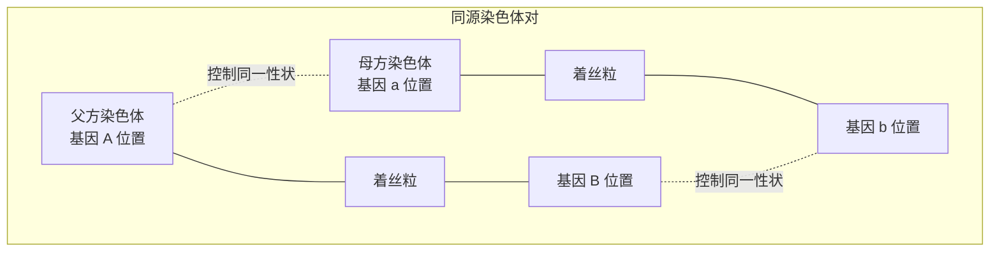
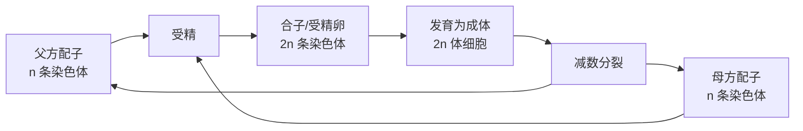
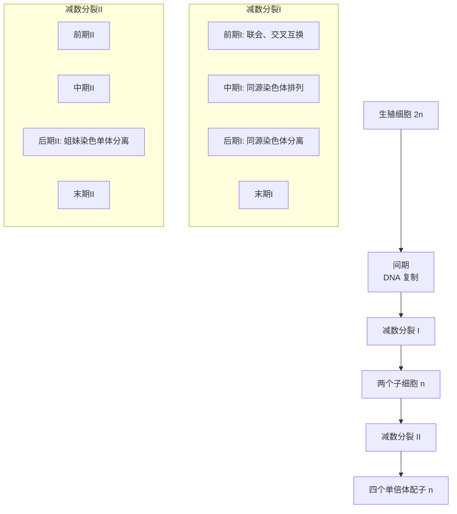
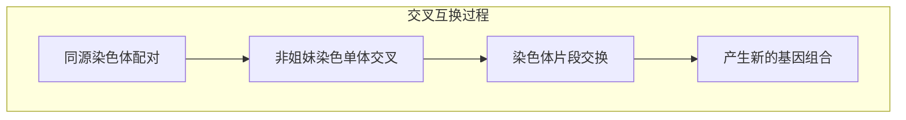
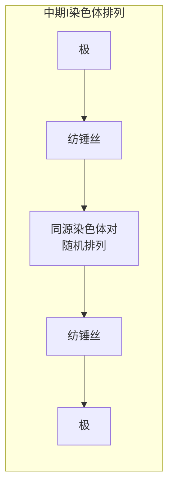
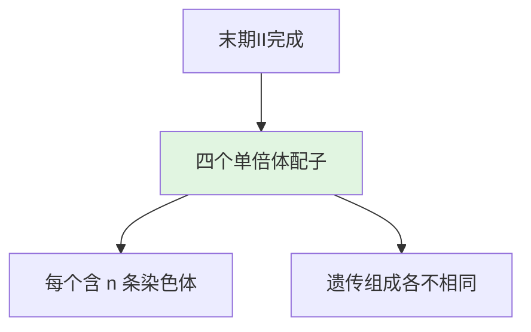
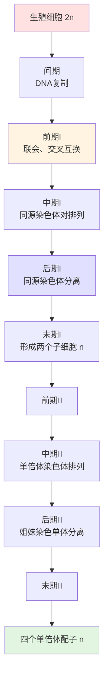
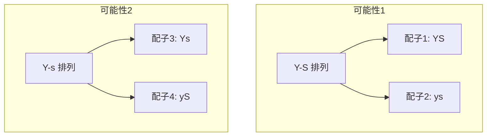

---
tags:
  - Biology
  - Genetics
  - 定义性
  - 基本原理
title: Meiosis 减数分裂
created: 2026-04-03T10:00:00
modified:
---

# Meiosis 减数分裂

> **核心目标**：产生单倍体配子，维持代际间染色体数目恒定，并提供遗传变异

## 1. 染色体与染色体数目

### 1.1 基因与性状

| 术语 | 定义 |
|------|------|
| **性状 (Trait)** | 生物体的特征，如发色、身高、眼睛颜色 |
| **基因 (Gene)** | 染色体上控制性状的 DNA 片段，指导蛋白质合成 |
| **等位基因 (Allele)** | 同一基因的不同形式 |

每个染色体包含数百个基因，每个基因在决定细胞特征和功能方面发挥重要作用。

### 1.2 同源染色体

**同源染色体 (Homologous Chromosomes)**：组成一对的染色体，一条来自父方，一条来自母方。

| 特征 | 描述 |
|------|------|
| **长度** | 相同 |
| **着丝粒位置** | 相同 |
| **基因位置** | 携带控制相同遗传性状的基因 |

> **注意**：同源染色体上相同位置的基因控制同一性状，但可能编码不同的表现形式（如耳垂类型）

### 1.3 单倍体与二倍体

| 术语 | 符号 | 定义 | 例子（人类） |
|------|------|------|--------------|
| **单倍体 (Haploid)** | $n$ | 配子中的染色体数目 | $n = 23$ |
| **二倍体 (Diploid)** | $2n$ | 体细胞中的染色体数目 | $2n = 46$ |

$$\text{配子} + \text{配子} \xrightarrow{\text{受精}} \text{合子}(2n)$$

$$n + n = 2n$$

## 2. 减数分裂概述

### 2.1 定义

**减数分裂 (Meiosis)**：一种细胞分裂类型，通过分离同源染色体将染色体数目减半，因此称为**减数分裂**。

### 2.2 与有丝分裂的区别

| 特征 | 有丝分裂 | 减数分裂 |
|------|----------|----------|
| **分裂次数** | 一次 | 两次（减数分裂 I 和 II） |
| **DNA 复制** | 间期一次 | 减数分裂 I 前一次 |
| **同源染色体联会** | 不发生 | 发生在前期 I |
| **产生细胞数** | 2 个 | 4 个 |
| **子细胞染色体数** | $2n$（二倍体） | $n$（单倍体） |
| **子细胞遗传组成** | 完全相同 | 不相同（由于交叉互换） |
| **发生部位** | 体细胞 | 生殖细胞 |
| **功能** | 生长和修复 | 产生配子，提供遗传变异 |

> **相关笔记**：[[Mitosis|有丝分裂]] - 有丝分裂的详细过程

### 2.3 减数分裂的两个分裂阶段

## 3. 减数分裂 I (Meiosis I)

### 3.1 间期 (Interphase)

DNA 复制和蛋白质合成

| 事件 | 描述 |
|------|------|
| DNA 复制 | 染色体复制 |
| 蛋白质合成 | 准备细胞分裂 |

### 3.2 前期 I (Prophase I)

**特点**：减数分裂中最复杂、最重要的阶段

| 事件 | 描述 |
|------|------|
| **染色体可见** | 复制的染色体变得可见，每条由两条姐妹染色单体组成 |
| **联会 (Synapsis)** | 同源染色体配对，紧密连接 |
| **交叉互换 (Crossing Over)** | 同源染色体之间交换染色体片段 |

$$\text{交叉互换结果} = \text{新的等位基因组合}$$

**交叉互换的意义**：
- 产生遗传变异
- 姐妹染色单体可能不再完全相同
- 增加配子的遗传多样性

### 3.3 中期 I (Metaphase I)

**特点**：同源染色体对排列在细胞赤道板上

| 有丝分裂中期 | 减数分裂中期 I |
|--------------|----------------|
| 单个染色体（含两条姐妹染色单体）排列 | **同源染色体对**排列 |
| 着丝粒在赤道板上 | 同源染色体对在赤道板上 |

> **重要区别**：纺锤丝附着在**同源染色体**的着丝粒上，而非姐妹染色单体

### 3.4 后期 I (Anaphase I)

**特点**：同源染色体分离

| 事件 | 描述 |
|------|------|
| **同源染色体分离** | 同源染色体对的成员移向细胞两极 |
| **染色体数减半** | $2n \rightarrow n$ |
| **姐妹染色单体保持连接** | 每条染色体仍由两条姐妹染色单体组成 |

$$\text{后期 I 结果}: 2n \xrightarrow{\text{同源分离}} n + n$$

### 3.5 末期 I (Telophase I)

| 事件 | 描述 |
|------|------|
| **染色体到达两极** | 每极只含同源染色体对中的一个成员 |
| **细胞分裂** | 胞质分裂通常发生 |
| **DNA 不再复制** | 如进入间期，DNA 不复制 |

**结果**：形成两个子细胞，每个含 $n$ 条染色体（每条染色体由两条姐妹染色单体组成）

## 4. 减数分裂 II (Meiosis II)
### 4.1 概述
减数分裂 II 类似于有丝分裂，但染色体数为单倍体 ($n$)

### 4.2 前期 II (Prophase II)
- 纺锤体装置形成
- 染色体凝缩

### 4.3 中期 II (Metaphase II)

| 特征 | 描述 |
|------|------|
| **染色体排列** | 单倍体数目的染色体排列在赤道板上 |
| **与有丝分裂对比** | 有丝分裂中期为二倍体数目排列 |

### 4.4 后期 II (Anaphase II)

**关键事件**：姐妹染色单体分离

| 事件 | 描述 |
|------|------|
| **着丝粒分裂** | 姐妹染色单体在着丝粒处分离 |
| **染色单体成为独立染色体** | 移向细胞两极 |

$$\text{后期 II}: \text{姐妹染色单体} \rightarrow \text{独立染色体}$$

### 4.5 末期 II (Telophase II)

| 事件 | 描述 |
|------|------|
| **染色体到达两极** | 每极含单倍体染色体 |
| **核膜重建** | 形成新的核膜和细胞核 |
| **胞质分裂** | 形成四个单倍体细胞 |

## 5. 减数分裂完整流程

## 6. 减数分裂的重要意义

### 6.1 维持染色体数目恒定

$$\text{代际染色体数目}: 2n \xrightarrow{\text{减数分裂}} n \xrightarrow{\text{受精}} 2n$$

### 6.2 产生遗传变异

| 变异来源 | 发生阶段 | 机制 |
|----------|----------|------|
| **交叉互换** | 前期 I | 同源染色体交换片段 |
| **独立分配** | 中期 I | 同源染色体对随机排列 |
| **随机受精** | 受精 | 任意雄配子与任意雌配子结合 |

### 6.3 独立分配的计算

**可能组合数**（不考虑交叉互换）：

$$\text{单倍体配子组合数} = 2^n$$

其中 $n$ = 染色体对数

| 生物 | 染色体对数 | 单倍体配子组合数 | 受精后可能组合数 |
|------|------------|------------------|------------------|
| 豌豆 | 7 | $2^7 = 128$ | $128 \times 128 = 16,384$ |
| 人类 | 23 | $2^{23} \approx 840$ 万 | $2^{23} \times 2^{23} > 70$ 万亿 |

> **注意**：以上计算未包含交叉互换产生的变异

### 6.4 染色体排列随机性

## 7. 有性生殖 vs 无性生殖

| 特征 | 有性生殖 | 无性生殖 |
|------|----------|----------|
| **亲本数量** | 两个 | 一个 |
| **遗传来源** | 双亲 | 单一亲本 |
| **后代遗传组成** | 与亲本不同 | 与亲本完全相同 |
| **遗传变异** | 高 | 低 |
| **例子** | 大多数动植物 | 细菌、部分原生生物 |

### 7.1 有性生殖的优势

研究表明：有性生殖累积有益突变的速度比无性生殖更快

$$\text{有性生殖} > \text{无性生殖} \quad (\text{有益基因增殖速度})$$

## 8. 关键术语

| 英文 | 中文 | 定义 |
|------|------|------|
| Gene | 基因 | 控制性状的 DNA 片段 |
| Homologous Chromosome | 同源染色体 | 组成一对的染色体，一条来自父方，一条来自母方 |
| Gamete | 配子 | 性细胞，含半数染色体 |
| Haploid | 单倍体 | 含 $n$ 条染色体的细胞 |
| Diploid | 二倍体 | 含 $2n$ 条染色体的细胞 |
| Fertilization | 受精 | 两个单倍体配子结合 |
| Meiosis | 减数分裂 | 产生单倍体配子的细胞分裂 |
| Synapsis | 联会 | 同源染色体配对 |
| Crossing Over | 交叉互换 | 同源染色体间交换片段 |

## 9. 核心要点总结
1. **减数分裂目的**：产生单倍体配子，维持染色体数目恒定
2. **两次分裂**：减数分裂 I（同源染色体分离）+ 减数分裂 II（姐妹染色单体分离）
3. **交叉互换**：前期 I 发生，产生新的基因组合
4. **独立分配**：同源染色体对随机排列，增加配子多样性
5. **最终产物**：四个遗传组成不同的单倍体配子
6. **与有丝分裂区别**：分裂次数、产物、遗传组成、功能
7. **遗传变异来源**：交叉互换、独立分配、随机受精
8. **人类配子组合**：超过 70 万亿种可能

## 10. 相关笔记
- [[Cellular Growth|细胞生长]] - 细胞周期与间期的详细内容
- [[Mitosis|有丝分裂]] - 有丝分裂的详细过程（与减数分裂对比）
- [[Mendelian Genetics|孟德尔遗传学]] - 分离定律与自由组合定律的细胞学基础
