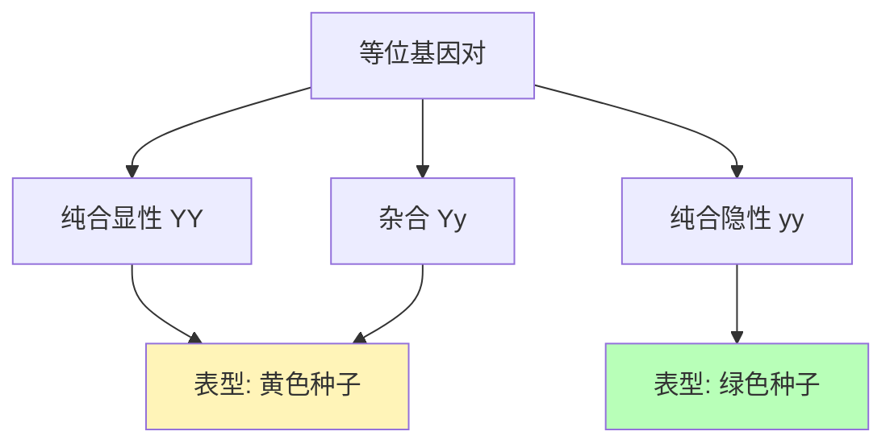
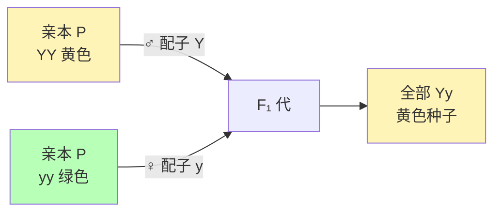
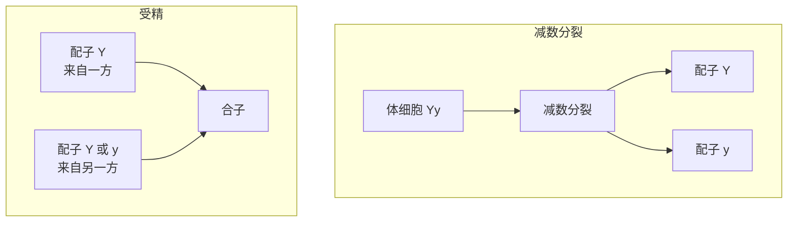
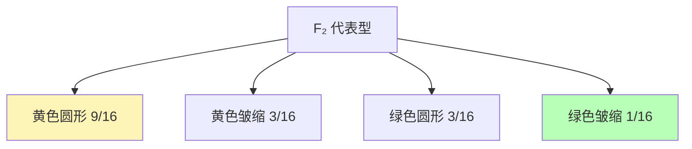
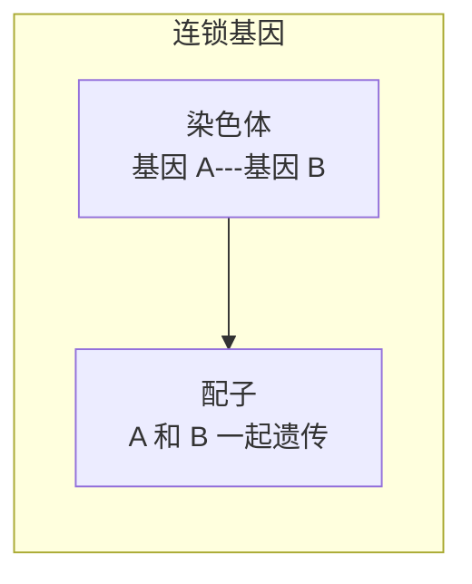
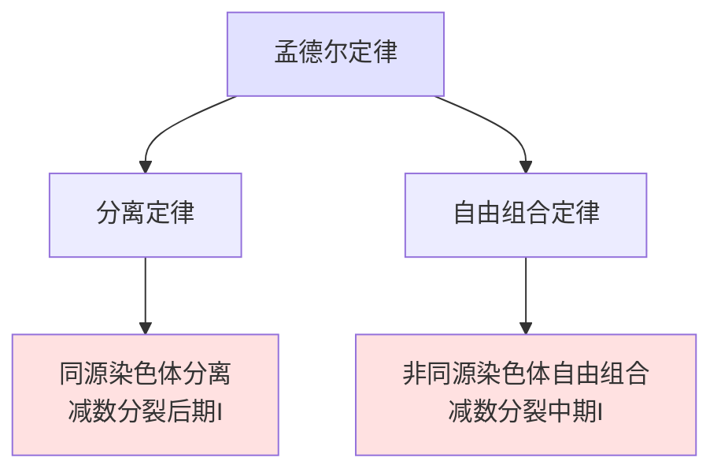

---
tags:
  - Biology
  - Genetics
  - 定义性
  - 基本原理
title: Mendelian Genetics 孟德尔遗传学
created: 2026-04-03T10:00:00
modified:
---

# Mendelian Genetics 孟德尔遗传学

> **核心贡献**：孟德尔通过豌豆实验揭示了遗传的基本规律——分离定律和自由组合定律

## 1. 遗传学的开端

### 1.1 格雷戈尔·孟德尔

**格雷戈尔·孟德尔 (Gregor Mendel, 1822-1884)**：奥地利修道士，被誉为"遗传学之父"

| 身份 | 贡献 |
|------|------|
| 修道士 | 植物育种者 |
| 研究者 | 1866年发表豌豆遗传研究 |
| 遗传学之父 | 揭示遗传的基本规律 |

### 1.2 豌豆作为模式生物的优势

| 优势 | 描述 |
|------|------|
| **易于种植** | 培养条件简单 |
| **真实遗传** | 每代只表现一种性状形式 |
| **自花传粉** | 自然繁殖方式 |
| **易于人工杂交** | 可手动进行异花传粉 |

### 1.3 孟德尔研究的七个性状

| 性状 | 显性形式 | 隐性形式 |
|------|----------|----------|
| 种子颜色 | 黄色 (Y) | 绿色 (y) |
| 种子形状 | 圆形 (R) | 皱缩 |
| 花的颜色 | 紫色 | 白色 (w) |
| 豆荚颜色 | 绿色 | 黄色 (y) |
| 豆荚形状 | 饱满 | 皱缩 |
| 茎长度 | 高 (T) | 矮 |
| 花的位置 | 腋生 | 顶生 |

## 2. 遗传的基本概念

### 2.1 核心术语

| 术语 | 英文 | 定义 |
|------|------|------|
| **性状** | Trait | 生物体的可观察特征 |
| **基因** | Gene | 控制性状的遗传因子 |
| **等位基因** | Allele | 同一基因的不同形式 |
| **显性** | Dominant | 在杂合子中表现出来的等位基因 |
| **隐性** | Recessive | 在杂合子中被掩盖的等位基因 |
| **纯合子** | Homozygous | 两个相同等位基因 (YY 或 yy) |
| **杂合子** | Heterozygous | 两个不同等位基因 |
| **基因型** | Genotype | 生物体的等位基因组合 |
| **表型** | Phenotype | 可观察的特征表现 |
| **杂交** | Hybrid | 杂合子个体 |

### 2.2 显性与隐性



**显性原理**：当等位基因以杂合状态存在时，观察到显性性状

$$\text{显性等位基因}: \text{大写字母} (Y)$$
$$\text{隐性等位基因}: \text{小写字母} (y)$$

### 2.3 基因型与表型的关系

| 基因型 | 等位基因组成 | 表型 |
|--------|--------------|------|
| $YY$ | 纯合显性 | 黄色种子 |
| $Yy$ | 杂合 | 黄色种子 |
| $yy$ | 纯合隐性 | 绿色种子 |

$$\text{基因型比例}: 1:2:1 \quad (YY:Yy:yy)$$
$$\text{表型比例}: 3:1 \quad (\text{黄色}:\text{绿色})$$

## 3. 孟德尔的实验

### 3.1 亲本杂交 (P Generation)

孟德尔用真实遗传的豌豆进行杂交：



**F₁ 代结果**：全部为黄色种子（显性性状）

### 3.2 F₁ 代自交

孟德尔让 F₁ 代自花传粉：

```mermaid
graph LR
    A[F₁ 代 Yy<br/>黄色] -->|自交| B[F₂ 代]
    
    subgraph F₂代结果
        C[YY 黄色] 
        D[Yy 黄色]
        E[Yy 黄色]
        F[yy 绿色]
    end
    
    B --> C
    B --> D
    B --> E
    B --> F
```

**F₂ 代结果**：
- 黄色种子：6022 粒
- 绿色种子：2001 粒
- 比例：$\approx 3:1$

### 3.3 世代符号

| 符号 | 含义 |
|------|------|
| **P** | 亲本世代 (Parental generation) |
| **F₁** | 子一代 (First filial generation) |
| **F₂** | 子二代 (Second filial generation) |

## 4. 孟德尔第一定律：分离定律

### 4.1 定义

**分离定律 (Law of Segregation)**：每个性状的两个等位基因在减数分裂时分离，每个配子只获得一个等位基因。

### 4.2 分离定律的机制



### 4.3 与减数分裂的联系

分离定律的细胞学基础是**减数分裂中同源染色体的分离**：

$$\text{同源染色体分离} \Rightarrow \text{等位基因分离}$$

> **相关笔记**：[[Meiosis#后期 I|减数分裂后期 I]] - 同源染色体分离

## 5. 单因子杂交与 Punnett 方格

### 5.1 单因子杂交 (Monohybrid Cross)

**定义**：涉及一对等位基因的杂交

### 5.2 Punnett 方格

**Punnett 方格**：由 Reginald Punnett 开发的预测杂交后代基因型的工具

#### 例：Yy × Yy 自交

| | Y | y |
|---|---|---|
| **Y** | YY | Yy |
| **y** | Yy | yy |

**结果分析**：

$$\text{基因型比例}: 1\,YY : 2\,Yy : 1\,yy$$
$$\text{表型比例}: 3\,\text{黄色} : 1\,\text{绿色}$$

### 5.3 应用实例：卷舌能力

卷舌能力是显性性状 (T)

**杂交**：$Tt \times Tt$

| | T | t |
|---|---|---|
| **T** | TT | Tt |
| **t** | Tt | tt |

$$\text{表型比例}: 3\,\text{能卷舌} : 1\,\text{不能卷舌}$$

## 6. 孟德尔第二定律：自由组合定律

### 6.1 定义

**自由组合定律 (Law of Independent Assortment)**：不同性状的等位基因在配子形成时独立分配。

### 6.2 适用条件

基因位于**不同的染色体**上时适用

$$\text{独立分配} \Leftrightarrow \text{基因位于不同染色体}$$

> **注意**：同一染色体上的基因不独立分配（见[[#基因连锁]]）

### 6.3 双因子杂交 (Dihybrid Cross)

**定义**：涉及两对等位基因的杂交

**性状**：
- 种子形状：圆形 (R) 显性，皱缩 隐性
- 种子颜色：黄色 (Y) 显性，绿色 隐性

#### F₁ 代：YyRr（黄色圆形）

#### F₁ 自交：YyRr × YyRr

**配子类型**：$YR, Yr, yR, yr$（各 $1/4$ 概率）

| | YR | Yr | yR | yr |
|---|---|---|---|---|
| **YR** | YYRR | YYRr | YyRR | YyRr |
| **Yr** | YYRr | YYrr | YyRr | Yyrr |
| **yR** | YyRR | YyRr | yyRR | yyRr |
| **yr** | YyRr | Yyrr | yyRr | yyrr |

**F₂ 代表型比例**：

$$9 : 3 : 3 : 1$$

| 表型 | 基因型 | 数量比例 |
|------|--------|----------|
| 黄色圆形 | Y_R_ | 9 |
| 黄色皱缩 | Y_rr | 3 |
| 绿色圆形 | yyR_ | 3 |
| 绿色皱缩 | yyrr | 1 |



## 7. 概率与遗传

### 7.1 概率基础

$$P(\text{事件}) = \frac{\text{有利结果数}}{\text{可能结果总数}}$$

**例子**：
- 抛硬币正面朝上的概率：$P = \frac{1}{2}$
- 两次都是正面：$P = \frac{1}{2} \times \frac{1}{2} = \frac{1}{4}$

### 7.2 乘法法则

**独立事件同时发生的概率**等于各事件概率的乘积：

$$P(A \text{ 且 } B) = P(A) \times P(B)$$

**例子**：Yy × Yy 杂交获得 yy 后代的概率：

$$P(yy) = P(y \text{ 来自母方}) \times P(y \text{ 来自父方}) = \frac{1}{2} \times \frac{1}{2} = \frac{1}{4}$$

### 7.3 加法法则

**互斥事件发生的概率**等于各事件概率之和：

$$P(A \text{ 或 } B) = P(A) + P(B)$$

**例子**：Yy × Yy 杂交获得显性表型的概率：

$$P(\text{显性}) = P(YY) + P(Yy) = \frac{1}{4} + \frac{1}{2} = \frac{3}{4}$$

### 7.4 大数定律

**样本量越大，实际结果越接近理论预测值**

孟德尔的数据：$6022 : 2001 \approx 3:1$

## 8. 基因连锁与多倍体

### 8.1 基因连锁 (Gene Linkage)

**定义**：位于同一染色体上相近位置的基因倾向于一起遗传



**与自由组合定律的关系**：

$$\text{基因连锁} \Rightarrow \text{不符合自由组合定律}$$

### 8.2 染色体图谱 (Chromosome Map)

**原理**：基因间距离越远，交叉互换频率越高

$$\text{图距单位} = \text{交叉互换频率} (\%)$$

**1 图距单位 (map unit) = 1% 交叉互换频率**

#### 例：果蝇 X 染色体图谱

| 基因对 | 交叉互换频率 | 图距 |
|--------|--------------|------|
| A - B | 30% | 30 单位 |
| A - D | 25% | 25 单位 |
| B - D | 5% | 5 单位 |
| C - D | 15% | 15 单位 |
| B - C | 20% | 20 单位 |


### 8.3 多倍体 (Polyploidy)

**定义**：生物体含有一套或多套额外的完整染色体组

| 类型 | 染色体数 | 例子 |
|------|----------|------|
| 单倍体 | $n$ | 配子 |
| 二倍体 | $2n$ | 大多数动物 |
| 三倍体 | $3n$ | 某些鱼类 |
| 六倍体 | $6n$ | 普通小麦、燕麦 |
| 八倍体 | $8n$ | 甘蔗、草莓 |

**多倍体在植物中的意义**：

| 特点 | 描述 |
|------|------|
| **发生率** | 约三分之一的已知开花植物为多倍体 |
| **优势** | 增强的活力和更大的体型 |
| **应用** | 农业育种选择具有优良性状的多倍体 |

> **注意**：多倍体在人类中总是致命的

## 9. 遗传重组

### 9.1 定义

**遗传重组 (Genetic Recombination)**：通过交叉互换和独立分配产生新的基因组合

### 9.2 重组来源

| 来源 | 机制 | 发生阶段 |
|------|------|----------|
| **独立分配** | 同源染色体随机排列 | 减数分裂中期 I |
| **交叉互换** | 非姐妹染色单体交换片段 | 减数分裂前期 I |
| **随机受精** | 任意配子组合 | 受精 |

### 9.3 组合数计算

**独立分配产生的配子组合数**：

$$\text{配子类型数} = 2^n$$

其中 $n$ = 染色体对数

| 生物 | $n$ | 配子类型数 | 受精后可能组合 |
|------|-----|------------|----------------|
| 豌豆 | 7 | $2^7 = 128$ | $128^2 = 16,384$ |
| 人类 | 23 | $2^{23} \approx 840$ 万 | $> 70$ 万亿 |

> **相关笔记**：[[Meiosis#独立分配的计算|减数分裂独立分配]]


## 10. 总结对比

### 10.1 孟德尔两大定律

| 定律 | 内容 | 细胞学基础 |
|------|------|------------|
| **分离定律** | 等位基因在配子形成时分离 | 同源染色体分离（减数分裂 I） |
| **自由组合定律** | 不同性状的等位基因独立分配 | 非同源染色体自由组合 |

### 10.2 杂交类型

| 类型 | 涉及基因对数 | 表型比例 |
|------|--------------|----------|
| 单因子杂交 | 1 对 | $3:1$ |
| 双因子杂交 | 2 对 | $9:3:3:1$ |

### 10.3 与减数分裂的关系



## 11. 关键术语

| 英文 | 中文 | 定义 |
|------|------|------|
| Genetics | 遗传学 | 研究遗传的科学 |
| Allele | 等位基因 | 同一基因的不同形式 |
| Dominant | 显性 | 在杂合子中表现的性状 |
| Recessive | 隐性 | 在杂合子中被掩盖的性状 |
| Homozygous | 纯合子 | 含相同等位基因 |
| Heterozygous | 杂合子 | 含不同等位基因 |
| Genotype | 基因型 | 等位基因组合 |
| Phenotype | 表型 | 可观察的特征 |
| Law of Segregation | 分离定律 | 等位基因在配子形成时分离 |
| Law of Independent Assortment | 自由组合定律 | 不同性状的等位基因独立分配 |
| Gene Linkage | 基因连锁 | 同一染色体上的基因一起遗传 |
| Polyploidy | 多倍体 | 含多套完整染色体组 |
| Genetic Recombination | 遗传重组 | 产生新基因组合的过程 |

## 12. 核心要点总结

1. **孟德尔选择豌豆**：真实遗传、易于杂交、性状明显
2. **F₁ 代**：全部显示显性性状
3. **F₂ 代**：表型比例 3:1（单因子）、9:3:3:1（双因子）
4. **分离定律**：等位基因在减数分裂时分离
5. **自由组合定律**：不同染色体上的基因独立分配
6. **Punnett 方格**：预测杂交后代基因型和表型
7. **概率法则**：乘法法则（独立事件）、加法法则（互斥事件）
8. **基因连锁**：同一染色体上的基因不独立分配
9. **染色体图谱**：根据交叉互换频率确定基因相对位置
10. **多倍体**：植物中常见，常具优良性状

## 13. 相关笔记

- [[Meiosis|减数分裂]] - 分离定律和自由组合定律的细胞学基础
- [[Mitosis|有丝分裂]] - 细胞分裂的基本过程
