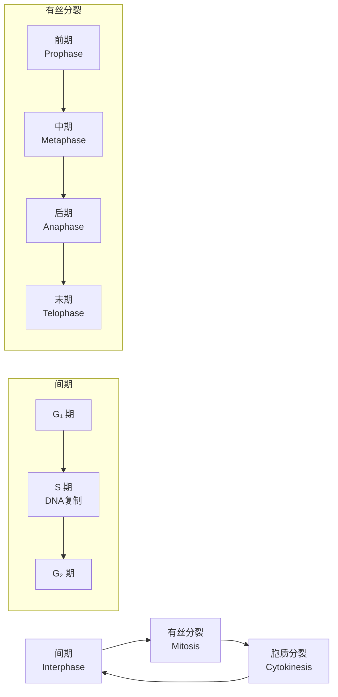
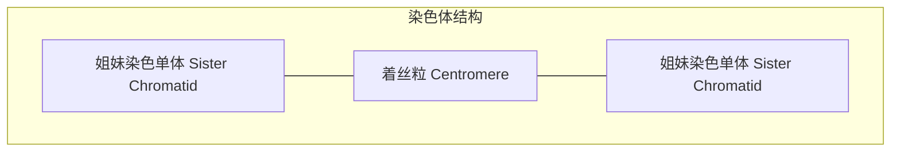
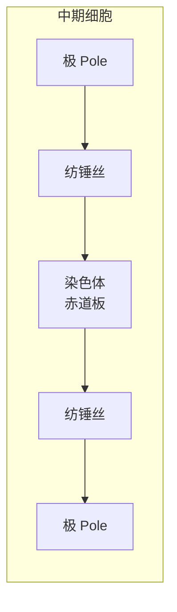
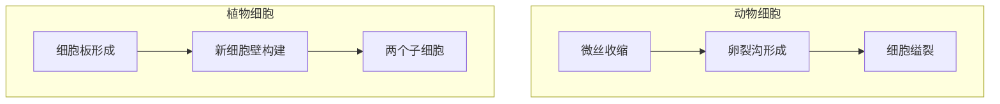
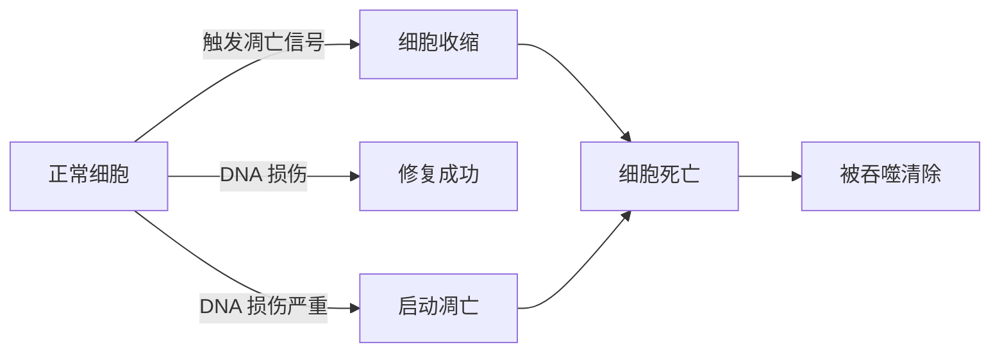
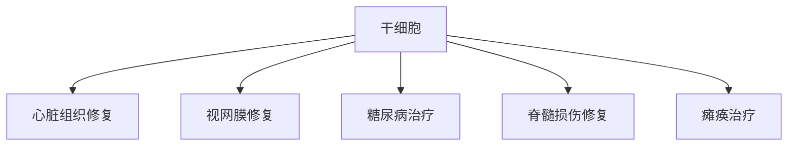
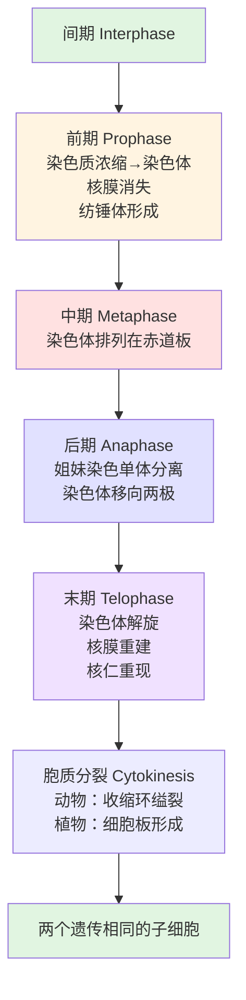

---
tags:
  - Biology
  - Cell
  - 定义性
  - 基本原理
title: Mitosis 有丝分裂
created: 2026-04-03T10:00:00
modified:
---

# Mitosis 有丝分裂

> **核心目标**：准确分离细胞复制的 DNA，产生两个遗传信息完全相同的子细胞

## 1. 概述

### 1.1 定义

**有丝分裂 (Mitosis)**：真核细胞核分裂的过程，确保细胞的遗传物质准确分离到新细胞中。

**胞质分裂 (Cytokinesis)**：细胞质分裂的过程，与有丝分裂配合完成细胞分裂。

### 1.2 功能

| 功能 | 描述 |
|------|------|
| **生长发育** | 多细胞生物通过有丝分裂增加细胞数量，从幼体生长为成体 |
| **细胞修复** | 替换受损或死亡的细胞（如伤口愈合时皮肤细胞的分裂） |
| **无性繁殖** | 某些生物通过有丝分裂进行无性繁殖 |

### 1.3 细胞周期回顾

> **相关笔记**：[[Cellular Growth]] - 细胞周期与间期的详细内容

## 2. 有丝分裂的阶段

有丝分裂分为四个连续阶段：**前期、中期、后期、末期**

### 2.1 前期 (Prophase)

**特点**：细胞在有丝分裂中花费时间最长的阶段

| 事件 | 描述 |
|------|------|
| **染色质浓缩** | 染色质紧缩形成可见的染色体，呈 X 形 |
| **姐妹染色单体** | 染色体的两半，含有相同的 DNA 副本 |
| **着丝粒** | 连接姐妹染色单体的中心结构 |
| **核仁消失** | 核仁在前期中逐渐消失 |
| **纺锤体形成** | 微管结构形成，包括纺锤丝、中心粒和星射线 |
| **核膜消失** | 核膜在前期末消失 |

#### 关键结构

$$\text{一个染色体} = \text{两条姐妹染色单体} + \text{一个着丝粒}$$

#### 纺锤体装置 (Spindle Apparatus)

| 组成部分 | 存在位置 | 功能 |
|----------|----------|------|
| **纺锤丝 (Spindle Fibers)** | 动物和植物细胞 | 移动和组织染色体 |
| **中心粒 (Centrioles)** | 动物和原生动物细胞 | 迁移到细胞两极 |
| **星射线 (Aster Fibers)** | 动物和原生动物细胞 | 星形微管结构 |

> **注意**：植物细胞没有中心粒，只有纺锤丝

### 2.2 中期 (Metaphase)
**特点**：有丝分裂中最短的阶段之一

| 事件 | 描述 |
|------|------|
| **染色体排列** | 姐妹染色单体被马达蛋白拉动，排列在细胞赤道板上 |
| **纺锤丝附着** | 纺锤丝附着在每个染色体的着丝粒两侧 |
| **精确排列** | 确保新细胞获得准确的染色体副本 |

### 2.3 后期 (Anaphase)
**特点**：姐妹染色单体分离

| 事件 | 描述 |
|------|------|
| **纺锤丝缩短** | 微管开始缩短 |
| **染色单体分离** | 姐妹染色单体同时分离成两个相同的染色体 |
| **染色体移动** | 染色体被拉向细胞两极 |

$$\text{分离后：每条姐妹染色单体} \rightarrow \text{独立的染色体}$$

> **重要**：所有姐妹染色单体同时分离（具体机制尚不完全清楚）

### 2.4 末期 (Telophase)
**特点**：有丝分裂的最后阶段

| 事件 | 描述 |
|------|------|
| **染色体到达两极** | 染色体到达细胞两极 |
| **染色体解旋** | 染色体松弛、解旋成染色质 |
| **核膜重建** | 两个新的核膜开始形成 |
| **核仁重现** | 核仁重新出现 |
| **纺锤体解体** | 纺锤体装置分解，微管被回收 |

## 3. 胞质分裂 (Cytokinesis)

### 3.1 定义

胞质分裂是有丝分裂后期开始的细胞质分裂过程，最终形成两个具有相同细胞核的子细胞。

### 3.2 不同细胞的胞质分裂

| 细胞类型 | 胞质分裂方式 | 特点 |
|----------|--------------|------|
| **动物细胞** | 收缩环缢裂 | 微丝收缩，细胞膜从中间凹陷（卵裂沟），最终分裂成两个细胞 |
| **植物细胞** | 细胞板形成 | 在两个子细胞核之间形成细胞板，然后形成新的细胞壁 |
| **原核细胞** | 二分裂 | DNA 复制后附着在细胞膜上，细胞膜生长时被拉开，最终分裂 |

### 3.3 对比图示

| 特征 | 动物细胞 | 植物细胞 |
|------|----------|----------|
| 细胞壁 | 无 | 有（刚性） |
| 分裂方式 | 从外向内缢裂 | 从内向外出芽 |
| 关键结构 | 收缩环、卵裂沟 | 细胞板、囊泡 |
| 中心粒 | 有 | 无 |

## 4. 细胞周期调控

### 4.1 细胞周期蛋白 (Cyclins)

**定义**：调控细胞周期的蛋白质，与周期蛋白依赖性激酶 (CDKs) 结合，启动细胞周期的各种活动。

| 组合 | 活动阶段 | 功能 |
|------|----------|------|
| Cyclin + CDK | G₁ 期 | 启动细胞周期 |
| 不同 Cyclin/CDK 组合 | S 期 | 启动 DNA 复制 |
| 不同 Cyclin/CDK 组合 | G₂ 期 | 准备有丝分裂 |
| 不同 Cyclin/CDK 组合 | M 期 | 启动核分裂 |

$$\text{Cyclin} + \text{CDK} \rightarrow \text{启动特定细胞周期活动}$$

### 4.2 检查点 (Checkpoints)

细胞周期有内置的质量控制检查点，监控周期进程并在出现问题时停止周期。

| 检查点位置 | 检查内容 |
|------------|----------|
| **G₁ 检查点** | DNA 损伤，决定是否进入 S 期 |
| **S 期检查点** | DNA 复制进度 |
| **G₂ 检查点** | DNA 复制完成情况 |
| **纺锤体检查点** | 纺锤丝功能是否正常 |

## 5. 异常细胞周期：癌症

### 5.1 定义

**癌症 (Cancer)**：细胞不受控制的生长和分裂，细胞周期调控失败的结果。

### 5.2 癌症细胞特征

| 特征 | 描述 |
|------|------|
| **失控增殖** | 不响应正常的细胞周期控制机制 |
| **间期缩短** | 癌细胞在间期停留时间比正常细胞短 |
| **形态异常** | 通常具有不规则形状 |
| **侵袭性** | 可挤压正常细胞，导致组织功能丧失 |

### 5.3 致癌因素

**致癌物 (Carcinogens)**：已知能引起癌症的物质或因素。

| 类型 | 例子 |
|------|------|
| **化学物质** | 烟草、石棉 |
| **辐射** | 紫外线、X 射线 |
| **病毒** | 某些致癌病毒 |

### 5.4 癌症与遗传

$$\text{癌症发生} = \text{多个 DNA 突变累积}$$

- 单一 DNA 变化不足以导致癌症
- 多个突变累积解释了癌症风险随年龄增加
- 癌症家族史：遗传的突变增加患癌风险

### 5.5 预防措施

| 措施 | 说明 |
|------|------|
| 避免烟草 | 包括二手烟和无烟烟草 |
| 防晒 | 使用防晒霜阻挡紫外线 |
| 职业防护 | 避免接触石棉等致癌物 |
| X 射线防护 | 使用铅围裙保护 |

## 6. 细胞凋亡 (Apoptosis)

### 6.1 定义

**细胞凋亡 (Apoptosis)**：程序性细胞死亡，细胞在控制下收缩和死亡的过程。

### 6.2 生物学意义

| 功能 | 例子 |
|------|------|
| **发育塑形** | 手指和脚趾间蹼状组织的消除 |
| **损伤修复** | 清除 DNA 损伤严重的细胞 |
| **癌症预防** | 防止受损细胞发展为癌细胞 |
| **植物落叶** | 秋季叶片脱落前局部细胞死亡 |

### 6.3 凋亡 vs 癌症

| 特征 | 细胞凋亡 | 癌症 |
|------|----------|------|
| 细胞分裂 | 停止 | 不受控制 |
| 细胞命运 | 程序性死亡 | 无限增殖 |
| 对机体影响 | 正常/保护 | 有害 |
| DNA 状态 | 损伤严重 | 突变累积 |

## 7. 干细胞 (Stem Cells)

### 7.1 定义

**干细胞 (Stem Cells)**：未特化的细胞，在适当条件下可发育为特化细胞。

### 7.2 干细胞类型

| 类型 | 来源 | 特点 | 应用潜力 |
|------|------|------|----------|
| **胚胎干细胞** | 早期胚胎（100-150细胞阶段） | 可发育成多种特化细胞 | 再生医学、疾病治疗 |
| **成体干细胞** | 各种组织 | 维持和修复所在组织 | 较少伦理争议，已用于多种治疗 |

### 7.3 干细胞研究进展

| 年份 | 研究成果 |
|------|----------|
| 1998 | 首次分离人类胚胎干细胞 |
| 1999 | 哈佛医学院用神经系统干细胞修复小鼠脑组织 |
| 2000 | 佛罗里达大学用胰腺干细胞恢复糖尿病小鼠胰腺功能 |
| 葡萄牙研究 | 鼻腔组织干细胞治疗瘫痪患者，部分恢复运动功能 |

### 7.4 干细胞应用前景

### 7.5 伦理考量

| 干细胞类型 | 伦理问题 |
|------------|----------|
| 胚胎干细胞 | 来源涉及胚胎破坏，存在伦理争议 |
| 成体干细胞 | 可从供体自愿获得，伦理争议较少 |

## 8. 有丝分裂完整流程图

## 9. 关键术语

| 英文                | 中文        | 定义                  |
| ----------------- | --------- | ------------------- |
| Mitosis           | 有丝分裂      | 细胞核分裂的过程            |
| Cytokinesis       | 胞质分裂      | 细胞质分裂的过程            |
| Prophase          | 前期        | 有丝分裂第一阶段，染色质浓缩      |
| Metaphase         | 中期        | 有丝分裂第二阶段，染色体排列在赤道板  |
| Anaphase          | 后期        | 有丝分裂第三阶段，姐妹染色单体分离   |
| Telophase         | 末期        | 有丝分裂最后阶段，核膜重建       |
| Sister Chromatid  | 姐妹染色单体    | 含有相同 DNA 副本的染色体两半   |
| Centromere        | 着丝粒       | 连接姐妹染色单体的结构         |
| Spindle Apparatus | 纺锤体装置     | 包括纺锤丝、中心粒、星射线的结构    |
| Cyclin            | 细胞周期蛋白    | 调控细胞周期的蛋白质          |
| CDK               | 周期蛋白依赖性激酶 | 与 Cyclin 结合调控细胞周期的酶 |
| Cancer            | 癌症        | 不受控制的细胞生长和分裂        |
| Carcinogen        | 致癌物       | 引起癌症的物质             |
| Apoptosis         | 细胞凋亡      | 程序性细胞死亡             |
| Stem Cell         | 干细胞       | 可发育为特化细胞的未特化细胞      |

## 10. 核心要点总结

1. **有丝分裂目的**：准确分离复制 DNA，产生两个遗传相同的子细胞
2. **四个阶段**：前期（最长）→ 中期 → 后期 → 末期
3. **染色体结构**：姐妹染色单体由着丝粒连接
4. **胞质分裂差异**：动物细胞缢裂，植物细胞形成细胞板
5. **周期调控**：Cyclin + CDK 组合调控各阶段活动
6. **检查点**：监控 DNA 损伤和纺锤体功能
7. **癌症本质**：细胞周期调控失败导致的失控增殖
8. **凋亡意义**：程序性死亡，清除受损细胞，预防癌症
9. **干细胞潜力**：未特化细胞可发育为多种特化细胞
10. **植物与动物差异**：植物无中心粒，胞质分裂方式不同

---

## 11. 相关笔记

- [[Cellular Growth|细胞生长]] - 细胞周期与间期的详细内容
- [[Meiosis|减数分裂]] - 产生配子的减数分裂过程（与有丝分裂对比）
- [[Mendelian Genetics|孟德尔遗传学]] - 遗传的基本规律
