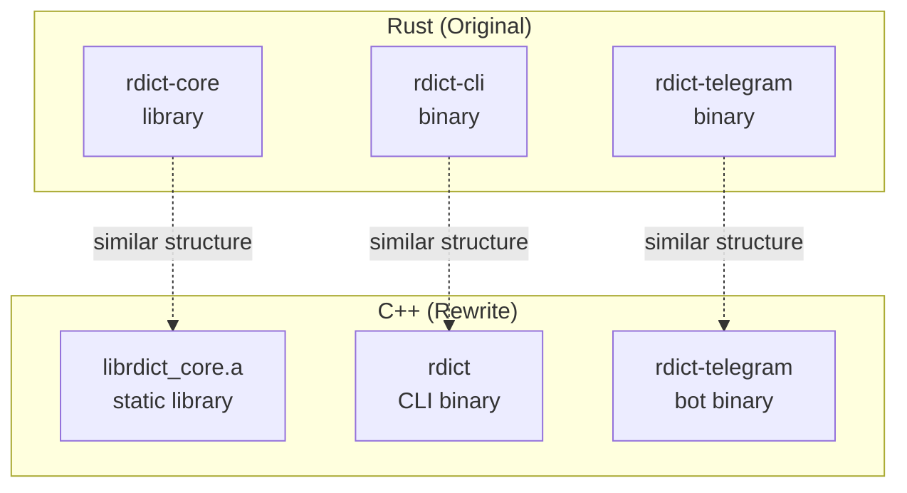

---
tags:
  - C++
  - Rust
  - 方法性
  - 基本原理
  - ProgrammingLanguages
title: "Rust vs C++ - Dictionary Client Implementation"
created: 2026-05-29
modified: 2026-05-29
---

# Rust vs C++ - Dictionary Client Implementation

> [!abstract] rdict 项目概述
> [rdict](https://github.com/Guanran928/rdict) 是一个终端词典客户端，支持**有道词典**（英⇄中）和 **Netzverb/verbformen.com**（德语）查询。原版用 Rust 编写，重写为 C++17。本文对比两种语言在**同一项目**下的实现差异，覆盖 HTML 解析、HTTP 请求、数据结构、错误处理、缓存、渲染、CLI 等全方面。

## 整体架构



**核心数据流**（两种语言完全一致）：

```
input_text
  → SQLite cache lookup
  → (miss) → HTTP GET (source.fetch_url)
  → HTML parse → TranslationData
  → store in cache
  → render output
```

## 1. HTML 解析策略

这是两种语言差异最显著的模块。原版 Rust 使用 `scraper`（CSS 选择器）；重写 C++ 使用 **libxml2 + XPath**。

### 1.1 Rust: `scraper` + CSS Selectors

[[Algorithm]] `scraper` 是 Rust 生态中最流行的 HTML 解析库，底层基于 `selectors`（Servo 项目）和 `html5ever`（浏览器级 HTML5 解析器）。

```rust
// Rust: 直接用 CSS 选择器
let sel = Selector::parse(".phone_con .per-phone .phonetic").unwrap();
for element in document.select(&sel) {
    let text = element.text().collect::<String>();
}
```

| 组件 | 说明 |
|------|------|
| `html5ever` | 解析 HTML → DOM 树（与浏览器兼容） |
| `selectors` | CSS 选择器匹配引擎（来自 Servo/火狐） |
| `scraper` | 高层封装，提供 `select()` API |

**特点**：
- CSS 选择器直接可用，无需转换
- HTML5 解析，容错性强
- 惰性迭代器（`.select()` 返回迭代器，不分配 Vec）
- 选择器在运行时解析（但 Rust 用 `LazyLock` 做了一次性编译）

### 1.2 C++: libxml2 + XPath Translation

C++ 生态没有等价的 CSS 选择器库。重写时采用 **libxml2**（系统通用库）的 HTML 解析器 + XPath 查询。

```cpp
// C++: CSS 选择器 → XPath 转换
// .phone_con .per-phone .phonetic
// →
// descendant::*[contains(@class,'phone_con')]
// //descendant::*[contains(@class,'per-phone')]
// //descendant::*[contains(@class,'phonetic')]

// RAII wrappers 确保 libxml2 内存安全
struct XmlDocDeleter {
    void operator()(xmlDoc* d) { xmlFreeDoc(d); }
};
using DocPtr = std::unique_ptr<xmlDoc, XmlDocDeleter>;
```

核心转换逻辑：

```cpp
class CssQuery {
    static std::string css_to_xpath(const std::string& css) {
        std::istringstream iss(css);
        std::string token;
        std::string xpath;
        while (iss >> token) {
            if (!xpath.empty()) xpath += "//";
            if (token[0] == '.') {
                std::string cls = token.substr(1);
                xpath += "descendant::*[contains(concat(' ',"
                    "normalize-space(@class),' '),' " + cls + " ')]";
            } else {
                xpath += "descendant::" + token;
            }
        }
        return xpath;
    }
};
```

**CSS → XPath 映射规则**：

| CSS 选择器 | XPath 表达式 |
|-----------|-------------|
| `.class` | `descendant::*[contains(concat(' ',normalize-space(@class),' '),' class ')]` |
| `tag` | `descendant::tag` |
| `a b` (空格) | 中间加 `//` 表示任意深度 |
| `.parent .child` | 两个 XPath 用 `//` 连接 |

**libxml2 API**：

```cpp
// 1. 解析 HTML
DocPtr doc(htmlReadMemory(html.data(), html.size(),
    nullptr, nullptr,
    HTML_PARSE_RECOVER | HTML_PARSE_NOERROR | HTML_PARSE_NOWARNING));

// 2. 创建 XPath 上下文
CtxPtr ctx(xmlXPathNewContext(doc.get()), xmlXPathFreeContext);

// 3. 执行 XPath 查询
ObjPtr obj(xmlXPathEvalExpression(
    (const xmlChar*)xpath_str.c_str(), ctx.get()),
    xmlXPathFreeObject);

// 4. 提取结果
for (int i = 0; i < obj->nodesetval->nodeNr; ++i) {
    xmlNode* node = obj->nodesetval->nodeTab[i];
    xmlChar* text = xmlNodeGetContent(node);
    // ... process
    xmlFree(text);
}
```

### 1.3 德语词典的特殊解析

德语词典（**WoerterNetSource**）需要更多定制化解析，两种语言的实现策略一致但语法不同：

| 解析任务 | Rust (scraper) | C++ (libxml2) |
|---------|---------------|---------------|
| 页面标题提取 | `.select(&sel("title"))` | `xmlXPathEval("//title")` |
| Schema.org 微数据 | `.select(&sel("[itemprop=\"mainEntity\"]"))` | `xmlXPathEval("//*[@itemprop='mainEntity']")` |
| `<i>` 标签定义 | `.select(&sel("i"))` | `xmlXPathEval("//i")` |
| `<ul class="rLstGt">` | `.select(&sel("ul.rLstGt li"))` | 先找 ul → 再找 li |
| IPA 音标提取 | 正则扫描 `/.../` | 相同逻辑，字符遍历 |
| 词性猜测 | 后缀匹配 (en, eln, ern ...) | 完全相同的 C++ 实现 |

> [!tip] XPath 优势
> 对于属性选择器（如 `[itemprop="mainEntity"]`），XPath 比 CSS 更简洁直接：`//*[@itemprop='mainEntity']`，无需额外语法。

## 2. HTTP 处理

### 2.1 Rust: `reqwest` (异步/Tokio)

```rust
// Rust: 异步 HTTP
let client = Client::new();
let response = client
    .get(&url)
    .header(USER_AGENT, "Mozilla/5.0 ...")
    .send()
    .await?;    // ❗ await 切换任务
let html = response.text().await?;
```

| 特性 | Rust 实现 |
|------|----------|
| 运行时 | Tokio（多线程） |
| API 风格 | 异步 `.await` |
| TLS | rustls（纯 Rust 实现） |
| 错误 | 自动转换 `reqwest::Error → Error::Http` |

**异步对项目的影响**：

```rust
#[tokio::main]  // 宏注入 tokio 运行时
async fn main() -> Result<()> {
    let app = App::new(cli).await?;  // 所有调用链必须 async
    app.run().await
}
```

整个调用链（main → App::run → get_results → fetch_source_html → HTTP GET）全部是 `async`。这意味着：
- 所有调用 `.await` 传播
- 不能在同步上下文中调用（需要 `block_on`）
- 但带来了并发能力（本例未利用，因为顺序调用）

### 2.2 C++: libcurl (同步)

```cpp
// C++: 同步 HTTP
static size_t write_callback(void* contents, size_t size,
                               size_t nmemb, void* userp) {
    auto* str = static_cast<std::string*>(userp);
    str->append(static_cast<char*>(contents), size * nmemb);
    return size * nmemb;
}

std::string fetch(const std::string& url) {
    CURL* curl = curl_easy_init();
    std::string response;
    curl_easy_setopt(curl, CURLOPT_URL, url.c_str());
    curl_easy_setopt(curl, CURLOPT_USERAGENT,
        "Mozilla/5.0 (Windows NT 10.0; Win64; x64) ...");
    curl_easy_setopt(curl, CURLOPT_WRITEFUNCTION, write_callback);
    curl_easy_setopt(curl, CURLOPT_WRITEDATA, &response);
    CURLcode res = curl_easy_perform(curl);
    curl_easy_cleanup(curl);
    if (res != CURLE_OK)
        throw HttpError(0, curl_easy_strerror(res));
    return response;
}
```

| 特性 | C++ 实现 |
|------|---------|
| 运行时 | 纯同步 |
| API 风格 | 回调函数 + CURLOPT |
| TLS | 系统 OpenSSL / NSS |
| 错误 | 手动检查 `CURLcode` |

**同步的优势与代价**：

```
优点：
  - 调试简单（线性执行）
  - 无需运行时
  - 二进制体积小
  - 第三方依赖少

缺点：
  - 只能顺序请求
  - 无法并发
  - 阻塞调用会暂停整个线程
```

### 2.3 对比

| 维度 | Rust (reqwest) | C++ (libcurl) |
|------|---------------|---------------|
| 异步/同步 | 异步 (.await) | 同步 (阻塞) |
| 运行时 | Tokio (~3MB) | 无 |
| 错误模型 | `Result` + 自动转换 | `CURLcode` 手动检查 |
| TLS | rustls (纯 Rust) | OpenSSL (系统) |
| 回调机制 | 无（直接返回） | 写回调 (CURLOPT_WRITEFUNCTION) |
| 构建复杂度 | cargo 自动管理 | 需 find_package |
| 内存安全 | 编译期保证 | 手动管理（curl_easy_init/cleanup） |
| 并发性 | 原生支持 | 需额外线程 |

## 3. 数据结构设计

### 3.1 Rust: `enum` + `struct` + `Option`

```rust
#[derive(Debug, Serialize, Deserialize)]
pub struct Pronunciation {
    pub uk: Option<String>,
    pub us: Option<String>,
}

pub struct ToChinese {
    pub input_text: String,
    pub pronunciation: Pronunciation,
    pub meanings: Vec<Meaning>,
    pub examples: Vec<Example>,
}

#[derive(Debug, Serialize, Deserialize)]
#[serde(tag = "type", content = "data")]
pub enum TranslationData {
    #[serde(rename = "to_chinese")]
    ToChinese(ToChinese),
    #[serde(rename = "to_english")]
    ToEnglish(ToEnglish),
    #[serde(rename = "german")]
    German(GermanEntry),
}
```

**关键特性**：
- `#[serde(tag = "type", content = "data")]` → 自动 JSON tagged union 序列化
- `Option<T>` → 编译期保证空值安全
- `#[derive]` 宏自动生成序列化代码
- `match` 表达式穷尽检查

### 3.2 C++: `std::variant` + `struct` + `std::optional`

```cpp
// C++17 等效
struct Pronunciation {
    std::optional<std::string> uk;
    std::optional<std::string> us;
};

struct ToChinese {
    std::string input_text;
    Pronunciation pronunciation;
    std::vector<Meaning> meanings;
    std::vector<Example> examples;
};

using TranslationData = std::variant<ToChinese, ToEnglish, GermanEntry>;
```

**关键特性**：
- `std::variant<Ts...>` → 类型安全的联合体（C++17）
- `std::optional<T>` → 等效 Rust `Option<T>`
- `std::visit` + `overloaded` → 等效 Rust `match` variant

### 3.3 `std::visit` 模式（等效 Rust `match`）

Rust `match`：
```rust
match &result.data {
    TranslationData::ToChinese(tc) => render_chinese(tc, is_colored),
    TranslationData::ToEnglish(te) => render_english(te, is_colored),
    TranslationData::German(ge) => render_german_entry(ge, is_colored),
}
```

C++ `std::visit`：
```cpp
template<class... Ts> struct overloaded : Ts... { using Ts::operator()...; };
template<class... Ts> overloaded(Ts...) -> overloaded<Ts...>;

std::visit(overloaded{
    [](const ToChinese& tc) { return render_chinese(tc, colored); },
    [](const ToEnglish& te) { return render_english(te, colored); },
    [](const GermanEntry& ge) { return render_german_entry(ge, colored); },
}, data);
```

> [!note] C++17 必须手动定义 `overloaded`
> 这是 C++17 的常见模式。如果使用 C++20+，`overloaded` 已在标准中（但尚未统一）。这是一个 [[Template and XOR]] 的应用。

### 3.4 JSON 序列化对比

| 维度 | Rust (serde) | C++ (nlohmann/json) |
|------|-------------|---------------------|
| 派生宏 | `#[derive(Serialize, Deserialize)]` | 无（需手写 `to_json`/`from_json`） |
| Tagged union | `#[serde(tag, content)]` | 手动 `if/else` 检查 `type` 字段 |
| 编译时间 | 较长（宏展开） | 极短（头文件模板） |
| 运行时 | 零开销 | O(n) 模板实例化 |

C++ tagged union JSON 处理示例：

```cpp
// 序列化
void to_json(json& j, const TranslationData& data) {
    std::visit(overloaded{
        [&](const ToChinese& tc) { j = json{{"type", "to_chinese"}, {"data", tc}}; },
        [&](const ToEnglish& te) { j = json{{"type", "to_english"}, {"data", te}}; },
        [&](const GermanEntry& ge) { j = json{{"type", "german"}, {"data", ge}}; },
    }, data);
}

// 反序列化
void from_json(const json& j, TranslationData& data) {
    std::string type = j.at("type");
    if (type == "to_chinese")
        data = j.at("data").get<ToChinese>();
    else if (type == "to_english")
        data = j.at("data").get<ToEnglish>();
    else if (type == "german")
        data = j.at("data").get<GermanEntry>();
}
```

这与 Rust 的 `#[serde(tag = "type", content = "data")]` 生成的 JSON 格式 100% 兼容。

## 4. 错误处理

### 4.1 Rust: `thiserror` + `Result<T, E>`

```rust
#[derive(Debug, Error)]
pub enum Error {
    #[error("Invalid UTF-8 database path: {0}")]
    InvalidDatabasePath(PathBuf),
    #[error("No translation results")]
    NoTranslationResults,
    #[error("Failed to parse response: {0}")]
    Parse(String),
    #[error("HTTP request failed: {0}")]
    Http(#[from] reqwest::Error),  // 自动转换
    #[error("Database error: {0}")]
    Database(#[from] sqlx::Error),
    #[error("Serialization error: {0}")]
    Serialize(#[from] serde_json::Error),
    #[error("I/O error: {0}")]
    Io(#[from] std::io::Error),
}
```

**关键特性**：
- `#[from]` → 自动 `From` trait 实现（`?` 运算符自动转换）
- `#[error("...")]` → 自动 `Display` / `Error` trait
- `Result<T, Error>` → 所有可恢复错误统一出口
- `?` 运算符 → 错误的早返回（zero-cost）

### 4.2 C++: Exception Hierarchy

```cpp
struct RdictError : std::runtime_error {
    using std::runtime_error::runtime_error;
};

struct HttpError : RdictError {
    int status_code;
    HttpError(int code, const std::string& msg)
        : RdictError(msg), status_code(code) {}
};

struct ParseError : RdictError {
    using RdictError::RdictError;
};

struct DatabaseError : RdictError {
    using RdictError::RdictError;
};
```

使用方式：

```cpp
// 抛出
if (!status.is_success())
    throw HttpError(status, "HTTP " + std::to_string(status));

// 捕获
try {
    auto result = client.get_results(text);
    render(result);
} catch (const NoTranslationResults& e) {
    std::cerr << "No results found.\n";
} catch (const RdictError& e) {
    std::cerr << "Error: " << e.what() << "\n";
}
```

> [!warning] C++ 异常需要谨慎
> - 没有 `#[from]` 宏——异常类型转换需手写包装
> - 没有 `?` 运算符——每步都需 `try-catch` 或传播
> - 异常抛出有运行时开销（展开栈）
> - 但 RAII 确保资源在异常时正确释放

### 4.3 对比总结

| 维度 | Rust | C++ |
|------|------|-----|
| 错误类型 | enum (代数数据类型) | 继承体系 (OOP) |
| 传递机制 | `Result<T, E>` 返回值 | 异常 (栈展开) |
| 自动转换 | `#[from]` / `?` | 手写 catch/rethrow |
| 开销 | 零（编译期） | 运行时（展开栈） |
| 必须处理 | 是（`must_use` / 警告） | 否（可被静默吞掉） |
| 来源追踪 | `#[error("...")]` | `what()` + `std::source_location` (C++20) |

## 5. SQLite 缓存

### 5.1 Rust: `sqlx` (异步)

```rust
// Rust: sqlx + tokio 异步
let pool = SqlitePool::connect(db_url).await?;

// 创建表
sqlx::query("CREATE TABLE IF NOT EXISTS cache_results (
    text TEXT PRIMARY KEY, data TEXT NOT NULL
)").execute(&pool).await?;

// 查询
let row = sqlx::query("SELECT data FROM cache_results WHERE text = ?")
    .bind(input_text)
    .fetch_optional(&pool).await?;

// 写入
sqlx::query("INSERT OR REPLACE INTO cache_results (text, data) VALUES (?, ?)")
    .bind(input_text)
    .bind(&json_data)
    .execute(&pool).await?;
```

### 5.2 C++: sqlite3 C API (同步)

```cpp
// C++: sqlite3 原生 C API
sqlite3* db;
sqlite3_open(db_path.c_str(), &db);

// 创建表（使用一次性编译 sqlite3_exec）
sqlite3_exec(db,
    "CREATE TABLE IF NOT EXISTS cache_results ("
    "text TEXT PRIMARY KEY, data TEXT NOT NULL)", 0, 0, 0);

// 编译查询
sqlite3_stmt* stmt;
sqlite3_prepare_v2(db,
    "SELECT data FROM cache_results WHERE text = ?", -1, &stmt, 0);
sqlite3_bind_text(stmt, 1, text.c_str(), text.size(), SQLITE_STATIC);

// 执行
int rc = sqlite3_step(stmt);
if (rc == SQLITE_ROW) {
    const char* data = (const char*)sqlite3_column_text(stmt, 0);
    // ...
}
sqlite3_finalize(stmt);
```

RAII 封装：

```cpp
struct StmtDeleter {
    void operator()(sqlite3_stmt* s) { sqlite3_finalize(s); }
};
using StmtPtr = std::unique_ptr<sqlite3_stmt, StmtDeleter>;

// 安全使用
StmtPtr stmt;
sqlite3_stmt* raw;
sqlite3_prepare_v2(db, sql, -1, &raw, nullptr);
stmt.reset(raw);
```

### 5.3 对比

| 维度 | Rust (sqlx) | C++ (sqlite3) |
|------|-------------|---------------|
| API 风格 | 高层 ORM-like | 底层 C API |
| 异步/同步 | 异步 | 同步 |
| 查询绑定 | `$1`, `?` 安全绑定 | 手动 `sqlite3_bind_*` |
| 编译期检查 | `query!()` 宏检查 SQL | 无 |
| 连接池 | 内置 | 需自实现 |
| 空值处理 | `fetch_optional` → `Option` | 检查 `rc == SQLITE_ROW` |
| 依赖大小 | sqlx (~400KB) + tokio ~ tokio | sqlite3 (~600KB) |

## 6. 输出渲染

### 6.1 Rust: `owo-colors` + serde + 条件编译宏

```rust
// Rust: 彩色输出 + 宏简化
macro_rules! c {
    ($output:expr, $colored:expr, $fmt:literal $(, $arg:expr)*) => {
        if $colored {
            writeln!($output, $fmt $(, $arg)*).unwrap()
        } else {
            let _ = writeln!($output, $fmt $(, $arg)*);
        }
    };
}

if colored {
    let _ = writeln!(output, "英：[{}]", uk.green());
} else {
    let _ = writeln!(output, "英：[{uk}]");
}
```

### 6.2 C++: ANSI 转义码 + 条件分支

```cpp
// C++: 直接 ANSI 转义码
constexpr const char* ANSI_GREEN   = "\033[32m";
constexpr const char* ANSI_MAGENTA = "\033[35m";
constexpr const char* ANSI_CYAN    = "\033[36m";
constexpr const char* ANSI_YELLOW  = "\033[33m";
constexpr const char* ANSI_RESET   = "\033[0m";

if (colored) {
    output += ANSI_GREEN + def + ANSI_RESET + "\n";
} else {
    output += def + "\n";
}
```

### 6.3 渲染函数对比（render_chinese）

Rust 版：

```rust
pub fn render_chinese(result: &ToChinese, colored: bool) -> String {
    let mut output = String::new();

    if result.pronunciation.uk.is_some() || result.pronunciation.us.is_some() {
        c!(output, colored, "# Pronunciation");
        if let Some(ref uk) = result.pronunciation.uk { ... }
    }
    // ...
    output.trim_end().to_string()
}
```

C++ 版：

```cpp
std::string render_chinese(const ToChinese& result, bool colored) {
    std::string output;

    auto c = [&](const std::string& s) {
        output += s + "\n";
    };

    if (result.pronunciation.uk || result.pronunciation.us) {
        c("# Pronunciation");
        if (result.pronunciation.uk) {
            // ANSI colored or plain
        }
    }
    // ...
    while (!output.empty() && output.back() == '\n')
        output.pop_back();
    return output;
}
```

> [!note] 渲染模式完全一致
> 两种语言都是：条件检查 → 拼接字符串 → trim trailing newline。核心逻辑相同，语法表达不同。

## 7. CLI 实现

### 7.1 三种运行模式（完全相同）

```mermaid
flowchart LR
    A[启动] --> B{命令行参数?}
    B -->|有| C[直接查询]
    B -->|无| D{stdin 终端?}
    D -->|是[管道重定向]| E[管道模式]
    D -->|否[交互终端]| F[交互模式]
```

### 7.2 参数解析

| 特性 | Rust (clap) | C++ (手动) |
|------|------------|-----------|
| 声明方式 | `#[derive(Parser)]` 派生宏 | 手动 `argc/argv` 循环 |
| 子命令 | 内置支持 | 手写 |
| 自动帮助 | `--help` 自动生成 | 手写 |
| 类型安全 | `Vec<String>`, `bool` 等 | 手动 `strcmp` + 解析 |
| 编译时间 | 较长（clap 模板庞大） | 几乎无 |

```cpp
// C++ 手动参数解析（简化版）
struct Args {
    std::vector<std::string> input_text;
    bool json = false;
    bool no_cache = false;
    DictionarySourceType source = DictionarySourceType::Youdao;
};

Args parse_args(int argc, char* argv[]) {
    Args args;
    for (int i = 1; i < argc; ++i) {
        std::string arg = argv[i];
        if (arg == "--json") args.json = true;
        else if (arg == "--no-cache") args.no_cache = true;
        else if (arg == "--source" && i + 1 < argc) {
            std::string s = argv[++i];
            if (s == "woerter-net")
                args.source = DictionarySourceType::WoerterNet;
        }
        else args.input_text.push_back(arg);
    }
    return args;
}
```

### 7.3 交互模式

| 特性 | Rust (rustyline) | C++ (readline / 纯 getline) |
|------|-----------------|---------------------------|
| 行编辑 | 完整（Emacs/Vi 模式） | GNU readline 提供 |
| 历史记录 | 自动保存 | `add_history()` |
| 彩色提示 | 支持 | 支持 |
| Tab 补全 | 可配置 | 可配置 |
| 跨平台 | 纯 Rust | Unix-only (readline) |

```cpp
// C++ 交互模式
#ifdef HAVE_READLINE
    #include <readline/readline.h>
    #include <readline/history.h>
    char* line = readline("[rdict]# ");
    if (line && *line) {
        add_history(line);
        // ...
    }
#else
    // 降级至标准 getline
    std::string line;
    std::cout << "[rdict]# ";
    std::getline(std::cin, line);
#endif
```

## 8. 构建系统

| 维度 | Rust (Cargo) | C++ (CMake) |
|------|-------------|-------------|
| 声明式 | `Cargo.toml` | `CMakeLists.txt` |
| 依赖管理 | 自动下载/编译 (crates.io) | FetchContent / find_package |
| 工作空间 | Cargo workspace | CMake `add_subdirectory` |
| 条件编译 | `#[cfg(...)]` | `target_compile_definitions` |
| 单元测试 | `#[test]` 内置 | CTest / 第三方 |
| 格式化 | `cargo fmt` | `clang-format` |
| Lint | `cargo clippy` | `clang-tidy` |
| Profile | `[profile.release]` | `CMAKE_BUILD_TYPE` |

## 9. 综合评价

| 维度 | Rust | C++ |
|------|------|-----|
| **类型安全** | `enum` + `match` 穷尽检查 | `variant` + `visit` 运行时可遗漏 |
| **空安全** | `Option<T>` 编译期保证 | `optional<T>` 解引用可能 UB |
| **错误处理** | `Result<T,E>` 强制处理 | 异常可被静默吞掉 |
| **零成本抽象** | 绝大多数是 | 模板+内联 |
| **构建速度** | 慢（类型检查 + LLVM） | 中等（头文件模板膨胀） |
| **依赖管理** | Cargo 出色 | CMake 手动 |
| **内存安全** | 编译期保证 | 程序员负责 |
| **C 互操作** | `extern "C"` 需 unsafe | 原生 |
| **异步支持** | 一等公民 | 需第三方库 |
| **生态成熟度** | 新（2015） | 极成熟（1985+） |

> [!tip] 项目选择建议
> - HTML 解析：两种语言都有成熟的方案。Rust `scraper` 更方便（CSS 选择器直接可用），C++ `libxml2+XPath` 稍繁琐但功能更强
> - HTTP 请求：Rust `reqwest` 的异步模型适合并发场景；C++ `libcurl` 同步简单直观
> - 数据序列化：Rust `serde` 的派生宏大幅减少样板代码；C++ `nlohmann/json` 需要手写更多
> - 缓存：两种语言没有本质差异，都是 SQLite + JSON

## 10. 相关笔记

- [[Smart Pointer]] — RAII 在 C++ 资源管理中的应用
- [[stdexcept]] — C++ 异常继承体系
- [[Template and XOR]] — `overloaded` 模式的模板推导
- [[Algorithm]] — C++ `<algorithm>` 与泛型编程
- [[Constructor Init List]] — C++ 构造函数初始化

## 11. 注意事项

1. **XPath 类匹配准确性**：`contains(@class,'foo')` 可能匹配 `foobar`，正确写法是 `contains(concat(' ',normalize-space(@class),' '),' foo ')`
2. **libxml2 内存管理**：每个 `xml*` 函数都可能分配内存，必须用 RAII 包装防止泄漏
3. **nlohmann/json variant**：`std::variant` 的 JSON 序列化没有 serde 级别的自动推导，需手动实现
4. **同步 vs 异步**：本项目的请求是顺序的（每次查一个词），同步方案完全足够，异步是过度工程
5. **readline 许可证**：GPL 许可证，如在商业项目中使用需注意兼容性
