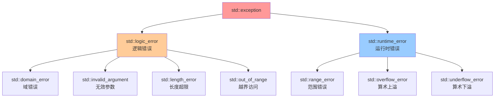

---
tags:
  - C++
  - 定义性
  - 基本原理
  - ErrorHandle
title: stdexcept
created: 2026-04-27
modified: 2026-04-27
---

# stdexcept

> [!abstract] C++ `<stdexcept>` 头文件
> `<stdexcept>` 是 C++ 标准库头文件，定义了一组**标准异常类**，用于报告程序运行中的错误。它们都继承自 `<exception>` 中的 `std::exception`。

## 1. 继承体系



## 2. 两大分支

### 2.1 `std::logic_error` — 逻辑错误

> [!note] 本质
> 程序本身的 bug，理论上可以在编码阶段发现。

| 子类 | 场景 |
|------|------|
| `domain_error` | 数学函数参数不在定义域（如 `sqrt(-1)`） |
| `invalid_argument` | 传入了不合适的参数（如构造函数收到负数长度） |
| `length_error` | 尺寸超限（如 `std::string` 超过 `max_size()`） |
| `out_of_range` | 索引越界（如 `vector::at()` 或自定义边界检查） |

### 2.2 `std::runtime_error` — 运行时错误

> [!note] 本质
> 运行时才能检测到的错误，无法在编码阶段预判。

| 子类 | 场景 |
|------|------|
| `range_error` | 值超出可表示范围（如浮点转换溢出） |
| `overflow_error` | 算术上溢（如整数运算超出类型范围） |
| `underflow_error` | 算术下溢（如浮点数下溢至 0） |

## 3. 用法

### 3.1 抛出异常

```cpp
#include <stdexcept>

throw std::out_of_range("Index 5 is out of range [0, 3)");
throw std::invalid_argument("Size must be non-negative");
throw std::runtime_error("File not found: config.txt");
```

> [!tip] 所有 `<stdexcept>` 中的异常类都接受 `const std::string&` 或 `const char*` 构造参数，用于描述错误。

### 3.2 捕获异常

```cpp
try {
    vec.at(100);  // 可能抛出 out_of_range
} catch (const std::out_of_range& e) {
    std::cerr << e.what() << "\n";  // 输出描述信息
}
```

### 3.3 按层级捕获

```cpp
try {
    // ...
} catch (const std::out_of_range& e) {
    // 只捕获越界
} catch (const std::logic_error& e) {
    // 捕获所有逻辑错误（包括上面没匹配的）
} catch (const std::exception& e) {
    // 捕获所有标准异常（兜底）
}
```

> [!warning] 注意
> `catch` 的顺序从具体到一般，否则子类异常会被父类的 `catch` 先拦截。

## 4. `what()` 方法

所有异常类都提供 `const char* what() const noexcept` 方法，返回 C 风格的错误描述字符串：

```cpp
try {
    throw std::invalid_argument("negative size");
} catch (const std::exception& e) {
    std::cout << e.what();  // 输出: negative size
}
```

## 5. 实际项目示例

在 Burgerkrieg 项目的 `Front` 类中用于边界检查：

```cpp
double getData(int r, int c) const {
    if (r < 0 || r >= rows || c < 0 || c >= cols)
        throw std::out_of_range("Front index out of range");
    return data[r][c];
}
```

> [!tip] 选择 `out_of_range` 而非 `invalid_argument`，因为错误本质是"索引超出了合法范围"，与 `std::vector::at()` 的语义一致。

## 6. 选择指南

| 情况 | 选择 |
|------|------|
| 参数值不合法（负数长度、空指针） | `invalid_argument` |
| 索引越界 | `out_of_range` |
| 尺寸超限 | `length_error` |
| 文件不存在、网络断开 | `runtime_error` |
| 数值计算溢出 | `overflow_error` |
| 不确定 | `runtime_error`（更安全的选择） |

> [!important] 原则
> 如果加个 `if` 就能在编码时避免，用 `logic_error` 系列；如果只有运行时才能发现，用 `runtime_error` 系列。

---

## 相关笔记

- [[Constructor Init List]] - 构造函数与初始化
- [[Smart Pointer]] - 智能指针与内存管理