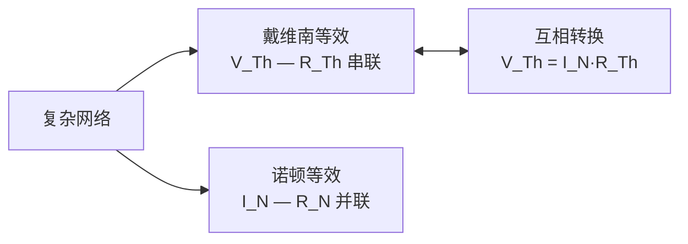

---
tags:
  - Physics
  - 方法性
  - 基本原理
title: DC Circuits
created: 2026-06-10
modified: 2026-06-10
---

# DC Circuits

> [!abstract] 直流电路
> 直流电路（DC Circuits）分析是电路理论的基础。基尔霍夫定律、串并联组合以及 Thevenin/Norton 等效定理构成电路分析的核心框架。

## 基尔霍夫定律 (Kirchhoff's Laws)

### 电流定律 (KCL — Kirchhoff's Current Law)

> [!note] KCL
> 在电路中的任意节点，流入和流出电流的代数和为零：
> $$\sum_{k=1}^n I_k = 0$$
> 
> 这是**电荷守恒**的体现。

### 电压定律 (KVL — Kirchhoff's Voltage Law)

> [!note] KVL
> 沿任意闭合回路，各元件电压的代数和为零：
> $$\sum_{k=1}^n V_k = 0$$
> 
> 这是**能量守恒**的体现（静电场是保守场）。

## 电阻的串并联

### 串联 (Series)

$$R_{\text{eq}} = R_1 + R_2 + \cdots + R_n$$

- 各电阻中电流相同
- 总电压为各电阻电压之和
- 电压按电阻**正比分压**

#### 分压公式 (Voltage Divider)

$$V_i = V_{\text{total}} \frac{R_i}{R_{\text{eq}}}$$

### 并联 (Parallel)

$$\frac{1}{R_{\text{eq}}} = \frac{1}{R_1} + \frac{1}{R_2} + \cdots + \frac{1}{R_n}$$

- 各电阻两端电压相同
- 总电流为各支路电流之和
- 电流按电阻**反比分流**

#### 分流公式 (Current Divider)

对于两个电阻并联：
$$I_1 = I_{\text{total}} \frac{R_2}{R_1 + R_2}, \quad I_2 = I_{\text{total}} \frac{R_1}{R_1 + R_2}$$

## 电路等效定理

### 戴维南定理 (Thevenin's Theorem)

> [!important] 戴维南定理
> 任意线性二端网络可以等效为一个**电压源** $V_{\text{Th}}$ 与一个**电阻** $R_{\text{Th}}$ 的串联组合。
> 
> - $V_{\text{Th}}$：端口开路电压
> - $R_{\text{Th}}$：端口内所有独立源置零后的等效电阻

### 诺顿定理 (Norton's Theorem)

> [!important] 诺顿定理
> 任意线性二端网络可以等效为一个**电流源** $I_{\text{N}}$ 与一个**电阻** $R_{\text{N}}$ 的并联组合。
> 
> - $I_{\text{N}}$：端口短路电流
> - $R_{\text{N}} = R_{\text{Th}}$

## RC 电路暂态分析

### 充电过程 (Charging)

电容通过电阻 $R$ 从电源 $V_0$ 充电：

$$q(t) = CV_0\left(1 - e^{-t/RC}\right)$$
$$V_C(t) = V_0\left(1 - e^{-t/RC}\right)$$
$$i(t) = \frac{V_0}{R} e^{-t/RC}$$

### 放电过程 (Discharging)

电容初始电压 $V_0$，通过电阻放电：

$$q(t) = CV_0 e^{-t/RC}$$
$$V_C(t) = V_0 e^{-t/RC}$$
$$i(t) = -\frac{V_0}{R} e^{-t/RC}$$

### 时间常数 (Time Constant)

> [!note] 时间常数
> $$\tau = RC$$
> 
> - 单位：秒 (s)
> - $t = \tau$ 时，电容充/放至最终值的 $63.2\%$（即 $1 - e^{-1} \approx 0.632$）
> - $t = 3\tau$ 时，达到 $95\%$；$t = 5\tau$ 时，达到 $99.3\%$
> - 工程上认为 $5\tau$ 后暂态过程**基本结束**

| 时间 | 充电百分比 | 放电剩余 |
|-----|-----------|---------|
| $0$ | $0\%$ | $100\%$ |
| $\tau$ | $63.2\%$ | $36.8\%$ |
| $2\tau$ | $86.5\%$ | $13.5\%$ |
| $3\tau$ | $95.0\%$ | $5.0\%$ |
| $5\tau$ | $99.3\%$ | $0.7\%$ |

### 能量

电容储能：
$$U_C = \frac{1}{2}CV_C^2$$

电阻消耗的能量在充电过程中恰好等于电容储能（两者均为 $\frac{1}{2}CV_0^2$，各占电池输出能量的一半）。

## 相关链接

- [[Electromagnetism/Current and Resistance|Current and Resistance]]
- [[Electromagnetism/Capacitance|Capacitance]]
- [[Electromagnetism/Inductance|Inductance]]
- [[Electromagnetism/Electromagnetism - Home|Electromagnetism - Home]]

## 注意事项

1. KCL 和 KVL 适用于**任何集总参数电路**（包括非线性电路），不仅限于线性电路
2. 戴维南和诺顿定理只适用于**线性**电路
3. RC 电路的时间常数 $\tau = RC$ 越大，暂态过程越长
4. 分析暂态时，注意电容电压**不会突变**（记忆效应）
