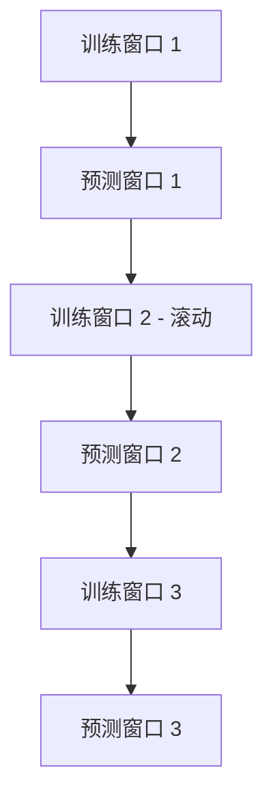
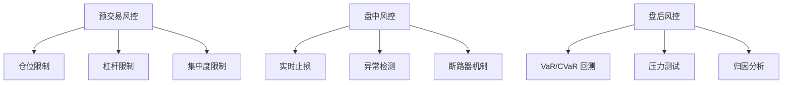
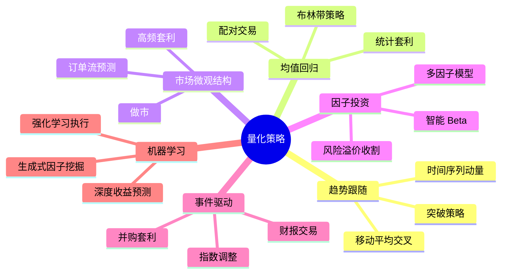

---
tags:
  - Economics
  - Finance
  - TradingSystems
  - FinancialML
  - FinancialModeling
  - 概念性
  - 基本原理
  - 方法性
title: Finance - Quantitative Trading Fundamentals
created: 2026-06-09
---

# Finance — Quantitative Trading Fundamentals

> [!abstract] 概述
> 量化交易（Quantitative Trading）是通过数学模型、统计分析和计算机程序来制定和执行交易策略的方法论。与主观交易不同，量化交易依赖数据驱动的信号生成、系统性回测与自动化执行，追求统计意义上的正期望收益。本文梳理量化交易的核心概念体系。

## 1. 量化交易的基本架构

### 1.1 与传统交易的区别

| 维度 | 传统/主观交易 | 量化交易 |
|:-----|:-------------|:---------|
| 决策依据 | 经验、直觉、基本面判断 | 数学模型、统计分析 |
| 信号数量 | 少数精选机会 | 同时处理海量信号 |
| 执行方式 | 手动下单 | 自动化执行 |
| 情绪影响 | 显著（恐惧/贪婪） | 被系统规则消除 |
| 可扩展性 | 受限于人的精力 | 软件层面可无限扩展 |
| 可验证性 | 难以精确回测 | 严格的历史回测与样本外验证 |

## 2. Alpha 研究：信号生成

### 2.1 Alpha 的定义

Alpha 是策略的**超额收益**——即策略收益中不能被已知风险因子解释的部分。

$$R_t^{\text{strategy}} = \alpha_t + \sum_{k=1}^K \beta_k F_{k,t} + \varepsilon_t$$

- $F_{k,t}$：第 $k$ 个风险因子（市场、价值、动量、波动率等）
- $\beta_k$：因子暴露
- $\alpha_t$：真正的 Alpha（期望非零且与因子无关）
- $\varepsilon_t$：特质噪声

> [!tip] Alpha 的信号来源
> Alpha 可以来自信息优势（更快的处理速度）、模型优势（更好的预测结构）或行为优势（利用市场参与者的系统性偏差）。

### 2.2 常见 Alpha 信号类别

| 类别 | 示例 | 理论基础 |
|:-----|:-----|:---------|
| **动量 (Momentum)** | 过去 $N$ 日涨幅为正向信号 | 趋势惯性与反应不足 |
| **均值回归 (Mean Reversion)** | 价格偏离均线时反向交易 | 价格围绕均衡波动 |
| **价值 (Value)** | 低估值资产买入 | 基本面均值回归 |
| **波动率 (Volatility)** | 预测波动率变化方向 | 波动率集聚与均值回复 |
| **事件驱动 (Event-Driven)** | 财报 / 并购公告后交易 | 公告后漂移 |
| **情绪 (Sentiment)** | NLP 分析新闻 / 社交媒体 | 行为金融偏误 |
| **资金流 (Flow)** | 大单 / 机构资金流向 | 信息级联效应 |
| **跨资产 (Cross-Asset)** | 利用相关资产的领先-滞后关系 | 信息扩散速度差异 |

## 3. 回测 (Backtesting)

### 3.1 回测的目的与陷阱

回测是将策略应用于历史数据以评估其假设表现的模拟过程。**核心矛盾**：回测好的策略在大样本下可能只是过拟合噪音。

> [!warning] 回测中必须避免的陷阱
> | 陷阱 | 描述 | 后果 |
> |:-----|:-----|:-----|
> | **前视偏差 (Look-ahead Bias)** | 使用了当时不可知的信息 | 极度高估收益 |
> | **存活偏差 (Survivorship Bias)** | 仅使用至今仍存活的资产 | 高估市场整体表现 |
> | **发布偏差 (Publication Bias)** | 仅报告成功的回测 | 学术/业界选择性报告 |
> | **过拟合 (Overfitting)** | 策略适配噪声而非信号 | 样本外崩溃 |
> | **交易成本忽略** | 不含滑点、佣金、市场冲击 | 实盘收益远低于回测 |
> | **数据窥探 (Data Snooping)** | 经多次试验后选择最佳结果 | 多重比较下的虚假发现 |

### 3.2 稳健性验证

**样本外测试 (Out-of-Sample Testing)**：将数据分为训练期 (in-sample) 和测试期 (out-of-sample)。

**Walk-Forward 验证**：

每一轮只用滚动窗口之前的数据训练，向前预测一小段，然后窗口向前平移。参见 [[ML-Track/CTM - Walk-Forward Validation]]。

**蒙特卡洛置换检验**：随机打乱信号与收益的对应关系，检验真实策略表现是否显著优于随机。

### 3.3 关键回测指标

| 指标 | 公式 / 含义 | 良好阈值 |
|:-----|:-----------|:---------|
| 年化收益率 (CAGR) | 几何平均年化收益 | 依赖策略类型 |
| 年化波动率 | 收益率标准差 $\times \sqrt{252}$ | — |
| **夏普比率 (Sharpe)** | $\displaystyle \frac{R_p - R_f}{\sigma_p}$ | $\ge 1.0$ 可接受, $\ge 2.0$ 优秀 |
| **最大回撤 (Max Drawdown)** | 从峰值到谷底的最大跌幅 | 通常控制在 $< 20\%$ |
| Calmar 比率 | CAGR / Max Drawdown | $\ge 1.0$ |
| 胜率 (Win Rate) | 盈利交易比例 | 不独立看待，需结合盈亏比 |
| 盈亏比 (Profit Factor) | 总盈利 / 总亏损 | $\ge 1.5$ |
| **信息系数 (IC)** | 预测值与实际值的秩相关 | $\ge 0.03$ 有效, $\ge 0.05$ 优秀 |
| **换手率 (Turnover)** | 每日/月组合持仓变化比例 | 与策略频率匹配 |

## 4. 执行算法 (Execution Algorithms)

### 4.1 执行的核心挑战

将理论信号转化为真实成交时面临：

| 挑战 | 描述 |
|:-----|:-----|
| **市场冲击 (Market Impact)** | 大额订单本身会推动价格反向变动 |
| **滑点 (Slippage)** | 信号价格与实际成交价格的差距 |
| **流动性 (Liquidity)** | 深度不足导致无法以合理价格成交 |
| **逆向选择 (Adverse Selection)** | 对手方可能拥有信息优势 |
| **延迟 (Latency)** | 信号生成到订单到达市场的时滞 |

### 4.2 常见执行策略

| 策略 | 描述 | 适用场景 |
|:-----|:-----|:---------|
| **TWAP** (Time-Weighted Average Price) | 均匀拆分订单于时间区间内 | 基线执行策略 |
| **VWAP** (Volume-Weighted Average Price) | 按历史成交量分布拆分 | 利用流动性模式 |
| **IS (Implementation Shortfall)** | 最小化执行差额(Arrival Price − 成交均价) | 最优执行框架 |
| **Iceberg / Hidden Orders** | 仅显示订单的一部分 | 隐藏真实意图 |
| **POV (Percentage of Volume)** | 以市场成交量固定比例参与 | 动态分配执行速率 |

### 4.3 Almgren-Chriss 最优执行框架

经典框架将执行问题构建为一个动态规划：以线性价格冲击假设，求解最优交易速率以最小化期望执行成本 + 风险惩罚。

$$\min_{v_t} \; \mathbb{E}\left[ \underbrace{\sum_t v_t \cdot \eta v_t}_{\text{瞬时冲击}} + \underbrace{\sum_t \gamma x_t^2}_{\text{库存风险}} \right]$$

其中 $v_t$ 为交易速率，$x_t$ 为剩余库存，$\eta$ 为市场冲击系数，$\gamma$ 为风险厌恶参数。

## 5. 组合优化 (Portfolio Optimization)

### 5.1 Markowitz 均值-方差优化

量化交易的经典起点，目标是在给定预期收益下最小化组合方差：

$$\min_{\mathbf{w}} \mathbf{w}^\top \mathbf{\Sigma} \mathbf{w} \quad \text{s.t.} \quad \mathbf{w}^\top \boldsymbol{\mu} = \mu_{\text{target}},\; \sum w_i = 1$$

其中 $\mathbf{w}$ 为权重向量，$\mathbf{\Sigma}$ 为协方差矩阵，$\boldsymbol{\mu}$ 为预期收益向量。

> [!warning] 实践中的问题
> - 协方差矩阵估计极不稳定（"Bellman 的诅咒"）
> - 对输入参数高度敏感（Garbage in, garbage out）
> - 不考虑交易成本和市场冲击

### 5.2 现代替代方法

| 方法 | 核心思路 | 优势 |
|:-----|:---------|:-----|
| **Black-Litterman** | 以市场均衡权重为先验，融合主观观点 | 生成更稳定的权重 |
| **风险平价 (Risk Parity)** | 等风险贡献分配 | 不依赖收益预测 |
| **最大分散化 (MDP)** | 最大化分散化比率 | 兼顾各风险源 |
| **收缩估计 (Shrinkage)** | 向结构化先验收缩协方差矩阵 | 降低估计误差 |
| **机器学习排序** | 学到一个资产排名而非连续权重 | 更稳健的决策 |

## 6. 风险管理

### 6.1 量化风险度量

| 度量 | 公式 | 描述 |
|:-----|:-----|:-----|
| VaR (Value at Risk) | $\mathbb{P}(\text{损失} \le \text{VaR}_\alpha) = 1 - \alpha$ | 在置信水平 $\alpha$ 下的最大损失 |
| CVaR / ES | $\mathbb{E}[\text{损失} \mid \text{损失} > \text{VaR}_\alpha]$ | 尾部条件期望损失 |
| 最大回撤 (MDD) | $\max_{t} (\text{Peak}_t - \text{Valley}_t)$ | 历史上最大跌幅 |
| 杠杆率 | $\sum |w_i|$ | 总市场暴露 |
| Beta 暴露 | $\beta_{\Pi} = \sum w_i \beta_i$ | 系统性市场风险 |

### 6.2 风险管理的层级

### 6.3 常见错误

> [!warning] 量化交易中的风险盲区
> - **模型风险**: 模型假设不再成立时的灾难性失败（如 LTCM 1998）
> - **相关性崩溃**: 压力情境下历史相关性结构瓦解
> - **流动性枯竭**: 所有人都试图平仓时没有对手方
> - **过拟合的风险模型**: 将噪音视为可预测的风险模式
> - **杠杆的隐性积累**: 看似低风险的策略经杠杆放大后变高风险

## 7. 数据基础设施

### 7.1 数据类型

| 数据类型 | 频率 | 典型用途 |
|:---------|:-----|:---------|
| 行情数据 (Market Data) | Tick / 分钟 / 日 | OHLCV，信号生成 |
| 基本面数据 (Fundamental) | 季度 / 年度 | 价值因子 |
| 另类数据 (Alternative) | 各异 | 卫星图像、信用卡交易、社交媒体 |
| 订单簿数据 (LOB) | 微秒级 | 高频做市 |
| 新闻 / 情绪数据 | 实时 | 事件驱动、NLP 信号 |

### 7.2 数据质量检查清单

- 价格调整（拆股、分红、权益事件）
- 停牌 / 退市处理
- 时区标准化
- 数据对齐（不同来源可能存在时间偏移）
- 异常值检测与处理
- 前视偏差审查

## 8. 统计套利 (Statistical Arbitrage)

### 8.1 核心思想

统计套利（Stat Arb）通过统计方法识别资产间的相对定价失衡，构建多空组合从均值回归中获利。

典型步骤：
1. **配对交易**: 选取协整或相关性高的资产对
2. **价差建模**: 计算价差 $z_t = \beta_0 + \beta_1 P_t^A - P_t^B$
3. **信号生成**: $z_t$ 偏离均值 $\mu$ 超过 $k\sigma$ 时入场
4. **均值回归**: 价差回归时平仓盈利

### 8.2 协整检验

协整是统计套利的数学基础。若两个非平稳序列 $X_t$ 和 $Y_t$ 的线性组合 $X_t - \beta Y_t$ 是平稳的，则它们协整。

常用检验：**Engle-Granger 两步法**、**Johansen 检验**。

## 9. 机器学习在量化交易中

### 9.1 常见应用

| 任务 | ML 方法 | 输入 | 输出 |
|:-----|:--------|:-----|:-----|
| **收益预测** | GBDT / LSTM / Transformer | 特征矩阵 | 未来收益方向/幅度 |
| **波动率预测** | GARCH / RNN | 历史收益 | 未来波动率 |
| **组合优化** | 强化学习 / 深度学习 | 市场状态 | 资产权重 |
| **订单执行** | 强化学习 | 订单簿 | 最优子订单拆分 |
| **异常检测** | 自编码器 / Isolation Forest | 市场特征 | 异常标记 |
| **因子挖掘** | Autoencoder / GAN | 大量候选因子 | 有效合成因子 |

### 9.2 量化 ML 的特殊挑战

> [!warning] 金融 ML 的独特困难
> - **低信噪比**: $R^2$ 通常 $\approx 0.01$–$0.05$，预测很难
> - **非平稳性**: 市场机制随时间变化（Regime Change）
> - **小样本**: 经济周期频率低（季度），$n$ 很小
> - **过拟合风险极高**: 资产数量 × 时间点 → 巨大的虚假发现空间
> - **可解释性要求**: 监管和风险管理需要理解模型决策

相关笔记：[[ML-Track/CTM - Mamba and S6 SSM]] | [[ML-Track/CTM - Feature Engineering]] | [[ML-Track/CTM - Loss Functions]]

## 10. 策略评估与归因

### 10.1 归因分析

将策略收益分解为可解释的成分：

$$R_t^{\text{strategy}} = \underbrace{\alpha_t}_{\text{技能}} + \underbrace{\sum \beta_k F_{k,t}}_{\text{因子暴露}} + \underbrace{\varepsilon_t}_{\text{噪声}}$$

- **风格归因**: 收益有多少来自已知因子（市场 Beta / 价值 / 动量 / 规模 / 波动率）？
- **行业归因**: 收益有多少来自特定行业的配置？
- **选股能力**: 同一行业内相对基准的超额表现？

### 10.2 信号衰减 (Alpha Decay)

Alpha 信号的预测力通常随时间衰减。半衰期 $t_{1/2}$ 指信号 IC 下降一半所需的时间：

$$\text{IC}(t) \approx \text{IC}_0 \cdot e^{-\lambda t}, \quad t_{1/2} = \frac{\ln 2}{\lambda}$$

高频信号半衰期仅数秒到数分钟；低频信号可能持续数月。

## 11. 量化交易策略分类全景

## 12. 相关链接

- [[Finance - Market Greeks]] — 市场希腊字母全面介绍
- [[ML-Track/CTM - Feature Engineering]] — 金融特征工程
- [[ML-Track/CTM - MultiAsset Model]] — 多资产交叉注意力建模
- [[ML-Track/CTM - Walk-Forward Validation]] — Walk-Forward 验证
- [[ML-Track/CTM - Trading Execution]] — 交易系统架构与执行
- [[ML-Track/CTM - Loss Functions]] — 量化交易中的损失函数设计
- [[ML-Track/CTM - Interpretability]] — 模型可解释性
- [[ML-Track/Time Series Fundamentals]] — 时间序列分析基础
- [[IEO/Supply_Demand/Equilibrium]] — 市场均衡基础

## 13. 推荐学习路径

1. 金融市场基础（供需、均衡）→ [[IEO/Supply_Demand/Equilibrium]]
2. 市场 Greeks 与衍生品 → [[Finance - Market Greeks]]
3. 时间序列分析 → [[ML-Track/Time Series Fundamentals]]
4. 金融特征工程 → [[ML-Track/CTM - Feature Engineering]]
5. 机器学习在金融中的应用
6. 执行系统与风险管理 → [[ML-Track/CTM - Trading Execution]]
7. 策略研究与回测框架搭建
