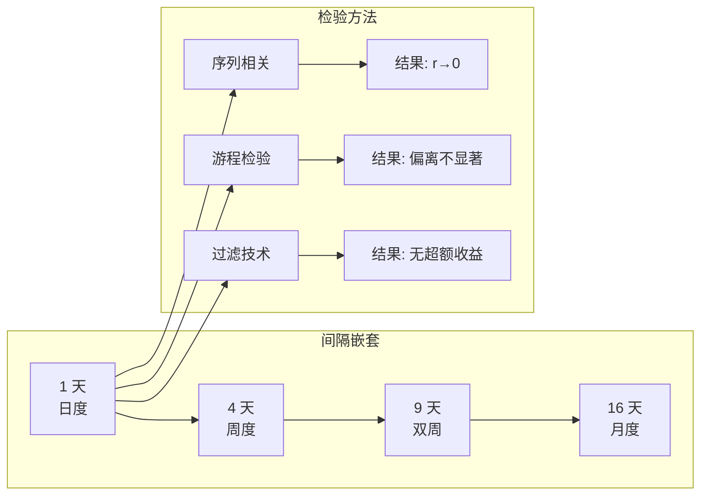
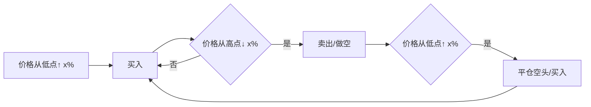

---
tags:
  - Economics
  - Finance
  - FinancialModeling
  - Statistics
  - 定理性
title: Finance - Random Walk in Stock Prices
created: 2026-06-11
---

# Finance — Random Walk in Stock Prices

> [!abstract] 概述
> 随机游走理论认为，股票价格水平的未来路径并不比一系列累积随机数的路径更具可预测性。Fama 1965 年使用三种统计方法系统检验了连续价格变化的独立性假设，为弱式有效市场提供了奠基性证据。
>
> **实验设计核心**：每种方法在四个嵌套差分间隔（**1 天、4 天、9 天、16 天**）上独立检验。若独立性成立，依赖程度应随间隔延长而衰减至零——这正是实际观测到的模式。

## 1. 随机游走的双重假设

随机游走模型包含两个独立假设：

1. **独立性**：连续价格变化是独立的（或至少在实际应用中独立）
2. **分布存在性**：价格变化服从某种概率分布（形式无需指定）

其中独立性是最重要的——若独立性不成立，理论即无效。

## 2. 实验设计：四间隔嵌套框架

Fama 对每种检验方法在 **1 天、4 天、9 天、16 天**四种间隔上分别执行，并加入更长间隔（如 20 天）作为对照。这一设计的逻辑：

- 若独立性成立，依赖程度应随间隔延长**单调衰减至零**
- 若存在微弱依赖，更长的合成间隔会将其稀释
- 所有四种间隔下的结果一致性，提供了远比单一间隔更强的证据

## 3. 三种独立性检验方法

### 3.1 序列相关检验（Serial Correlation）

计算连续对数收益率之间的序列相关系数：

$$r_k = \frac{\sum_{t=1}^{N-k} (x_t - \bar{x})(x_{t+k} - \bar{x})}{\sum_{t=1}^{N} (x_t - \bar{x})^2}$$

其中 $x_t$ 为时间 $t$ 的对数收益率，$k$ 为滞后阶数。

**一阶序列相关结果（30 只道琼斯成分股）**：

| 指标 | 数值 |
|:----|:----:|
| 一阶序列相关系数均值 | **+0.03** |
| 最大一阶系数 | **< 0.10** |
| 0.05 水平显著的股票数 | 30 只中约 11 只 |
| 4 天间隔系数均值 | 进一步趋近于零 |
| 9 天/16 天间隔 | 几乎完全消失 |

**高阶序列相关**：Fama 还计算了滞后 2–10 阶的相关系数及联合 $\chi^2$ 统计量，**无一系统性显著**。

> [!note] 结论
> 统计上微弱显著（$r \approx 0.03$），但**经济上无足轻重**——该依赖程度无法在扣除交易成本后产生超额利润。

### 3.2 游程检验（Runs Test）

非参数检验，不依赖于分布假设，可检测非线性或符号性依赖模式。

游程（run）定义为连续具有相同符号的价格变化序列。

**预期游程数公式**：

$$\mathbb{E}(R) = \frac{N(N+1) - \sum_{i=1}^{3} n_i^2}{N}$$

其中 $N$ 为总观测数，$n_1$ = 正变化数、$n_2$ = 负变化数、$n_3$ = 零变化数（价格不变）。

**结果**：

| 检验维度 | 结论 |
|:--------|:----|
| 游程总数 | 略少于预期，仅 4–5 只在 0.05 水平显著 |
| 游程长度分布 | 与 $(1/2)^k$ 预期分布基本一致 |
| 按符号分类 | 正游程与负游程行为高度对称 |
| 4 天/9 天/16 天间隔 | 差异进一步缩小，几乎不可分辨 |
| 超长游程（≥ 5） | 略多于预期，但效应极弱且不稳定 |

### 3.3 Alexander 过滤技术（Filter Technique）

检验**经济意义上的独立性**——过去价格能否产生超额利润。

**规则**：
- 价格从近期低点向上移动 $x\%$ → 买入
- 价格从后续高点向下移动 $x\%$ → 卖出并做空
- 空头从后续低点向上反弹 $x\%$ → 平仓空头并买入
- $x$ 取值：0.5%、1%、2%、5%、…、50%

> [!tip] 方法论细节
> Fama 在回测中**调整了现金股息及股息再投资的影响**——任何严谨的过滤规则复现都必须考虑这一处理。

**结果**：

| 过滤规模 | 总利润对比 | 扣除交易成本后 |
|:--------|:----------|:--------------|
| 0.5%–1.5%（小） | 略高于买入-持有 | **低于**买入-持有 |
| 5%–50%（大） | 与买入-持有相当 | 无显著超额利润 |

## 4. 大变化的聚集现象

Fama 还发现大价格变化（$\geq 2.5\sigma$ 或 $\geq 3.0\sigma$）存在**聚集现象**——大的变化倾向于跟随大的变化。但：

> 聚集的**符号是随机的**——大的正变化后既可能跟大的正变化，也可能跟大的负变化。

因此该聚集本身不具备预测价值（尽管它对分布建模有含义）。

## 5. 综合结论

| 检验方法 | 统计显著性 | 经济显著性 |
|:--------|:---------:|:---------:|
| 序列相关（所有滞后阶数） | 微弱（$r \approx 0.03$） | 无 |
| 游程检验 | 基本不显著 | — |
| 过滤技术 | — | 无超额收益 |
| 大变化聚集 | 存在但符号随机 | 无预测价值 |

所有检验在四个间隔上均无系统性偏离——**数据为随机游走模型提供了一致且强有力的支持**。

> [!quote] Fama 1965
> "图表解读——尽管或许是一种有趣的消遣——对股票市场投资者并无实际价值。"

## 相关链接

- [[Finance - Efficient Market Hypothesis]] — EMH 理论框架
- [[Finance - Stable Paretian Distribution]] — 价格变化的数学分布
- [[Finance - Stock Price Behavior]] — Fama 1965 论文全景
- [[Finance - Quantitative Trading Fundamentals]] — 量化交易中的 Alpha 研究
