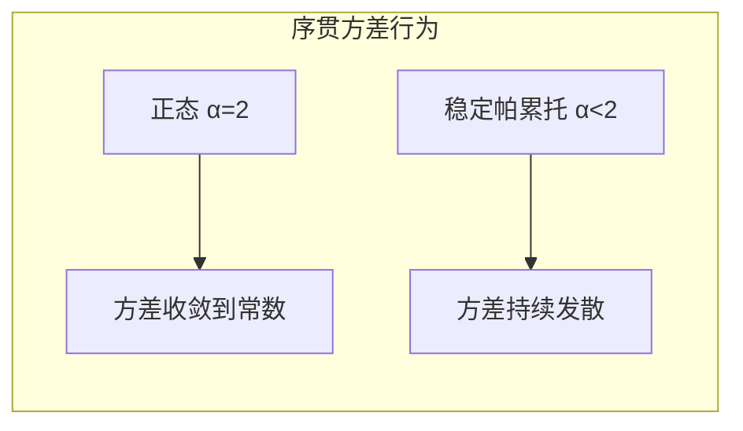

---
tags:
  - Economics
  - Statistics
  - Finance
  - FinancialModeling
  - 定理性
  - 证明
title: Finance - Stable Paretian Distribution
created: 2026-06-11
---

# Finance — Stable Paretian Distribution

> [!abstract] 概述
> Fama 1965 年系统**检验并验证**了 Benoit Mandelbrot（1963 年提出）的假设：股票价格变化服从**稳定帕累托分布**，其特征指数 $\alpha < 2$，而非古典金融学假设的正态分布（$\alpha = 2$）。这是该论文最深刻的数学贡献——它意味着价格变化具有**无穷大方差**，金融市场比高斯模型描述的更加动荡。

## 1. 来自稳定帕累托分布族的正态偏离

### 1.1 稳定帕累托分布的特征函数

通过特征函数的对数定义：

$$\log f(t) = i\delta t - \gamma |t|^\alpha \left[ 1 + i\beta \frac{t}{|t|} \omega(t, \alpha) \right]$$

其中 $\omega(t, \alpha)$ 为：

$$
\omega(t, \alpha) =
\begin{cases}
\tan \dfrac{\pi\alpha}{2} & \alpha \neq 1, \\[6pt]
\dfrac{2}{\pi} \log |t| & \alpha = 1.
\end{cases}
$$

### 1.2 四个参数

| 参数 | 名称 | 范围 | 含义 |
|:----|:----|:----:|:-----|
| $\alpha$ | 特征指数 | $0 < \alpha \leq 2$ | 尾部厚度；$\alpha=2$ 正态，$\alpha<2$ 厚尾 |
| $\beta$ | 偏度 | $-1 \leq \beta \leq 1$ | $\beta=0$ 对称，$\beta>0$ 右偏；**Fama 发现多数股票呈轻微正偏** |
| $\delta$ | 位置 | $\mathbb{R}$ | $\alpha > 1$ 时即均值；**$\alpha \leq 1$ 时均值未定义** |
| $\gamma$ | 尺度 | $\gamma > 0$ | $\alpha=2$ 时为半方差 $\sigma^2/2$；$\alpha<2$ 时定义分布尺度但非方差 |

### 1.3 经验分布的核心发现

Fama 对 30 只道琼斯成分股约 1200–1700 个交易日的数据分析显示：

- **尖峰**（leptokurtosis）：均值 $\pm 0.5\sigma$ 内，所有 30 只股票频率均**高于**正态预测
- **厚尾**：$2.5\sigma$–$5.0\sigma$ 尾部，所有股票频率均**高于**正态预测
- **概率图 S 形**：正态概率图呈特征性的拉长 S 形——厚尾分布标志

> [!note] 排除的替代解释
> Fama 检验并排除了两种高斯模型的变体：
> 1. **混合正态分布**（不同时期方差不同）— 证据不支持
> 2. **高斯非平稳性**（参数随时间变化）— 切分后子区间仍非正态

## 2. α 的三种估计方法

由于稳定帕累托分布除少数特例外无闭式密度函数，Fama 使用了三种独立方法。

### 2.1 双对数正态概率图法

利用正态概率图尾部偏离直线的程度反推 $\alpha$。尾部弯曲幅度与 $\alpha$ 有确定的理论关系——$\alpha$ 越小，偏离越大。

### 2.2 序贯方差法

> [!tip] 关键定理
> 若 $\alpha < 2$，则样本方差 $S^2$ **不收敛**，而是随样本量 $n$ 增长而发散。

数学推导：设 $y = u - \delta$，则 $y^2$ 的尾部服从渐近帕累托分布：

$$\Pr(y^2 > \theta) \to (C_1 + C_2)\theta^{-\alpha/2}$$

累积样本方差的分位数关系：

$$S_1^2 = S_0^2 \left( \frac{n_1}{n_0} \right)^{-1+2/\alpha}$$

- $\alpha = 2$（正态）：指数 $=0$ → 方差收敛
- $\alpha < 2$：指数 $>0$ → **方差随 $n$ 增长而无界增大**

### 2.3 极差分析

利用稳定帕累托分布在加法下的稳定性：未加权和的分布尺度为单个加项分布尺度的 $n^{1/\alpha}$ 倍。

$$a = n^{-1/\alpha}$$

- $\alpha = 2$：尺度以 $\sqrt{n}$ 增长
- $\alpha < 2$：尺度增长**快于** $\sqrt{n}$

Fama 测量 1 天、4 天、9 天、16 天间隔的分布极差，拟合 $\alpha$。

### 2.4 估计结果

| 方法 | $\alpha$ 范围 | 均值 |
|:----|:-----------:|:----:|
| 双对数概率图 | 1.7–2.0 | ~1.90 |
| 序贯方差 | 1.7–2.0 | ~1.90 |
| 极差分析 | 1.8–1.95 | ~1.90 |
| **综合** | **1.7–2.0** | **~1.90** |

> [!warning] 结论
> 30 只股票的 $\alpha$ 均值为约 **1.90**，明确偏离正态（$\alpha=2$），方差无穷大。

**个股差异**：Fama 报告了个股层面的估计差异，部分股票对外呈显著异质性：
- **Allied Chemical**：$\alpha \approx 1.99$–$2.00$，与正态分布几乎无区分
- 其他股票低至 **1.80**–**1.90**
- 这一差异说明：稳定帕累托拟合度因股票而异，部分股票接近正态；大盘均值 $\approx 1.90$ 是对所有股票的中心趋势度量

## 3. 稳定帕累托分布的关键数学性质

### 3.1 帕累托尾部定律（渐近形式）

$$\Pr(u > \zeta) \to \left( \frac{\zeta}{U_1} \right)^{-\alpha} \quad \text{当 } \zeta \to \infty$$

尾部以**幂律**衰减——比正态分布的指数衰减慢得多。这意味着崩盘和暴涨的概率远高于正态预测。

### 3.2 加法下的稳定性

独立同分布稳定帕累托变量之和的分布形式不变：

$$n \log f(t) = i(n\delta)t - (n\gamma)|t|^\alpha \left[1 + i\beta \frac{t}{|t|} \omega(t, \alpha)\right]$$

这保证了日、周、月收益率分布属于同一族——Fama 用此验证了稳定性假设。

### 3.3 广义中心极限定理

稳定帕累托分布是 i.i.d. 随机变量之和的**唯一可能极限分布**（经适当标准化后）：

- **方差有限** → 极限分布为正态（$\alpha=2$，古典 CLT）
- **方差无穷** → 极限分布为 $\alpha < 2$ 的稳定帕累托

## 4. 向正态分布的收敛

Fama 发现一个关键实证模式：随着差分间隔的延长（从 1 天 → 4 天 → 16 天），样本分布的尾部略微**趋向正态**。这表现为：

- 正态概率图上的 S 形弯曲度随间隔延长而**减小**
- 极端尾部的概率密度向正态预测值偏移

这一收敛趋势是**支持稳定帕累托假设的关键证据**：若真实分布是非平稳高斯（参数随时间变化），则聚合后的分布不应趋向正态；而稳定帕累托分布的稳定性性质恰好预测了这一模式。

Fama 还检验并排除了**周末/节假日效应**的解释：将周末（3 天间隔）与平日（1 天间隔）的变化分离后，两种子样本均呈现厚尾特征，说明尖峰厚尾并非由混合方差驱动。

## 5. 含义

### 4.1 经济含义

> 在稳定帕累托（$\alpha<2$）市场中，总变化通常由**少数几个极大的单个变化**主导；在高斯市场中，则是大量微小变化的聚集。

这意味着金融市场比高斯模型更加动荡——对风险管理、衍生品定价有根本影响。

### 4.2 统计含义

| $\alpha$ 范围 | 标准统计工具的可靠性 |
|:------------:|:------------------|
| $\alpha \approx 1.9$ | 仍大致可靠（序列相关检验等） |
| $\alpha \leq 1.5$ | **彻底失效** |

## 相关链接

- [[Finance - Random Walk in Stock Prices]] — 独立性检验
- [[Finance - Efficient Market Hypothesis]] — EMH 理论框架
- [[Finance - Stock Price Behavior]] — Fama 1965 论文全景
- [[ML-Track/CTM - Feature Engineering]] — 金融时间序列特征工程中的厚尾处理
