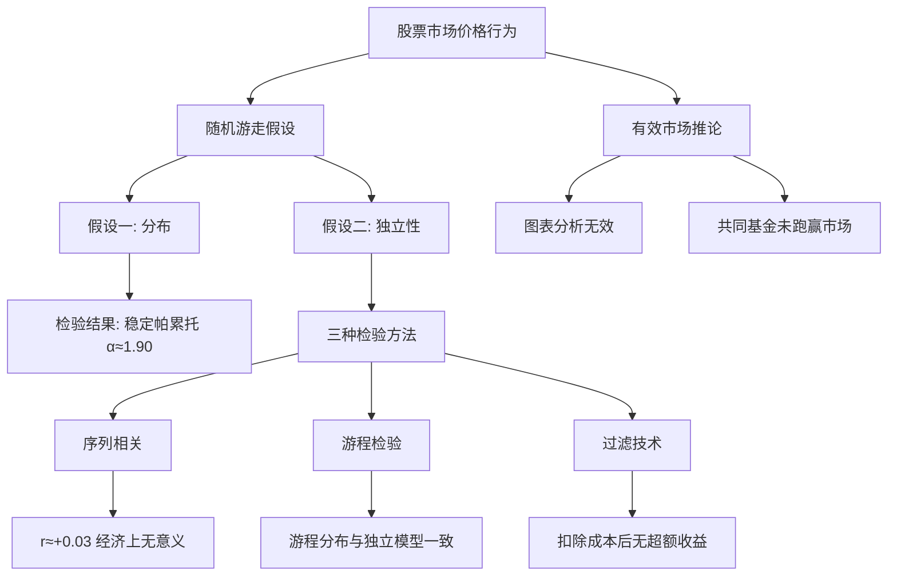

---
tags:
  - Economics
  - Finance
  - 论文
  - 概念性
title: Finance - Stock Price Behavior
created: 2026-06-11
---

# Finance — Stock Price Behavior (Fama 1965)

> [!abstract] 概述
> Eugene F. Fama 于 1965 年在《Journal of Business》发表的《The Behavior of Stock-Market Prices》是金融学史上被引用最多的论文之一。它是 Fama 的博士论文，系统检验了股票价格是否遵循**随机游走**，并为后来正式提出的**有效市场假说**奠定了实证基础。论文在分布的数学形式（稳定帕累托 vs 正态）和独立性检验两方面均有里程碑式的贡献。

## 论文信息

| 项目 | 内容 |
|:----|:-----|
| **标题** | The Behavior of Stock-Market Prices |
| **作者** | Eugene F. Fama |
| **期刊** | The Journal of Business, Vol. 38, No. 1 |
| **年份** | 1965 年 1 月 |
| **页码** | 34–105 |
| **数据** | 30 只道琼斯成分股日度数据 + NYSE 全部普通股月度数据 |
| **时间段** | 1957–1962（日度），更早覆盖月度 |

## 核心框架

## 两大数学发现

### 发现 1：价格变化的分布——稳定帕累托（$\alpha < 2$）

- 30 只成分股的经验分布均呈现**尖峰厚尾**
- $\alpha \approx 1.90$ 的稳定帕累托分布比正态拟合更优
- **方差无穷大**——序贯方差随样本量发散而非收敛
- 广义中心极限定理为稳定帕累托族提供了理论基础

→ 详细数学推导见 [[Finance - Stable Paretian Distribution]]

### 发现 2：连续价格变化的独立性——随机游走成立

- 序列相关系数均值 $r \approx +0.03$，经济上无足轻重
- 游程检验结果与独立性假设基本一致
- Alexander 过滤规则无法产生扣除交易成本后的超额利润
- 大变化存在聚集，但符号随机无预测价值

→ 详细检验方法见 [[Finance - Random Walk in Stock Prices]]

## 理论贡献

| 贡献 | 描述 |
|:----|:-----|
| **弱式有效市场检验** | 历史价格不能预测未来——技术分析失效 |
| **经济显著性 vs 统计显著性** | 开创性地区分了两者——$r\approx0.03$ 统计显著但无套利价值 |
| **精明交易者抵消机制** | 即使信息生成过程有依赖，套利行为也能消除价格中的依赖 |
| **共同基金实证** | 39 只基金 1950–1960 年均未跑赢市场基准 |

## 引用数据

论文引用了前人理论：

| 作者 | 年份 | 贡献 |
|:----|:----:|:-----|
| Louis Bachelier | 1900 | 首次提出价格变化的**正态假设**与随机游走 |
| M. F. Osborne | 1959 | 重新发现并形式化 Bachelier 的随机游走模型 |
| Benoit Mandelbrot | 1963 | **投机价格的**稳定帕累托分布假设与无穷大方差 |
| S. S. Alexander | 1961 | 过滤技术 (filter technique) |

## 历史影响

- **1970**：Fama 在《Efficient Capital Markets: A Review of Theory and Empirical Work》中正式提出三形式 EMH（弱式/半强式/强式）——直接建立在 1965 年的实证基础之上
- **1970s–80s**：指数基金兴起，被动投资理念深入人心
- **1990s**：行为金融学（De Bondt & Thaler 动量反转、Jegadeesh & Titman 动量效应、Shiller 波动率）挑战 EMH
- **1991**：Fama 发表《Efficient Capital Markets: II》，承认部分异象，但认为它们反映了风险或数据挖掘
- **2013**：Fama、Hansen、Shiller 共同获得诺贝尔经济学奖——表彰他们对资产价格的实证分析；诺奖委员会直接引用了本文
- **当代共识**：市场**基本有效**但存在**有限套利**可解释的异象

> [!quote] Fama 1965 原文
> "数据似乎为[随机游走]模型提供了一致且强有力的支持。这意味着图表解读——尽管或许是一种有趣的消遣——对股票市场投资者并无实际价值。"

## 相关链接

- [[Finance - Efficient Market Hypothesis]] — EMH 理论
- [[Finance - Random Walk in Stock Prices]] — 独立性检验方法
- [[Finance - Stable Paretian Distribution]] — 稳定帕累托分布的数学
- [[Finance - Quantitative Trading Fundamentals]] — 量化交易核心概念
- [[Finance - Market Greeks]] — 衍生品风险度量
- [[ML-Track/CTM - Walk-Forward Validation]] — Walk-Forward 验证框架
