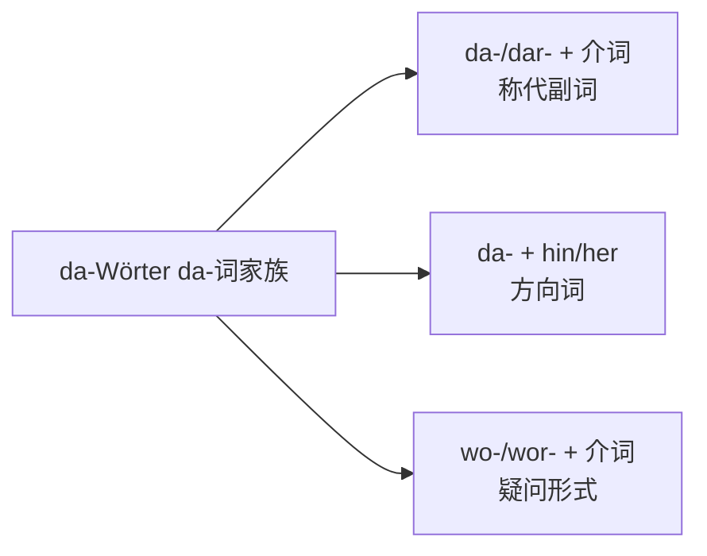

---
tags:
  - German
  - Linguistics
  - 定义性
  - 基本原理
  - GermanAdverb
title: Da-Compounds - Meanings and Usage
created: 2026-09-01
modified:
---
# Da-Compounds - Meanings and Usage

> [!abstract] 概述
> Da-词（德语 da-Wörter）是由 da-/dar- 与介词或方向词合成的一族指示词，如 dafür、darin、damit、dahin。它们代替「介词 + 名词短语」，指代上文提到的事物、情况或地点。本笔记逐个给出常见 da-词的意义与用法；构成规则、句子位置、拼写规则见 [[Praepositionaladverbien]]。

> [!note] 术语
> 严格语法上，da-/dar- + 介词 构成的词叫**称代副词**（Pronominaladverbien），如 damit、darüber。dahin、daher 等 da- + 方向词 属于**方位/方向副词**。学习时通常归为一族，德语课本统称 da-Wörter。

## 一、词族构成

| 类型 | 构成 | 例词 | 功能 |
|------|------|------|------|
| 称代副词 | da- + 辅音开头介词；dar- + 元音开头介词 | damit, dafür, darauf, darüber | 指代事物、情况 |
| 方向词 | da- + hin / her | dahin, daher | 指示方向、来源 |
| 疑问形式 | wo- + 辅音开头介词；wor- + 元音开头介词 | womit, wofür, worüber | 提问 |

> [!tip] 口语缩略
> 口语中 dar- 常缩为 dr-：drüber、drin、drauf、draus（见 [[Praepositionaladverbien]]）。

## 二、逐词详解：da-/dar- + 介词

| 词 | 介词 | 核心意义 | 例句 | 常见搭配 / 熟语 |
|----|------|----------|------|----------------|
| damit | mit | 用它；以此 | Er nimmt den Schlüssel und öffnet damit die Tür. | damit 表目的时是连词（见 §三.2） |
| dafür | für | 为此；赞成；代表 | Ich bin dafür. / Er hat sich dafür entschuldigt. | dafür sein（赞成）；反义 dagegen |
| dagegen | gegen | 反对它；相比之下 | Sie stimmte dagegen. / Dagegen ist das zweite Buch billiger. | dagegen sein（反对） |
| dabei | bei | 在身边；与此同时；参与其中 | Ich war dabei. / Dabei fiel er hin. | dabei bleiben（坚持）；es bleibt dabei（就这么定了） |
| dadurch | durch | 通过这种方式；由此 | Dadurch wurde das Problem gelöst. | dadurch, dass ...（借由……的方式） |
| daran | an | 在其上；对此（想到、动手） | Ich denke oft daran. / Ich arbeite gerade daran. | daran denken（想到）；daran arbeiten（处理） |
| darauf | auf | 在其上；对此（等待、注意） | Ich warte darauf. / Darauf kommt es an. | darauf achten, dass ...；Wie kommst du darauf?（你怎么想到的？） |
| daraus | aus | 从中；由此 | Daraus wurde nichts. | daraus lernen；daraus folgt, dass ... |
| darin | in | 在其中；在这方面 | Darin bin ich anderer Meinung. | das Problem liegt darin, dass ...（问题在于……） |
| darunter | unter | 在其下；其中（包括）；低于 | Alle kamen, darunter auch der Chef. | darunter versteht man ...（人们把……理解为） |
| darüber | über | 在其上方；关于它；超过 | Wir sprechen darüber. | darüber hinaus（此外）；sich ärgern über |
| darum | um | 围绕它；因此 | Es regnet, darum bleiben wir zu Hause. | es geht um ...（关键在于） |
| davon | von | 从它；关于它；其中（部分） | Das hängt davon ab. / Zehn Studenten, davon drei aus China. | davon ausgehen, dass ...（假定）；ich bin davon überzeugt（我确信） |
| dazu | zu | 为此；对此；此外 | Was sagst du dazu? | dazu kommt, dass ...（此外还有）；dazu gehören（属于） |
| danach | nach | 在那之后；按照它 | Danach gingen wir ins Kino. | sich richten nach（照……行事） |
| davor | vor | 在其前；在此之前；对此（害怕、警告） | Ich habe Angst davor. / Davor war er Lehrer. | sich fürchten vor；warnen vor |
| dahinter | hinter | 在其后；背后（隐情） | Dahinter steckt mehr. | dahinterkommen（弄明白真相） |
| daneben | neben | 在旁边；出错 | Er steht daneben. / Du liegst daneben. | danebenliegen（搞错）；danebengehen（落空） |
| dazwischen | zwischen | 在两者之间；从中（调停） | Dazwischen liegt ein Fluss. | sich dazwischenschalten（出面调停） |

## 三、方向词：dahin / daher / dorthin

| 词 | 构成 | 意义 | 例句 |
|----|------|------|------|
| dahin | da + hin | ①到那里 ②到那时 ③到那种地步；没了 | Wir fahren dahin, wo du wohnst. / Bis dahin bin ich fertig. / Mein Geld ist dahin.（钱没了，口语） |
| daher | da + her | ①从那里来 ②因此 | Er kommt daher. / Es regnet, daher bleiben wir. / Von daher ist das kein Problem.（就此而言） |
| dorthin | dort + hin | 到那边去（强调目的地） | Dorthin gehen wir. | 对比 hierher（到这里来） |

> [!warning] dahin 的熟语
> 「事情发展到……」常用 Es ist dahin gekommen, dass ...；「离题」用 Was hat das damit zu tun?，不用 dahin。

## 四、易混词对比

### 1. 表示「因此」的词

| 词 | 用法 | 例句 | 侧重点 |
|----|------|------|--------|
| deshalb / deswegen | 最通用，中位副词 | Es regnet, deshalb bleiben wir. | 中性 |
| darum | 同义，口语更常用 | Es regnet, darum bleiben wir. | 口语 |
| daher | 同义；另表「从那里来」 | Es regnet, daher bleiben wir. | 书面也可 |
| dadurch | 强调「通过这种方式」，常接 dadurch, dass ... | Er trainierte viel, dadurch wurde er besser. | 手段 → 结果 |

⚠️ **dafür 不表因果**：它只表「为此 / 赞成 / 代表」。

### 2. damit：副词 vs 连词

| 词性 | 意义 | 例句 | 语序 |
|------|------|------|------|
| 副词 | 用它；以此 | Er nimmt den Schlüssel und öffnet damit die Tür. | 正常语序 |
| 连词 | 以便（目的） | Er lernt fleißig, damit er die Prüfung besteht. | 从句：动词放句末 |

### 3. dafür vs dagegen

赞成 vs 反对：Ich bin dafür. / Ich bin dagegen. 动词搭配同理：kämpfen für → dafür kämpfen；protestieren gegen → dagegen protestieren。

### 4. daran vs darüber（想到 vs 谈论）

| 动词搭配 | 对应形式 | 例句 |
|----------|----------|------|
| denken an（想到） | daran | Ich denke oft daran. |
| nachdenken über（思考） | darüber | Ich muss darüber nachdenken. |
| sprechen über（谈论） | darüber | Wir sprechen darüber. |

### 5. dahin / dorthin / dort

| 词 | 意义 | 回答的问题 |
|----|------|-----------|
| dort | 在那里（静态） | Wo? |
| dahin / dorthin | 到那里（方向） | Wohin? |

dorthin 强调「到那个确切的地方」，常与 hierher 对举；dahin 口语更常用，且可引申表时间（到那时）和状态（完了）。

### 6. darin / darunter / dazwischen

- **darin**：在（事物）之中；抽象义「在这方面」→ Darin bin ich anderer Meinung.
- **darunter**：在其下；列举时表「其中包括」→ Alle kamen, darunter auch der Chef.
- **dazwischen**：在两者之间 → Dazwischen liegt ein Fluss.

## 五、常见搭配：介词动词 → da-词

> [!note] 使用规则
> da-词对应的介词由**动词决定**，不是由意义决定。记动词时同时记住介词，如 warten **auf** → darauf。完整动词搭配表见 [[Präpositionalverben und Satzverbindung]]。

| 动词 | 介词 | da-词 | 例句 |
|------|------|-------|------|
| denken | an | daran | Ich denke oft daran. |
| sich gewöhnen | an | daran | Ich habe mich daran gewöhnt. |
| arbeiten | an | daran | Ich arbeite gerade daran. |
| warten | auf | darauf | Ich warte darauf. |
| sich freuen | auf | darauf | Ich freue mich darauf. |
| sich verlassen | auf | darauf | Du kannst dich darauf verlassen. |
| ankommen | auf | darauf | Darauf kommt es an.（关键在于此） |
| sich interessieren | für | dafür | Ich interessiere mich dafür. |
| sich entschuldigen | für | dafür | Er hat sich dafür entschuldigt. |
| sich kümmern | um | darum | Ich kümmere mich darum. |
| es geht | um | darum | Es geht darum, das Problem zu lösen. |
| sich beschäftigen | mit | damit | Ich beschäftige mich damit. |
| aufhören | mit | damit | Ich höre damit auf. |
| sprechen / sich unterhalten | über | darüber | Wir sprechen darüber. |
| sich ärgern | über | darüber | Ich habe mich darüber geärgert. |
| wissen / träumen | von | davon | Ich weiß davon. / Ich träume davon. |
| überzeugt sein | von | davon | Ich bin davon überzeugt. |
| abhängen | von | davon | Das hängt davon ab. |
| Angst haben / sich fürchten | vor | davor | Ich habe Angst davor. |
| warnen | vor | davor | Er hat davor gewarnt. |
| leiden | unter | darunter | Viele leiden darunter. |
| verstehen | unter | darunter | Was versteht man darunter? |
| gehören / beitragen | zu | dazu | Das gehört dazu. / Er hat dazu beigetragen. |
| sich bewerben | um | darum | Er bewirbt sich darum. |

## 六、wo-/wor- 疑问形式

| 疑问词 | 介词 | 例句 |
|--------|------|------|
| womit | mit | Womit schreibst du? |
| wofür | für | Wofür ist das? |
| wogegen | gegen | Wogegen protestiert ihr? |
| wobei | bei | Wobei hast du Probleme? |
| woran | an | Woran denkst du? |
| worauf | auf | Worauf wartest du? |
| woraus | aus | Woraus besteht das? |
| worin | in | Worin liegt das Problem? |
| worunter | unter | Worunter versteht man das? |
| worüber | über | Worüber sprecht ihr? |
| worum | um | Worum geht es hier? |
| wovon | von | Wovon träumst du? |
| wovor | vor | Wovor hast du Angst? |
| wonach | nach | Wonach suchst du? |
| wozu | zu | Wozu brauchst du das? |
| wohin | -（方向） | Wohin gehst du? |
| woher | -（来源） | Woher kommst du? |

> [!tip] wor- 作关系词（书面语）
> 正式书面语中 wor- 形式可作关系代词引导从句：Das Problem, **worüber** wir sprechen, ist wichtig. 口语更常说 über das wir sprechen。详见 [[Präpositionalverben und Satzverbindung]]。

## 七、常见错误

### 1. 指代人误用 da-词
❌ Ich denke an ihn... —— 不对，应指代事物。正确规则：指代人用「介词 + 人称代词」（Ich denke **an ihn**.），指代事物用 da-词（Ich denke **daran**.）。

### 2. damit 连词语序错误
❌ Ich lerne Deutsch, damit ich spreche besser.
✅ Ich lerne Deutsch, damit ich besser spreche.（从句动词放句末）

### 3. 介词搭配错误
❌ Ich bin dafür einverstanden.
✅ Ich bin **damit** einverstanden.（einverstanden sein + **mit**）

### 4. 静态与动态混用
❌ Ich wohne dahin.
✅ Ich wohne dort.（wohnen 表静态，用 dort；dahin 表方向）

### 5. 因果误用 dafür
❌ Es regnet, dafür bleibe ich zu Hause.
✅ Es regnet, darum / deshalb bleibe ich zu Hause.（dafür 不表「因此」）

## 相关链接
- [[Praepositionaladverbien]] — da-/dar- 拼写规则、前置与后置位置、记忆口诀
- [[Präpositionalverben und Satzverbindung]] — 介词动词固定搭配与 wor- 关系从句
- [[Preposition]] — 介词与格的支配
- [[Pronomen]] — 德语代词系统
- [[Grammar Index]] — 德语语法索引
