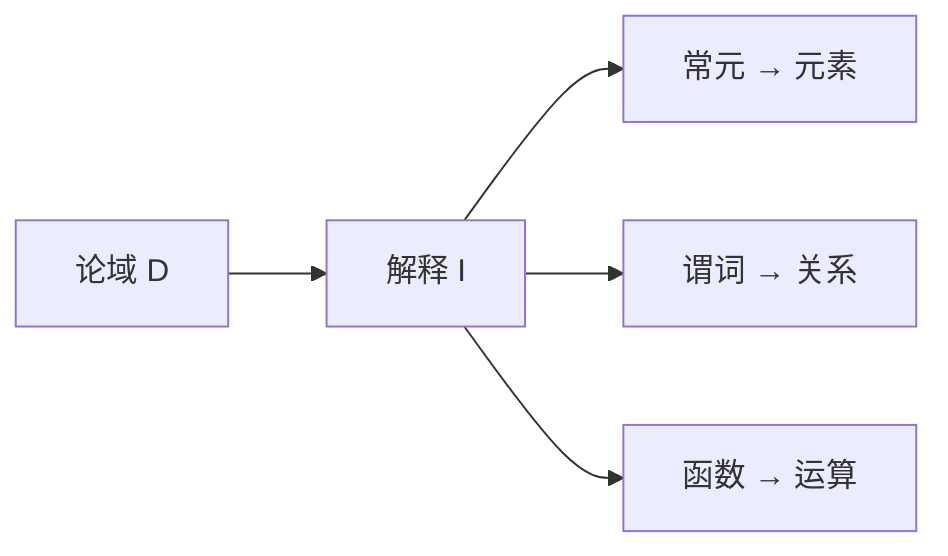

---
tags:
  - Logic
  - FirstOrderLogic
  - 基本原理
title: First-Order Logic
created: 2026-05-20
---

[[Propositional Logic]]
[[Formal Systems]]
[[克里普克模态语义递归定义]]
# 一阶逻辑基础

> [!note] 定义
> 一阶逻辑（谓词逻辑）在命题逻辑基础上引入**量词**和**谓词**，分析命题的内部结构。

## 语法

**项**（term）：个体变元 $x,y,z,\dots$、个体常元 $c$、函数项 $f(t_1,\dots,t_n)$

**公式**（formula）：原子公式 $P(t_1,\dots,t_n)$、复合公式 $\lnot A,\;A\land B,\;\forall x A,\;\exists x A$

## 量词

| 量词 | 读法 | 真值条件（模型 $\mathcal{M}$ 中） |
|------|------|-----------------------------------|
| $\forall x A(x)$ | 对所有 $x$，$A(x)$ | 对每个 $d\in|\mathcal{M}|$ 有 $\mathcal{M}\models A[d/x]$ |
| $\exists x A(x)$ | 存在 $x$ 使 $A(x)$ | 存在 $d\in|\mathcal{M}|$ 使 $\mathcal{M}\models A[d/x]$ |

> [!tip] 对偶性
> $\forall x A \equiv \lnot\exists x\lnot A$，$\exists x A \equiv \lnot\forall x\lnot A$

## 辖域与约束

- **辖域**（scope）：量词作用的公式范围
- **约束变元**：在量词辖域内的变元出现
- **自由变元**：不在任何量词辖域内的变元出现

$$
\underbrace{\forall x}_{\text{量词}} \underbrace{(P(x) \to Q(x))}_{\text{辖域}}
$$

## 模型

一阶模型 $\mathcal{M} = \langle D, \mathcal{I} \rangle$：

- $D$：论域（非空集合）
- $\mathcal{I}$：解释函数，常元 $\mapsto$ 元素，谓词 $\mapsto$ 关系

> [!warning] 注意
> 一阶逻辑的完全性由 Gödel 1929 年证明。与模态逻辑的关系见[[克里普克模态语义递归定义]]——模态逻辑可视为在一阶框架上的扩展。
