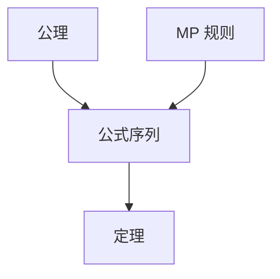

---
tags:
  - Logic
  - FormalSystem
  - 基本原理
title: Formal Systems
created: 2026-05-20
---
[[Propositional Logic]]
[[First-Order Logic]]
[[Modal Logic]]
[[克里普克模态语义递归定义]]
# 形式系统基础

> [!note] 定义
> 形式系统由**形式语言**（符号集与形成规则）、**公理**和**推理规则**构成，推导出所有**定理**。

## Hilbert 系统

经典命题逻辑的 Hilbert 公理（Łukasiewicz）：

$$
\begin{aligned}
&\text{Ax1: } A \to (B \to A)\\
&\text{Ax2: } (A \to (B \to C)) \to ((A \to B) \to (A \to C))\\
&\text{Ax3: } (\lnot B \to \lnot A) \to (A \to B)
\end{aligned}$$
**推理规则**——分离规则（Modus Ponens, MP）：

$$
\frac{A \quad A \to B}{B}
$$
## 证明

证明是公式的有限序列，每步为公理或由前述公式经 MP 得到。

## Sequent Calculus（矢列演算）
Gentzen 的 $\mathbf{LK}$ 用矢列 $\Gamma \vdash \Delta$ 代替公理推导，核心规则为**切规则**（Cut）：

$$
\frac{\Gamma \vdash \Delta, A \qquad A, \Gamma \vdash \Delta}{\Gamma \vdash \Delta}
$$

> [!tip] 切消除
> Gentzen Hauptsatz：任何含 Cut 的证明可转化为无 Cut 证明，获得**子公式性质**。

## 元定理
| 概念 | 含义 |
|------|------|
| **可靠性**（Soundness） | $\vdash A \Rightarrow \vDash A$（可证皆有效） |
| **完全性**（Completeness） | $\vDash A \Rightarrow \vdash A$（有效皆可证） |

> [!warning] 注意
> 完全性对一阶逻辑成立（Gödel 1929），但对二阶及更高阶逻辑不成立。模态系统 S5 的完全性证明参见[[克里普克模态语义递归定义]]的相关讨论。
