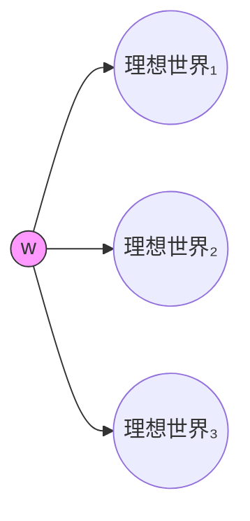

---
tags:
  - Kripke
  - ModalLogic
  - DeonticLogic
  - Ethics
title: Deontic Logic
created: 2026-05-20
---
[[Modal Logic]] [[Kripke]] [[克里普克模态语义递归定义]] [[System T]] [[Epistemic Logic]] [[Temporal Logic]]
# 道义逻辑

道义逻辑（Deontic Logic）将模态算子 $\Box$ 重新解释为"应当"（$O$），研究义务、允许、禁止等规范性概念的形式化。

### 道义算子

$$
\begin{aligned}
O\varphi &: \text{"应当 } \varphi\text{"（义务）} \\
P\varphi &: \text{"允许 } \varphi\text{"} \equiv \lnot O\lnot\varphi \\
F\varphi &: \text{"禁止 } \varphi\text{"} \equiv O\lnot\varphi
\end{aligned}
$$

> [!note] 定义
> 道义模型 $\langle W, R, V\rangle$，$wRw'$ 表示 $w'$ 是在道义上**理想的**世界（从 $w$ 的规范标准看）。语义递归见[[克里普克模态语义递归定义]]。

### 标准道义逻辑 (SDL)

SDL = 系统 K + **D公理**，语义要求 $R$ 是**序列的**（serial）：

$$
O\varphi \to P\varphi \quad \text{即} \quad O\varphi \to \lnot O\lnot\varphi
$$

D公理表达"义务蕴含允许"——应当做的事必须是可能的。序列性要求每个世界至少有一个道义理想世界。

> [!warning] 注意
> 道义逻辑**放弃** T 公理 $O\varphi\to\varphi$。义务不蕴含事实——应当做的事未必实际发生。这是[[System T]]的核心区别。

### 道义悖论

**罗斯悖论 (Ross's Paradox)**：
$$
O\varphi \vdash_{SDL} O(\varphi \lor \psi)
$$
从"应当寄信"推出"应当寄信或烧信"。直观荒谬但在 SDL 中有效——实质蕴涵怪论的道义版本。

**奇肖姆悖论 (Chisholm's Paradox)**（反义务悖论）：
$$
\begin{aligned}
&O\varphi \quad &\text{（应当帮助邻居）} \\
&O(\varphi \to \psi) \quad &\text{（如果帮助，应当告知）} \\
&\lnot\varphi \quad &\text{（未帮助）} \\
&\lnot\varphi \to O\lnot\psi \quad &\text{（若未帮助，应当不告知）}
\end{aligned}
$$
这四个命题各自合理，但在 SDL 中不一致——SDL 无法同时刻画义务与反义务（contrary-to-duty）。

> [!quote] 引用
> 道义悖论推动了对**反义务道义逻辑**（CTD Logic）和**义务道义逻辑**的发展，说明标准模态逻辑应用于规范领域时的深层局限。

### 与标准模态逻辑的关系

| 模态概念 | 道义版本 | Kripke条件 |
|---------|---------|-----------|
| $\Box$ 必然 | $O$ 应当 | 序列性 |
| $\Diamond$ 可能 | $P$ 允许 | — |
| System T 自反 | 被放弃 | $O\varphi\not\to\varphi$ |

更强系统（如 **KD45**）对应信念逻辑，在道义语境中用于刻画理想规范的多层结构。
