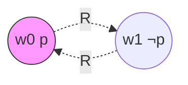

---
tags:
  - Kripke
  - ModalLogic
  - EpistemicLogic
  - Epistemology
title: Epistemic Logic
created: 2026-05-20
---
[[Modal Logic]] [[Kripke]] [[System T]] [[Completeness in S5]] [[Deontic Logic]] [[Temporal Logic]]
# 认识逻辑

认识逻辑（Epistemic Logic）将模态必然性算子 $\Box$ 重新解释为知识算子 $K$，研究知识的形式化性质与多主体认知互动。

### K 算子：$\Box$ 作为"知道"

$$
K_a\varphi \quad \text{含义：主体 } a \text{ 知道 } \varphi
$$

对应关系：$\Box\varphi \mapsto K\varphi$（知道），$\Diamond\varphi \mapsto \langle K\rangle\varphi$（认知可能）。

> [!note] 定义
> 认知模型 $\langle W, \{R_a\}_{a\in\mathcal{A}}, V\rangle$，其中 $R_a$ 是认知可达关系。$wR_a w'$ 表示从 $w$ 看，$w'$ 与 $a$ 的知识一致。

### 知识公理与 S5 框架

认识逻辑以 **S5** 为标准框架（参见[[Completeness in S5]]），其三公理对应知识的直观性质：

| S5公理 | 认识论解释 | Kripke条件 |
|--------|-----------|-----------|
| $K\varphi\to\varphi$ | 知识蕴含真理 | $R$ 自反 |
| $K\varphi\to KK\varphi$ | 正内省（KK论题） | $R$ 传递 |
| $\lnot K\varphi\to K\lnot K\varphi$ | 负内省 | $R$ 欧几里得 |

语义递归定义继承[[克里普克模态语义递归定义]]：

$$
w \models K_a\varphi \iff \forall w'\;(wR_a w' \Rightarrow w'\models \varphi)
$$

> [!example] 例子
> 设 $w_0$ 中 $p$ 真，$w_1$ 中 $p$ 假。若主体在 $w_0$ 中无法区分二者（$w_0Rw_1$），则 $Kp$ 在 $w_0$ 为假。

### KK 论题

$$
K\varphi \to KK\varphi
$$

KK论题（正内省公理）是认识逻辑最具争议的公理：

- **支持（Hintikka）**：知识要求有意识的认知访问，知则知己知。
- **反对（Williamson）**：存在"边缘知识"——边界案例中知而不知己知。

> [!warning] 注意
> KK论题在 **S5** 中有效，但在 **KT**（即[[System T]]的认知版本）中不必然成立。是否接受取决于"知识"的哲学立场。

### 共同知识

共同知识（Common Knowledge, $C_G\varphi$）是多主体认识的核心概念：

$$
C_G\varphi := \bigwedge_{n=1}^{\infty} E_G^n\varphi, \quad E_G\varphi := \bigwedge_{a\in G} K_a\varphi
$$

$C_G\varphi$ 意味着"人人皆知且人人皆知人人之皆知……"的无限迭代。

> [!quote] 引用
> Aumann 证明：理性主体的共同知识是博弈中达成一致行动（agreeing to disagree）的充分条件。

### 从知识到信念

放弃 T 公理 $K\varphi\to\varphi$ 即从知识过渡到信念逻辑（**KD45**）：
- 信念不需真，只需**一致**（$B\varphi \to \lnot B\lnot\varphi$）
- 可达关系 $R$ 满足序列性、传递性、欧几里得性
- 这体现了[[System T]]中"必然性蕴含现实性"在认知语境下的弱化
