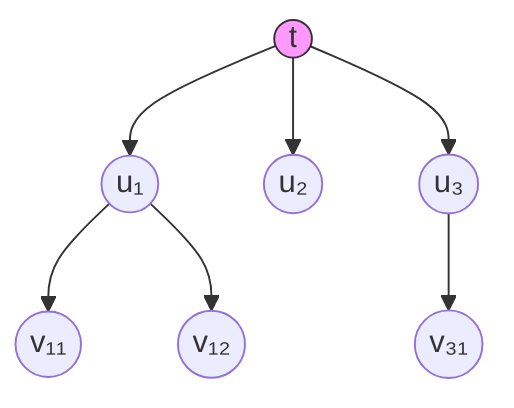

---
tags:
  - Kripke
  - ModalLogic
  - TemporalLogic
  - PhilosophyOfTime
title: Temporal Logic
created: 2026-05-20
---
[[Modal Logic]] [[Kripke]] [[克里普克模态语义递归定义]] [[Epistemic Logic]] [[Deontic Logic]]
# 时态逻辑

时态逻辑（Temporal Logic）将模态算子解释为时间性概念，研究命题真值随时间的变化。

### 时态算子

$$
\begin{aligned}
G\varphi &: \text{将来总是 } \varphi \\
F\varphi &: \text{将来某个时刻 } \varphi \equiv \lnot G\lnot\varphi \\
H\varphi &: \text{过去总是 } \varphi \\
P\varphi &: \text{过去某个时刻 } \varphi \equiv \lnot H\lnot\varphi
\end{aligned}
$$

> [!note] 定义
> 时态模型 $\langle T, <, V\rangle$，$T$ 为时间点集，$<$ 为早于关系。$tRu$ 即 $t<u$（指向未来）。

### 克里普克语义的时态化

$$
t \models G\varphi \iff \forall u > t,\; u \models \varphi
$$

时态逻辑是模态逻辑的**多关系推广**：可达关系 $R$ 被具体化为时间序 $<$，沿此方向量化的算子即为时态算子。这与[[克里普克模态语义递归定义]]的模式完全一致。

**基本公理**（对应时间序的反自反与传递性）：
$$
\begin{aligned}
G(\varphi\to\psi) &\to (G\varphi\to G\psi) &\text{（K 公理）} \\
\varphi &\to GP\varphi &\text{（过去-将来镜像）} \\
G\varphi &\to GG\varphi &\text{（传递性：4 公理）}
\end{aligned}
$$

### 线性时间与分支时间

**线性时间（Linear Time）**：每时刻有唯一未来，时间如单线展开。
$$
\forall t\,\forall u\,\forall v\;(t<u \land t<v \to u<v \lor u=v \lor v<u)
$$

**分支时间（Branching Time）**：每时刻有多个可能未来，时间如树状分枝。
$$
\forall t\,\forall u\,\forall v\;(u<t \land v<t \to u<v \lor u=v \lor v<u)
$$
过去线性唯一，未来分支发散。

> [!example] 例子
> 分支时间刻画"自由意志"：$t$ 时刻的决策面对多个可能未来 $u_1,u_2,u_3$，$Gp$ 仅在 $p$ 在所有分支中真时为真。

### LTL 基础

**线性时序逻辑 (LTL)** 在线性时间上扩展，算子包括：

$$
\begin{aligned}
X\varphi &: \text{下一时刻 } \varphi \\
\varphi U\psi &: \varphi \text{ 直到 } \psi
\end{aligned}
$$

LTL 公式的递归定义：
$$
\begin{aligned}
G\varphi &\equiv \varphi \land XG\varphi \\
F\varphi &\equiv \top U \varphi
\end{aligned}
$$

> [!warning] 注意
> 时态逻辑的"必然性"仅约束**时间方向**，而非所有逻辑可能世界。这与[[System T]]中 $\Box$ 的"相对必然性"一脉相承——必然性总相对于特定的可达关系。

### 应用领域
- **计算机科学**：LTL 模型检验（Model Checking）验证程序时序属性
- **哲学**：McTaggart 时间 A/B 系列的形式化
- **语言学**：Reichenbach 时态理论的形式语义基础
