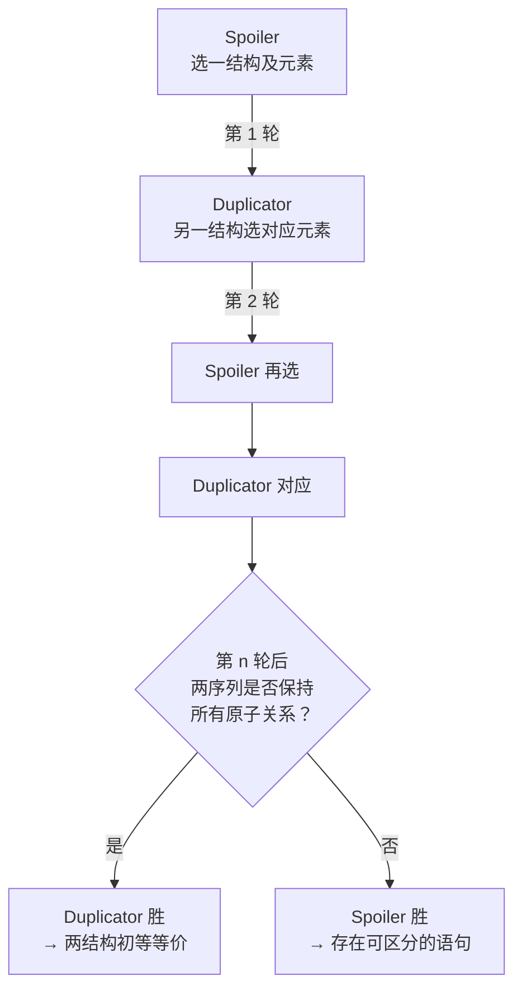

---
tags:
  - ModelTheory
  - ElementaryEquivalence
  - Logic
title: Elementary Equivalence
created: 2026-05-20
---

[[Model Theory]]
[[First-Order Logic]]
[[Completeness in S5]]
[[克里普克模态语义递归定义]]

# Elementary Equivalence

> [!note] 定义
> 两 $\sigma$-结构 $\mathcal{M}$ 与 $\mathcal{N}$ 称为**初等等价**（记作 $\mathcal{M} \equiv \mathcal{N}$），若对任意 $\sigma$-语句 $\varphi$，
> $$\mathcal{M} \models \varphi \iff \mathcal{N} \models \varphi.$$
> 即二者满足完全相同的 $\sigma$-理论 $\mathrm{Th}(\mathcal{M}) = \mathrm{Th}(\mathcal{N})$。

## Isomorphism vs. Elementary Equivalence

- **同构** $\mathcal{M} \cong \mathcal{N}$ 必然推出 $\mathcal{M} \equiv \mathcal{N}$，但逆不成立
- 同构要求结构与解释之间存在一一对应；$\equiv$ 只要求在一阶语句层面不可区分

> [!example] 例子
> $(\mathbb{Q}, <) \equiv (\mathbb{R}, <)$。二者都是**稠密线性无端点全序**（DLO）的模型。DLO 理论是 $\aleph_0$-范畴的（所有可数模型同构于 $\mathbb{Q}$），因而是完备的，故任意 DLO 模型间均初等等价。但 $\mathbb{Q}$ 与 $\mathbb{R}$ 不同构（基数不同）。

## Back-and-Forth Method

**往返法**用于证明可数结构的 $\omega$-同构性，亦为 EF 博弈策略的基础：

1. 枚举 $\mathbb{Q} = \{q_0, q_1, \dots\}$ 及 $\mathbb{R}$ 的可数稠密子集 $\{r_0, r_1, \dots\}$
2. 构造部分同构链 $f_0 \subseteq f_1 \subseteq \dots$：
   - **Forth**（偶数步）：取最小未映射 $q_i$，在 $\mathbb{R}$ 中选保持序的对应元素
   - **Back**（奇数步）：取最小未映射 $r_i$，在 $\mathbb{Q}$ 中选保持序的对应元素

可数 DLO 的 $\aleph_0$-范畴性经由往返法直接建立。

## Ehrenfeucht-Fraisse Games

EF 游戏给出初等等价的**博弈论刻画**。设两结构 $\mathcal{M}, \mathcal{N}$，游戏进行 $n$ 轮：

> [!theorem] 定理
> $\mathcal{M} \equiv_n \mathcal{N}$（量词秩 $\le n$ 的语句不可区分）当且仅当 Duplicator 在 $n$ 轮 EF 游戏中有必胜策略。因此，$\mathcal{M} \equiv \mathcal{N}$ 当且仅当对所有 $n$，Duplicator 在 $n$ 轮游戏中皆有必胜策略。

> [!warning] 注意
> 与[[Completeness in S5]]的联系：完全性定理断言语法 $\vdash$ 与语义 $\models$ 的**对齐**；而初等等价 $\equiv$ 是两结构在语义层面的**对齐**。前者是语形-语义桥梁，后者是结构-结构桥梁。在模态逻辑中，若两个 Kripke 模型满足相同的模态公式集，称它们**模态等价**——这正是模态逻辑版本的初等等价。
