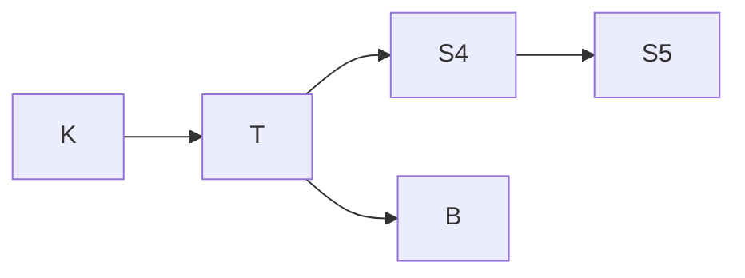

# Modal Logic - Axiom Systems

> [!abstract] 概述
> **正规模态逻辑公理系统**从 $\mathbf{K}$ 开始，通过添加不同的公理模式（$\mathbf{T}$、$\mathbf{D}$、$\mathbf{B}$、$\mathbf{4}$、$\mathbf{5}$）定义不同的逻辑系统（$\mathbf{T}$、$\mathbf{S4}$、$\mathbf{S5}$ 等）。不同公理系统对应不同的可达关系性质。模态坍塌（[[Modal Logic - Modal Collapse]]）描述了一类极端情况，其中公理系统过强，导致模态区分消失。

## 公理系统谱系

## 相关概念

- [[Modal Logic - Kripke Semantics|克里普克语义学]]
- [[Modal Logic - Modal Collapse|模态坍塌]]
