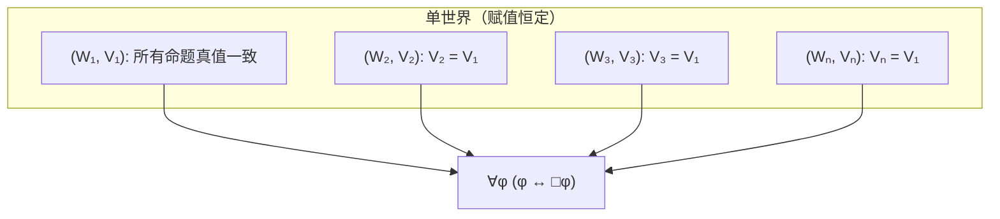
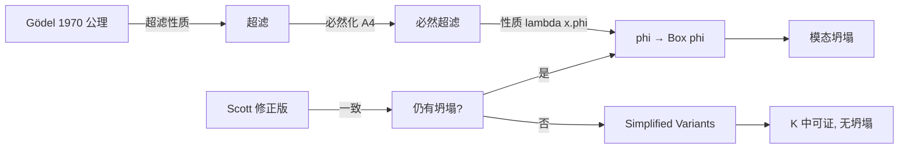

# Modal Logic - Modal Collapse

> [!abstract] 概述
> **模态坍塌**指一组模态公理迫使模态区分消除，使得 $\Box$ 和 $\Diamond$ 成为真值函数性算子。其核心特征是 $\varphi \to \Box\varphi$ 对所有 $\varphi$ 可证——每个真理都是必然真理，每个假命题都是必然假。这在 $\text{Gödel}$ 模态本体论论证中是关键的归谬结果。

## 形式定义

模态坍塌是指模态逻辑验证以下模式之一（它们相互等价）：

$$
\begin{aligned}
\text{(MC1)} &\quad \varphi \to \Box\varphi &\text{（若真则必然真）} \\
\text{(MC2)} &\quad \Diamond\varphi \to \Box\varphi &\text{（若可能则必然真）} \\
\text{(MC3)} &\quad \Box\varphi \leftrightarrow \varphi \;\land\; \Diamond\varphi \leftrightarrow \varphi &\text{（模态与真相重合）}
\end{aligned}
$$

当 (MC1)–(MC3) 成立时，所有真值在所有可能世界中一致，模态算子完全冗余。

## 等价条件

在正规模态逻辑 $\mathbf{K}$ 中，以下条件两两等价：

| 编号 | 条件 | 含义 |
|------|------|------|
| (i) | $\varphi \to \Box\varphi$ | 必然性概括 |
| (ii) | $\Diamond\varphi \to \Box\varphi$ | 可能即必然 |
| (iii) | $\Box\varphi \leftrightarrow \varphi$ | 必然等价于真 |
| (iv) | $\Diamond\varphi \leftrightarrow \varphi$ | 可能等价于真 |
| (v) | $\forall w\forall v(wRv) \land \forall p\forall w\forall v (V(p,w)=V(p,v))$ | 关系普遍 + 赋值恒定 |

**证明要点**：
- (i)→(ii)：在 $\varphi$ 中代入 $\Diamond\varphi$，由模态逻辑 $\mathbf{K}$ 性质可得。
- (ii)→(i)：在 (ii) 中以 $\lnot\varphi$ 代入 $\varphi$，取逆否得 $\Box\varphi \to \varphi$，再与 (i) 组合。

## 可能世界语义学解释

在克里普克语义学 $\langle W, R \rangle$ 中：

- $\Box\varphi$ 在 $w$ 真 $\iff$ 对所有满足 $wRv$ 的 $v$，$\varphi$ 在 $v$ 真
- $\Diamond\varphi$ 在 $w$ 真 $\iff$ 存在某个满足 $wRv$ 的 $v$，$\varphi$ 在 $v$ 真

模态坍塌要求：

1. **$R$ 是普遍关系**：$\forall w\forall v(wRv)$，即每个世界可达每个世界。
2. **原子公式赋值恒定**：所有世界对命题变元的真值赋值一致。

此时 $\langle W, R \rangle$ 退化为**单世界框架**——所有世界在原子公式的真值上完全一致，可能世界结构变成纯形式的冗余：

> [!warning] S5 ≠ 模态坍塌
> S5（等价关系框架）允许不同世界真值不同——$\Diamond\varphi \land \Box\lnot\varphi$ 仍可满足。模态坍塌远比 S5 强。

## Gödel 本体论论证中的模态坍塌

> [!note] Gödel 本体论论证 (1970)
> Gödel 用模态高阶逻辑构造了一个关于神的存在的本体论证明，公理涉及"正性质"($\mathcal{P}$)。

### 关键公理

| 公理 | 内容 |
|------|------|
| A1 | $\mathcal{P}(\varphi) \land \Box\forall x(\varphi(x) \to \psi(x)) \to \mathcal{P}(\psi)$（正性质在必然蕴涵下封闭） |
| A2 | $\mathcal{P}(\lnot\varphi) \leftrightarrow \lnot\mathcal{P}(\varphi)$（正性质的否定即非正性质） |
| A3 | $\mathcal{P}(G)$，$G(x)$ 意为"$x$ 是神样的" |
| A4 | $\mathcal{P}(\varphi) \to \Box\mathcal{P}(\varphi)$（正性质必然） |
| A5 | $\mathcal{P}(\text{NE})$，NE 意为"本质必然存在" |

### 坍塌的推导（Sobel 1987）

**步骤 1：超滤性质**。由 A1 + A2 可得正性质构成一个**超滤**：

$$
\forall\varphi(\mathcal{P}(\varphi) \lor \mathcal{P}(\lnot\varphi))
$$

**步骤 2：必然化超滤**。结合 A4：

$$
\forall\varphi(\Box\mathcal{P}(\varphi) \lor \Box\mathcal{P}(\lnot\varphi))
$$

**步骤 3：对任意命题 $\varphi$，考虑性质 $\lambda x.\varphi$**（所有个体使 $\varphi$ 为真）。由步骤 2 得 $\Box\mathcal{P}(\lambda x.\varphi)$ 或 $\Box\mathcal{P}(\lnot\lambda x.\varphi)$。

**步骤 4**：神样个体 $g$ 具有所有正性质，配合神样本质的刻画，可得 $\varphi \to \Box\varphi$。

**步骤 5**：因此对所有 $\varphi$，$\varphi \to \Box\varphi$ 成立——**模态坍塌**。

### 重要性

模态坍塌在此语境下是致命的：

| 问题 | 说明 |
|------|------|
| **过度证明** | 神必然存在不再是特例，而是普遍坍塌的推论——"一切必然"与有神论的神的自由创造意志冲突 |
| **取消偶然性** | 自由意志、物理定律、历史事件皆被重新归类为必然 |
| **归谬论证** | 公理集不自洽——不是证明了神存在，而是证明了公理过强 |
| **平凡化** | A4（正性质必然）在坍塌下不增加任何信息 |

### 形式验证

Benzmüller 和 Woltzenlogel-Paleo (2014) 使用 **Leo-II** 定理证明器：

- 自动发现 **Gödel 原始公理在 KB 中不一致**
- 验证模态坍塌在 **Scott 修正版**（本质定义增加合取项，恢复一致性）中仍然成立
- 全自动推导可由 Isabelle/HOL 配合 Sledgehammer 完成

## 避免模态坍塌的策略

历史上提出了多种修正：

| 方案 | 修改 | 效果 | 验证 |
|------|------|------|------|
| **Anderson (1990)** | 削弱 A1，限制正性质封闭范围 | 避免坍塌 | 手动 |
| **Hájek (1996, 2002)** | 限制正性质范围，避免超滤性质 | 避免坍塌，部分不完整 | 手动 |
| **Benzmüller & Fuenmayor (2020)** | 以超滤公理 U1 替换 A4、A5 | 在 **K** 中可证，**无坍塌** | **Leo-II, Isabelle** |
| **SimpleVariantHF (2020)** | 以 $\mathcal{G}$ 的主超滤替代正性质理论 | 一致，无坍塌，与多神论相容 | **Isabelle/Nitpick** |

> [!tip] 关键洞见
> Benzmüller & Fuenmayor (2020) 证明：只要**滤子性质**（对合取和超集封闭）就足够了，不需要超滤性质。在模态逻辑 $\mathbf{K}$ 中即可成立，且**不产生模态坍塌**。

## 相关概念

- [[Modal Logic - Kripke Semantics|克里普克语义学]]
- [[Modal Logic - Axiom Systems|模态逻辑公理系统]]
- [[Philosophy - Ontological Argument|本体论论证]]
- [[Modal Logic - Possible Worlds|可能世界语义学]]

## 参考文献

1. Sobel, J. H. (1987). Gödel's Ontological Argument. In *On Being and Saying: Essays for Richard Cartwright*.
2. Benzmüller, C. & Woltzenlogel-Paleo, B. (2014). Automating Gödel's Ontological Proof. *Nature*, 4–5.
3. Benzmüller, C. & Fuenmayor, D. (2020). Computationally Explored Variants of Gödel's Ontological Argument. In *Automated Reasoning* (IJCAR).
4. Anderson, C. A. (1990). Some Emendations of Gödel's Ontological Proof. *Faith and Philosophy*, 7(3).
5. Hájek, P. (2002). A New Small Emendation of Gödel's Ontological Proof. *Studia Logica*, 71(2).
