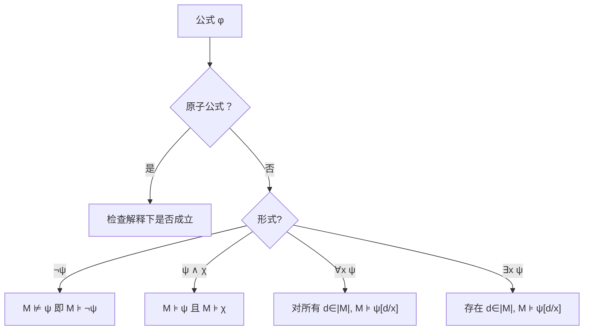

---
tags:
  - ModelTheory
  - Logic
title: Model Theory
created: 2026-05-20
---

[[First-Order Logic]]
[[Formal Systems]]
[[克里普克模态语义递归定义]]
[[Completeness in S5]]
[[Elementary Equivalence]]

# Model Theory

> [!note] 定义
> 模型论研究形式语言与数学结构之间的关系：一个**理论**的**模型**是使该理论所有语句为真的结构。模型论可看作"有限制条件的泛代数"。

## Signature / Language

**签名**（signature）$\sigma$ 是以下符号的集合，每个附有元数（arity）：

- **关系符号** $R_i$，元数 $n_i$
- **函数符号** $f_j$，元数 $m_j$
- **常元符号** $c_k$

$\sigma$-语言即由此类符号按一阶语法生成的全部公式。

## L-structure

$\sigma$**-结构** $\mathcal{M} = \langle |\mathcal{M}|, \mathcal{I} \rangle$：

- $|\mathcal{M}|$：**论域**（非空集合），也称 universe
- $\mathcal{I}$：**解释**，将关系符映为 $|\mathcal{M}|$ 上的关系，函数符映为运算，常元映为元素

> [!example] 例子
> 取 $\sigma = \{+, \times, 0, 1, <\}$，$(\mathbb{R}, +, \times, 0, 1, <)$ 是一个 $\sigma$-结构。

## Satisfaction Relation

$\mathcal{M} \models \varphi$ 读作"$\mathcal{M}$ 满足 $\varphi$"或"$\varphi$ 在 $\mathcal{M}$ 中真"，递归定义如下：

对模态逻辑的推广：[[克里普克模态语义递归定义]]中的 $w \models \Box A$ 正是此递归在 Kripke 框架上的特例——将可能世界视为"状态"，可达关系视为二元谓词。

## Theory and Models

- **语句**（sentence）：无自由变元的公式
- **理论** $T$：语句集，**模型** $\mathcal{M} \models T$ 即满足所有语句的结构
- $\mathrm{Mod}(T)$：$T$ 的全体模型构成的类

> [!theorem] 定理
> **紧致性定理（Compactness）**
> 若 $T$ 的每个有限子集都有模型，则 $T$ 有模型。
>
> *证明概览*：由 Gödel 完全性定理，$T$ 无模型 $\Rightarrow$ $T$ 不一致（$\vdash \bot$）$\Rightarrow$ 存在有限 $\Delta \subseteq T$ 使得 $\Delta \vdash \bot$ $\Rightarrow$ $\Delta$ 无模型。正因此，紧致性等价于"证明长度有限"这一事实的语义表现。

### 应用

- **非标准算术模型**：在 $\text{Th}(\mathbb{N})$ 中添常元 $c$ 与公理 $c > n$（$n\in\mathbb{N}$）。任一有限子集仅涉及有限多个 $n$，故有模型。紧致性保证存在含无穷大数的非标准模型。
- **图 $k$-着色**：若图的每个有限子图均可 $k$-着色，则全图可 $k$-着色（将着色条件编码为一阶语句）。

> [!theorem] 定理
> **Löwenheim-Skolem 定理**
> - **向下**：若 $\mathcal{L}$ 可数且 $T$ 有无限模型，则 $T$ 有任意基数 $\kappa \ge \aleph_0$ 的模型
> - **向上**：若 $T$ 有无限模型，则 $T$ 有任意更大基数的模型
>
> *直观*：一阶逻辑无法固定模型的基数。"Skolem 悖论"即源于此——ZFC 有可数模型，尽管 ZFC 内可证明存在不可数集。

> [!warning] 注意
> 模型论与[[First-Order Logic]]密不可分：一阶语言是模型论的基本载体。而[[克里普克模态语义递归定义]]的 Kripke 语义 $\langle W,R,V \rangle$ 本质上就是一个 $\sigma$-结构（$R$ 为二元关系，$V$ 为一组一元谓词）。[[Completeness in S5]] 中的语义表构造法则是在构造模型的显式表示。
