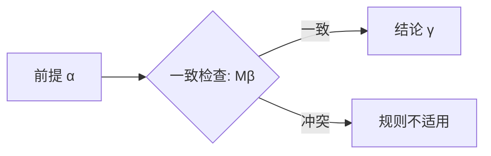

---
tags:
  - NonMonotonicLogic
  - DefaultLogic
  - NonClassicalLogic
title: Non-Monotonic Logic
created: 2026-05-20
---
[[Paraconsistent & Many-Valued Logic]]
[[Substructural & Relevance Logic]]
[[First-Order Logic]]
[[Propositional Logic]]
[[Intuitionistic Logic]]
[[Modal Logic]]

# Non-Monotonic Logic

> [!note] 定义
> **非单调逻辑**（Non-Monotonic Logic）允许新信息撤回已有结论。经典逻辑的单调性在此不成立。

## 单调性 vs 非单调性

[[First-Order Logic]] 是单调的：$\Gamma \vdash \varphi \;\Rightarrow\; \Gamma \cup \Delta \vdash \varphi$。前提增加，结论只增不减。

日常推理是**可废止的**（defeasible）：鸟通常会飞，但企鹅不会。若已知鸟(Tweety)，合理推出会飞(Tweety)；若后来知道企鹅(Tweety)，旧结论被撤回。这在单调逻辑中不可表达——强行加入 $∀x(\text{Bird}(x) → \text{Flies}(x))$ 与 $\text{Penguin(Tweety)}$ 直接矛盾。

## Default Logic（Reiter）

**默认规则**形式：$\displaystyle\frac{\alpha : M\beta}{\gamma}$

含义：若 $\alpha$ 成立，且 $\beta$ **与当前知识一致**（$M\beta$ 表示"可能 $\beta$"），则默认推出 $\gamma$。

经典例子——鸟与企鹅：

$$\frac{\text{Bird}(x) : M\text{Flies}(x)}{\text{Flies}(x)} \quad \frac{\text{Penguin}(x) : M\lnot\text{Flies}(x)}{\lnot\text{Flies}(x)}$$

已知 $\text{Penguin(Tweety)}$ 时后一条规则优先，得出 $\lnot\text{Flies(Tweety)}$。

> [!example] 例子
> 仅知 Bird(Tweety)：默认推出 Flies(Tweety)。加入 Penguin(Tweety) 后，Flies(Tweety) 被撤回——结论集非单调收缩。

## 扩展（Extension）

默认理论的**扩展**是满足封闭性与无矛盾性的极大信念集。一个理论可有零个、一个或多个扩展。

> [!warning] 注意
> 非单调逻辑还包括**限定推理**（Circumscription, McCarthy）和**自认知逻辑**（Autoepistemic Logic, Moore）。$M\beta$ 的一致性检查常借助[[Modal Logic]]的 $\Diamond$ 算子解读。非单调性与[[Intuitionistic Logic]]的知识增长不同——直觉主义语义虽是动态的，但知识只增不减（单调）。
