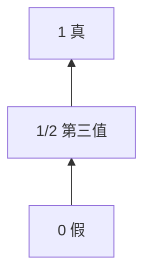

---
tags:
  - ParaconsistentLogic
  - ManyValuedLogic
  - NonClassicalLogic
title: Paraconsistent & Many-Valued Logic
created: 2026-05-20
---
[[Substructural & Relevance Logic]]
[[Non-Monotonic Logic]]
[[Propositional Logic]]
[[Intuitionistic Logic]]
[[First-Order Logic]]
[[Formal Systems]]

# Paraconsistent & Many-Valued Logic

> [!note] 定义
> 非经典逻辑的两个相关分支。**弗协调逻辑**（Paraconsistent Logic）容纳矛盾而不琐碎；**多值逻辑**（Many-Valued Logic）将真值域扩展到两个以上。

## 弗协调逻辑

经典逻辑中**爆炸原理**（Principle of Explosion）成立：$\lnot P, P \vdash Q$，矛盾推出一切。弗协调逻辑拒绝此原理，允许 $P \land \lnot P$ 为真而不导致系统无意义。

Priest 的 **Logic of Paradox (LP)** 引入第三真值 $\top$（既真又假），即**双面真理论**（Dialetheism）。LP 核心真值表：

| $P$ | $\lnot P$ | $P \land \lnot P$ |
|-----|-----------|-------------------|
| 1   | 0         | 0                 |
| 0   | 1         | 0                 |
| $\top$ | $\top$ | $\top$           |

有效推理在 LP 中定义为：前提为 1 时结论不能为 0（$\top$ 传递算有效）。

> [!example] 例子
> "这句话是假的"（说谎者悖论）在 LP 中赋 $\top$。$P \land \lnot P \vdash Q$ 无效，因为 $P$ 取 $\top$ 时 $Q$ 可为 0——矛盾被局部化。

## 多值逻辑

Łukasiewicz 三值逻辑 $L_3$：真值集合 $\{0,\;1/2,\;1\}$，$1/2$ 表"不定"。蕴涵定义为：

$$v(P \to Q) = \min(1,\;1 - v(P) + v(Q))$$

Kleene 强三值逻辑将 $1/2$ 视为"未知"，合取/析取与 $L_3$ 相同但蕴涵不同（$\to$ 在 Kleene 中不是真值函数完全的）。

> [!warning] 注意
> 多值逻辑挑战[[Propositional Logic]]的**双值原则**。区别于[[Intuitionistic Logic]]（拒斥排中律但不新增真值），多值逻辑直接扩展真值数目。LP 同时属于弗协调和多值两个家族。
