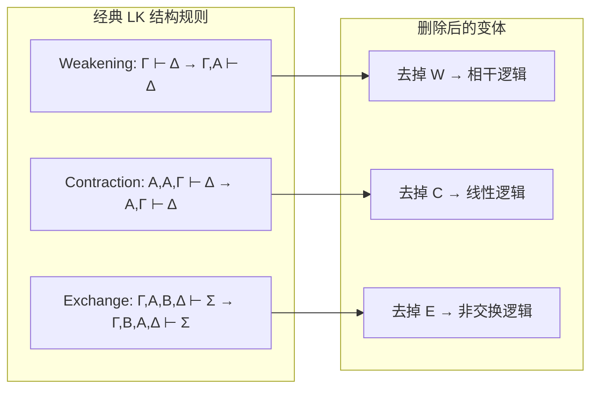

---
tags:
  - SubstructuralLogic
  - RelevanceLogic
  - NonClassicalLogic
title: Substructural & Relevance Logic
created: 2026-05-20
---
[[Paraconsistent & Many-Valued Logic]]
[[Non-Monotonic Logic]]
[[Formal Systems]]
[[Propositional Logic]]
[[Intuitionistic Logic]]
[[First-Order Logic]]

# Substructural & Relevance Logic

> [!note] 定义
> **子结构逻辑**（Substructural Logic）移除 sequent calculus 中的结构规则。**相干逻辑**（Relevance Logic）要求前提与结论间有实质关联。

## 结构规则（Structural Rules）

Gentzen 的 $\mathbf{LK}$（[[Formal Systems]]）有三类可被选择性地删除的结构规则：

- **Weakening（弱化）**：添加无关前提 — **Contraction（压缩）**：前提重复使用 — **Exchange（交换）**：前提重新排序

## 相干逻辑

相干逻辑要求 $\vdash A \to B$ 时 $A$ 与 $B$ **共享至少一个命题变元**（variable sharing condition）。这排除了经典逻辑中的"蕴涵悖论"。

经典有效但相干无效的例子：$P \to (Q \to P)$（Weakening 产物，$Q$ 无关），$P \land \lnot P \to Q$（$Q$ 不出现于前提）

> [!example] 例子
> $A \land B \to A$ 在相干逻辑中成立（共享 $A$），而 $A \to (B \to A)$ 不成立——$B$ 的出现与 $A$ 无关，是 Weakening 的语法产物。

## 与其他非经典逻辑的关系

线性逻辑（无 Contraction）限制资源使用，适合计算语义（线性逻辑的蕴含是"消耗性"的）。非交换逻辑用于范畴语法。全部结构规则都去掉则得到**交换线性逻辑**。

> [!warning] 注意
> 子结构逻辑与[[Intuitionistic Logic]]有交集：直觉主义可视为限制右手边至多一个公式。相干逻辑常与[[Paraconsistent & Many-Valued Logic]]联合，因为二者都排斥经典逻辑的某些"有效但反直觉"推理。
