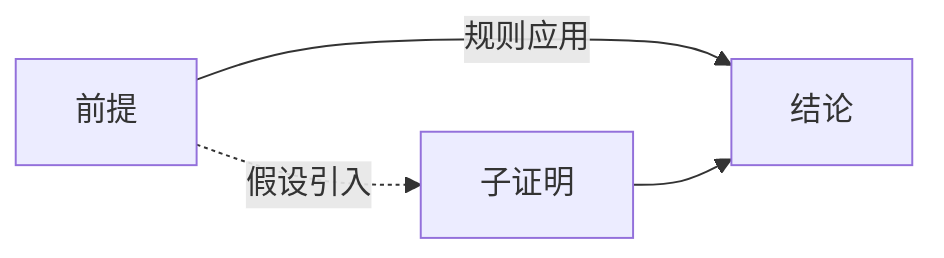

---
tags:
  - Logic
  - PropositionalLogic
  - 基本原理
title: Propositional Logic
created: 2026-05-20
---
[[First-Order Logic]]
[[Formal Systems]]
[[System T]]
[[克里普克模态语义递归定义]]
# 命题逻辑基础

> [!note] 定义
> 命题逻辑研究原子命题经连接词构成的复合命题，不分析命题内部结构。

## 连接词与真值表

| 连接词 | 名称 | 真值条件 |
|--------|------|----------|
| $\lnot P$ | 否定 | $P$ 为假 |
| $P\land Q$ | 合取 | 两者皆真 |
| $P\lor Q$ | 析取 | 至少一真 |
| $P\to Q$ | 蕴涵 | $P$ 假或 $Q$ 真 |
| $P\leftrightarrow Q$ | 等值 | 同真同假 |

真值表（$P\to Q$ 示例）：

$$
\begin{array}{cc|c}
P & Q & P\to Q \\\hline
T & T & T \\
T & F & F \\
F & T & T \\
F & F & T
\end{array}
$$

> [!tip] 实质蕴涵
> $P\to Q$ 等价于 $\lnot P\lor Q$，仅在 $P$ 真 $Q$ 假时为假。

## 语义分类

- **重言式**（Tautology）：所有赋值下为真，如 $P\lor\lnot P$
- **矛盾式**（Contradiction）：所有赋值下为假，如 $P\land\lnot P$
- **偶真式**（Contingency）：部分赋值下为真

## 自然推理

核心规则：$\land I/E$、$\lor I/E$、$\to I$（蕴涵引入）、$\to E$（MP）、$\lnot I$（归谬）。

> [!warning] 注意
> 命题逻辑的可靠性与完全性由 Post 于 1921 年证明。对比公理系统见[[Formal Systems]]，其语义在模态逻辑中扩展见[[克里普克模态语义递归定义]]。
