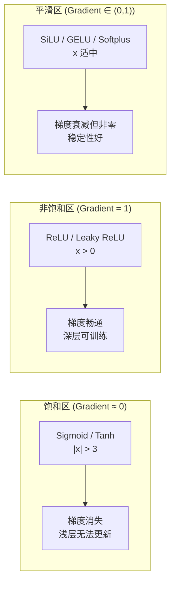

---
tags:
  - MachineLearning
  - DeepLearning
  - ActivationFunction
  - NeuralNetwork
  - 深度学习/激活函数
  - 概念性
title: Activation Functions
created: 2026-06-01
---

# Activation Functions — Non-Linear Transformations in Neural Networks

> [!abstract] Overview
> 激活函数是神经网络中引入非线性的核心组件。没有激活函数，多层网络将退化为线性变换，丧失表达能力。不同的激活函数在梯度性质、计算效率和收敛行为上存在显著差异。本文梳理主流激活函数的数学形式、梯度特性和适用场景，并以 CTM 中的 SiLU 和 Softplus 使用为例说明设计选择。

Related: [[Neural Network]] | [[Mamba]] | [[CTM - Mamba and S6 SSM]] | [[Gradient Descent and Optimizers]] | [[Vanilla RNN]] | [[LSTM]]

---

## 1. Activation Functions — Core Principles

### What & Why

激活函数的作用是在神经元的加权求和后施加一个**非线性变换（nonlinear transformation）**：

$$h = \sigma(Wx + b)$$

其中 $\sigma(\cdot)$ 是激活函数。没有 $\sigma$，多层网络的组合仍然是线性变换，深度便失去了意义。

激活函数的选择直接影响三个关键方面：

- **梯度传播**：导数的大小决定了梯度能否有效传递到浅层
- **表达能力**：不同的 $\sigma$ 产生不同的决策边界几何
- **计算效率**：指数运算、分段线性等不同形式影响训练吞吐

### Mathematical Forms & Properties

**Sigmoid**

$$\sigma(x) = \frac{1}{1 + e^{-x}}$$

将任意实数映射到 $(0, 1)$。历史上广泛用于二分类输出层和门控机制。

| 性质 | 描述 |
|------|------|
| 输出范围 | $(0, 1)$，天然适合概率解释 |
| 导数 | $\sigma'(x) = \sigma(x)(1 - \sigma(x))$，最大值为 $0.25$ |
| 对称性 | 非零中心（输出恒正），导致梯度更新表现为 zigzag |
| 饱和区 | $|x| > 3$ 时导数趋近于 0，梯度几乎消失 |

**Tanh**

$$\tanh(x) = \frac{e^x - e^{-x}}{e^x + e^{-x}}$$

将输入映射到 $(-1, 1)$，零中心对称。

| 性质 | 描述 |
|------|------|
| 输出范围 | $(-1, 1)$，零中心 |
| 导数 | $\tanh'(x) = 1 - \tanh^2(x)$，最大值为 $1.0$ |
| 饱和区 | 同 Sigmoid，$|x| > 3$ 梯度消失 |
| 优势 | 零中心输出缓解 zigzag 问题，梯度范围大 4 倍 |

**ReLU (Rectified Linear Unit)**

$$\text{ReLU}(x) = \max(0, x)$$

现代深度学习的默认选择。

| 性质 | 描述 |
|------|------|
| 输出范围 | $[0, \infty)$，非负 |
| 导数 | $x > 0$ 时为 $1$，$x \leq 0$ 时为 $0$ |
| 优势 | 计算简单、非饱和正区间、加速收敛 |
| 问题 | **Dying ReLU**：负区间梯度为 0，一旦进入永不恢复 |

**Leaky ReLU / PReLU**

$$\text{LeakyReLU}(x) = \max(\alpha x, x) \quad \alpha \in (0, 1)$$

通过保留负区间的小梯度解决 Dying ReLU 问题。

- $\alpha$ 固定（Leaky ReLU）或可学习（PReLU）
- 典型 $\alpha$ 值：$0.01$（Leaky ReLU）
- 负区间梯度非零，神经元有机会"复活"

**SiLU / Swish**

$$\text{SiLU}(x) = x \cdot \sigma(x) = \frac{x}{1 + e^{-x}}$$

由 Google 提出，是 Sigmoid 门控的变体。

| 性质 | 描述 |
|------|------|
| 输出范围 | 有下界无上界，$\approx [-0.28, \infty)$ |
| 形状 | 非单调函数，在 $x \approx -1.28$ 处有最小值 |
| 导数 | $\text{SiLU}'(x) = \sigma(x) + x \cdot \sigma(x)(1 - \sigma(x))$ |
| 优势 | 平滑、非单调、自门控特性，在深层网络中优于 ReLU |
| 应用 | Swin Transformer、Mamba、EfficientNet 等现代架构 |

**GELU (Gaussian Error Linear Unit)**

$$\text{GELU}(x) = x \cdot \Phi(x)$$

其中 $\Phi(x)$ 是标准正态分布的 CDF。常近似为：

$$\text{GELU}(x) \approx 0.5x\left(1 + \tanh\left(\sqrt{2/\pi}(x + 0.044715x^3)\right)\right)$$

| 性质 | 描述 |
|------|------|
| 输出范围 | 类似 SiLU，有下界无上界 |
| 形状 | 在 $x=0$ 附近类似 ReLU，但平滑过渡 |
| 应用 | BERT、GPT、ViT 等 Transformer 架构的标准选择 |
| 与 SiLU 对比 | 形状非常相似，GELU 更平滑，SiLU 计算稍快 |

**Softplus**

$$\text{Softplus}(x) = \ln(1 + e^x)$$

ReLU 的**平滑近似（smooth approximation）**，处处可导。

| 性质 | 描述 |
|------|------|
| 输出范围 | $(0, \infty)$ |
| 导数 | $\text{Softplus}'(x) = \sigma(x)$（即 Sigmoid）|
| 对比 ReLU | 渐进式趋近线性，而非 ReLU 的硬阈值 |
| 用途 | 参数化正数约束（如方差、时间尺度 $\Delta$）|

### Gradient Flow & Vanishing Gradient



**梯度消失（Vanishing Gradient）** 是指网络浅层接收到的梯度趋近于 0，导致参数几乎不更新。Sigmoid 和 Tanh 在饱和区梯度极低，链式法则下多层累积后迅速衰减到 0。ReLU 族在正区间梯度恒为 1，从根本上解决了梯度消失，但引入了 Dying ReLU 的新问题。

### Activation Function Comparison

| 函数 | 公式 | 输出范围 | 梯度特性 | 零中心 | 饱和性 | 计算开销 | 典型应用 |
|------|------|---------|---------|--------|--------|---------|---------|
| **Sigmoid** | $\frac{1}{1+e^{-x}}$ | $(0,1)$ | 最大 0.25，饱和消失 | 否 | 双侧饱和 | 中等 | 门控、二分类输出 |
| **Tanh** | $\frac{e^x - e^{-x}}{e^x + e^{-x}}$ | $(-1,1)$ | 最大 1.0，饱和消失 | 是 | 双侧饱和 | 中等 | RNN、MLP |
| **ReLU** | $\max(0,x)$ | $[0,\infty)$ | 正区间恒 1 | 否 | 单侧饱和 | **最低** | CNN、MLP 默认 |
| **Leaky ReLU** | $\max(\alpha x, x)$ | $(-\infty,\infty)$ | 负区间 $\alpha$，正区间 1 | 否 | 无饱和 | 最低 | 防止 Dying ReLU |
| **SiLU** | $x \cdot \sigma(x)$ | $[-0.28,\infty)$ | 平滑非单调 | 否 | 无饱和 | 中等 | SSM、Transformer |
| **GELU** | $x \cdot \Phi(x)$ | $[-0.17,\infty)$ | 平滑，类 SiLU | 否 | 无饱和 | 高（含 erf） | BERT、GPT、ViT |
| **Softplus** | $\ln(1+e^x)$ | $(0,\infty)$ | 处处为 Sigmoid | 否 | 无饱和 | 中等 | 正数参数化 |

### Activation Function Family Tree

```mermaid
flowchart TD
    Linear[Linear / Identity] --> SigmoidFamily[Sigmoid Family]
    Linear --> ReLUFamily[ReLU Family]
    
    SigmoidFamily --> Sigmoid
    SigmoidFamily --> Tanh[Tanh = 2×Sigmoid(2x) - 1]
    Sigmoid --> SiLU[SiLU = x × Sigmoid]
    Sigmoid --> Softplus[Softplus = ln(1+e^x)]
    SiLU --> GELU[GELU = x × Φ(x)]
    
    ReLUFamily --> ReLU
    ReLU --> LeakyReLU[Leaky / PReLU]
    ReLU --> ELU[ELU / SELU]
    ReLU --> ReLU6[ReLU6]
```

> [!note] Sigmoid 族的统一视角
> SiLU、Softplus、GELU 都可以视为 Sigmoid 门控的变体——它们在 $\sigma(x)$ 或 $\Phi(x)$ 上施加不同的变换，本质都是"输入 × 门控值"的模式。这个思路直接影响了现代 SSM 中的门控设计。

---

## 2. Case Study: CTM Implementation

### How CTM Applies These Principles

CTM（Cross-Temporal Model）在 MambaBlock 中使用了两种激活函数，各司其职：

| 激活函数 | CTM 中的角色 | 使用位置 | 设计动机 |
|---------|-------------|---------|---------|
| **SiLU** | 门控激活（Gating） | MambaBlock 内的门控分支 | 自门控特性，平滑非单调，适合 SSM 中的序列选择机制 |
| **Softplus** | 正数参数化 | Mamba 的 $\Delta$（时间尺度参数） | 确保 $\Delta > 0$，平滑可导，渐进线性 |

**SiLU 用于门控**：

在 Mamba 架构中，核心操作是输入通过两个分支——一个经 SiLU 激活的门控信号，另一个经 SSM 变换的特征表示——再进行逐元素相乘：

$$y = \underbrace{\text{SSM}(x)}_{\text{特征}} \odot \underbrace{\text{SiLU}(\text{Proj}(x))}_{\text{门控}}$$

SiLU 的非单调性在这里至关重要。在 $x < 0$ 的区间，SiLU 输出为负（而非 ReLU 的 0），这让门控信号可以携带"抑制"信息而非单纯的"关断"。SSM 中的选择性机制需要这种表达能力。

**Softplus 用于 $\Delta$ 参数化**：

Mamba 中的 $\Delta$ 是一个正的时间尺度参数，控制离散化步长：

$$\Delta = \text{Softplus}(\text{Linear}(x))$$

使用 Softplus 而非 ReLU 的原因：
- Softplus 处处可导，梯度更稳定
- Softplus 在 $x$ 接近 0 时渐进趋近 0 而非硬截断，允许 $\Delta$ 取非常小的正值
- 这避免了 ReLU 在 $x < 0$ 时输出恰好 0 导致 $\Delta = 0$ 的退化情况

```mermaid
flowchart LR
    subgraph MambaBlock["Mamba Block (CTM)"]
        Input[X] --> Branch1[SSM Path]
        Input --> Branch2[Gate Path]
        Branch2 --> SiLU[SiLU Activation]
        Branch1 --> Delta[Δ = Softplus(Proj(x))]
        Delta --> SSM[S6 SSM]
        SSM --> Multiply[⊙ Element-wise]
        SiLU --> Multiply
        Multiply --> Output[Y]
    end
```

> [!tip] 激活函数选择与架构耦合
> SiLU 和 Softplus 在 CTM 中的选择不是孤立的——它们与 Mamba 架构选择性机制的设计哲学深度耦合。这也解释了为什么 CTM 没有选择 GELU（Transformer 导向）或 ReLU（CNN 导向）。详见 [[CTM - Mamba and S6 SSM]]。

---

## 3. Key Takeaways

### When to Use Which Activation

| 网络类型 | 推荐激活 | 原因 |
|---------|---------|------|
| **CNN / MLP** | ReLU | 计算高效，正区间梯度畅通，足够表达能力 |
| **深层 CNN (>50 层)** | SiLU / GELU | 非饱和平滑梯度，避免 ReLU 的累计偏差 |
| **RNN / SSM** | SiLU / Tanh | SiLU 的自门控适合序列选择；Tanh 是传统 RNN 选择 |
| **门控机制** | Sigmoid / SiLU | 输出在 (0,1) 或 (-0.28, 0.5] 范围内，适合乘法门控 |
| **正数约束** | Softplus | 平滑正数参数化，不会退化到 0 |
| **二分类输出** | Sigmoid | 天然概率解释 |
| **多分类输出** | Softmax | 概率和为 1 |

### Common Pitfalls to Avoid

- **Sigmoid + 深层网络**：5 层以上 Sigmoid 几乎必然遇到梯度消失。除非门控作用，否则避免在隐藏层使用
- **ReLU 的 dying 问题**：学习率过大时，ReLU 神经元批量死亡。使用 Leaky ReLU 或 SiLU 作为替代，或配合梯度裁剪
- **激活函数与权重初始化不匹配**：ReLU 需要 He 初始化，Sigmoid/Tanh 需要 Xavier/Glorot 初始化。错误匹配导致梯度异常
- **SiLU 与 GELU 混用**：两者形状极为接近，在多数任务上表现差异很小。选择更简单或生态更成熟的那一个，不要同时使用
- **Softplus 输出爆炸**：Softplus 渐进线性，输入很大时输出也很大。在需要约束输出范围时，使用 Sigmoid + Scale 替代

### Related Concepts & Further Reading

- [[Neural Network]] — 激活函数在网络中的位置
- [[Mamba]] — SiLU 门控 + Softplus 参数化的完整案例
- [[Gradient Descent and Optimizers]] — 梯度消失/爆炸与优化器的配合
- [[Vanilla RNN]] — Tanh 主导的时代及其梯度问题
- [[CTM - Mamba and S6 SSM]] — CTM 中 SiLU 和 Softplus 的架构上下文
- Glorot & Bengio, *Understanding the difficulty of training deep feedforward neural networks* (2010) — Xavier Initialization
- Hendrycks & Gimpel, *Gaussian Error Linear Units (GELU)* (2016)
- Ramachandran et al., *Searching for Activation Functions* (2017) — Swish 搜索发现
