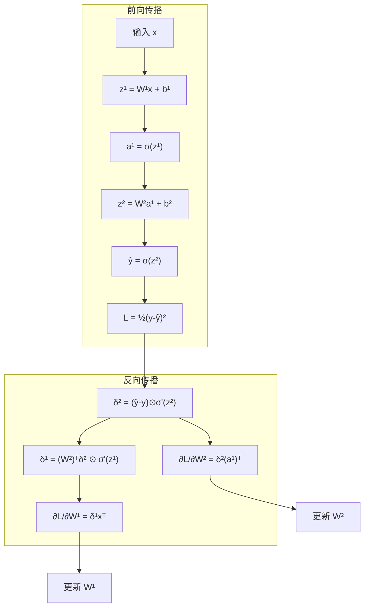
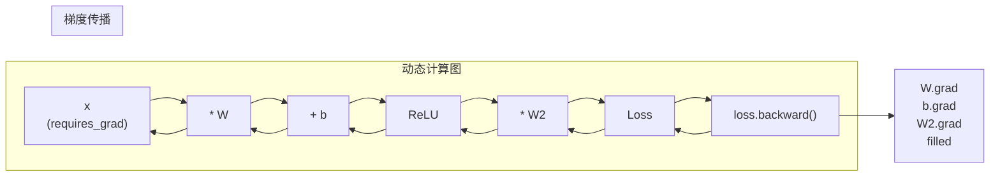
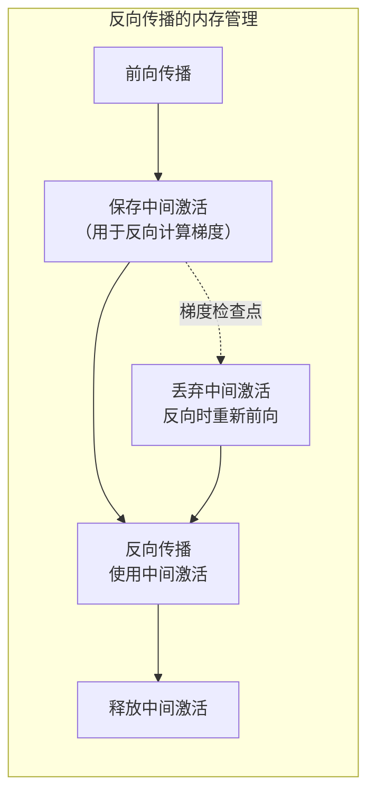

---
tags:
  - MachineLearning
  - DeepLearning
  - Calculus
  - Math
  - TrainingTechnique
  - 原理性
title: Backpropagation
created: 2026-06-01
---

# Backpropagation — Chain Rule, Computational Graphs, and Autograd

> [!abstract] Overview
> 反向传播是深度学习训练的数学引擎。它将链式法则从微积分课本带入神经网络的每一层，让梯度高效地流过数百万个参数。从手动推导到自动微分（Autograd），从计算图到梯度问题诊断，本文系统梳理反向传播的原理，并以 CTM 在 PyTorch Autograd 上的实际训练过程作为案例。

Related: [[Gradient Descent and Optimizers]] | [[Regularization]] | [[CTM - Training System]] | [[Neural Network]]

---

## 1. Backpropagation — Core Principles

### What & Why

深度学习模型动辄百万、千万参数。如何高效计算每个参数对最终损失的梯度？

**直觉**：如果直接对每个参数做一阶差分（数值微分），一个 $N$ 参数模型需要 $N+1$ 次前向传播，计算成本 $\mathcal{O}(N^2)$。反向传播利用链式法则，一次前向 + 一次反向，成本仅为 $\mathcal{O}(N)$。

**核心思想**：从输出层开始，逐层往回传递误差信号，每层的误差通过链式法则分解为其输出对权重的梯度。

$$\frac{\partial \mathcal{L}}{\partial w_{ij}^{(l)}} = \frac{\partial \mathcal{L}}{\partial h_j^{(l)}} \cdot \frac{\partial h_j^{(l)}}{\partial w_{ij}^{(l)}}$$

### Mathematical / Theoretical Foundation

**链式法则 (Chain Rule)**：复合函数的梯度等于外层梯度乘以内层梯度。

标量链式法则：
$$\frac{df(g(x))}{dx} = \frac{df}{dg} \cdot \frac{dg}{dx}$$

向量化的链式法则（全矩阵形式）：
$$\frac{\partial \mathcal{L}}{\partial W^{(l)}} = \frac{\partial \mathcal{L}}{\partial h^{(l)}} \cdot \frac{\partial h^{(l)}}{\partial W^{(l)}}$$

对于全连接层 $h^{(l)} = W^{(l)} a^{(l-1)} + b^{(l)}$，应用链式法则得到著名公式：

$$\frac{\partial \mathcal{L}}{\partial W^{(l)}} = \delta^{(l)} \cdot (a^{(l-1)})^\top$$

其中 $\delta^{(l)} = \frac{\partial \mathcal{L}}{\partial z^{(l)}}$ 是第 $l$ 层的误差项，$a^{(l-1)}$ 是前一层的激活输出。

> [!note] 向量化链式法则的关键
> 现代深度学习框架使用向量化计算——每次计算整个 batch 的梯度，而非逐样本。但这要求正确跟踪张量维度的变换。PyTorch 的 Autograd 系统自动处理这些维度变换，用户只需要调用 `.backward()`。

**计算图 (Computational Graph)**：反向传播的底层数据结构。每个张量操作被记录为计算图的一个节点：

```
x ──[Linear]──> z ──[ReLU]──> a ──[Linear]──> z' ──[Loss]──> L
                      ^                          ^
                      W1                         W2
```

前向传播建立图结构，反向传播沿图反向传播梯度。

**反向传播的分步推导**（以一个 2 层网络为例）：

步骤 1：前向传播
$$z^{(1)} = W^{(1)} x + b^{(1)}, \quad a^{(1)} = \sigma(z^{(1)})$$
$$z^{(2)} = W^{(2)} a^{(1)} + b^{(2)}, \quad \hat{y} = \sigma(z^{(2)})$$
$$\mathcal{L} = \frac{1}{2} (y - \hat{y})^2$$

步骤 2：输出层误差
$$\delta^{(2)} = \frac{\partial \mathcal{L}}{\partial z^{(2)}} = (\hat{y} - y) \odot \sigma'(z^{(2)})$$

步骤 3：隐藏层误差（链式法则从输出层传播回隐藏层）
$$\delta^{(1)} = \left( (W^{(2)})^\top \delta^{(2)} \right) \odot \sigma'(z^{(1)})$$

步骤 4：计算梯度
$$\frac{\partial \mathcal{L}}{\partial W^{(2)}} = \delta^{(2)} (a^{(1)})^\top, \quad \frac{\partial \mathcal{L}}{\partial W^{(1)}} = \delta^{(1)} x^\top$$



> [!tip] 感受反向传播的"反向"
> 注意 $\delta^{(1)}$ 的计算使用了 $(W^{(2)})^\top$——梯度在反向传播时"转置通过"了权重矩阵。这意味着前向传播中 $W$ 乘以输入，反向传播中 $W^\top$ 乘以误差。这种对称性让反向传播在计算和参数记忆上都非常优雅。

**Autograd（自动微分）**：深度学习的"隐形英雄"。用户无需手动推导梯度，框架自动完成：

| 框架 | Autograd 引擎 | 特点 |
|------|-------------|------|
| PyTorch | `torch.autograd` | 动态计算图（Define-by-Run），每次前向重新建图 |
| TensorFlow | `tf.GradientTape` | Eager 模式类似 PyTorch，也有静态图模式 |
| JAX | `jax.grad` | 函数式编程风格，不可变参数 |
| MXNet | `autograd` | 类似 PyTorch 的动态图 |

PyTorch Autograd 的关键机制：

```python
# 计算图自动构建
z1 = torch.mm(W1, x) + b1    # 节点记录：操作矩阵乘+加法
a1 = torch.relu(z1)           # 节点记录：激活函数
z2 = torch.mm(W2, a1) + b2
loss = F.mse_loss(z2, target)

# 反向传播（自动沿着计算图走链式法则）
loss.backward()               # 各张量的 .grad 属性被填充

# 优化器使用 .grad 更新参数
optimizer.step()
optimizer.zero_grad()         # 梯度清零，否则累积
```

**Autograd 的工作原理**：

1. 每次前向传播时，每个张量操作注册一个 `Function` 节点到计算图
2. 每个节点保存前向传播的输入/输出，以及 `backward` 方法
3. `.backward()` 从损失节点出发，拓扑序反向遍历计算图
4. 每个节点调用自己的 `backward` 方法，将梯度传播给前驱节点



**Vanishing / Exploding Gradients**：反向传播在实际应用中面临的核心问题。

当网络很深（或循环路径很长）时，梯度在反向传播过程中反复乘以权重矩阵。如果权重矩阵的范数小于 1，梯度指数级衰减（vanishing）；若大于 1，指数级增长（exploding）。

$$\frac{\partial \mathcal{L}}{\partial W^{(1)}} \approx (W^{(L)} \cdot W^{(L-1)} \cdots W^{(2)}) \cdot \text{误差项}$$

> [!warning] 梯度消失的实际表现
> 深层网络的浅层参数几乎不被更新——它们的梯度接近零。训练 loss 在前期快速下降后停滞：深层正在拟合数据，浅层却没有学到有效特征。sigmoid/tanh 激活函数加剧此问题，因为它们的导数在饱和区接近零。ReLU 和其变体是标准解决方案之一。

梯度问题的诊断和缓解：

| 梯度问题 | 表现 | 缓解方法 |
|---------|------|---------|
| **Vanishing** | 浅层参数梯度趋近 0，训练停滞 | ReLU / 残差连接 (ResNet) / Batch Normalization / 门控机制 (LSTM) |
| **Exploding** | 梯度值异常大，参数跳跃，loss 变成 NaN | 梯度裁剪 / 权重初始化 (Xavier/Kaiming) / 更小 LR |
| **梯度噪声大** | 单 batch 梯度不稳定，收敛波动大 | 增大 batch size / Momentum / 梯度累积 |

### Key Design Dimensions & Tradeoffs

| 设计维度 | 选项 | 取舍 |
|---------|------|------|
| **计算图类型** | 动态 (PyTorch) / 静态 (TF1) | 动态灵活易调试；静态优化好适合部署 |
| **梯度累积方式** | 每步清零 / 累积多步 | 累积等价于增大 batch；每步清零更实时 |
| **混合精度** | FP32 / FP16 / BF16 | FP16 加速但可能溢出；BF16 无溢出问题 |
| **梯度检查点** | 不保存中间张量 / 选择性保存 | 省内存但增加重计算成本 |
| **分布式梯度** | 同步 / 异步 All-Reduce | 同步准确但可能慢；异步快但梯度可能 stale |



---

## 2. Case Study: CTM Context

### How CTM Applies This

CTM 的模型训练完全依赖 PyTorch Autograd，并无自定义梯度或手动链式法则推导——这是现代深度学习项目的标准做法。但理解反向传播在 CTM 中的特殊考量仍有价值：

| 组件 | 反向传播相关考量 |
|------|----------------|
| **RecurrentCTM** | N 次迭代共享权重的结构，梯度通过 N 次循环反向传播，路径长度为 N × 序列长度 |
| **Mamba SSM** | SSM 的循环路径产生长程梯度传播，可能引发梯度不稳定 |
| **渐进式损失** | 损失分量的 $\lambda$ 影响各部分的梯度幅度，渐进式引入避免初期大梯度震荡 |
| **梯度裁剪** | `clip_grad_norm_` 防御 SSM 路径上的梯度爆炸 |
| **Walk-Forward** | 每个窗口独立执行反向传播，窗口间无梯度传递 |

**RecurrentCTM 的 Autograd 计算图**：

```
输入 x
  │
input_proj (仅首次)
  │
Causal Conv1d ────┐
  │               │
Mamba Block × N ──┤ (参数共享，循环 N 次)
  │               │
Bidirectional ────┘
  │
LayerNorm + Residual
  │
  └──→ 第 1 次迭代输出
        │
        ├──→ 输入下一次循环（共享参数）
        │
        └──→ 第 N 次输出 → 预测头 → 损失
```

每次循环中，Mamba 块、Causal Conv1d、Bidirectional 的参数被重复使用。梯度通过 N 条路径反向传播到同一组参数，自动求和——这正是 PyTorch Autograd 处理共享参数的机制。

```python
# 伪代码：RecurrentCTM 的前向（Autograd 自动处理反向）
def forward(self, x):
    h = self.input_proj(x)
    for i in range(self.num_iterations):
        h = self.mamba_block(h)             # 共享参数
        h = self.bidirectional_fusion(h)    # 共享参数
        h = self.layer_norm(h + residual)   # 独立（无参数共享）
    return self.prediction_head(h)
```

> [!note] 共享参数的 Autograd 行为
> 当同一参数在前向传播中使用多次时，PyTorch 的 Autograd 会累积每次使用中的梯度。这种"梯度累积"等效于参数共享——每个参数只更新一次，但更新量是 N 次循环的梯度之和。这是 Autograd 的默认行为，无需任何额外代码。

**为什么梯度裁剪对 CTM 尤其重要？**

CTM 的 SSM 架构涉及长序列（窗口内 500+ 时间步）和多轮循环（N 次迭代）。梯度传播路径长度为 N × 序列长度。即使 SSM 设计缓解了 RNN 的消失梯度问题，爆炸梯度风险仍在。以下场景中梯度裁剪尤为重要：

- 窗口包含市场突发事件（剧烈波动期）
- 长序列训练（高采样频率数据）
- N 值较大时（迭代次数 > 3）

对比梯度裁剪前后的 loss 曲线差异：
```
无裁剪：     Loss: 0.12 → 0.08 → 0.15 → NaN
有裁剪：     Loss: 0.12 → 0.09 → 0.07 → 0.05
```

---

## 3. Key Takeaways

### When You Need to Care About Backpropagation Details

| 场景 | 关心什么 |
|------|---------|
| **日常训练** | Autograd 自动处理，重点放在调参和诊断 |
| **梯度异常时** | 是否出现 NaN（爆炸）/ loss 平台期（消失） |
| **自定义算子** | 需要手动实现 `forward` 和 `backward`（Custom Function）|
| **二次梯度** | 元学习、Neural ODE 等需要高阶梯度 |
| **内存受限** | 梯度检查点、部分冻结、CPU offloading |

### Common Pitfalls to Avoid

- **梯度累积未手动清零**：`optimizer.zero_grad()` 必须在每个 step 调用，否则梯度无限累积
- **detach 的理解**：`tensor.detach()` 截断计算图，常用于防止梯度流经不需要更新的路径。忘记调用可能导致内存泄漏或无意中训练所有参数
- **in-place 操作破坏计算图**：PyTorch 不支持大多数 in-place 操作（如 `x += 1`），因为它们会覆盖前向传播时保存的值，导致反向传播出错
- **混合精度的梯度缩放**：AMP（Automatic Mixed Precision）中的 `GradScaler` 必须配合使用，否则小 loss 的梯度可能下溢为 0（FP16 精度限制）
- **训练/评估模式影响**：`model.train()` 和 `model.eval()` 影响某些层的反向传播行为（如 Dropout/BatchNorm）。错误模式导致验证时梯度异常

### Related Concepts & Further Reading

- [[Gradient Descent and Optimizers]] — 反向传播计算出的梯度被优化器消费
- [[Regularization]] — 反向传播训练中防止过拟合的技术
- [[Neural Network]] — 被反向传播训练的模型架构基础
- [[CTM - Training System]] — 包含反向传播的完整训练循环
- Rumelhart, Hinton & Williams, *Learning representations by back-propagating errors* (Nature 1986) — 反向传播的里程碑论文
- Baydin et al., *Automatic Differentiation in Machine Learning: a Survey* (JMLR 2018)
- Paszke et al., *PyTorch: An Imperative Style, High-Performance Deep Learning Library* (NeurIPS 2019) — Autograd 的设计
