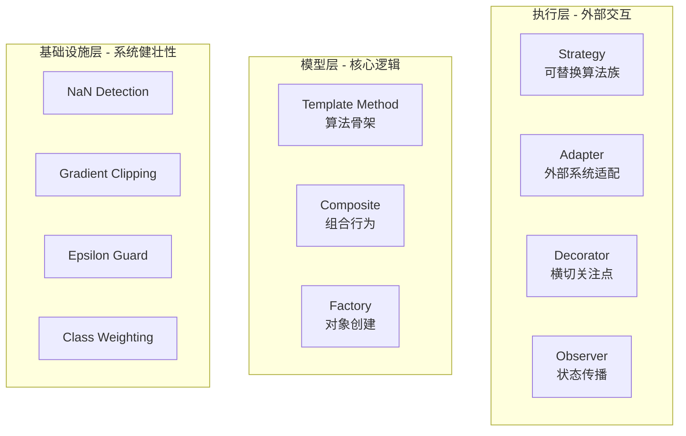

---
tags:
  - MachineLearning
  - Architecture
  - SoftwareDesign
  - 方法性
title: CTM - Architecture Patterns
created: 2026-06-01
---

# CTM - Architecture Patterns

*设计模式在 ML 系统中的特殊应用与反脆弱设计哲学*

> [!abstract] 本文定位
> 本文从**架构设计视角**出发，探讨经典 GoF 设计模式在 ML 系统中的特殊应用方式，以及 ML 系统特有的反脆弱设计模式。CTM 项目作为案例，展示 7 种经典模式和 5 种反脆弱模式的落地实践。

## 1. ML 系统的设计模式——核心理念

### 为什么 ML 系统需要设计模式

ML 系统与传统软件系统存在本质差异，这些差异让设计模式在 ML 语境下有特殊的价值和变体。

| ML 系统特性 | 对架构的影响 | 涉及的模式 |
|------------|-------------|-----------|
| **非确定性** (训练随机性、数值误差) | 需要防守式编程，假设一切可能出错 | 反脆弱系列 |
| **多模型变体** (多种算法、超参数) | 需要灵活的组件替换机制 | Strategy, Template Method |
| **外部依赖** (数据源、Broker、GPU) | 需要解耦和容错 | Adapter, Decorator |
| **异构组件组合** (Python + C++、不同框架) | 需要清晰的接口边界 | Factory, Adapter |
| **状态传播** (交易执行、账户更新) | 需要自动状态同步 | Observer |

> [!note] 核心观点
> ML 系统的设计模式不是对 GoF 模式的简单套用，而是在处理 ML 特有的**不确定性、数值敏感性和外部依赖**过程中自然演化出的架构方案。

### 按架构层分组

有效的 ML 系统架构将模式自然分布在三个层中。



每个层的设计目的不同，选择的模式也因此不同：

- **执行层 (Execution Layer)**：应对外部世界的不确定性。Broker 可能断连、API 可能限流、网络可能超时。模式的目标是隔离外部变化，让核心逻辑不受干扰。
- **模型层 (Model Layer)**：应对算法变体的管理。一个项目可能需要多种扫描策略、多种损失函数、多种模型架构。模式的目标是让新增变体不需要修改已有代码。
- **基础设施层 (Infrastructure Layer)**：应对数值系统的固有缺陷。NaN、梯度爆炸、除零等问题在 ML 中无法避免。模式的目标是让系统在边界条件下仍能稳定运行，而非崩溃或静默产生错误结果。

### 反脆弱设计哲学

反脆弱 (Anti-Fragile) 的概念来自 Taleb：有些系统不仅能在冲击中存活，还能变得更强。ML 系统的反脆弱设计核心信念是：**系统不应假设输入数据和计算过程是完美的。**

具体来说，ML 系统需要在下述场景中保持稳定：

| 失效模式 | 表现 | 反脆弱策略 |
|---------|------|-----------|
| **NaN 污染** | 一次 NaN 扩散到整个计算图 | 逐层检测 + 原地修复 |
| **梯度爆炸** | Loss to NaN，训练崩溃 | 全局梯度范数裁剪 |
| **除零错误** | 标准差为零、分母接近零 | Epsilon guard 全局保护 |
| **类别不平衡** | 多数类淹没少数类信号 | 逆频率加权 + 自适应平衡 |
| **Hessian 负值** | GBDT 牛顿步方向错误 | Hessian Clamp 到正值 |

反脆弱与"健壮"的区别：健壮是抵抗冲击而不变，反脆弱是从冲击中获益。梯度裁剪不仅防止训练崩溃，还能帮助模型跳出尖锐局部最小值——这是反脆弱的典型体现。

---

## 2. Case Study: CTM 模式应用

### 执行层模式

#### Strategy (策略模式)——可替换的 Broker 实现

解决的问题：多种 Broker API 存在但逻辑相同，需要一种方式让交易执行与具体 Broker 解耦。

```python
class BaseBroker(ABC):
    @abstractmethod
    def connect(self) -> bool: ...
    @abstractmethod
    def place_order(self, symbol, qty, side, type, ...) -> Order: ...
    @abstractmethod
    def supports_fractional_shares(self) -> bool: ...

class AlpacaBroker(BaseBroker): ...   # Alpaca API 实现
class IBKRBroker(BaseBroker): ...      # Interactive Brokers 实现
```

| 策略实现 | 特点 | 适用场景 |
|---------|------|---------|
| `AlpacaBroker` | REST API，支持碎股 | 美股实盘交易 |
| `IBKRBroker` | 网关协议，支持多市场 | 全球市场、期权交易 |

为什么 Strategy 特别适合 ML 系统的执行层？因为 ML 系统的策略回测和实盘执行需要相同的接口但不同的 Broker。同一个 `OrderManager` 可以在回测模式（模拟 Broker）和实盘模式（真实 Broker）之间无缝切换。

#### Adapter (适配器模式)——外部 SDK 适配

解决的问题：外部 SDK 的接口与系统内部模型不兼容。

`AlpacaBroker` 将 Alpaca Trade API 的 `TradingClient` 适配为统一的 `BaseBroker` 接口：

- 数据类型适配：`TradingClient.get_account()` 返回的自有类 to 统一的 `AccountInfo` / `Order` / `Position`
- 碎股交易适配：`qty < 1.0` 时使用 Alpaca 的 notional 参数实现美元计价执行
- Lazy initialization：`TradingClient` 在首次使用时才创建，避免初始化时进行网络调用

#### Decorator (装饰器模式)——网络重试

解决的问题：网络请求可能失败，但失败处理不应侵入核心业务逻辑。

```python
def _retry_on_failure(max_retries=3, base_delay=1.0):
    def decorator(func):
        @functools.wraps(func)
        def wrapper(*args, **kwargs):
            for attempt in range(max_retries):
                try:
                    return func(*args, **kwargs)
                except _RETRY_EXCEPTIONS as e:
                    if attempt == max_retries - 1:
                        raise
                    delay = base_delay * (2 ** attempt)
                    time.sleep(delay)
        return wrapper
    return decorator
```

| 参数 | 值 | 理由 |
|------|-----|------|
| 重试异常 | `TimeoutError`, `ConnectionError`, `OSError` | 网络层面的可恢复错误 |
| 最大重试 | 3 次 | 平衡可用性与延迟 |
| 退避策略 | 指数退避: 1s to 2s to 4s | 避免对下游服务造成重试风暴 |

为什么 Decorator 特别适合 ML 系统？ML 系统中网络请求失败不应导致整个训练或交易流程中断。装饰器将重试逻辑从业务代码中解耦，让核心逻辑保持简洁。

#### Observer (观察者模式)——订单状态传播

解决的问题：订单状态的变更需要自动传播到多个依赖方。

```
OrderManager.execute_signal()
    → AlpacaBroker.place_order()
        → Order filled (status: "filled")
            → TradingAccount.update_position()     ← 仓位更新
            → TradingAccount.update_cash()         ← 资金更新
            → get_open_orders().remove(order)      ← 移除待处理订单
```

ML 系统与观察者模式的特殊契合点：ML 系统的多个子系统（模型、账户、风控）之间存在异步状态依赖，观察者模式在不引入紧耦合的前提下实现自动状态同步。

### 模型层模式

#### Template Method (模板方法模式)——算法骨架

解决的问题：多种扫描策略共享大部分计算步骤，需要避免代码重复。

```
BaseMambaBlock.forward():
    Step 1: Input Projection (2x expansion)          ← 共享
    Step 2: Causal Depthwise Conv1D                  ← 共享
    Step 3: Selective Parameters (Delta, B, C)       ← 共享
    Step 4: Scan (abstract method)                   ← 子类实现

MambaBlock:                   MambaBlockParallel:
  for t: h = h * A_bar + B·x   cp = cumprod(A_bar)
                                h = cp * cumsum(B·x/cp)
```

关键价值：确保两个变体共享完全相同的参数化方式（Delta 低秩分解、A_log 初始化等），唯一的差异在扫描策略。如果需要新增第三种扫描策略（如半并行扫描），只需新增一个子类。

#### Composite (组合模式)——复合损失

解决的问题：多目标优化需要组合多个损失函数，但调用方应只需与"一个损失函数"交互。

```python
def composite_loss(pred, batch, config, model):
    losses = {}
    losses["mse"] = F.mse_loss(pred_reg, target_reg)
    if config.use_sharpe:
        losses["sharpe"] = -math.sqrt(252) * pred_mean / (pred_std + eps)
    if config.use_directional:
        losses["directional"] = F.cross_entropy(pred_cls, target_cls)
    if config.use_pinball:
        losses["pinball"] = pinball_loss(pred_pinball, target, tau=config.sharpe_tau)
    return sum(losses.values()), losses
```

Composite 模式的优势在 ML 系统中尤为突出：每个子损失独立可开关、可通过 `LossConfig` 组合而不修改代码、配合不确定性加权 (Kendall et al., 2018) 自动平衡各子损失的贡献。

#### Factory (工厂模式)——损失函数创建

解决的问题：根据配置动态创建不同类型的损失函数，隔离构造逻辑。

```python
def make_gbdt_loss_fn(config: LossConfig):
    if config.gbdt_loss in ("mse", "mae", "huber"):
        return CppNativeLoss(config.gbdt_loss)
    elif config.gbdt_loss == "rankic":
        return DifferentiableRankICLoss(temperature=config.rank_temperature)
    elif config.gbdt_loss == "composite":
        return LossBridgeLoss(composite_loss_fn=config.composite_loss)
```

### 基础设施层模式 (反脆弱)

CTM 系统性地实现了 5 种反脆弱模式。

| 模式 | 触发条件 | 处理方式 |
|------|---------|---------|
| **NaN Detection** | `torch.isnan(tensor).any()` | 替换为 0 并记录日志 |
| **Gradient Clipping** | 梯度范数超过阈值 | 缩放到阈值内 |
| **Selective L2** | 优化器 step 前 | 仅对权重矩阵 (ndim > 1) 施以正则 |
| **Class Weighting** | 类别分布高度不平衡 | 逆频率加权 |
| **Epsilon Guard** | 分母接近零 / Hessian 为负 | 全局 eps = 1e-8，Hessian clamp 到 1e-6 |

```python
# NaN Detection  每层输出后执行
def check_nan(tensor, name="tensor"):
    if torch.isnan(tensor).any():
        logging.warning(f"NaN detected in {name}, replacing with 0")
        tensor = torch.nan_to_num(tensor, nan=0.0)
    return tensor

# 梯度裁剪  全局范数裁剪
nn.utils.clip_grad_norm_(model.parameters(), grad_clip)

# Epsilon Guard  除法安全
pred_std = torch.sqrt(pred_var + eps)
hessian = torch.clamp(hessian, min=1e-6)
```

> [!note] 反脆弱的更深层含义
> 梯度裁剪不仅防止崩溃，还能帮助模型跳出尖锐局部最小值。NaN 检测在训练早期数值不稳定时提供恢复机会，让训练可以继续而非失败。这些模式让系统从"不稳定"中获益而不是被它摧毁。

---

## 3. Key Takeaways

### 何时使用这些模式

| 模式 | 适用信号 | 一句话判断 |
|------|---------|-----------|
| **Strategy** | 多种算法实现同一接口 | "我需要替换整个算法族而不改调用方" |
| **Template Method** | 多种变体共享大部分步骤 | "多种变体只有一步不同，其余都相同" |
| **Composite** | 多个子对象可统一处理 | "调用方不应知道它在跟一个还是多个对象对话" |
| **Factory** | 对象创建逻辑复杂或配置驱动 | "我不知道具体类型，我只知道配置参数" |
| **Adapter** | 外部 SDK 接口不兼容 | "外部接口很好，但跟我的系统不匹配" |
| **Decorator** | 横切关注点需附加到核心逻辑 | "这个行为应该可以开关，不应侵入核心代码" |
| **Observer** | 状态变更需同步到多个依赖 | "当 X 变化时，Y 和 Z 需要自动知道" |
| **反脆弱系列** | 任何 ML 系统 | "如果这里可能出现 NaN/Inf/除零，我需要保护" |

### 常见陷阱

| 陷阱 | 表现 | 矫正 |
|------|------|------|
| **模式过度工程** | 仅为 2 个子类也使用 Strategy | 3 个以上具体实现才值得引入模式 |
| **反脆弱掩盖错误** | NaN 被安静替换掩盖了更深的问题 | NaN 检测应同时记录日志，在开发环境中可以抛出告警 |
| **Observer 循环** | A 更新 B，B 更新 A，无限循环 | 使用事件总线并引入去重或版本号机制 |
| **Decorator 堆叠顺序** | 先重试再鉴权 vs 先鉴权再重试 | Decorator 的顺序就是处理顺序，需要文档化 |
| **Composite 深度失衡** | 组合树过深，性能下降 | 扁平的 Composite (一层深度) 适合多数 ML 场景 |

### 相关概念

- [[CTM - System Overview]] — 系统架构全局视图
- [[CTM - Mamba and S6 SSM]] — Template Method 模式在 Mamba 中的具体应用
- [[CTM - StockModel Architecture]] — Composite 模式在残差连接中的应用
- [[CTM - Loss Functions]] — Composite 模式 + 不确定性加权
- [[CTM - Ensemble and GBDT]] — Factory 模式 + Loss Bridge
- [[CTM - Trading Execution]] — Strategy + Observer + Decorator + Adapter
- [[Design Patterns]] — GoF 经典设计模式参考
