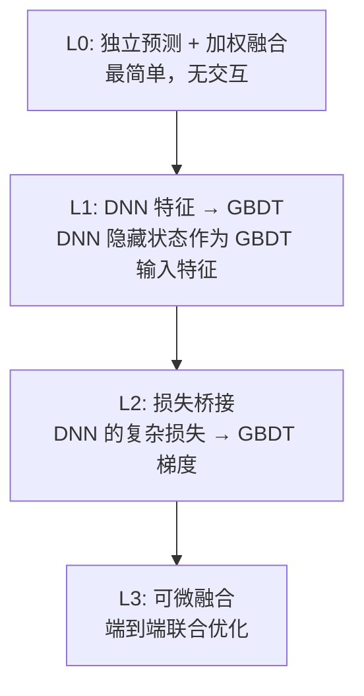
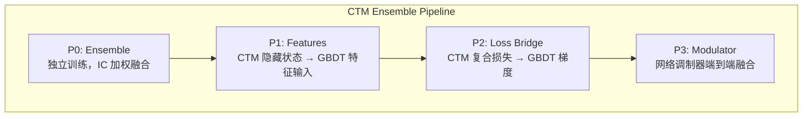

---
tags:
  - MachineLearning
  - EnsembleMethods
  - ModelFusion
  - GradientBoosting
  - 方法性
title: CTM - Ensemble and GBDT
created: 2026-06-01
---

# CTM — Ensemble Methods: Neural Networks + Tree Models

深度神经网络 (DNN) 与梯度提升树 (GBDT) 的集成是结构化数据建模中最强大的范式之一。两种模型在偏差-方差特性、特征交互方式、训练机制上高度互补，合理的融合策略能显著超越单一模型上限。

## 1. DNN + GBDT Ensemble — Core Principles

### What & Why

DNN 和 GBDT 代表了两类完全不同的学习范式：

| 维度 | DNN (神经网络) | GBDT (树模型) |
|------|---------------|---------------|
| **特征处理** | 隐式特征表示学习，自动提取高阶交互 | 显式特征分裂，决策边界为分段常数 |
| **数据需求** | 数据量大时表现优异 | 中小数据量高效，对大数据的扩展性不如 DNN |
| **序列建模** | 天然支持 (RNN, Transformer, Mamba) | 无序列记忆，需手工构造时序特征 |
| **损失函数** | 任意可微损失，灵活多变 | 需要 (损失, 梯度, 黑塞) 三元组，限定在二阶可微 |
| **训练方式** | 小批量 SGD / Adam | 逐棵树贪婪拟合负梯度 |
| **方差** | 高方差 (不同随机种子差异大) | 低方差 (bagging 引入随机性后更稳定) |

**互补性的根源**：DNN 擅长从原始数据中**学习表示**和捕获长期依赖，但容易过拟合噪声；GBDT 擅长**特征选择**和鲁棒的决策边界，但缺乏对序列结构和复杂损失函数的表达能力。融合两者可以结合 DNN 的灵活性与 GBDT 的鲁棒性。

### Fusion Strategies

通用的 DNN + GBDT 融合有以下几种范式，由浅入深：



| 级别 | 方法 | 优点 | 缺点 |
|------|------|------|------|
| **L0: 加权融合** | 独立训练后融合输出 | 最简实用，无耦合 | 忽略模型间交互 |
| **L1: 特征增强** | DNN 隐状态作为 GBDT 特征 | 注入 DNN 学到的表示 | 单向：GBDT 无法反馈 |
| **L2: 损失桥接** | DNN 损失函数桥接到 GBDT 梯度 | 让 GBDT 也能优化复杂目标 | 需手动求导，工程复杂 |
| **L3: 可微融合** | 联合训练或调制器网络 | 信息全流通 | 训练不稳定，需调节 |

### Key Design Dimensions & Tradeoffs

1. **融合深度 vs 可维护性**：越深层的融合越能发挥模型协同潜力，但工程复杂度、调试难度、训练稳定性都在增加。
2. **计算开销**：GBDT 通常用 C++ 实现（如 LightGBM, XGBoost），DNN 在 Python 中训练。跨语言调用带来 I/O 和序列化开销。
3. **时间对齐**：时序场景中，DNN 和 GBDT 的处理窗口、预测频率可能不同，需设计对齐策略。
4. **自适应权重**：模型性能随时间变化（概念漂移），融合权重应动态调整而非静态固定。

### Differentiable Ranking Approximations

排序优化在搜索、推荐、量化交易中至关重要，但排序指标（NDCG, RankIC）通常是不可微的阶跃函数。通用的解决办法是**软排名近似**：

$$\text{rank}_{\text{soft}}(x_i) = \frac{1}{N} \sum_{j=1}^{N} \sigma\left(\frac{x_i - x_j}{\tau}\right) \quad \in [0, 1]$$

其中 $\sigma$ 是 sigmoid 函数，$\tau$ 是温度参数。当 $\tau \to 0$ 时逼近真实排名，但梯度趋于零化；$\tau$ 越大，近似越平滑。

利用软排名可以将 Spearman 秩相关系数近似为 Pearson 相关系数在软排名上的版本，从而构造**可微排序损失**：

$$\mathcal{L}_{\text{RankIC}} = 1 - \rho(\text{rank}_{\text{soft}}(\hat{y}), \text{rank}_{\text{soft}}(y))$$

## 2. Case Study: CTM Implementation

### Architecture — P0 to P3 Progressive Integration

CTM 实现了从 L0 到 L3 的四级渐进集成管线，命名为 P0-P3：



| 级别 | CTM 实现 | 对应通用范式 |
|------|---------|-------------|
| **P0** | 独立训练 CTM 和 GBDT，IC 加权融合输出 | L0 加权融合 |
| **P1** | CTM 最后一个 Mamba Block 的隐藏态作为 GBDT 特征 | L1 特征增强 |
| **P2** | CTM 复合损失（Sharpe, Directional, Pinball）桥接到 GBDT | L2 损失桥接 |
| **P3** | 额外训练调制器网络，以 CTM 和 GBDT 输出为输入生成融合结果 | L3 可微融合 |

### Design Decision: IC-Weighted Fusion

CTM 使用 **Spearman 秩相关系数 (IC)** 作为自适应融合权重，而非简单的固定加权或验证集搜索。

> [!note] IC 作为权重的直觉
> IC 衡量预测值与真实收益的排序一致性——IC 越高，模型的排序能力越强。用 IC 绝对值作为权重，本质上是让「最近表现好的模型」在当前预测中占更大比重。

$$w_{\text{ctm}} = \frac{|IC_{\text{ctm}}|}{|IC_{\text{ctm}}| + |IC_{\text{gbdt}}| + \epsilon}$$

$$\text{fused} = w_{\text{ctm}} \cdot \text{ctm\_pred} + (1 - w_{\text{ctm}}) \cdot \text{gbdt\_pred}$$

| 关键参数 | 说明 |
|---------|------|
| IC 计算方式 | 滚动窗口上 Spearman $\rho$ |
| 窗口长度 | 默认 252 个交易日（约 1 年） |
| 绝对值 IC | 防止 $IC<0$ 时权重为负，保持融合的物理意义 |

```python
def ic_weighted_fusion(ctm_pred, gbdt_pred, ic_ctm, ic_gbdt, eps=1e-8):
    w_ctm = abs(ic_ctm) / (abs(ic_ctm) + abs(ic_gbdt) + eps)
    fused = w_ctm * ctm_pred + (1 - w_ctm) * gbdt_pred
    return fused, w_ctm
```

### Design Decision: Loss Bridge

**核心问题**：GBDT 的每一轮迭代需要每个叶子节点的（损失, 梯度, 黑塞矩阵），但 CTM 的复合损失包含非凸项（Sharpe）和分段线性项（Pinball），无法直接传入 GBDT。

CTM 的 Loss Bridge 将复合损失逐项解析转换：

| 损失项 | 转换方式 | 梯度类型 |
|--------|---------|---------|
| **MSE** | `torch.autograd.grad()` 自动求导 | 标准二次梯度 |
| **Pinball** | 分段线性，解析求导 | 一阶梯度分段常数，二阶为零 |
| **Directional** | 简化为二分类 BCE | 与 MSE 梯度形式一致 |
| **Sharpe** | 解析一阶/二阶导数 | 见下方公式 |

**Sharpe Ratio 解析梯度**（以预测序列 $r_i$ 为例）：

$$SR = \sqrt{AF} \cdot \frac{\mu}{\sigma}, \quad \mu = \frac{1}{N}\sum r_i, \quad \sigma = \sqrt{\frac{1}{N}\sum (r_i - \mu)^2}$$

$$\frac{\partial SR}{\partial r_i} \approx \sqrt{AF} \cdot \left( \frac{1}{N \cdot \sigma} - \frac{\mu \cdot (r_i - \mu)}{N \cdot \sigma^3} \right)$$

$$\frac{\partial^2 SR}{\partial r_i^2} \approx \sqrt{AF} \cdot \left( -\frac{2\mu}{N \cdot \sigma^3} + \frac{3\mu \cdot (r_i - \mu)}{N \cdot \sigma^5} \right)$$

> [!warning] 黑塞矩阵近似
> 完整黑塞矩阵是 $N \times N$ 稠密矩阵。实践中使用**对角近似**，并对负值 clamp 到 $10^{-6}$ 确保牛顿步方向正确。

### Design Decision: Differentiable RankIC Loss

CTM 实现了可微的 RankIC 损失，允许 GBDT 直接优化排序指标而非 MSE：

```python
def _differentiable_ranking_helper(x, temperature=0.1):
    N = x.shape[-1]
    x_i = x.unsqueeze(-1)   # (..., N, 1)
    x_j = x.unsqueeze(-2)   # (..., 1, N)
    pairwise = torch.sigmoid((x_i - x_j) / temperature)
    ranks = pairwise.sum(dim=-1) / N
    return ranks

def rankic_loss(y_pred, y_true):
    pred_rank = _differentiable_ranking_helper(y_pred)
    true_rank = _differentiable_ranking_helper(y_true)
    rank_ic = pearson_corr(pred_rank, true_rank)
    loss = 1.0 - rank_ic

    grad = torch.autograd.grad(loss, y_pred, create_graph=True)[0]
    hess = torch.ones_like(y_pred)   # 常数黑塞近似
    return loss, grad, hess
```

**GBDT 训练调度**：根据 loss 类型分发到不同实现路径——

```python
# mse/mae/huber → C++ 原生 GBDT.fit()
# rankic      → Python RankIC Bridge + 手动 boosting
# composite   → Loss Bridge + 手动 boosting
```

> [!tip] 手动 Boosting 循环
> 对 rankic 和 composite 类型，无法直接调用 C++ `GBDT.fit()`，需在 Python 中手动循环：每轮计算梯度/黑塞 → 训练新树 → 更新预测。

### Code / Configuration Example

典型的 CTM 集成配置：

```python
config = {
    "ensemble_level": "P2",              # P0 / P1 / P2 / P3
    "gbdt_loss": "composite",            # mse / mae / rankic / composite
    "ic_lookback": 252,                  # IC 权重滚动窗口
    "n_gbdt_trees": 500,                 # GBDT 树数量
    "temperature": 0.1,                  # 软排名温度
}
```

## 3. Key Takeaways

### When to Use This Pattern

- **DNN 和 GBDT 单独均已调优但仍有提升空间**：集成通常可再提升 5-15% 的排序指标
- **需要同时捕获时序结构和特征交互**：DNN 做序列建模 + GBDT 做特征选择是黄金组合
- **损失函数复杂**（排序、Sharpe、分位数）：用 DNN 包裹复杂损失，桥接到 GBDT
- **概念漂移频繁**：自适应加权融合比固定权重更鲁棒

### Common Pitfalls to Avoid

1. **过拟合风险**：P2/P3 级别的集成引入额外参数，小数据量时容易过拟合。建议从 P0 开始逐步深化。
2. **时间穿越**：IC 加权必须使用**历史窗口**的 IC，绝不能用到未来数据计算权重。
3. **黑塞矩阵近似**：对角近似在大规模样本时可能精度不足，需监控牛顿步的收敛性。
4. **损失桥接的梯度匹配**：复合损失各分量需要合理缩放，避免某一项梯度主导。
5. **训练/推理不一致**：P1 模式下，训练时 GBDT 使用 CTM 隐藏态；推理时需确保 CTM 隐藏态可用，避免延迟 mismatch。

### Related Concepts & Further Reading

- [[CTM - Loss Functions]] — 复合损失函数的完整定义
- [[CTM - MultiAsset Model]] — 多资产场景下的集成
- [[CTM - StockModel Architecture]] — CTM 模型架构基础
- **Stacking / Blending** — 多模型融合的经典方法
- **Gradient Boosted Trees** (Friedman, 2001) — GBDT 理论基础
- **Differentiable Sorting** (Grover et al., 2019) — 软排名与可微排序的理论分析
- **Model Agnostic Meta-Learning** — 更一般的多模型融合框架
