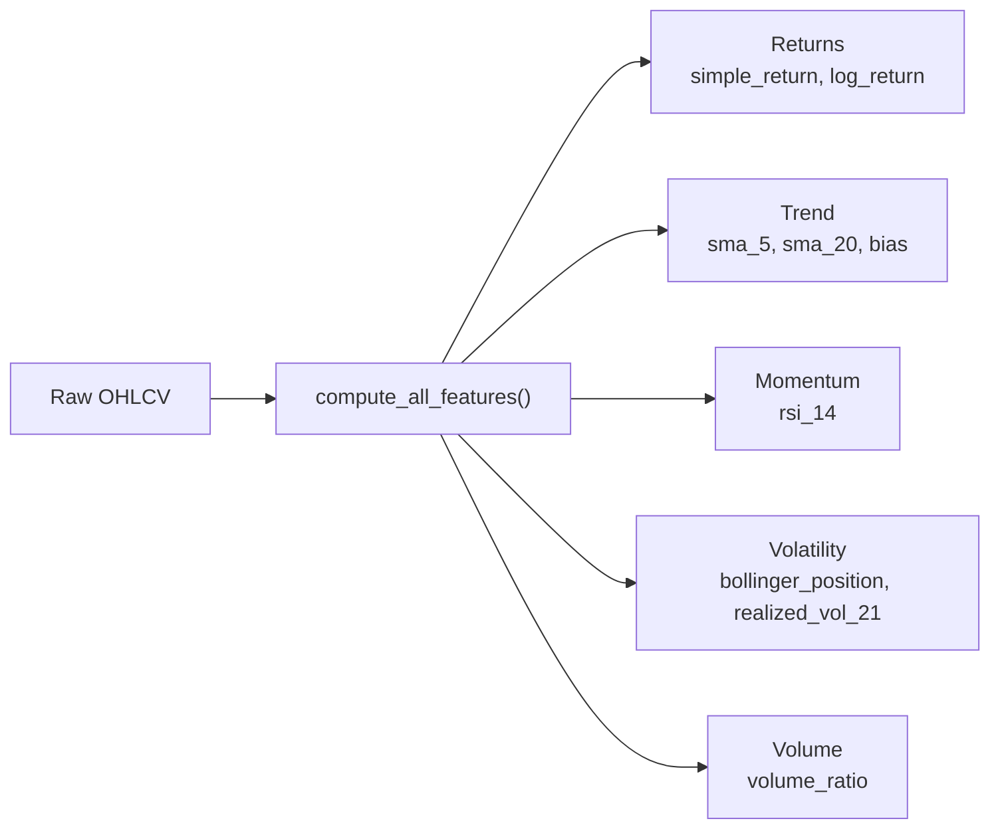

---
tags:
  - MachineLearning
  - FeatureEngineering
  - TechnicalAnalysis
  - FinancialModeling
  - 机器学习/特征工程
  - 金融/技术指标
title: CTM - Feature Engineering
created: 2026-06-01
---

# CTM — 金融时间序列特征工程

## 1. 金融特征工程 — 核心原理

### 概念与动机

原始的 OHLCV 数据（开盘价、最高价、最低价、收盘价、成交量）是一个稀疏的信号。为了提取可预测的模式，我们将其转化为 **特征族（Feature Families）** ——从原始数据中派生的量，用来捕捉市场行为的不同侧面。目标是在时间 $t$ 表示市场状态，使得模型能够从中学习。

最关键的约束是：**因果性（Causality）**。时间 $t$ 的特征必须仅使用截至 $t$ 的数据计算。任何前视行为都会污染训练目标。

### 特征族（Feature Families）

金融特征大致可分为以下几个族：

**动量/趋势特征** 捕捉方向性强度和速度：
- 简单收益率：$r_t = p_t / p_{t-1} - 1$
- 对数收益率：$\ln(p_t / p_{t-1})$ — 在时间上可加，统计性质更好
- 移动平均偏离度：$p_t / \text{SMA}_k(p) - 1$ — 价格偏离其 k 期均值的程度
- RSI（相对强弱指标）：将近期涨跌幅归一化到 $[0, 100]$

**波动率特征** 捕捉风险与不确定性：
- 已实现波动率：$\text{std}(\{r_{t-k}, \dots, r_t\})$ — 滚动收益率标准差
- 布林带位置：$(p_t - \text{SMA}_k) / \sigma_k$ — 价格同时按水平和波动率归一化
- ATR（平均真实波幅）：捕捉日内波动率（使用最高-最低价差）

**成交量特征** 捕捉参与度与确定性：
- 成交量比率：$V_t / \text{SMA}_k(V)$ — 检测异常成交量尖峰
- 成交额：$p_t \times V_t$ — 捕捉资金流
- VWAP（成交量加权平均价格）偏离度

> [!note] 因果计算
> 上述每个特征都可以仅使用**回溯窗口（lookback window）** 进行因果计算。SMA 使用 $[t-k+1, t]$ 的数据，RSI 使用 Wilder 平滑的 k 期数据，波动率使用滚动窗口。这使得它们可以安全地用于在线/实时推理。

### 数学/理论基础

**技术指标作为基扩展。** 大多数金融特征可以视为原始价格序列的**基扩展（Basis Expansion）**。正如多项式特征捕捉回归中的非线性关系，技术指标捕捉非线性的市场动态：

$$\Phi(p_t, V_t) = [\phi_1(p_t), \phi_2(p_t, V_t), \dots, \phi_D(p_t, V_t)]$$

其中每个 $\phi_d$ 是价格和成交量历史的确定性因果函数。然后模型学习 $y_t \approx f(\Phi(p_t, V_t))$。

**回溯窗口超参数** $k$ 控制每个特征所捕捉的时间尺度。短回溯窗口（$k=5$）捕捉微观结构噪声；中等回溯窗口（$k=14\text{--}20$）捕捉摆动动态；长回溯窗口（$k=50\text{+}$）捕捉宏观趋势。一个好的特征集应覆盖多个时间尺度。

### 关键设计维度与权衡

| 维度 | 选项 | 权衡 |
|------|------|------|
| 特征多样性 | 仅价格 vs. 价格+成交量+波动率 | 更多族捕捉更多信号，但增加共线性和噪声 |
| 回溯窗口 | 单一 vs. 多个 | 多个窗口覆盖不同状态但增加维度 |
| 计算方法 | 滚动 numpy vs. 因果卷积 vs. 扩展窗口 | 因果卷积适合批量计算，扩展窗口适合在线计算 |
| 归一化 | Z-Score vs. Min-Max vs. Rank | Z-Score 保留异常值，Min-Max 限制范围，Rank 尺度不变 |

## 2. 案例分析：CTM 实现

### 特征计算管线

CTM 的 `compute_all_features()` 将调整后的收盘价 $p_t$ 和成交量 $V_t$ 转化为 9 个特征序列，覆盖动量、波动率和成交量三个族：



| 特征 | 公式 | 所属族 | 回溯窗口 |
|------|------|--------|----------|
| `simple_return` | $p_t / p_{t-1} - 1$ | Momentum | 1 |
| `log_return` | $\ln(p_t / p_{t-1})$ | Momentum | 1 |
| `sma_5` | $p_t / \text{SMA}_5(p) - 1$ | Trend | 5 |
| `sma_20` | $p_t / \text{SMA}_{20}(p) - 1$ | Trend | 20 |
| `rsi_14` | RSI，Wilder 平滑 | Momentum | 14 |
| `bollinger_position` | $(p_t - \text{SMA}_{20}) / \sigma_{20}$ | Volatility | 20 |
| `volume_ratio` | $V_t / \text{SMA}_{20}(V)$ | Volume | 20 |
| `realized_vol_21` | $\text{std}(\{r_{t-20}, \dots, r_t\})$ | Volatility | 21 |
| `bias` | $(p_t - \text{SMA}_{20}) / \text{SMA}_{20}$ | Trend | 20 |

所有特征均通过**因果卷积（Causal Convolution）**（左填充）计算，确保没有未来信息进入计算。

### 面向树模型的序列到向量聚合

树模型（GBDT、Random Forest）无法直接消费变长序列 $T \times D$。标准解决方案是**聚合（Aggregation）**：使用汇总统计量将每个特征的历史压缩为固定大小的向量。

CTM 对每个特征应用 6 种聚合操作：

```python
aggregations = [last, mean, std, min, max, slope]
```

输出维度：$6 \times D$（9 个特征共 54 维）。

**Slope** 通过 OLS 线性回归计算（特征值对时间索引回归）：

$$\text{slope} = \frac{\text{Cov}(i, f)}{\text{Var}(i)} = \frac{\sum_{i=1}^n (i - \bar{i})(f_i - \bar{f})}{\sum_{i=1}^n (i - \bar{i})^2}$$

这保留了其他算子丢弃的趋势信息。

> [!note]
> [[CTM - Ensemble and GBDT]] 消费这个聚合后的 54 维向量。而 CTM（Mamba）模型直接消费原始的 $T \times 9$ 序列——序列模型原生支持变长输入。

### 因果归一化（Z-Score）

金融特征需要归一化。朴素的做法（在整个数据集上计算 $\mu, \sigma$）是**非因果的（Non-Causal）**——它使用未来值来归一化过去。正确的做法是**扩展窗口（Expanding Window）** 归一化：

```python
def normalize_features(features, causal=True, mean=None, std=None):
    if mean is not None and std is not None:
        return (features - mean) / (std + 1e-8)     # Inference mode

    if causal:
        cum_mean = features.expanding().mean()       # Causal: t uses [0..t]
        cum_std = features.expanding().std()
        return (features - cum_mean) / (cum_std + 1e-8)
    else:
        return (features - features.mean()) / (features.std() + 1e-8)   # Debug only
```

| 模式 | `causal` | 统计量来源 | 何时使用 |
|------|----------|-----------|---------|
| Causal（因果） | `True` | 扩展窗口，$t$ 使用 $[1, t]$ | 训练、验证、实盘交易 |
| Reuse（复用） | 传入 `mean, std` | 从训练集预计算 | 推理，防止分布偏移 |
| Global（全局） | `False` | 全数据集统计量 | 调试/分析仅用 — 不可用于模型训练 |

推理时，CTM 保存训练最后一步的扩展窗口统计量并复用它：

```python
# Training: compute expanding statistics
train_features = compute_all_features(train_data)
_, precomputed_mean = train_features.expanding().mean()
_, precomputed_std = train_features.expanding().std()
torch.save({"mean": precomputed_mean, "std": precomputed_std}, "feature_stats.pt")

# Inference: reuse
stats = torch.load("feature_stats.pt")
normalized = normalize_features(new_features, mean=stats["mean"], std=stats["std"])
```

### 完整管线

```
Raw OHLCV
    |
    v
compute_all_features()
    |-- simple_return, log_return       ← 收益率（动量）
    |-- sma_5, sma_20, bias             ← 移动平均偏离度（趋势）
    |-- rsi_14                           ← 动量震荡指标
    |-- bollinger_position               ← 波动率归一化价格
    |-- volume_ratio                     ← 成交量异常
    |-- realized_vol_21                  ← 已实现波动率
    |
    v
[T x D] feature matrix (causal throughout)
    |
    ├──→ CTM StockModel (Mamba)         ← 消费原始 T x D 序列
    |
    └──→ aggregate_sequence_features()
            |-- last, mean, std, min, max, slope
            v
          [6D] = 54-dim vector
            |
            v
          GBDT Model                     ← 消费聚合后的向量
```

## 3. 要点总结

### 适用场景

- **技术指标作为基础特征**：简单、可解释且因果正确。从 5-10 个核心特征开始（收益率、SMA、RSI、波动率），再考虑加入更复杂的指标。
- **面向树模型的序列聚合**：任何时候使用需要固定大小输入但数据是变长序列的模型时。
- **因果归一化**：始终如此。扩展窗口 Z-Score 是最安全的默认选择。永远不要对训练或验证使用全局统计量。

### 常见陷阱

1. **非因果的特征计算**：最危险的 bug。用 pandas 计算 SMA 或 RSI 时，务必检查 `shift()` 是否正确应用，确保 $f_t$ 不包含 $p_{t+1}$。99% 的代码看起来正确，但会悄无声息地失败。
2. **训练时使用全局归一化**：如果在全数据集上 `fit_transform` 后再划分训练/验证集，归一化已经泄漏了未来信息。始终仅在训练窗口上计算统计量。
3. **忽略特征共线性**：SMA_5 和 SMA_20 与原始价格高度相关。PCA 或特征选择可能有所帮助，但对树模型而言不太关键。
4. **RSI Wilder 平滑的混淆**：第一个 RSI 值使用 SMA，后续值使用 $\alpha = 1/k$ 指数平滑。这意味着 RSI 需要 $2k$ 期才能稳定，而不是 $k$。
5. **固定聚合破坏时序结构**：`last` 和 `mean` 丢弃了序列的形状信息。`slope` 和 `std` 保留了一定的形状信息。考虑加入 `skew`、`kurtosis` 或分位数特征以获取更丰富的表示。

### 相关概念与延伸阅读

- [[CTM - Walk-Forward Validation]] — 因果特征工程 + purge period = 双层泄漏防护
- [[CTM - Ensemble and GBDT]] — 聚合后的特征如何输入 GBDT 集成
- [[CTM - StockModel Architecture]] — Mamba 如何直接消费原始序列
- [[CausalConv1d for Time Series]] — 确保因果特征计算的卷积技术
- [[Feature Engineering for Time Series Forecasting (Hyndman, 2018)]]
