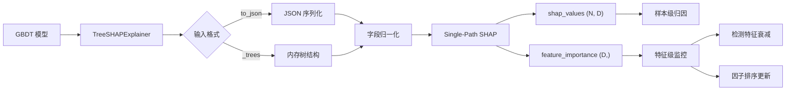

---
tags:
  - MachineLearning
  - ModelInterpretability
  - SHAP
  - TreeModels
  - ExplainableAI
  - 方法性
title: CTM - Interpretability
created: 2026-06-01
---

# CTM — TreeSHAP: Tree Model Interpretability

树模型（决策树、随机森林、GBDT）在结构化数据上表现优异，但以其"黑箱"著称。TreeSHAP 提供了在树模型上计算特征贡献的理论严谨且高效的方法，是目前最广泛使用的树模型解释工具。

## 1. TreeSHAP — Core Principles

### What & Why

模型可解释性在金融、医疗、风控等领域不是可选项而是必要条件。对于股票预测模型，一个特征贡献解释框架需要回答三个问题：

1. **归因 (Attribution)**：某个预测结果中，每个特征贡献了多少？
2. **方向 (Direction)**：该特征是推高还是拉低了预测值？
3. **漂移 (Drift)**：特征的贡献随时间如何变化？

**SHAP (SHapley Additive exPlanations)** 基于合作博弈论中的 Shapley 值，为每个特征分配一个对模型输出的边际贡献。其核心思想是：特征的贡献等于在所有可能的特征子集中，加入该特征后模型输出的平均变化。

### Shapley Values for Machine Learning

给定一个模型 $f$ 和特征集 $F$，特征 $j$ 的 Shapley 值为：

$$\phi_j = \sum_{S \subseteq F \setminus \{j\}} \frac{|S|!(|F| - |S| - 1)!}{|F|!} \left[ f(S \cup \{j\}) - f(S) \right]$$

其中 $f(S)$ 表示仅使用特征子集 $S$ 时的模型期望输出。

> [!note] Shapley 值的公理性质
> - **效率性**：各特征贡献之和等于总预测值减去均值，$\sum \phi_j = f(x) - \mathbb{E}[f(X)]$
> - **对称性**：等价特征的贡献相同
> - **虚拟性**：不影响输出的特征贡献为零
> - **可加性**：多个模型的 SHAP 值可线性叠加

### TreeSHAP vs KernelSHAP

| 维度 | TreeSHAP | KernelSHAP |
|------|---------|-----------|
| **适用模型** | 树模型（决策树、RF、GBDT） | 任意模型（模型无关） |
| **计算方式** | 利用树结构在 $O(TLD)$ 内精确计算 | 蒙特卡洛采样近似 |
| **复杂度** | $O(T \cdot L \cdot D)$ 线性于树数、深度、特征数 | $O(2^D \cdot K)$ 随特征数指数增长 |
| **精确性** | 精确（在 TreeSHAP 定义下） | 近似（采样误差） |
| **交互效应** | 可扩展为 TreeSHAP Interaction | 需额外计算 |

> [!warning] TreeSHAP 的前提假设
> TreeSHAP 假设特征是相互独立的——在计算 $f(S)$ 时，不在 $S$ 中的特征通过积分（期望）消去。如果特征高度相关，SHAP 值可能产生偏差。路径相关的 TreeSHAP (Path-Dependent TreeSHAP) 部分缓解了此问题。

### Single-Path SHAP: A Practical Approximation

完整 TreeSHAP 需要遍历所有可能的特征子集——即使利用树结构做条件期望，复杂度仍较高。实践中常用一种简化的 **Single-Path SHAP**：

对于单棵决策树，样本 $x$ 沿决策路径到达叶子值 $v_{\text{leaf}}$。Single-Path 将叶子值均分给路径上的所有特征：

$$\phi_j = \frac{v_{\text{leaf}}}{|\text{path}(x)|} \quad \text{for each } j \in \text{path}(x)$$

$$\sum_{j \in \text{path}(x)} \phi_j = v_{\text{leaf}}$$

**可视化示例**：
```text
         x2 ≤ 0.03
         /        \
    x5 ≤ 0.1    x1 ≤ -0.02
    /     \      /     \
  0.02  -0.01  0.03   0.05
                         ↑ 样本落于此叶子
  路径特征: x2, x1
  φ_x2 = 0.05 / 2 = 0.025
  φ_x1 = 0.05 / 2 = 0.025
```

| 版本 | 复杂度 | 优点 | 缺点 |
|------|--------|------|------|
| 完整 TreeSHAP | $O(T \cdot L \cdot 2^D)$ | 理论精确 | 特征多时不可行 |
| 路径依赖 TreeSHAP | $O(T \cdot L \cdot D^2)$ | 利用树结构加速 | 仍较高 |
| **Single-Path SHAP** | $O(T \cdot D)$ | 极快，线性复杂度 | 近似值，忽略特征交互 |

> [!note] Single-Path 的 tradeoff
> 完整 TreeSHAP 考虑"如果走另一条路径会怎样"，Single-Path 只考虑实际路径。这在 $O(T \cdot D)$ 下保留了每个特征的相对贡献信息，适合大规模计算，但在特征交互强烈的场景下会低估交互效应。

### Why Interpretability Matters in Quantitative Trading

金融领域对可解释性的需求特别强烈：

1. **风控合规**：交易决策需要可追溯的原因，监管日益要求算法透明
2. **特征衰减监控**：因子的预测能力随时间下降，SHAP 的重要性漂移是最直接的监测信号
3. **模型调试**：当模型在某段时间表现异常时，SHAP 值能定位哪些特征导致的异常
4. **研究员信任**：可解释的模型让量化研究员更愿意采纳 ML 建议

## 2. Case Study: CTM Implementation

### Architecture: TreeSHAPExplainer

CTM 的 `TreeSHAPExplainer` 是一个框架无关的树模型解释器，支持多种 GBDT 格式：

```python
# 三种初始化方式
explainer = TreeSHAPExplainer(gbdt_model_cpp)           # C++ pybind
explainer = TreeSHAPExplainer(gbdt_trainer._model)      # Python wrapper
explainer = TreeSHAPExplainer(raw_trees=_trees)          # 原生树结构
```



### Design Decision: Field Normalization

不同 GBDT 框架对树节点的字段命名各异。`TreeSHAPExplainer` 自动检测并归一化：

| 框架 | 分裂特征字段 | 阈值字段 | 叶子值字段 |
|------|-------------|---------|-----------|
| XGBoost | `feature` / `split_feature` | `threshold` / `split_condition` | `leaf` / `leaf_value` |
| LightGBM | `split_feature` | `threshold` | `leaf_value` |
| 自定义 C++ | 任意命名 | 任意命名 | 任意命名 |

自动检测策略：遍历首棵树的节点字段集合，匹配已知的命名模式。若未匹配，抛出明确的字段映射错误，提示用户显式指定 `feature_col` / `threshold_col` / `value_col`。

> [!note] 为什么需要字段归一化
> 股票预测场景中，GBDT 可能来自不同框架（XGBoost, LightGBM, 自定义 C++ 实现）。即使在同一 CTM 流水线内部，P1 阶段的 GBDT（以隐藏状态为特征）和融合阶段的 GBDT 可能使用不同的序列化格式。字段归一化使解释器成为框架无关的工具，而非绑定在某一个实现上。

### Design Decision: Single-Path SHAP

CTM 采用 Single-Path SHAP 近似而非完整 TreeSHAP：

```python
def explain(self, X):
    N, D = X.shape
    shap_values = np.zeros((N, D))
    for i in range(N):
        for tree in self.trees:
            path = self._traverse(tree, X[i])        # 获取决策路径
            leaf_value = self._get_leaf_value(tree, path)
            path_features = self._get_path_features(path)
            feat_contrib = leaf_value / len(path_features)  # 均分
            for j in path_features:
                shap_values[i, j] += feat_contrib
    return shap_values
```

**复杂度分析**：$O(N \cdot T \cdot D)$

- $N$: 样本数
- $T$: 树数量
- $D$: 特征数

> [!tip] 性能优化实践
> - 将树结构预加载为扁平数组（而非嵌套 JSON），减少运行时解析开销
> - 决策路径遍历可并行化：多线程分片处理样本
> - 在 CTM 场景中（$N \approx 1000$, $T \approx 1000$, $D \approx 50$），计算约 $5 \times 10^7$ 次操作，秒级完成

### Design Decision: Feature Importance via SHAP

全局特征重要性通过对 SHAP 绝对值取平均得到：

$$\text{importance}_j = \frac{1}{N} \sum_{i=1}^{N} |\phi_{ij}|$$

| 重要性类型 | 计算方式 | 反映的信息 |
|-----------|---------|-----------|
| 分裂次数 | GBDT 原生 `feature_importances_` | 特征被使用的频率 |
| 增益 | 分裂导致的总方差减少 | 特征对纯度的贡献 |
| **SHAP 重要性** | 平均绝对 SHAP 值 | 特征实际影响预测值的**大小** |

> [!tip] SHAP vs 传统重要性
> 传统 GBDT 的 `feature_importances_` 基于分裂次数或增益，只反映特征被使用的频率。SHAP 重要性基于边际贡献，更能反映特征**实际影响**预测值的大小，且对不同相关性的特征组合更鲁棒。

### Interface

```python
explainer = TreeSHAPExplainer(gbdt_model, num_features=D, learning_rate=lr)
shap_values = explainer.explain(X)                          # (N, D) SHAP 值
importance = explainer.feature_importance_shap(X)            # (D,) mean |SHAP|
```

| 返回值 | 维度 | 含义 |
|--------|------|------|
| `shap_values` | $(N, D)$ | 每个样本每个特征的 SHAP 贡献值 |
| `feature_importance_shap` | $(D,)$ | 所有样本的平均 $\lvert\text{SHAP}\rvert$ |

### SHAP Interpretation in Stock Prediction

在量化交易上下文中，SHAP 值的正负有具体交易含义：

| SHAP 符号 | 对预测的影响 | 交易含义 |
|-----------|-------------|---------|
| $\phi_j > 0$ | 该特征值使预测收益偏高 | 特征增强做多信号 |
| $\phi_j < 0$ | 该特征值使预测收益偏低 | 特征增强做空信号 |
| $|\phi_j|$ 大 | 该特征对当前样本影响强 | 决策主要依赖此特征 |

> [!note] SHAP 在 Walk-Forward 中的应用
> 在 [[CTM - Training System]] 的每个窗口训练完成后，对验证集计算 SHAP 重要性。通过观察 SHAP 重要性在时间轴上的漂移（如某个因子从 $\phi > 0$ 变为 $\phi < 0$），可以检测**特征衰减 (feature decay)**。这是量化模型监控的重要环节，详见 [[CTM - Feature Engineering#特征衰减监控]]。

## 3. Key Takeaways

### When to Use TreeSHAP

- **模型是树模型或树集成**：TreeSHAP 比 KernelSHAP 快几个数量级，且计算精确
- **需要对单样本做归因**：SHAP 提供样本级的特征贡献分解
- **需要监控特征重要性随时间变化**：SHAP 重要性比分裂次数重要性更稳定、更有信息量
- **需要向非技术人员解释模型行为**：SHAP 的加性解释易于理解

### Common Pitfalls to Avoid

1. **特征相关性偏差**：TreeSHAP 假设特征独立，相关性强的特征会导致 SHAP 值失真。考虑使用 SHAP Interaction Values 或路径依赖版本。
2. **Single-Path 的局限**：均分叶子值到路径特征上忽略了特征在分裂中的不同重要性。在特征交互强烈的场景此近似会低估。先验是：路径上每个特征对叶子值的贡献大致相同。
3. **SHAP 不等于因果**：SHAP 衡量的是特征对模型输出的统计贡献，不是对真实世界的因果效应。高 SHAP 值不意味着该特征有真实的预测力。
4. **叶子值缩放**：多棵树的 SHAP 值需按学习率缩放。如果模型有 shrinkage / learning rate，每棵树的叶子值在求和前应乘上该系数。
5. **计算效率 vs 精度 tradeoff**：$N \times T \times D$ 在数千棵树时仍可接受。若需进一步提升性能，可对树做剪枝——移除贡献极小的树（增益低于阈值）。

### Related Concepts & Further Reading

- [[CTM - Ensemble and GBDT]] — GBDT 的构建与训练
- [[CTM - Feature Engineering]] — 特征衰减监控与因子分析
- [[CTM - Training System]] — Walk-Forward 训练与 SHAP 监控的集成
- **A Unified Approach to Interpreting Model Predictions** (Lundberg & Lee, 2017) — SHAP 的原始论文
- **Consistent Individualized Feature Attribution for Tree Ensembles** (Lundberg et al., 2019) — TreeSHAP 的理论扩展
- **Interpretable Machine Learning** (Molnar, 2022) — 可解释机器学习的综述书籍
