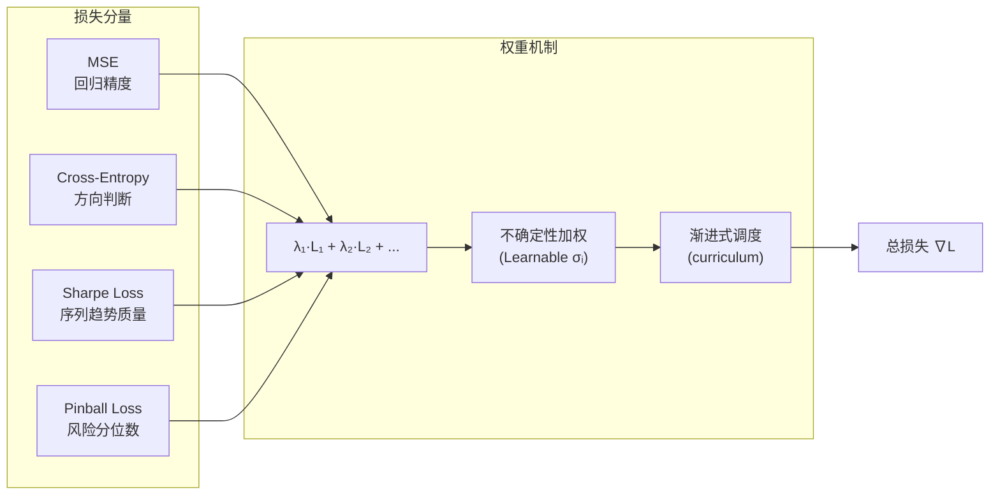

---
tags:
  - MachineLearning
  - DeepLearning
  - LossFunction
  - MultiTaskLearning
  - TimeSeries
  - Math
  - 概念性
title: CTM - Loss Functions
created: 2026-06-01
---

# CTM - Loss Functions — Multi-Objective Loss Design for Time Series & Finance

> [!abstract] Overview
> 单一损失函数（如纯 MSE）在复杂时序预测任务中往往不足。多目标损失通过组合多个损失分量来同时优化回归精度、序列趋势质量、方向准确率和风险度量。本文从通用设计原则出发，以 CTM 的 5 分量复合损失作为案例。

Related: [[CTM - StockModel Architecture]] | [[CTM - Training System]] | [[CTM - Ensemble and GBDT]]

---

## 1. Multi-Objective Loss Design — Core Principles

### What & Why

现实世界的时间序列预测几乎从来不是"预测准"就够了。一个优秀的预测可能需要同时满足：

- **数值准确**：预测值接近真实值（回归误差小）
- **方向正确**：涨跌判断准确（分类准确率高）
- **序列合理**：预测序列平滑、有趋势、可交易（Sharpe 比高）
- **风险感知**：能估计预测的不确定性（分位数准确）

单一损失函数无法覆盖所有这些维度。例如：

| 单目标 | 好但不够 | 坏处 |
|--------|---------|------|
| 纯 MSE | 数值准但方向乱 | 预测在零点附近震荡，没有趋势 |
| 纯分类 | 方向准但幅度偏 | 大波动时估值偏差大 |
| 纯 Sharpe | 序列趋势好但易过拟合 | 可能学到虚假模式或取极端仓位 |

**多目标损失**的核心思想：将多个损失分量以加权方式组合，每个分量监督模型的一个输出维度。

### Mathematical / Theoretical Foundation

**一般形式**：多目标损失是各分量损失的加权和：

$$\mathcal{L}_{\text{total}} = \sum_{i=1}^{N} \lambda_i \cdot \mathcal{L}_i$$

其中 $\lambda_i$ 是各任务的权重。这里的核心问题：**如何确定 $\lambda_i$？**

**各损失分量的通用公式**：

| 分量 | 公式 | 解决的问题 |
|------|------|-----------|
| MSE | $\frac{1}{n}\sum(y - \hat{y})^2$ | 基础回归精度 |
| Sharpe Loss | $-\sqrt{B} \cdot \frac{\mu(\hat{y})}{\sigma(\hat{y})}$ | 预测序列的交易价值（趋势质量）|
| Cross-Entropy | $-\sum y_c \log \hat{p}_c$ | 分类/方向判断 |
| Pinball Loss | $\sum [\tau \cdot (y - \hat{y})^+ + (\tau - 1) \cdot (y - \hat{y})^-]$ | 分位数回归/不确定性估计 |
| L2 Regularization | $\sum w^2$ | 防止过拟合 |

> [!note] Sharpe Loss 的直觉
> Sharpe Loss 让损失通过整个预测序列传播梯度。如果模型在某时间步的预测偏离了趋势方向，梯度会从整个序列返回——这迫使模型产生**序列级**而不是**逐点级**的合理预测。系数 $\sqrt{B}$（B 是年化交易日数）将评价尺度统一到年化 Sharpe。

**分位数回归 (Quantile Regression)** 的 Pinball Loss：

$$\mathcal{L}_\tau(y, \hat{p}) = \begin{cases}
\tau \cdot (y - \hat{p}) & y \geq \hat{p} \\
(\tau - 1) \cdot (y - \hat{p}) & y < \hat{p}
\end{cases}$$

当 $\tau=0.5$ 时退化为 MAE；$\tau=0.05$ 估计 5% 分位数（VaR 的常见选择）。

### Key Design Dimensions & Tradeoffs

| 设计维度 | 选项 | 取舍 |
|---------|------|------|
| **权重确定** | 手动调参 / 可学习 / 基于不确定性 | 手动可解释但耗时；可学习自动但可能不稳定 |
| **分量选择** | 少而精 / 大而全 | 少分量易调参；多分量覆盖全面但梯度可能冲突 |
| **权重调度** | 固定 / 渐进式 / 循环 | 固定简单；渐进式可改善训练初期稳定性 |
| **梯度聚合** | 加权和 / 梯度归一化 / PCGrad | 加权和最常用；梯度归一化缓解冲突 |
| **正则化策略** | 隐式(权重衰减) / 显式(L1/L2) / 辅助任务 | 组合使用效果通常最佳 |

**不确定性加权多任务学习 (Uncertainty Weighting, Kendall et al., 2018)**：

一种自动学习任务权重的通用方法。核心思想：每个任务 $i$ 学习一个噪声参数 $\sigma_i$（模型对该任务的置信度），损失函数自动为"不确信"的任务降低权重：

$$\mathcal{L} = \sum_i \left[ \frac{1}{2} \exp(-\log \sigma_i^2) \cdot \mathcal{L}_i + \frac{1}{2} \log \sigma_i^2 \right]$$

其中：
- $\exp(-\log \sigma_i^2)$ = 任务 $i$ 的可学习权重（高不确定性 = 低权重）
- $\frac{1}{2} \log \sigma_i^2$ = 正则项，防止权重坍缩到零



**权重调度策略 (Weight Scheduling)**：

训练初期模型输出不稳定，某些损失分量（如 Sharpe Loss）的梯度通过全序列传播可能加剧震荡。渐进式引入（curriculum learning for losses）是一种通用的稳定训练技巧：

```
Phase 1: λ_sharpe = 0,MSE only           → 先学"预测准"
Phase 2: λ_sharpe: 0 → target            → 渐进引入"有趋势"
Phase 3: λ_sharpe = target                → 稳定优化全目标
```

---

## 2. Case Study: CTM Implementation

### How CTM Applies This

CTM 的复合损失函数由 5 个分量组成，由 `LearnableWeights` 模块自动加权：

| 分量 | 公式 | 通用角色 | CTM 的具体用途 |
|------|------|---------|---------------|
| MSE | $\text{mean}((\text{pred} - \text{target})^2)$ | 连续值回归精度 | 预测收益率的数值准确度 |
| Sharpe Loss | $-\sqrt{252} \cdot \frac{\mu(\text{pred})}{\sigma(\text{pred})}$ | 预测序列的交易质量 | 鼓励平滑、有趋势的预测序列 |
| Cross-Entropy | $\text{CE}(\text{3-class})$ | 方向分类 | UP / NEUTRAL / DOWN 三分类 |
| Pinball Loss | $\tau(y - \hat{p})^+ + (\tau-1)(y - \hat{p})^-$ | 分位数回归 | VaR 估计（风险管理）|
| L2 Reg | $\sum w^2$ | 权重衰减 | 防止过拟合 |

### Design Decisions & Rationale

**1. 为什么用 5 分量而不是更少？**

金融预测的特殊性使得每个维度都不可省略：
- 纯 MSE 的模型预测会在零点附近震荡，没有交易价值
- 纯 Sharpe 的模型容易过拟合到历史噪声
- 没有 Pinball 的模型无法提供风险控制所需的分位数估计
- 没有正则项，低信噪比下模型几乎必然过拟合

**2. 为什么用可学习权重而非固定权重？**

```python
class LearnableWeights(nn.Module):
    def __init__(self, num_tasks):
        super().__init__()
        self.log_vars = nn.Parameter(torch.zeros(num_tasks))

    def forward(self, task_losses):
        total_loss = 0
        for i, loss in enumerate(task_losses):
            precision = torch.exp(-self.log_vars[i])
            total_loss += 0.5 * precision * loss + 0.5 * self.log_vars[i]
        return total_loss
```

`learnable_weights` 模块使用 Kendall et al. (2018) 的异方差不确定性方法。为什么不用手动调参？因为各损失分量的尺度差异大（MSE 约 1e-4，Cross-Entropy 约 1，Sharpe Loss 约 1e2），手动平衡需要大量实验。可学习权重自动适应训练过程中的尺度变化。

> [!warning] 可学习权重的局限
> 可学习权重并不保证收敛到最优平衡——如果某个任务的损失尺度天然较小，它的 $\sigma_i$ 可能坍缩到零使得该任务被忽略。实践中需要监控 $\log \sigma_i^2$ 的演化，必要时加入上下界约束。

**3. 为什么用 3 分类（UP/NEUTRAL/DOWN）而非二分或回归？**

中性类的引入是为了处理"难以判断"的样本。纯二分类（UP/DOWN）强制模型在所有时间步上做出方向判断，这在低信噪比的金融数据中会导致大量错误。三分类允许模型在不确定时输出 NEUTRAL，从而提高有效预测的准确率。

> [!warning] Loss Bridge 场景中的简化
> 在与 GBDT 集成（Loss Bridge）的场景中，Directional Loss 被简化为二分类 BCE，因为 GBDT 的梯度接口不直接支持三分类。详见 [[CTM - Ensemble and GBDT#^loss-bridge]]。

### Code / Configuration Example

```python
# Loss 配置
loss_config = LossConfig(
    use_sharpe=True,        # 启用 Sharpe Loss
    use_directional=True,   # 启用方向分类损失
    use_pinball=True,       # 启用 Pinball Loss
    sharpe_tau=0.05,        # VaR 95% 分位数
    class_weight="balanced" # 逆频率加权缓解类别不平衡
)

# LossWrapper 自动处理：
# 1. 目标构建：从数据提取回归目标 + 分类标签
# 2. 通道自适应：从模型属性推导 num_regression
# 3. 类别加权：自动计算逆频率
loss_fn = LossWrapper(
    model=ctm_model,
    config=loss_config
)
loss, loss_components = loss_fn(pred, batch)
# loss_components 包含各分量值，可用于日志记录
```

---

## 3. Key Takeaways

### When to Use This Pattern / Technique

- **复杂时序预测**：当"预测准"不等于"预测有用"时（金融、能源、供应链）
- **多维度评估的任务**：需要同时优化多个评价指标时
- **风险管理要求高**：需要分位数/不确定性估计的场景
- **多任务学习框架**：多个相关任务共享表示时的不确定性加权

### Common Pitfalls to Avoid

- **损失尺度不匹配**：各分量的数值尺度差异过大时，大尺度分量会主导梯度。标准化或可学习权重是必备的
- **权重调度缺失**：训练初期引入所有损失分量可能导致训练不稳定。渐进式引入（curriculum）显著改善
- **梯度冲突**：不同损失分量的梯度方向相反时，模型无法同时优化所有目标。监控梯度余弦相似度，必要时使用 PCGrad 等梯度调和技术
- **分位数越多越好？**：每个额外分位数增加输出维度，且分位数之间需要排序约束（monotonicity），否则会出现分位数交叉
- **可学习权重不是万能药**：它们不能替代合理的分量选择和尺度归一化，且需要监控以避免权重坍缩

### Related Concepts & Further Reading

- Kendall, Gal, & Cipolla, *Multi-Task Learning Using Uncertainty to Weigh Losses for Scene Geometry and Semantics* (CVPR 2018) — 不确定性加权的原始论文
- [[CTM - Training System]] — 损失的渐进式引入（Loss Warmup）策略
- [[CTM - Ensemble and GBDT#^loss-bridge]] — Loss Bridge：将复合损失传递给 GBDT
- [[CTM - StockModel Architecture]] — 产生多任务输出的模型架构
- PCGrad (Yu et al., 2020) — 梯度投影解决多任务梯度冲突
