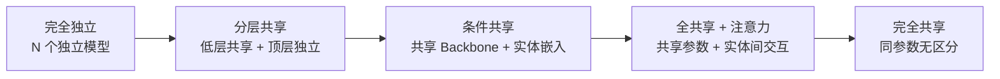
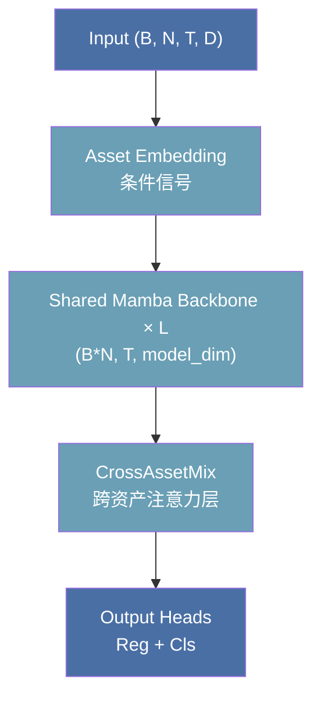

---
tags:
  - MachineLearning
  - MultiTaskLearning
  - CrossAssetModeling
  - AttentionMechanism
  - FinancialML
  - 定义性
title: CTM - MultiAsset Model
created: 2026-06-01
---

# CTM — Multi-Asset Modeling with Cross-Asset Attention

在金融、推荐系统、供应链等涉及大量相关实体的场景中，单独为每个实体训练模型既浪费数据也难以捕获实体间的联动关系。多资产建模的核心命题是：**如何让一个模型同时处理多个相关实体，并利用实体间的信息交互提升预测精度？**

## 1. Core Principles of Multi-Asset / Multi-Task Modeling

### What & Why

多资产建模面临三个基本矛盾：

| 矛盾 | 描述 |
|------|------|
| **共享 vs 独立** | 完全共享参数损失个性化信息，完全独立则损失跨实体迁移能力 |
| **信息交互 vs 噪声放大** | 资产间既有真实关联也有伪相关，不加区分地融合会引入噪声 |
| **计算效率 vs 模型容量** | 同时处理 $N$ 个资产要考虑张量布局对计算图的影响 |

### Parameter Sharing Strategies

多实体模型的参数共享是一个光谱，常见策略从完全独立到完全共享排列：



| 策略 | 参数效率 | 个性化能力 | 跨实体迁移 | 适用场景 |
|------|---------|-----------|-----------|---------|
| 完全独立 | 极低 | 最高 | 无 | 实体差异极大 |
| 分层共享 | 中 | 高 | 有限 | 底层特征通用，顶层任务特定 |
| **条件共享** | 高 | 中高 | 强 | 实体同质性好，有个体差异 |
| 全共享+注意力 | 高 | 中 | 强 | 实体间有强交互关系 |
| 完全共享 | 极高 | 无 | — | 实体无差异 |

> [!note] 条件共享是实践中最常用的折中方案
> 用一个共享 Backbone 捕获通用模式，再通过实体特定的条件信号（embedding, bias）注入个性信息，兼顾参数效率和个性化。

### Cross-Entity Information Flow

实体间的信息交互通常通过**注意力机制**实现，设计维度包括：

1. **交互维度**：在哪个张量维度上计算注意力？
   - 实体维度 (entity-wise)：同一时间步不同实体的交互
   - 时间维度 (temporal)：不同实体在时序上的交叉影响
   - 特征维度 (feature)：不同特征的实体间交互

2. **交互粒度**：
   - 全局交互：所有实体两两计算注意力，$O(N^2)$
   - 局部交互：基于先验结构（行业、地域）限制注意力范围
   - 稀疏交互：用 Top-k 或聚类选择交互实体

3. **动态 vs 静态偏置**：
   - 静态偏置：可学习的 $N \times N$ 矩阵，捕获实体间的固定关系
   - 动态偏置：随输入状态变化的偏置（如基于当前预测值调整）
   - 混合偏置：静态基础 + 动态调制

### Output Layout Design

多资产模型的输出层设计有两个关键选择：

- **展平输出 (Flatten)**：将所有资产的输出展平到最后一维，配合统一的 loss 函数
  - 优点：loss 计算简洁，批量操作高效
  - 缺点：需要在 loss 层做维度映射
- **分离输出 (Separate Heads)**：每个资产有独立的输出头
  - 优点：个性化更强
  - 缺点：参数多，且 $N$ 变化时需要调整结构

## 2. Case Study: CTM Implementation

### Architecture

MultiAssetCTM 采用**条件共享 + 跨资产注意力**的架构：



| 符号 | 含义 |
|------|------|
| $B$ | Batch size |
| $N$ | 资产数量 |
| $T$ | 序列长度（时间步） |
| $D$ | 输入特征维度 |
| $\text{model\_dim}$ | 模型隐藏维度 |

### Design Decision: Asset Embedding as Conditional Signal

**核心思想**：共享 Backbone 的参数对所有资产相同，无法感知当前处理的是哪个资产。Asset Embedding 通过在输入空间叠加一个**资产特定的偏置向量**，让 Mamba 能根据资产身份调整其内部状态演化轨迹。

```python
self.asset_embed = nn.Embedding(n_assets, embed_dim)  # (N, embed_dim)
self.cond_proj = nn.Linear(embed_dim, model_dim)       # 升维投影

# 前向
asset_embeds = self.asset_embed(asset_ids)              # (N, embed_dim)
cond_signal = self.cond_proj(asset_embeds)              # (N, model_dim)
cond = cond_signal.unsqueeze(0).unsqueeze(2)            # (1, N, 1, model_dim)
x = x + cond                                            # broadcast over B, T
```

> [!note] 低维嵌入瓶颈
> `embed_dim`（如 32）远小于 `model_dim`（如 256），形成一个信息瓶颈。这迫使嵌入空间学习到高效、可解释的资产表示——做 t-SNE 聚类可以看到同行业、同风格的资产自然聚集。

**为什么用加法而非拼接**？拼接会增加参数维度且打破模型的平移不变性。加法更简洁，直接将条件信号融入特征空间，等价于为每个资产学习一个「隐式偏置」。

### Design Decision: Shared Mamba Backbone

将 4D 输入 `(B, N, T, D)` reshape 为 3D `(B*N, T, D)` 后传入共享 Mamba：

```python
B, N, T, D = x.shape
x_reshaped = x.reshape(B * N, T, D)        # (B*N, T, D)
h = self.mamba_backbone(x_reshaped)         # (B*N, T, model_dim)
h = h.reshape(B, N, T, -1)                  # (B, N, T, model_dim)
```

| 优势 | 说明 |
|------|------|
| **参数高效** | $N$ 个资产共享一组参数，不会导致 $N$ 倍参数量 |
| **跨资产迁移** | 数据不足的资产从数据充足的资产学到通用时序模式 |
| **训练稳定** | 有效 batch size 从 $B$ 变为 $B \times N$，梯度更稳定 |
| **推理灵活** | 新资产只需新增嵌入向量，无需重训整个 Backbone |

### Design Decision: CrossAssetMix — Attention on Asset Dimension

CrossAssetMix 在**资产维度**上计算注意力，即每个时间步各资产独立交互。这等价于假设资产间的关系是**瞬时同步的**。

#### 单头版本 (CrossAssetAttention)

```python
# h: (B, N, T, model_dim) → (B*T, N, model_dim)
h_bt = h.permute(0, 2, 1, 3).reshape(B * T, N, D)

Q = self.q_proj(h_bt)      # (B*T, N, D)
K = self.k_proj(h_bt)      # (B*T, N, D)
V = self.v_proj(h_bt)      # (B*T, N, D)

scores = matmul(Q, K.T) / sqrt(D)          # (B*T, N, N)
scores = scores + self.adj_bias             # 可学习邻接偏置
attn_out = softmax(scores) @ V              # (B*T, N, D)
```

**可学习邻接偏置**：`adj_bias[i, j]` 表示资产 $j$ 对资产 $i$ 的先验关联强度（softmax 前偏置）。正偏置使 $j$ 更容易被 $i$ 注意。这个矩阵在训练中自动发现资产间关系（同行业、同因子暴露），无需人工预定义。

#### 多头 + GBDT 调制版本 (FusedMultiHeadCrossAttention)

多头版本扩展了容量，并引入 **GBDTModulator** 利用 GBDT 的预测动态调整偏置：

```python
class GBDTModulator(nn.Module):
    def __init__(self, model_dim, n_heads, n_assets):
        super().__init__()
        self.mlp = nn.Sequential(
            nn.Linear(2, 64),           # 输入: 两资产的 GBDT 预测差值
            nn.ReLU(),
            nn.Linear(64, n_heads),     # 输出: 每头一个偏置值
        )

    def forward(self, gbdt_preds):
        diff = gbdt_preds.unsqueeze(-1) - gbdt_preds.unsqueeze(-2)  # (B,T,N,N)
        bias = self.mlp(torch.stack([diff, diff.abs()], dim=-1))    # (B,T,N,N,n_heads)
        return bias.permute(0, 1, 4, 2, 3)                           # (B,T,n_heads,N,N)
```

> [!note] GBDT 调制偏置的物理含义
> 当 GBDT 对资产 $i$ 和 $j$ 的预测差距很大时（$|\text{pred}_i - \text{pred}_j|$ 大），说明二者处于不同市场状态。注意力权重应据此调整：可能降低它们的交互（走势分化），也可能升高（分化本身提供信号）。MLP 从数据中学习这种调度策略。

**完整的 CrossAssetMix 前向流程**：

```python
def forward(self, h, gbdt_preds=None):
    B, N, T, D = h.shape
    h_bt = h.permute(0, 2, 1, 3).reshape(B * T, N, D)

    # 多头 Q/K/V
    Q = self.q_proj(h_bt).reshape(B * T, N, n_heads, h_dim).transpose(1, 2)
    K = self.k_proj(h_bt).reshape(B * T, N, n_heads, h_dim).transpose(1, 2)
    V = self.v_proj(h_bt).reshape(B * T, N, n_heads, h_dim).transpose(1, 2)

    scores = matmul(Q, K.T) / sqrt(h_dim)
    scores = scores + self.adj_bias.unsqueeze(0)   # 可学习偏置

    if gbdt_preds is not None:
        mod_bias = self.gbdt_modulator(gbdt_preds)    # (B,T,n_heads,N,N)
        scores = scores + mod_bias.reshape(B*T, n_heads, N, N)

    attn_out = softmax(scores) @ V
    # ... reshape + 残差连接 + FFN
```

### Design Decision: Output Layout

```python
# h: (B, N, T, model_dim)
out_reg = self.reg_head(h)            # (B, N, T, output_dim)
out_cls = self.cls_head(h)            # (B, N, T, 3)

out_reg = out_reg.permute(0,2,1,3).reshape(B, T, N * output_dim)
out_cls = out_cls.permute(0,2,1,3).reshape(B, T, N * 3)
```

采用**展平输出**方案：所有资产的预测在最后一维展平，与 `LossWrapper` 中 `num_regression = N * output_dim` 配合。

### Complete Forward Flow

```python
def forward(self, x, asset_ids, gbdt_preds=None):
    # 1. Asset Embedding (条件信号)
    emb = self.asset_embed(asset_ids)                       # (N, embed_dim)
    cond = self.cond_proj(emb).unsqueeze(0).unsqueeze(2)    # (1, N, 1, model_dim)
    x = x + cond

    # 2. Shared Mamba Backbone
    B, N, T, D = x.shape
    h = self.mamba_backbone(x.reshape(B * N, T, D))         # (B*N, T, model_dim)
    h = h.reshape(B, N, T, -1)                              # (B, N, T, model_dim)

    # 3. CrossAssetMix
    h = self.cross_asset_mix(h, gbdt_preds)                 # (B, N, T, model_dim)

    # 4. Output Heads + 布局重排
    out_reg = self.reg_head(h).permute(0,2,1,3).reshape(B, T, N * output_dim)
    out_cls = self.cls_head(h).permute(0,2,1,3).reshape(B, T, N * 3)
    return out_reg, out_cls
```

## 3. Key Takeaways

### When to Use This Pattern

- **实体数量多且同质性好**（如股票池、商品池、用户群）：共享 Backbone 能充分利用聚合数据
- **实体间存在可学习的关联**（同行业、同风格、供应链关系）：跨资产注意力能捕获这些关系
- **单个实体数据量不足**：跨实体迁移使数据稀疏的实体受益
- **需要在线加入新实体**：条件共享架构只需新实体 embedding，无需重训

### Common Pitfalls to Avoid

1. **$N$ 变化时的张量对齐**：如果资产池动态变化（停牌、退市、上市），`adj_bias` 的大小需要相应调整。建议预留最大 $N$ 并做 mask。
2. **注意力过度平滑**：所有资产注意力权重趋同时，跨资产交互退化为平均池化。可用 entropy regularization 鼓励注意力聚焦。
3. **计算开销 $O(N^2)$ 扩展性**：$N > 500$ 时，完整注意力矩阵的计算和存储成本过高。考虑分块、稀疏化或采样。
4. **资产嵌入与 Backbone 的交互不足**：如果仅将嵌入加到输入层，深层 Backbone 可能遗忘资产身份。可在每层都注入条件信号。
5. **时序对齐**：不同资产的观测时间点可能不同（非均匀采样），reshape 为 `(B*N, T)` 前需确保时间轴对齐。

### Related Concepts & Further Reading

- [[CTM - StockModel Architecture]] — 单资产 CTMStockModel，Shared Backbone 的基础
- [[CTM - Ensemble and GBDT]] — GBDTModulator 的上游，多资产 + 多模型的组合
- [[CTM - Loss Functions]] — 复合损失与展平输出的衔接
- **Multi-Task Learning** (Caruana, 1997) — 多任务学习的理论框架
- **Cross-Attention / Transformer Decoder** (Vaswani et al., 2017) — 注意力机制的原点
- **Entity Embeddings** (Cheng et al., 2016) — 分类特征嵌入的经典方法
- **Parameter-Efficient Transfer Learning** — 条件共享在 LLM 微调中的广泛应用
