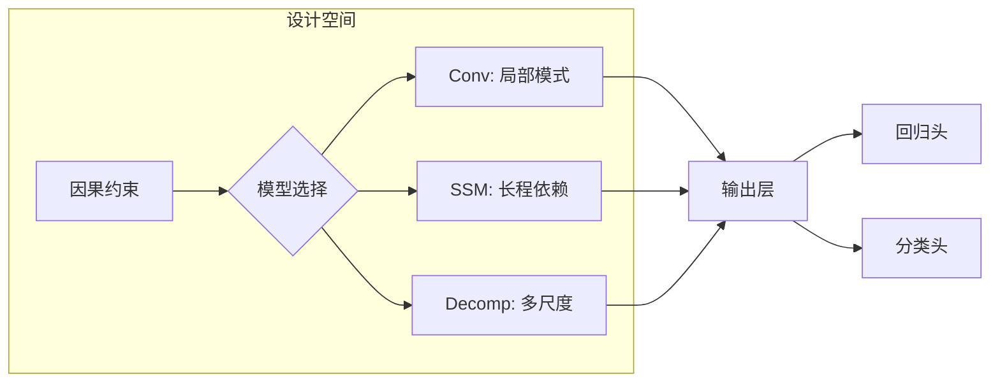
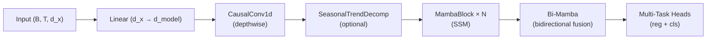

---
tags:
  - MachineLearning
  - Architecture
  - TimeSeries
  - DeepLearning
  - SequenceModel
  - Math
  - 概念性
title: CTM - StockModel Architecture
created: 2026-06-01
---

# CTM - StockModel Architecture — Time Series Model Architecture for Financial Data

> [!abstract] Overview
> 时序模型架构设计的核心挑战：如何在满足因果约束的前提下，同时捕捉局部模式、长期依赖和多尺度时间结构。本文从通用设计原则出发，以 CTM 作为具体案例进行分析。

Related: [[CTM - Loss Functions]] | [[CTM - Training System]] | [[CTM - Mamba and S6 SSM]] | [[Mamba]]

---

## 1. Time Series Model Architecture — Core Principles

### What & Why

时序建模与标准序列建模（如 NLP）有本质区别：

- **因果约束**：预测 $y_t$ 时只能使用 $x_{\le t}$，不能看到未来——这与机器翻译等双向任务完全不同
- **非平稳性**：金融时序的统计特性随时间变化，模型需要适应分布漂移
- **多尺度结构**：局部波动（分钟级）、中周期（日/周）和长期趋势（月/年）共存
- **低信噪比**：金融数据的可预测成分极弱，模型设计需注重正则化和稳定性

一个好的时序架构需要在以下能力之间取得平衡：

| 能力 | 含义 | 典型实现 |
|------|------|---------|
| 局部模式提取 | 捕捉邻近时间步的短程依赖 | 卷积、核方法 |
| 长程依赖建模 | 捕捉远距离时间步的依赖 | RNN、Transformer、SSM |
| 趋势-周期分解 | 分离信号的不同时间尺度 | 移动平均、STL 分解 |
| 多任务输出 | 从同一表示产生多个预测目标 | 共享主干 + 独立头 |

### Mathematical / Theoretical Foundation

**因果建模 (Causal Modeling)**：时序预测的核心条件是未来信息不可用于当前预测。对卷积来说，这意味着只使用左侧 padding：

$$y_t = f(x_t, x_{t-1}, \dots, x_{t-k+1})$$

对 SSM / RNN 来说，因果性通过递推式隐状态自然保证：

$$h_t = f(h_{t-1}, x_t), \quad y_t = g(h_t)$$

**季节-趋势分解 (Seasonal-Trend Decomposition)**：将序列分解为趋势 $t_t$ 和季节/残差 $s_t$，是处理非平稳性的经典技术：

$$s_t = x_t - \text{MA}(x_t), \quad t_t = \text{MA}(x_t)$$

其中 $\text{MA}$ 是移动平均。分解后各分量可用不同子网络处理。

**残差连接与 Pre-Norm (Residual Connections)**：深层网络的训练核心模式：

$$x_{\ell+1} = x_\ell + \mathcal{F}(\text{Norm}(x_\ell))$$

Pre-Norm（先归一化再进入子层）相比 Post-Norm 在深层网络中训练更稳定 (Xiong et al., 2020)。

**深度可分离卷积 (Depthwise Separable Convolution)**：标准卷积的参数量为 $O(C_{\text{in}} \times C_{\text{out}} \times k)$，深度可分离卷积将其分解为逐通道卷积 + 逐点卷积，参数量降至 $O(C_{\text{in}} \times k) + O(C_{\text{in}} \times C_{\text{out}})$：

$$\text{DepthwiseConv}(x) = \text{Conv}(x, \text{groups}=C_{\text{in}})$$

在参数量受限时（如金融模型需要防止过拟合），这是一个关键效率设计。

### Key Design Dimensions & Tradeoffs

| 设计维度 | 选项 | 取舍 |
|---------|------|------|
| **因果 vs 双向** | 因果 padding / 双向 padding | 因果保证实时可用性，双向提供更丰富的上下文但会泄漏未来 |
| **卷积类型** | 标准 / 深度可分离 / 空洞 | 标准容量大但参数多，深度可分离省参数，空洞扩大感受野 |
| **长程建模** | RNN / Transformer / SSM(Mamba) | RNN 线性但无法并行；Transformer 并行但 $O(T^2)$；SSM 折中 |
| **分解策略** | 硬分解(MA) / 软分解(可学习) | 硬分解简单可解释，软分解更灵活但易过拟合 |
| **多任务结构** | 共享头 / 分离头 | 共享头促进迁移学习，分离头避免任务间干扰 |



---

## 2. Case Study: CTM Implementation

### How CTM Applies This

CTM (Conv-Temporal-Mamba) 的完整管线演示了如何将这些通用原则组合成一个可工作的金融时序架构：



| 组件 | 对应通用概念 | CTM 的具体选择 |
|------|-------------|---------------|
| Linear Projection | 特征映射 | `nn.Linear(d_x, d_model)` |
| CausalConv1d | 因果 + 深度可分离卷积 | `groups=d_model`, 左 padding |
| SeasonalTrendDecomp | 季节-趋势分解 | 移动平均, kernel=25/51, 可选 |
| MambaBlock × N | SSM 长程建模 | S6 selective scan, 堆叠 N 层 |
| Bi-Mamba | 双向融合（训练时） | `torch.flip` + concat |
| Output Heads | 多任务输出 | 回归头 + 三分类头 |

### Design Decisions & Rationale

**1. 为什么用 CausalConv1d 而非标准 Conv1d？**

金融预测的核心约束：测试/部署时只能使用历史数据。`pad(x, (d_conv-1, 0))` 确保左侧 padding、右侧无 padding，严格保证因果关系。

**2. 为什么用深度可分离卷积？**

参数量从 $O(d_{\text{model}}^2 \times d_{\text{conv}})$ 降至 $O(d_{\text{model}} \times d_{\text{conv}})$。对于金融数据（通常只有几百到几千条训练样本），减少参数量是防御过拟合的第一道防线。

**3. 为什么分解默认关闭？**

SeasonalTrendDecomp 作为可选组件。原因是金融时序的季节性不稳定——不同市场周期、不同资产类别的季节性模式差异大，硬编码的移动平均核可能引入偏差。

**4. 为什么用 Bi-Mamba（训练时双向，推理时只用正向）？**

训练时双向融合提供更丰富的梯度信号，帮助 MambaBlock 学习更好的表示。推理时只用正向，因为：
- 实时交易中无法获取未来数据
- 正向 Mamba 已是因果模型

> [!note] torch.flip 是零拷贝操作
> `torch.flip` 仅改变张量的 stride，不分配新内存。因此 Bi-Mamba 在训练时几乎没有额外显存开销。

**5. 为什么 Pre-Norm + Residual？**

Pre-Norm 在 MambaBlock 堆叠时提供了更稳定的训练动态。每个 block 的流程：

```python
residual = x
x_norm = norm(x)
x_mamba, _ = block(x_norm)
x = residual + dropout(out_proj(x_mamba))
```

每个 block 有独立的 `out_proj`（Bi-Mamba 后维度翻倍，需要投影回 `d_model`），但 Norm 权重共享与否均可。

### Code / Configuration Example

```python
# CTMStockModel 配置示例
model_config = {
    "d_model": 128,          # 模型维度
    "d_conv": 4,             # 卷积核大小
    "n_layers": 4,           # MambaBlock 层数
    "decomp_kernel": 25,     # 季节分解核大小 (0=关闭)
    "bidirectional": True,   # 训练时双向融合
    "dropout": 0.1,          # Dropout 率
}

# 核心卷积实现 (nn.Parameter + F.conv1d)
self.conv = nn.Parameter(torch.randn(d_model, 1, d_conv))
# Forward
x = F.conv1d(x_padded, weight=self.conv, groups=d_model)
```

---

## 3. Key Takeaways

### When to Use This Pattern / Architecture

- **金融/经济预测**：因果约束 + 深度可分离卷积 + SSM 的组合非常适合低信噪比、强因果的场景
- **任何需要因果推理的时序任务**：如自动驾驶轨迹预测、工业异常检测
- **多目标预测**：当需要同时输出连续值和离散类别时，共享主干 + 独立头的模式比分开训练更高效

### Common Pitfalls to Avoid

- **因果泄漏**：padding 方向错误（用了右 padding）会导致未来信息泄漏，获得虚假的高验证性能
- **分解滥用**：硬分解（固定 MA 核）在非平稳数据上可能引入虚假模式，始终用验证集确认分解是否真的提升性能
- **过度参数化**：金融时序通常样本有限，深度可分离卷积和参数共享不是可选项而是必需品
- **双向泄漏**：训练时使用双向但在推理时切回单向会造成分布偏移——确保二者转换平滑或使用 dropout 的方式弥合差距

### Related Concepts & Further Reading

- [[Mamba]] — SSM 与 S6 selective scan 的通用理论
- [[CTM - Loss Functions]] — 配合此架构的多目标损失设计
- [[CTM - Training System]] — 含 RecurrentCTM 循环共享权重的训练策略
- ALBERT (Lan et al., 2019) — 跨层参数共享的先驱
- Xiong et al., *On Layer Normalization in the Transformer Architecture* (2020) — Pre-Norm vs Post-Norm 分析
- Chen & Sun, *DMamba: Decomposition-enhanced Mamba* (2026) — 季节-趋势分解增强的状态空间模型
