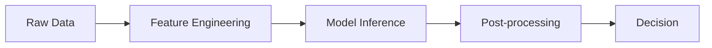
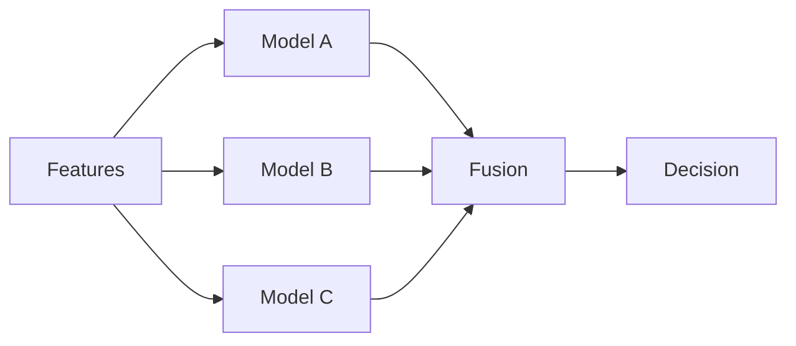
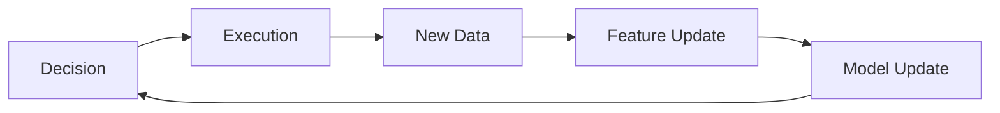
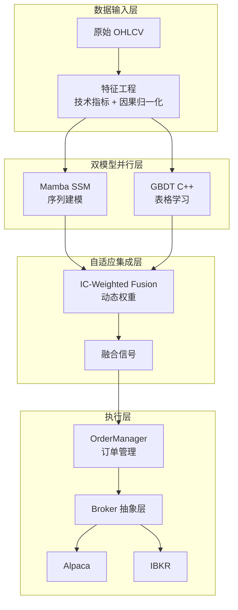

---
tags:
  - MachineLearning
  - Architecture
  - SystemDesign
  - 定义性
title: CTM - System Overview
created: 2026-06-01
---

# CTM - System Overview

*从通用视角理解端到端 ML 系统的设计原则与架构模式*

> [!abstract] 本文定位
> 本文阐述**端到端 ML 系统**的通用设计原则——从原始数据到业务决策的完整链路如何架构。CTM (Conv-Temporal-Mamba) 项目作为贯穿全文的案例，展示这些原则在量化交易系统中的具体实现。

## 1. 端到端 ML 系统设计——核心原则

### 端到端 ML 系统的基本认知

一个真正的端到端 ML 系统，区别于"在 Jupyter Notebook 里跑模型"的关键在于：

- **数据流的有向性**：每个环节的输入输出都有明确的契约和边界
- **因果链的完整性**：从原始数据到最终决策的每一条路径都有时间顺序保证
- **组件的可替换性**：任何组件都可以独立升级、替换或 A/B 测试
- **可观测性**：系统内部状态对调试和监控透明

> [!note] 核心洞察
> ML 系统的架构设计本质上是在做**不确定性管理**。模型的预测有不确定性，数据有不确定性，外部环境有不确定性。好的架构用确定性边界包裹不确定性核心。

### 关键架构维度

每个 ML 系统设计都面临以下维度的权衡。理解这些维度是做出正确选型的前提。

| 维度 | 左极 | 右极 | 设计含义 |
|------|------|------|---------|
| **耦合模式** | 紧耦合单体 | 松耦合微服务 | 影响迭代速度与部署灵活性 |
| **时间边界** | 严格因果 | 近似因果 | 影响模型可靠性与特征丰富度 |
| **计算延迟** | 实时推理 | 批处理 | 影响技术选型与硬件需求 |
| **集成拓扑** | 串行管道 | 并行集成 | 影响模型容错性与性能上限 |
| **状态管理** | 有状态 | 无状态 | 影响系统复杂度和恢复能力 |

**耦合度选择**是第一个需要做出的决策。紧耦合单体系统在开发效率上有优势，适合研究阶段的快速迭代。松耦合微服务架构适合生产环境中的独立扩展和故障隔离。

**因果保证**在时间序列 ML 系统中格外关键。严格的因果保证要求系统中的每一个计算步骤都不使用未来信息，这包括特征计算、归一化、模型验证等所有环节。因果泄露是时间序列 ML 系统中最常见也最隐蔽的错误来源。

### 管道拓扑模式

ML 系统中常见的三种管道拓扑各有适用场景。

**串行管道** (Sequential Pipeline)



- 优点：逻辑清晰、易于调试
- 缺点：延迟累加、单点故障
- 适用：流程固定、环节依赖明确的场景

**并行集成** (Parallel Ensemble)



- 优点：模型互补、鲁棒性高
- 缺点：计算资源翻倍、融合策略需要设计
- 适用：异构模型组合、需要高稳健性的场景

**反馈闭环** (Feedback Loop)



- 优点：自适应、持续改进
- 缺点：容易引入分布偏移，需要监控
- 适用：在线学习、动态环境

### 跨模型集成策略

多模型系统面临的核心问题：如何组合异构模型的输出？

| 策略 | 耦合深度 | 自适应能力 | 实现复杂度 | 过拟合风险 |
|------|---------|-----------|-----------|-----------|
| **加权融合** | 浅 (信号层) | 低 (固定权重) | 低 | 低 |
| **自适应加权** | 浅 (信号层) | 高 (权重动态调整) | 中 | 中 |
| **特征注入** | 中 (特征层) | 中 | 中 | 中 |
| **损失桥接** | 深 (梯度层) | 高 | 高 | 中 |
| **元模型调制** | 深 (决策层) | 高 | 高 | 高 |

加权融合是最简单也最稳健的方式，但无法捕捉模型的动态表现变化。自适应加权（如 IC-Weighted Fusion）在此基础上引入动态性，用模型近期的表现指标来调整权重。损失桥接通过梯度传递实现更深层的融合，但也增加了系统的耦合度。

> [!warning] 集成过拟合警告
> 集成层级越深，过拟合风险越高。P3 级别的调制器需要严格的 Walk-Forward 验证来确保其泛化能力。推荐从最浅的集成方式开始，只有确认简单方式不足时才增加深度。

---

## 2. Case Study: CTM 实现

### 系统架构全景

CTM 采用**并行集成拓扑 + 自适应加权融合**的架构，核心设计体现为两条处理路径。



CTM 在上述通用架构维度上的具体选型：

| 维度 | CTM 的选择 | 选择理由 |
|------|-----------|---------|
| **耦合模式** | 紧耦合单体 (Python 进程内) | 研究阶段效率优先，支持快速实验 |
| **时间边界** | 严格因果 (CausalConv1D + Walk-Forward) | 金融数据对因果泄露零容忍 |
| **计算延迟** | 批处理为主 (日频/分钟频) | 非高频场景，批处理足够 |
| **集成拓扑** | 并行集成 (Mamba + GBDT) | 序列与表格知识互补 |
| **状态管理** | 有状态 (Mamba 循环隐藏状态) | 序列建模需要跨时间步的状态 |

### 设计决策与原理

**决策 1: 为什么选择 Mamba + GBDT 双模型架构？**

这是由数据特性决定的。股票预测数据同时包含两种结构：(1) 时间序列结构——过去的价格序列包含未来价格的隐式信息；(2) 表格结构——技术指标、截面特征包含静态比较信息。单一模型很难同时捕捉这两种结构，Mamba 擅长前者，GBDT 擅长后者。

**决策 2: 为什么用 IC-Weighted Fusion 而不是 Stacking？**

IC (Information Coefficient) 是金融领域衡量预测与真实值相关性的标准指标。用它作为权重的好处是：(a) 具有领域可解释性；(b) 权重计算方式简单，不需要额外的验证集来拟合元模型；(c) 相较于固定权重，能自适应地反映模型近期的表现变化。

IC-Weighted Fusion 公式：

$$w_{\text{ctm}} = \frac{|IC_{\text{ctm}}|}{|IC_{\text{ctm}}| + |IC_{\text{gbdt}}| + \epsilon}$$

$$\text{fused} = w_{\text{ctm}} \cdot \text{ctm\_pred} + (1 - w_{\text{ctm}}) \cdot \text{gbdt\_pred}$$

**决策 3: 为什么设计四级集成 (P0-P3)？**

不同场景需要不同的集成深度。P0（信号级融合）最稳健，适合快速验证。P2（损失桥接）是核心创新，将 CTM 的复合损失通过梯度传递给 GBDT。P3（调制器）适合多资产场景中的跨资产关系建模。这种渐进式设计让用户可以从简单开始，只在需要时增加复杂度。

| 层级 | 方法 | 集成深度 | 推荐场景 |
|------|------|---------|---------|
| P0 | IC-Weighted Ensemble | 信号层 | 快速验证、稳定性优先 |
| P1 | 特征注入 (隐藏状态 to GBDT 特征) | 特征层 | 需要间接传递序列信息 |
| P2 | Loss Bridge (梯度传递) | 梯度层 | 核心场景，多数情况下效果最好 |
| P3 | 神经网络调制器 | 决策层 | 多资产、跨资产关系建模 |

### 关键代码模式

**残差连接 + SSM 块堆叠**——这是深度学习跳连 (Skip Connection) 在 SSM 上的应用：

```python
# 每个 MambaBlock 外包裹残差连接 + Pre-Norm
for block, out_proj, norm in zip(self.mamba_blocks, self.mamba_out_projs, self.norms):
    residual = x
    x_norm = norm(x)
    x_mamba, _ = block(x_norm)
    x = residual + self.dropout(out_proj(x_mamba))
```

这种模式的核心价值在于：SSM 的递推结构面临梯度衰减问题，残差连接提供了梯度的"高速公路"，让深层堆叠成为可能。

---

## 3. Key Takeaways

### 何时采用端到端 ML 系统架构

- **多环节依赖清晰**：数据 to 特征 to 模型 to 决策的链路中，各环节边界明确
- **需要严格的因果保证**：特别是金融、医疗等对时间顺序敏感的领域
- **异构模型有互补效应**：单一模型已达瓶颈，多模型组合能突破上限
- **系统需要持续演进**：组件可替换性是系统长期维护的关键

### 常见陷阱

| 陷阱 | 表现 | 预防 |
|------|------|------|
| **因果泄露** | 特征工程中用了未来数据，模型看似完美实则无效 | 严格执行 Walk-Forward，特征计算中禁止前视窗口 |
| **集成过拟合** | 融合层在验证集上表现优秀，实盘失效 | 从最简单的融合开始 (P0)，只有必要时才增加深度 |
| **过度耦合** | 修改特征工程需要同时修改模型和融合层 | 明确定义组件接口，保持层间契约稳定 |
| **技术选型过早优化** | 为尚未出现的瓶颈问题选择复杂架构 | 从单体开始，用数据驱动架构演化 |

### 相关概念

- [[MLOps]] — ML 系统工程化与运维
- [[Walk-Forward Validation]] — 时间序列验证框架
- [[CTM - Architecture Patterns]] — ML 系统设计模式详解
- [[CTM - Mamba and S6 SSM]] — SSM 理论落地
- [[CTM - Ensemble and GBDT]] — 集成策略深究
- [[Mamba]] — SSM 基础理论
