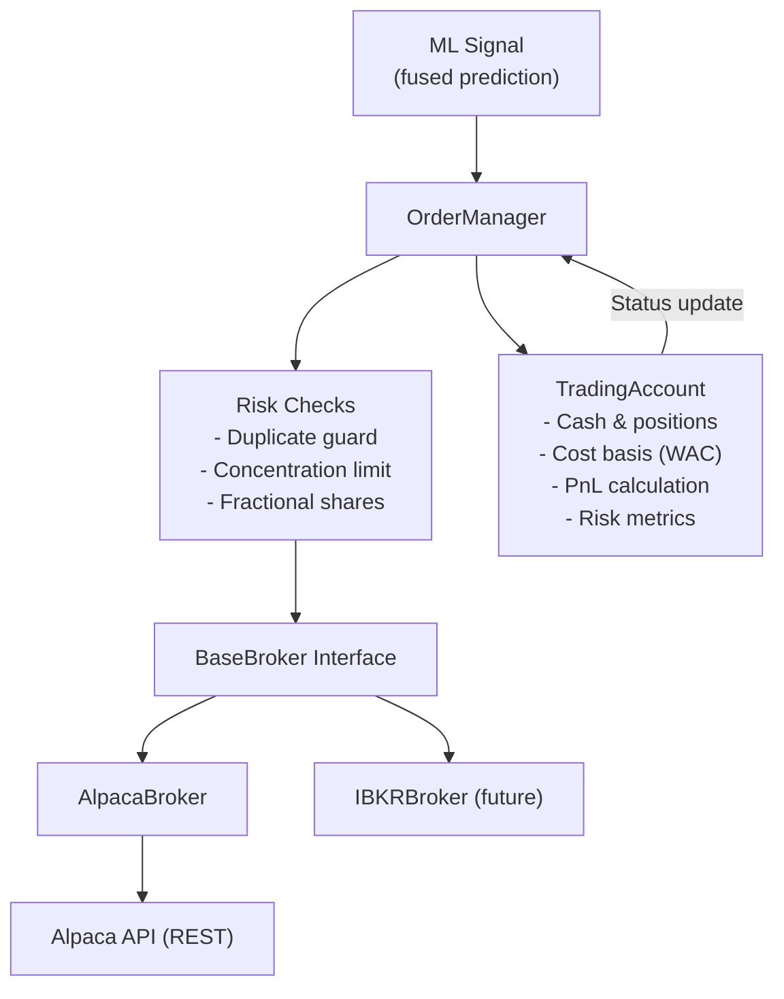

---
tags:
  - MachineLearning
  - SystemDesign
  - TradingSystems
  - ComputerScience
  - 交易系统
  - 系统设计/架构模式
title: CTM - Trading Execution
created: 2026-06-01
---

# CTM — Trading System Architecture: Broker 抽象层与订单管理

## 1. Trading System Architecture — 核心原则

### 是什么与为什么

交易系统将 ML 预测连接到真实市场。核心挑战是**管理复杂性**——生产级交易系统必须处理 Broker 连接、订单生命周期、仓位跟踪、风险控制和 PnL 核算，同时保持可测试性和 Broker 无关性。

标准的架构模式将这些关注点分层隔离：

```
Signal Source (ML Model)
    |
    v
Order Manager (decision logic, risk checks)
    |
    v
Broker Abstraction (strategy pattern)
    |
    v
Broker API (Alpaca, IBKR, etc.)
    |
    v
Exchange
```

这种解耦意味着你可以切换 Broker、更改风控规则或替换信号源，而无需重写整个系统。

### 关键设计维度与取舍

**Broker 抽象层（Strategy Pattern）**

Broker 抽象层是架构的骨干。`BaseBroker` 接口定义了契约：

```python
class BaseBroker(ABC):
    @abstractmethod
    def connect(self) -> bool: ...
    @abstractmethod
    def get_account(self) -> AccountInfo: ...
    @abstractmethod
    def place_order(self, symbol, qty, side, type, ...) -> Order: ...
    @abstractmethod
    def get_bars(self, symbols, timeframe, ...) -> pd.DataFrame: ...
    @abstractmethod
    def supports_fractional_shares(self) -> bool: ...
```

| 方法 | 优点 | 缺点 |
|----------|------|------|
| 单一具体类 | 简单、原型开发快 | 绑定单一 Broker；难以测试 |
| 抽象类 + 每个 Broker 独立实现 | 可测试、可切换 Broker、职责清晰 | 更多模板代码；接口设计需预判所有 Broker |
| Protocol / 结构类型（Python） | Duck-typed，无需继承 | 契约不够显式；难以强制完整性 |

**订单管理模式**

订单经历生命周期：`new → accepted → filled (full | partial) → done (filled | canceled | rejected)`。系统必须处理：

- **重复预防**：避免同一订单发送两次
- **成交同步**：市价单可能立即成交或随时间逐步成交
- **部分成交**：将大订单拆分为多个小成交
- **撤单**：信号变化时能够撤销未成交订单

> [!note] 成交模型
> 回测时假设立即成交。实盘交易使用市价单（高成交概率），异步处理部分成交。限价单增加滑点控制但可能无法成交。

**仓位管理与成本基础**

**加权平均成本法**是跟踪入场价格的标准方法：

$$\text{avg\_price}_{\text{new}} = \frac{\text{avg\_price}_{\text{old}} \times qty_{\text{old}} + \text{fill\_price} \times fill\_qty}{qty_{\text{old}} + fill\_qty}$$

当前价格 $p_t$ 下的未实现 PnL：

$$\text{unrealized\_PnL} = (p_t - \text{avg\_entry\_price}) \times qty$$

**风险管理维度**

| 指标 | 公式 | 目的 |
|--------|---------|---------|
| 总敞口（Gross Exposure） | $\sum \|\text{position\_value}_i\|$ | 总风险资本 |
| 仓位集中度（Position Concentration） | $\frac{\|\text{position\_value}\|}{\text{portfolio\_value}}$ | 单一标的风险限额 |
| 购买力（Buying Power） | `account_info.buying_power` | 新开仓可用资金 |
| 杠杆率（Leverage） | $\frac{\text{exposure}}{\text{equity}}$ | 资本效率与风险 |



## 2. 案例研究：CTM 实现

### 架构概览

CTM 实现了标准的三层架构：`OrderManager` 编排执行逻辑，`BaseBroker` 提供抽象层，`TradingAccount` 跟踪状态。

```
Signal (fused_signal) → OrderManager → BaseBroker → AlpacaBroker
                              |
                        TradingAccount (cash, positions, PnL, risk)
```

### Broker 实现：AlpacaBroker

**延迟初始化（Lazy Initialization）**

网络客户端（TradingClient、MarketDataClient）在首次使用时创建，而非构造时创建。这避免了对象创建时的连接开销，并在测试中实现干净的依赖注入。

```python
class AlpacaBroker(BaseBroker):
    def __init__(self, api_key, secret_key, base_url, paper=True):
        self._api_key = api_key
        self._secret_key = secret_key
        self._base_url = base_url
        self._paper = paper
        self._trade_client = None     # Lazy: created on first use
        self._data_client = None      # Lazy: created on first use

    @property
    def trade_client(self):
        if self._trade_client is None:
            self._trade_client = TradingClient(...)
        return self._trade_client
```

**带指数退避的重试（Retry with Exponential Backoff）**

网络调用（下单、账户查询）使用重试装饰器包装。这对生产环境可靠性至关重要——Broker API 可能出现瞬时故障。

```python
_RETRY_EXCEPTIONS = (TimeoutError, ConnectionError, OSError)

def _retry_on_failure(max_retries=3, base_delay=1.0):
    def decorator(func):
        def wrapper(*args, **kwargs):
            for attempt in range(max_retries):
                try:
                    return func(*args, **kwargs)
                except _RETRY_EXCEPTIONS as e:
                    if attempt == max_retries - 1:
                        raise
                    time.sleep(base_delay * (2 ** attempt))
        return wrapper
    return decorator
```

**名义金额（Dollar-Based）订单支持**

对于碎股（qty < 1.0），Alpaca 要求使用美元金额订单而非股数订单。Broker 自动处理此分支：

```python
if qty < 1.0:
    order = self.trade_client.submit_order(
        symbol=symbol,
        notional=qty * current_price,   # Dollar-valued fractional share
        side=side,
        type=type,
    )
else:
    order = self.trade_client.submit_order(
        symbol=symbol, qty=qty, ...
    )
```

### Order Manager：生命周期与风险控制

`OrderManager.execute_signal()` 实现了一个四阶段执行管线：

1. **重复订单防护** — 如果同一标的/方向已有未成交订单，则跳过
2. **集中度风险检查** — 如果目标仓位超过集中度限制，则拒绝
3. **碎股检查** — 如果需要，委托 Broker 的名义金额订单路径
4. **立即成交处理** — 市价单同步成交；成交时更新 `TradingAccount`

```python
def execute_signal(self, symbol, target_qty, side):
    if self._has_open_order(symbol, side):
        logger.warning(f"Duplicate order guard: {symbol} {side}")
        return None
    if not self._pass_concentration_check(symbol, target_qty):
        logger.warning(f"Concentration risk: {symbol} qty={target_qty}")
        return None

    order = self.broker.place_order(symbol, target_qty, side, type="market")
    if order.status == "filled":
        self.account.apply_fill(order)
    return order
```

**批量执行**：`execute_signals(signals)` 遍历信号列表，对每个信号调用 `execute_signal`。失败订单（风控拒绝）被静默跳过。

**再平衡**：`rebalance_to_targets(target_positions)` 计算当前仓位与目标仓位之间的差值，仅生成所需的交易：

```python
def rebalance_to_targets(self, target_positions: Dict[str, float]):
    current = self.account.get_positions()
    orders = []
    for symbol, target_qty in target_positions.items():
        current_qty = current.get(symbol, 0.0)
        delta = target_qty - current_qty
        if abs(delta) < self.MIN_TRADE_THRESHOLD:
            continue
        side = "buy" if delta > 0 else "sell"
        order = self.execute_signal(symbol, abs(delta), side)
        orders.append(order)
    return orders
```

### 数据模型

所有模型使用 `@dataclass`，精度为 `float`（支持碎股）：

```python
@dataclass
class Order:
    id: str
    symbol: str
    side: str                    # buy / sell
    qty: float
    type: str                    # market / limit / stop
    status: str                  # new / filled / partial / canceled
    filled_qty: float
    filled_avg_price: Optional[float]
    created_at: datetime
    updated_at: datetime

@dataclass
class Position:
    symbol: str
    qty: float
    market_value: float
    avg_entry_price: float
    unrealized_pl: float
    current_price: float
    change_today: float

@dataclass
class AccountInfo:
    cash: float
    portfolio_value: float
    buying_power: float
    equity: float
    long_market_value: float
    short_market_value: float
    status: str                  # active / frozen / closed
```

### 设计模式总结

| 模式 | 应用 | 原理 |
|---------|-------------|-----------|
| **Strategy** | `BaseBroker` → `AlpacaBroker` / `IBKRBroker` | Broker 实现可在运行时切换 |
| **Decorator** | `_retry_on_failure()` | 横切关注点（容错）与业务逻辑分离 |
| **Adapter** | `AlpacaBroker` | 将 Alpaca 原生 SDK 包装为统一的 `BaseBroker` 接口 |
| **Lazy Initialization** | `TradingClient` / `MarketDataClient` 属性 | 避免不必要的连接；简化测试 |
| **Observer（发布-订阅）** | `TradingAccount` + `OrderManager` | 成交事件自动传播到账户状态 |
| **Repository** | `get_open_orders()`, `get_order_history()` | 抽象的订单存储（内存或持久化） |

## 3. 关键要点

### 何时使用该模式/技术

- **Broker 抽象层**：只要连接实盘 Broker 或计划支持多个 Broker 时使用。抽象成本低，灵活性收益高。
- **Broker 接口的 Strategy Pattern**：当需要从同一代码库进行确定性测试（Mock Broker）、模拟交易和实盘交易时使用。
- **API Client 的延迟初始化（Lazy Initialization）**：当 Broker SDK 构造开销大或需要网络连接时使用。
- **加权平均成本法**：符合 FIFO 的仓位跟踪标准方法。始终优先于简单平均。

### 常见陷阱与避免方法

1. **Broker 接口过度抽象**：并非所有 Broker 都支持相同功能（碎股、盘前盘后、订单类型）。围绕所有目标 Broker 的交集设计接口，或使用特性检测方法如 `supports_fractional_shares()`。
2. **忽略部分成交**：市价单可能逐步成交。你的 `OrderManager` 必须处理 `order.status == "partially_filled"` 并跟踪剩余未成交数量。CTM 通过使用立即成交的市价单简化处理，但生产系统需要部分成交处理。
3. **重复订单防护中的竞态条件**：检查未成交订单和提交新订单并非原子操作。在高频场景下，防护可能遗漏并发提交。必要时使用幂等键。
4. **名义金额订单的陈旧价格**：计算 `qty * current_price` 使用了缓存价格。在波动市场中，缓存价格可能过时，导致名义价值偏离预期敞口。使用实时报价。
5. **未处理 Broker API 频率限制**：大多数 Broker 会限制 API 调用频率。你的重试装饰器应区分瞬时错误（重试）和限流错误（退避 + 等待重置）。

### 相关概念与延伸阅读

- [[CTM - System Overview]] — 执行在全量 ML 管线中的位置
- [[CTM - Ensemble and GBDT]] — 信号源（IC-Weighted Fusion）输入 OrderManager
- [[Order Lifecycle Management]] — 订单状态的详细状态机（待处理、已接受、已成交、已拒绝、已取消）
- [[System Design of Algo Trading Systems]] — 基于队列与事件驱动的架构
