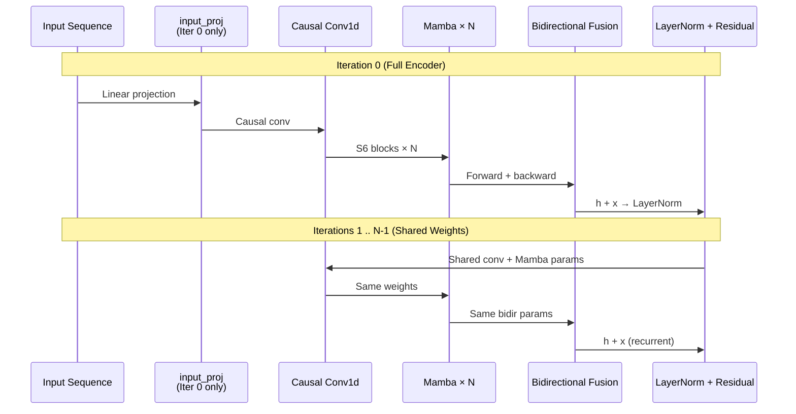

---
tags:
  - MachineLearning
  - DeepLearning
  - ModelTraining
  - TrainingTechnique
  - Optimizer
  - Regularization
  - 概念性
title: CTM - Training System
created: 2026-06-01
---

# CTM - Training System — Training System Design for Deep Learning Models

> [!abstract] Overview
> 深度学习训练系统工程远不止 optimizer.step()。学习率调度、损失曲线设计、梯度管理、早停和参数共享结构共同决定了模型的收敛质量和泛化能力。本文以 CTM 的训练系统为案例，梳理这些通用技术的设计原则和最佳实践。

Related: [[CTM - Loss Functions]] | [[CTM - StockModel Architecture]] | [[CTM - Walk-Forward Validation]] | [[CTM - Ensemble and GBDT]]

---

## 1. Training System Design — Core Principles

### What & Why

训练一个深度学习模型需要回答几个关键问题：

- **学多快？** — 学习率何时大何时小（LR 调度）
- **学什么？** — 目标函数何时引入哪些分量（课程学习/渐进式损失）
- **学不进去？** — 梯度爆炸怎么防（梯度裁剪）
- **何时停？** — 过拟合前怎么自动停止（早停）
- **学几遍？** — 是否让模型反复处理数据以加深表示（循环/共享权重结构）

这些不是孤立的选择——它们必须协同工作。例如，渐进式损失需要配合 LR 调度，早停的 patience 需要配合 LR 衰减的节奏。

### Mathematical / Theoretical Foundation

**学习率调度 (LR Scheduling)**：学习率是训练中最敏感的超参数。单固定 LR 很少是最优的，调度策略带来的收益通常超过其他超参数调优。

| 策略 | 公式 | 效果 |
|------|------|------|
| **线性预热** | $\text{LR} = \text{lr} \times (\alpha + (1-\alpha) \cdot \frac{t}{T})$ | 训练初期稳定优化，防止极端梯度更新 |
| **余弦退火** | $\text{LR} = \frac{1}{2}\text{lr}(1 + \cos(\frac{t}{T}\pi))$ | 从高 LR 平滑衰减到 0 |
| **Step Decay** | $\text{LR} \times \gamma^{\lfloor t / T \rfloor}$ | 阶段性下降 |
| **Cosine Warm Restarts** | 余弦 + 周期性重置 | 跳出局部最小值 |

**线性预热 + 余弦退火** 的组合是目前广泛采用的最佳实践（见 DeiT、ConvNeXt 等现代架构）：

```mermaid
lr: ^
    |       /\
    |      /  \
    |     /    \
    |    /      \
    |   /        \
    |  /          \
    | /            \
    |/              \
    +------------------> epoch
    warmup    cosine decay
```

**梯度裁剪 (Gradient Clipping)**：防止梯度爆炸的标准方法，对 RNN/SSM 尤为重要（它们存在路径长度导致的梯度传播问题）：

$$\mathbf{g} \leftarrow \begin{cases}
\mathbf{g} \cdot \frac{\text{clip\_norm}}{\|\mathbf{g}\|} & \text{if } \|\mathbf{g}\| > \text{clip\_norm} \\
\mathbf{g} & \text{otherwise}
\end{cases}$$

常见 clip_norm 范围：1.0 ~ 10.0。

**早停 (Early Stopping)**：最简单的正则化方法——在验证集指标连续 $p$ 个 epoch 无改善时停止训练：

$$\text{stop if } \max_{i > t-p} \text{metric}_i \leq \text{best\_metric}$$

$p$（patience）的选择需要权衡：太小则训练不充分，太大则增加过拟合风险。经验法则：$p$ 设为预期总 epoch 数的 10%-20%。

**循环共享权重 (Recurrent Shared Weights)**：受 ALBERT (Lan et al., 2019) 启发，在多次迭代中重复使用同一组网络参数，每次迭代的输入是前一次迭代的输出：

$$x^{(0)} = \text{Proj}(x_{\text{in}})$$
$$x^{(k)} = \mathcal{F}(x^{(k-1)}) \quad \text{for } k = 1 \dots N$$

效果：
- **参数效率**：N 次迭代不增加参数量
- **特征精炼**：每次迭代使用同一变换函数逐步优化表示
- **正则化**：共享权重迫使每步学到通用的变换，防止某一层过拟合到特定特征

> [!note] 与循环神经网络的关系
> 循环共享权重本质上是将深度展开为时间（"深度"→"迭代"），与 RNN 的"时间展开为深度"相反。ALBERT 将其用于 Transformer 层，CTM 的 RecurrentCTM 将其用于 SSM 层。

### Key Design Dimensions & Tradeoffs

| 设计维度 | 选项 | 取舍 |
|---------|------|------|
| **LR 调度** | warmup+cosine / step / constant / restarts | warmup+cosine 最通用；step 适合阶段性任务 |
| **LR 调度器组合** | SequentialLR / Chain / MultiStep | SequentialLR 解耦性好；MultiStep 简单但不够平滑 |
| **损失引入** | 全量 / 渐进式(课程) / 分阶段 | 全量快但可能不稳定；渐进式稳但需更多调参 |
| **梯度裁剪** | 按值 / 按范数 / None | 按范数保留方向信息；按值直接截断 |
| **早停指标** | validation loss / 领域指标(Sharpe/IC) | 领域指标直接挂钩最终目标但噪声大 |
| **权重共享** | 无共享 / 跨层共享(ALBERT式) / 循环迭代 | 无共享容量大；共享减少参数但可能欠拟合 |

---

## 2. Case Study: CTM Implementation

### How CTM Applies These Principles

CTM 的训练系统将这些通用技术组合成一个完整的管线：

| 通用技术 | CTM 的具体选择 | 动机 |
|---------|---------------|------|
| LR 调度 | SequentialLR: LinearLR + CosineAnnealingLR | 解耦预热和衰减，独立控制 warmup epochs |
| 渐进式损失 | 3 阶段 Sharpe Loss 引入 (delay → ramp → steady) | Sharpe Loss 的全序列梯度在初期破坏性大 |
| 梯度裁剪 | `clip_grad_norm_(max_norm=grad_clip)` | SSM 路径上的梯度爆炸风险 |
| 早停 | 监控 validation Sharpe，patience=10 | 金融时序各窗口收敛速度差异大 |
| 共享权重 | RecurrentCTM: N 次迭代共享 Mamba 参数 | 类似 ALBERT 的参数共享 |
| 结果跟踪 | `TrainingResult` dataclass | 记录单模型和集成指标便于分析 |

**完整训练循环**：

```python
for window_idx, (train_data, val_data) in enumerate(walk_forward_splits):
    model = RecurrentCTM(...)
    optimizer = AdamW(model.parameters(), lr=lr, weight_decay=wd)
    scheduler = SequentialLR(optimizer, schedulers=[
        LinearLR(start_factor=0.01, end_factor=1.0, total_iters=warmup_epochs),
        CosineAnnealingLR(T_max=total_epochs - warmup_epochs),
    ], milestones=[warmup_epochs])

    for epoch in range(total_epochs):
        # Step 1: 计算有效 lambda（渐进式损失调度）
        lambda_sharpe = get_effective_lambda(
            global_step, warmup_steps, ramp_steps, target_lambda
        )
        # Step 2: 训练一个 epoch
        loss = train_epoch(model, optimizer, train_data, lambda_sharpe)
        # Step 3: 验证
        val_sharpe = validate(model, val_data)
        # Step 4: 更新学习率
        scheduler.step()
        # Step 5: 早停检查
        if val_sharpe > best_sharpe:
            best_sharpe = val_sharpe
            no_improve = 0
            torch.save(model.state_dict(), f"window_{window_idx}.pt")
        else:
            no_improve += 1
            if no_improve >= patience:
                break
```

### Design Decisions & Rationale

**1. 为什么 SequentialLR 而非 CosineAnnealingWarmRestarts？**

`SequentialLR` 将预热和衰减解耦为两个独立调度器，通过 `milestones` 定义切换点。这使得 warmup epoch 数可以独立调整，不会因为总 epoch 数变化而产生 LR 跳跃。相比之下，`CosineAnnealingWarmRestarts` 的预热和衰减耦合在一起，灵活性较低。

**2. 为什么 Sharper Loss 需要渐进式引入？**

```python
def get_effective_lambda(step, warmup_steps, ramp_steps, target_lambda):
    if step < warmup_steps:
        return 0.0                    # Phase 1: MSE-only
    elif step < warmup_steps + ramp_steps:
        ramp = (step - warmup_steps) / ramp_steps
        return target_lambda * ramp   # Phase 2: 线性引入
    else:
        return target_lambda          # Phase 3: 稳定训练
```

Sharpe Loss 的梯度通过整个预测序列传播——这意味着它同时影响了 K 个时间步的预测。训练初期模型输出随机，这种全局梯度会引发大幅震荡。先以 MSE 稳定回归能力（逐点学习），再渐进引入 Sharpe Loss（序列级学习），模拟了从"学会走路"到"学会跑步"的课程学习过程。

**3. 为什么早停用 Sharpe 而非 validation loss？**

Validation loss 是模型与标签的误差，Sharpe 是预测序列的交易价值。这两个指标并不完全正相关——有时 loss 更低但 Sharpe 更低（模型过拟合到噪声）。以 Sharpe 为早停指标直接优化最终目标，更符合金融预测的实际需求。

### RecurrentCTM — Parameter Sharing in Depth

**通用模式**：CTM 的 RecurrentCTM 是 ALBERT 风格参数共享在 SSM 架构上的应用。



| 组件 | Iteration 0 | Iterations 1..N-1 |
|------|-------------|-------------------|
| `input_proj` | 独立参数 | **跳过**（仅首次需要） |
| Causal Conv1d | 初始化 | **完全共享** |
| Mamba × N | 初始化 | **完全共享** |
| Bidirectional | 初始化 | **完全共享** |
| Residual | LayerNorm(h + x) | LayerNorm(h + x) |

**参数效率对比**：

| 配置 | 参数 | 内存 |
|------|------|------|
| 单次前向 | $P$ | $P$ |
| N 次迭代（不共享） | $N \times P$ | $N \times P$ |
| N 次迭代（RecurrentCTM） | $P + P_{\text{proj}}$ | $\approx P$ |

**渐进式 Dropout**：深层迭代中 dropout 率递减，因为深层特征已经经过多次精炼，需要更少的随机性：

$$p_{\text{current}} = p_{\text{loop}} \times \left(1.0 - 0.7 \times \frac{i-1}{n-2}\right)$$

其中 $i$ 是迭代索引 ($i \ge 1$)，$n$ 是总迭代次数。首次迭代使用完整 dropout $p_{\text{loop}}$，后续迭代逐步衰减到 $0.3 \times p_{\text{loop}}$。

### TrainingResult — Result Tracking

```python
@dataclass
class TrainingResult:
    best_sharpe: float                    # 验证集最佳 Sharpe（早停判断）
    epochs_run: int                       # 实际运行 epoch 数
    window_metrics: List[dict]            # 逐 epoch 指标记录

    # Ensemble 模式额外字段
    ctm_sharpe: float | None = None       # CTM 模型验证 Sharpe
    gbdt_ic: float | None = None          # GBDT 验证集 IC
    ensemble_sharpe: float | None = None  # 集成融合后的 Sharpe
    ctm_weight: float | None = None       # 融合权重
    gbdt_importance: float | None = None  # GBDT 贡献度
```

`TrainingResult` 不仅记录最佳指标，还保存每个 epoch 的 `window_metrics` 历史。这对分析训练动态至关重要：是否过拟合（验证指标先升后降）、是否欠拟合（指标持续上升未收敛）、LR 调度是否合适（训练 loss 是否平滑下降）。

> [!tip] Walk-Forward 中的早停配合
> 在 [[CTM - Walk-Forward Validation]] 中，每个时间窗口独立执行早停。某些窗口可能在几十个 epoch 内收敛，而高波动期可能需要更多迭代。早停确保每个窗口都使用恰好足够的容量，避免对平稳期的过拟合。

---

## 3. Key Takeaways

### When to Use These Techniques

| 技术 | 适用场景 |
|------|---------|
| **Warmup + Cosine Decay** | 几乎所有深度学习任务（从 ResNet 到 Transformer 到 SSM）|
| **渐进式损失引入** | 损失分量之间存在"基础能力 → 高级能力"依赖关系时 |
| **梯度裁剪** | RNN、SSM、Mamba、LSTM 等循环路径模型；深度 Transformer |
| **早停** | 所有存在过拟合风险的场景（尤其是小样本、高噪声数据）|
| **循环共享权重** | 需要模型深度但参数量受限时；多轮特征精炼而非单次前向 |
| **结构化结果记录** | 需要比较实验、重放训练过程的任何项目 |

### Common Pitfalls to Avoid

- **LR 预热不足**：预热步数太少（<10 steps）对 Transformer/SSM 不够，建议至少 5-10 epoch（或 10%-20% 总步数）
- **SequentialLR 的 milestones 配置错误**：milestones 值必须在对应调度器的 `total_iters` / `T_max` 范围内，否则子调度器不会被触发
- **过早引入复杂损失**：训练前 10% 的 epoch 使用简化目标（如纯 MSE）几乎总是有助于稳定收敛
- **早停 patience 过大**：patience 越大，模型在验证指标平台期浪费的 epoch 越多。经验值：总 epoch 的 10%-20%
- **循环共享的过度迭代**：N 次迭代中 N 过大时，共享权重的表示能力饱和，继续迭代只会增加计算成本而不提升性能。建议 N=2~4
- **只记录最终指标不记录过程**：没有 `window_metrics` 历史，训练不稳定、过拟合、LR 不匹配等问题无法诊断

### Related Concepts & Further Reading

- [[CTM - Loss Functions]] — 被渐进式引入的复合损失函数
- [[CTM - Walk-Forward Validation]] — 与早停配合的时间序列交叉验证
- [[CTM - Ensemble and GBDT]] — 训练结果中 CTM 与 GBDT 的集成
- ALBERT (Lan et al., 2019) — 跨层参数共享的先驱
- Loshchilov & Hutter, *SGDR: Stochastic Gradient Descent with Warm Restarts* (2017) — 余弦退火 LR 调度
- Smith, *Cyclical Learning Rates for Training Neural Networks* (2017) — 学习率调度的系统研究
