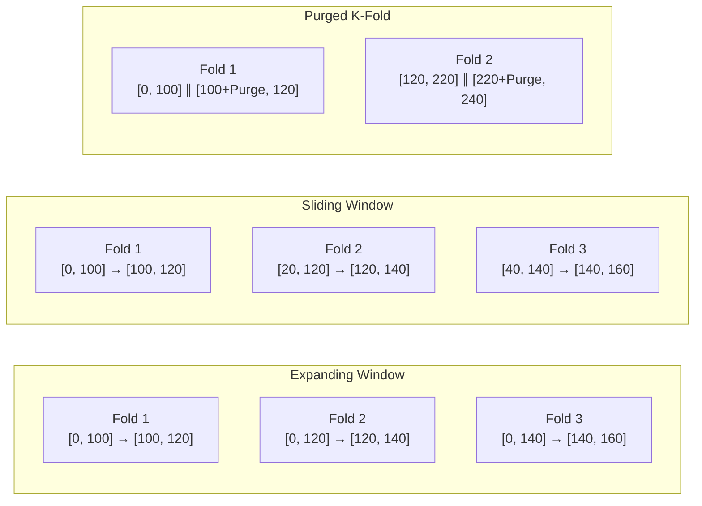

---
tags:
  - MachineLearning
  - TimeSeries
  - Validation
  - FinancialModeling
  - 机器学习/时间序列
  - 机器学习/模型验证
title: CTM - Walk-Forward Validation
created: 2026-06-01
---

# CTM — 时间序列验证策略

## 1. 时间序列验证 — 核心原理

### 概念与动机

标准的 K 折交叉验证假设数据是 **IID（独立同分布）** 的。它将观测值随机打乱并分配到各折中。对于时间序列，这是灾难性的——未来信息会泄漏到训练集中，产生极度乐观的验证指标。

时间序列数据有两个破坏 IID 假设的特性：

1. **时间依赖性**：观测值 $x_t$ 与 $x_{t-1}, x_{t-2}, \dots$ 相关
2. **非平稳性**：数据生成过程随时间变化（状态转换、波动率聚类）

**基本原则**：训练集必须完全早于验证集。没有例外。

### 数学/理论基础

设 $D = \{(x_1, y_1), \dots, (x_N, y_N)\}$ 为按时间排序的数据。有效的时间序列划分是一个满足以下条件的划分 $D = D_{\text{train}} \cup D_{\text{val}}$：

$$\max\{t : (x_t, y_t) \in D_{\text{train}}\} < \min\{t : (x_t, y_t) \in D_{\text{val}}\}$$

**标签泄漏（Label Leakage）** 更为隐蔽。如果 $y_t$ 是一个前视标签（例如，为期 $H$ 的未来收益），那么 $(x_t, y_t)$ 使用了 $[t, t+H]$ 的信息。两个相邻样本 $(x_t, y_t)$ 和 $(x_{t+1}, y_{t+1})$ 的标签窗口 $[t, t+H]$ 与 $[t+1, t+H+1]$ 存在重叠，这意味着它们在 $[t+1, t+H]$ 之间共享了未来信息。

> [!warning] 标签泄漏（Label Leakage）
> 这是时间序列 ML 中最隐蔽的头号 bug。没有 purge period 的标准 Walk-Forward 仍然会泄漏——最后一个训练样本与第一个验证样本的标签窗口重叠。务必设置 `purge_period >= H`。

### 关键设计维度与权衡

**训练窗口策略**：

| 策略 | 描述 | 优点 | 缺点 |
|------|------|------|------|
| Expanding Window（扩展窗口） | 训练集随时间增长，始终从 $t=0$ 开始 | 后期折的训练数据最大化 | 陈旧数据可能有害；计算成本不断增长 |
| Sliding Window（滑动窗口） | 训练集大小固定，向前滑动 | 计算量可控；适应状态转换 | 丢弃了可能仍有价值的旧数据 |
| Purged K-Fold（带冲刷的 K 折） | 按时间顺序的 K 折，每折在训练/验证之间有冲刷缓冲区 | 更多验证折数（更好的统计估计） | 实现复杂；每折样本更少 |

**步长决策**：

- $step\_size < val\_window$：验证窗口重叠，评估更密集
- $step\_size = val\_window$：不重叠，更干净但迭代次数更少
- 步长通常与自然频率挂钩（如月、季度）

**冲刷周期（Purge Period）**：必须至少等于标签窗口 $H$。更大的 purge period 虽然更安全但会丢弃更多数据。



## 2. 案例分析：CTM 实现

### Walk-Forward 窗口生成器

CTM 采用标准的滑动窗口方案并加入了 purge period 缓冲区。核心是一个生成器函数 `walk_forward_windows()`，它为每折返回索引边界。

```python
def walk_forward_windows(N, train_window, val_window, purge_period, step_size=21):
    """
    Generator yielding (pos, train_end, purge_end, val_end) tuples.

    Parameters
    ----------
    N : int
        Total data length
    train_window : int
        Training window size (time steps)
    val_window : int
        Validation window size
    purge_period : int
        Purge buffer between train and validation
    step_size : int
        Step forward per iteration, default 21 trading days (~1 month)
    """
    pos = 0
    while pos + train_window + purge_period + val_window <= N:
        train_end = pos + train_window
        purge_end = train_end + purge_period
        val_end = purge_end + val_window
        yield (pos, train_end, purge_end, val_end)
        pos += step_size
```

### 设计决策与理由

| 决策 | CTM 的选择 | 理由 |
|------|-----------|------|
| 窗口策略 | Sliding（固定 3 年训练集） | 市场会切换状态；5 年前的旧数据往往弊大于利 |
| 步长 | 21 个交易日 | 对应每月重新评估；频率足以捕捉状态切换 |
| Purge period | $H$（标签窗口） | 与前向收益预测窗口匹配；最小安全缓冲区 |
| 验证窗口 | 6 个月 | 足够长以获得可靠的 Sharpe 估计；足够短以避免过拟合到单一状态 |

### 数据提取循环

```python
for pos, train_end, purge_end, val_end in walk_forward_windows(N, ...):
    train_data = data[pos:train_end]       # Training set — no future info
    val_data = data[purge_end:val_end]     # Validation set — isolated by purge buffer

    model.fit(train_data)
    metrics = model.evaluate(val_data)     # Sharpe, IC, etc.
```

### 与集成训练的整合

在 CTM 的 P0 集成中，CTM（Mamba）和 GBDT 模型都在相同的 Walk-Forward 窗口上训练。它们的预测通过窗口级别的 IC-Weighted Fusion 进行融合：

```
Each window:
  CTM training → CTM validation (record validation Sharpe)
  GBDT training → GBDT validation (record validation IC)
  IC-Weighted Fusion → fused window prediction
  Step forward → next cycle
```

> [!note]
> 融合机制详见 [[CTM - Ensemble and GBDT]]，训练编排详见 [[CTM - Training System]]。

## 3. 要点总结

### 适用场景

- **始终使用**于时间序列预测（金融、天气、IoT 传感器数据、需求预测）
- 当数据生成过程稳定且更多数据有助于提升性能时，优先选择 Expanding Window
- 当近期数据主导预测能力时（金融市场），优先选择 Sliding Window
- 当需要更细粒度的验证估计时，优先选择 Purged K-Fold

### 常见陷阱

1. **没有 purge period**：最常见的 bug。如果标签有前视窗口 $H$，训练集和验证集之间必须丢弃至少 $H$ 个样本。否则标签泄漏会导致指标虚高 2-5 倍。
2. **划分前打乱数据**：标准交叉验证库（scikit-learn 的 `cross_val_score`）默认会打乱数据。务必传入 `shuffle=False` 或使用 `TimeSeriesSplit`。
3. **陈旧的数据校准**：如果做特征归一化（Z-Score 等），仅在训练窗口上计算统计量。使用全数据集统计量会将未来信息泄漏到训练中——这是第二层泄漏路径。
4. **步长等于验证窗口大小**：这会浪费数据。使用重叠窗口（更小的步长）以获得更稳健的估计。
5. **未检查标签窗口**：purge period 取决于标签定义。如果改变了预测窗口 $H$，必须相应更新 purge period。

### 相关概念与延伸阅读

- [[CTM - Feature Engineering]] — 因果特征计算（时间安全性的另一半）
- [[CTM - Training System]] — Walk-Forward 如何与学习率调度和早停整合
- [[CTM - Ensemble and GBDT]] — 窗口级别的预测融合
- [[Purged K-Fold Cross-Validation]]（[[De Prado, 2018]]）— 金融 ML 中标签泄漏的权威参考文献
