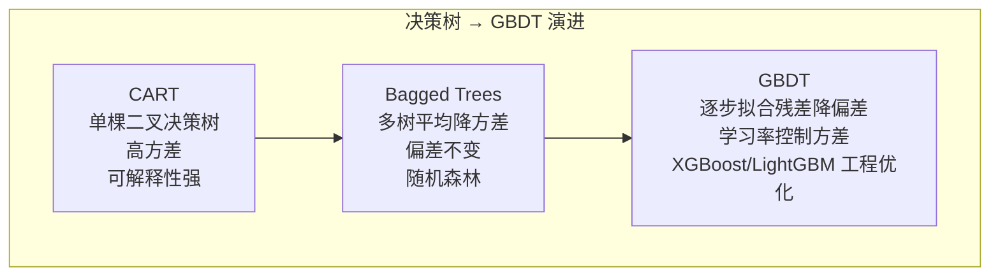
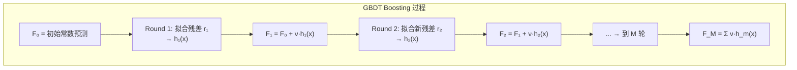
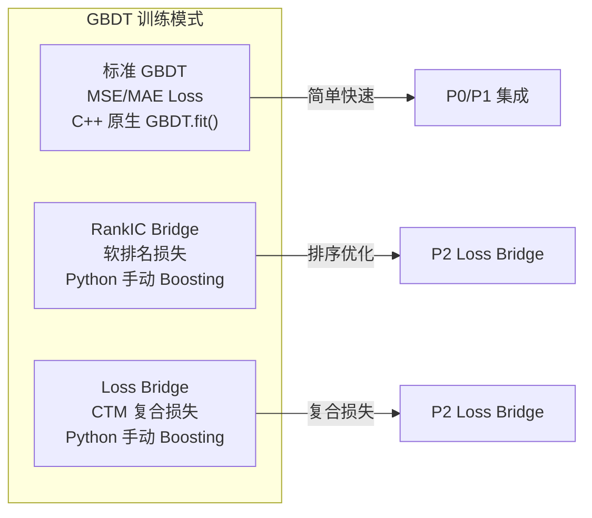

---
tags:
  - MachineLearning
  - DecisionTrees
  - GradientBoosting
  - TreeMethods
  - EnsembleLearning
  - 方法性
title: Decision Trees and GBDT
created: 2026-06-01
---

# Decision Trees and GBDT — From CART to Gradient Boosting and Modern Implementations

> [!abstract] Overview
> 决策树是最直观也是最强大的机器学习模型之一——它以树状决策规则逼近任意函数。但单棵决策树方差极高，需要通过集成方法驯服其不稳定性。梯度提升树（GBDT）通过逐步拟合残差将弱学习器提升为强学习器，是结构化数据建模中应用最广泛的算法之一。本文从 CART 出发，系统梳理 GBDT 的原理和工程实践。

Related: [[Bias-Variance Tradeoff]] | [[Loss Functions - Foundations]] | [[CTM - Ensemble and GBDT]] | [[CTM - Training System]]

---

## 1. Decision Trees and Boosting — Core Principles

### What & Why

决策树通过递归地将特征空间划分为矩形区域，在每个区域内用常数（回归）或多数类（分类）进行预测。其核心优势在于：

- **可解释性**：完整决策路径可追溯
- **非参数化**：无需假设数据分布
- **特征天然处理**：混合类型特征无需归一化
- **自动特征选择**：分裂过程隐式选择重要特征

但单棵树有两个致命问题：高方差（数据微小变化可能导致树结构巨变）和缺乏"增量学习"能力。GBDT 通过 boosting 解决后者，同时通过集成控制前者。



### Mathematical Foundation

#### CART 分裂准则

CART（Classification and Regression Trees）在每个节点寻找最优分裂特征 $j$ 和阈值 $t$：

$$\min_{j, t} \left[ \frac{n_{\text{left}}}{n} G_{\text{left}} + \frac{n_{\text{right}}}{n} G_{\text{right}} \right]$$

其中 $G$ 是节点不纯度度量。常用不纯度函数：

| 不纯度 | 公式 | 特性 |
|-------|------|------|
| **MSE（回归）** | $\frac{1}{n}\sum (y_i - \bar{y})^2$ | 连续目标的标准分裂准则 |
| **Gini（分类）** | $\sum_{k=1}^{K} p_k(1 - p_k)$ | 对多分类友好，计算快 |
| **交叉熵（分类）** | $-\sum_{k=1}^{K} p_k \log p_k$ | 对概率敏感，计算稍慢 |
| **误分类率（分类）** | $1 - \max_k p_k$ | 不推荐——对概率变化不敏感 |

> [!note] Gini vs 交叉熵
> 实践中 Gini 和交叉熵的选择对最终性能影响很小，Gini 计算更快。交叉熵对节点概率的变化更敏感，理论上更偏向于生成更平衡的树。

**树的深度与偏差-方差**：

```mermaid
line: ^
    |   深度=1       深度=3       深度=10+
    | (stump)    (moderate)     (deep tree)
    |
    |  Bias² ↑    Bias² →      Bias² ↓
    |  Var   ↓    Var   →      Var   ↑
    |  Total ≈    Total optimal Total ≈
    |
    +---------------------------------->
```

#### Gradient Boosting 算法

GBDT 的核心思想：每一轮 $m$ 训练一棵新树 $h_m(x)$ 来拟合**当前残差的梯度方向**。

给定损失函数 $L(y, F(x))$，第 $m$ 步的目标是：

$$F_m(x) = F_{m-1}(x) + \nu \cdot h_m(x)$$

$$h_m(x) = \arg\min_h \sum_{i=1}^{N} \left[ -\frac{\partial L(y_i, F_{m-1}(x_i))}{\partial F_{m-1}(x_i)} - h(x_i) \right]^2$$

其中 $\nu$ 是学习率（shrinkage），$-\frac{\partial L}{\partial F_{m-1}}$ 是负梯度（也即**伪残差**）。

**算法流程**：

1. 初始化：$F_0(x) = \arg\min_\gamma \sum L(y_i, \gamma)$
2. 对 $m = 1, \dots, M$：
   a. 计算负梯度：$r_{i,m} = -\left[\frac{\partial L(y_i, F_{m-1}(x_i))}{\partial F_{m-1}(x_i)}\right]$
   b. 拟合回归树：$h_m(x)$ 拟合 $(x_i, r_{i,m})$
   c. 对每个叶节点计算最优步长：$\gamma_{j,m} = \arg\min_\gamma \sum_{x_i \in R_{j,m}} L(y_i, F_{m-1}(x_i) + \gamma)$
   d. 更新：$F_m(x) = F_{m-1}(x) + \nu \cdot \sum_j \gamma_{j,m} \mathbf{1}(x_i \in R_{j,m})$

对于 MSE 损失，负梯度 **恰好等于** 残差 $y_i - F_{m-1}(x_i)$，这体现了"拟合残差"的直观理解。



#### XGBoost 与 LightGBM 核心改进

**XGBoost 的核心贡献**：

- **二阶泰勒近似**：使用损失函数的梯度和黑塞矩阵（Hessian）
  
  $$L \approx \sum_{i} \left[ L(y_i, \hat{y}^{(t-1)}) + g_i f_t(x_i) + \frac{1}{2} h_i f_t^2(x_i) \right] + \Omega(f_t)$$
  
  其中 $g_i = \partial_{\hat{y}} L$, $h_i = \partial^2_{\hat{y}} L$，$\Omega(f_t) = \gamma T + \frac{1}{2}\lambda \sum w_j^2$ 是正则化项。

- **列采样 (Column Subsampling)**：类似随机森林，减少过拟合
- **加权分位数 Sketch**：高效处理大规模数据

**LightGBM 的核心贡献**：

- **GOSS（Gradient-based One-Side Sampling）**：保留大梯度样本，随机采样小梯度样本，大幅减少数据量
- **EFB（Exclusive Feature Bundling）**：将互斥特征捆绑，降低维度
- **叶子节点优先（Leaf-wise）增长**：比 XGBoost 的层级增长（Level-wise）更快收敛但需控制深度

| 特性 | XGBoost | LightGBM |
|------|---------|----------|
| 树增长策略 | Level-wise（层级） | Leaf-wise（最佳叶） |
| 分裂点查找 | 预排序 + 加权分位数 | 直方图算法 |
| 缺失值处理 | 自动学习分裂方向 | 直方图自带 |
| 内存效率 | 需预存排序数据 | 直方图占用小 |
| 小数据集 | 稳定高效 | 可能过拟合（需调 `num_leaves`）|
| 大数据集 | 较慢 | **极快** |
| 默认正则化 | 强（$\lambda, \gamma$ 默认 > 0） | 弱（需更多调参） |

### Key Design Dimensions & Tradeoffs

| 设计维度 | 选项 | 取舍 |
|---------|------|------|
| **树数量 M** | 100 ~ 10000+ | 越多偏差越低但计算量越大，且过拟合风险增加 |
| **学习率 $\nu$** | 0.01 ~ 0.3 | 越小越需更多树，泛化越好 |
| **树深** | 3 ~ 15 | 越深捕获更多交互但方差越大 |
| **子采样** | 0.5 ~ 1.0 | 降方差但增加偏差 |
| **列采样** | 0.5 ~ 1.0 | 类似随机森林，减少特征冗余 |
| **叶节点最小样本数** | 1 ~ 100+ | 越大树越保守，防止过拟合 |

---

## 2. Case Study: CTM Context

### Why GBDT for CTM Ensemble

CTM 选择 GBDT（LightGBM）作为深度神经网络的集成伙伴，并非偶然。从偏差-方差角度，GBDT 提供了 DNN 所缺乏的互补特性：

| 维度 | CTM (DNN/SSM) | GBDT (LightGBM) |
|------|--------------|-----------------|
| **特征处理** | 隐式表示学习 | 显式特征分裂 |
| **序列建模** | 天然支持（SSM/Mamba） | 无，需手工构造时序特征 |
| **损失灵活性** | 任意可微损失 | 需损失+梯度+黑塞 |
| **方差水平** | 高（种子敏感） | 低（学习率收缩） |
| **可解释性** | 差（黑盒） | 中（特征重要性） |

> [!tip] CTM 如何弥补 GBDT 的两大短板
> 1. **时序建模缺失**：GBDT 无法直接处理序列结构，CTM 的隐藏态（P1 特征增强）为 GBDT 注入了时序表示
> 2. **复杂损失限制**：GBDT 传统上只能优化简单损失，CTM 的 Loss Bridge（P2）将 Sharpe/Directional/Pinball 桥接到 GBDT，突破了这一限制

### GBDT in CTM Training Pipeline

在 [[CTM - Ensemble and GBDT]] 的 P0 和 P1 阶段，GBDT 使用 LightGBM + MSE 损失，特征以手工特征为主：

```python
# CTM Ensemble 中 GBDT 的典型配置
gbdt_params = {
    "objective": "mse",
    "num_leaves": 63,            # 2^6 - 1, 中等树容量
    "learning_rate": 0.05,       # 低学习率 + 多树
    "n_estimators": 500,         # 足够的 boosting 轮次
    "subsample": 0.8,            # 行采样防过拟合
    "colsample_bytree": 0.8,     # 列采样降方差
    "min_child_samples": 20,     # 叶节点最小样本
    "reg_lambda": 1.0,           # L2 正则化
    "reg_alpha": 0.1,            # L1 正则化
}
```

在 [[CTM - Ensemble and GBDT]] 的 P2 阶段（Loss Bridge），GBDT 不再使用内置的 MSE objective，而是通过 Python 手动 boosting 循环拟合 CTM 复合损失：

```python
def manual_gbdt_boost(X, y, F_init, loss_fn, n_trees, lr):
    F = F_init.copy()
    trees = []
    for _ in range(n_trees):
        # 计算梯度（复合损失的负梯度）
        loss, grad, hess = loss_fn(y, F)
        # 训练一棵回归树拟合负梯度
        tree = LightGBMRegressor(n_leaf=63)
        tree.fit(X, -grad)
        # 叶子节点最优步长（牛顿步）
        leaf_idx = tree.apply(X)
        for leaf in np.unique(leaf_idx):
            mask = leaf_idx == leaf
            F[mask] += lr * np.sum(-grad[mask]) / max(np.sum(hess[mask]), 1e-6)
        trees.append(tree)
    return F, trees
```



### GBDT and Walk-Forward Validation

在 [[CTM - Walk-Forward Validation]] 中，GBDT 在每个时间窗口独立训练。由于 GBDT 训练快且鲁棒（对初始化不敏感），它不需要早停机制——直接训练满 `n_estimators` 棵树并使用早停的早期停止版本（validation metric 的 early stopping）。

---

## 3. Key Takeaways

### When to Use GBDT

| 场景 | 推荐 | 理由 |
|------|------|------|
| 结构化/表格数据 | **首选 GBDT** | 无需大量调参即达顶尖性能 |
| 特征意义明确 | GBDT | 显式分裂可解释 |
| 序列/文本/图像数据 | DNN | GBDT 无法直接处理序列 |
| 异构数据（混合类型） | GBDT | 天然处理分类+数值特征 |
| 需要概率校准 | GBDT + Platt Scaling | 原始输出非良好概率 |
| 推理延迟敏感 | GBDT（LightGBM） | 单树推理极快 |
| 数据量极大（>1M 样本） | LightGBM / CatBoost | 直方图算法效率高 |

### Common Pitfalls to Avoid

- **树太多 + 学习率太高**：经典组合——模型复杂度过高导致过拟合。经验法则：学习率 0.01-0.1，配合 500-2000 棵树。
- **LightGBM 的 `num_leaves` 远大于 $2^{\text{max_depth}}$**：`num_leaves` 是 LightGBM 中最敏感的参数，默认 31 对应深度 5。设置为 255 却不限制 `max_depth` 可能构造出极深的不平衡树。
- **分类特征的序数编码**：LightGBM 原生支持分类特征，应使用 `categorical_feature` 参数而非 one-hot 编码（减少维度膨胀）。
- **忽视列采样**：colsample_bytree=0.6-0.8 几乎总是提升泛化，且不增加训练时间。
- **在时序数据中不做严格的训练/测试划分**：GBDT 的样本假设独立同分布，时序预测必须使用 Walk-Forward 或滑动窗口，避免时间穿越。

### Related Concepts & Further Reading

- [[Bias-Variance Tradeoff]] — 偏差-方差分解理解 GBDT 的 Boosting 策略
- [[Loss Functions - Foundations]] — GBDT 的损失函数框架（MSE, MAE, Huber, Cross-Entropy）
- [[CTM - Ensemble and GBDT]] — CTM 中 DNN + GBDT 集成的完整工程实现
- [[CTM - Training System]] — 与 GBDT 联合训练的训练流程
- [[CTM - Walk-Forward Validation]] — GBDT 在时间序列交叉验证中的应用
- **Friedman, J. (2001)** — Greedy Function Approximation: A Gradient Boosting Machine（GBDT 基础论文）
- **Chen & Guestrin (2016)** — XGBoost: A Scalable Tree Boosting System
- **Ke et al. (2017)** — LightGBM: A Highly Efficient Gradient Boosting Decision Tree
- **Prokhorenkova et al. (2018)** — CatBoost: Unbiased Boosting with Categorical Features
