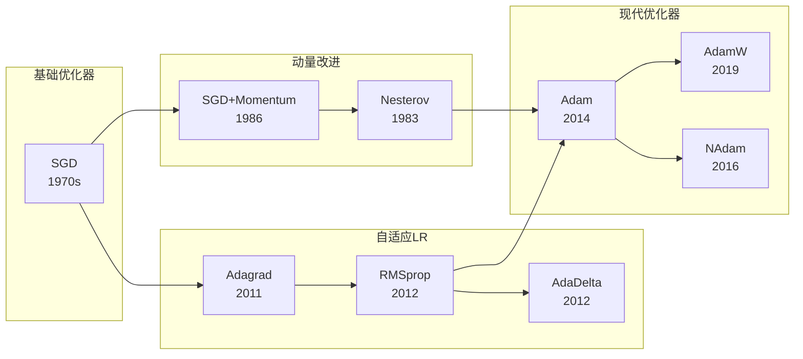
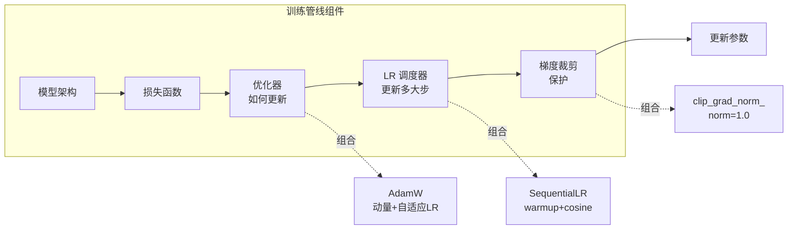

---
tags:
  - MachineLearning
  - DeepLearning
  - Optimizer
  - TrainingTechnique
  - Calculus
  - Math
  - 原理性
title: Gradient Descent and Optimizers
created: 2026-06-01
---

# Gradient Descent and Optimizers — From SGD to AdamW and Learning Rate Scheduling

> [!abstract] Overview
> 梯度下降是深度学习优化的核心引擎。从最基础的 SGD 到现代自适应优化器（Adam、AdamW），再到学习率调度和梯度裁剪，这些技术共同构成了让模型高效收敛的工具箱。本文梳理优化器的演化脉络和设计哲学，并以 CTM 训练系统中的 AdamW + SequentialLR + 梯度裁剪组合作为实践案例。

Related: [[CTM - Training System]] | [[CTM - Loss Functions]] | [[Backpropagation]] | [[Regularization]]

---

## 1. Gradient-Based Optimization — Core Principles

### What & Why

梯度下降的核心思想很简单：沿损失函数梯度的负方向更新参数，使损失逐步降低。

$$\theta_{t+1} = \theta_t - \eta \cdot \nabla_\theta \mathcal{L}(\theta_t)$$

但现实中的优化远比这个公式复杂。关键挑战包括：

- **收敛速度**：平坦区域梯度小，训练变慢。如何加速？
- **震荡抑制**：陡峭方向上的梯度震荡如何缓解？
- **超参数敏感**：学习率 $\eta$ 对 SGD 极其敏感，如何降低调参成本？
- **泛化能力**：优化器的选择影响模型最终泛化性能，如何平衡训练速度和泛化？

这些挑战驱动了从 SGD 到 AdamW 的优化器演化。

### Mathematical / Theoretical Foundation

**SGD (Stochastic Gradient Descent)**：每次迭代使用一个 mini-batch 计算梯度，而非全数据集。

$$\theta_{t+1} = \theta_t - \eta \cdot g_t, \quad g_t = \frac{1}{|B|} \sum_{i \in B} \nabla_\theta \mathcal{L}_i(\theta_t)$$

SGD 的梯度估计有噪声，但这个噪声有时反而有助于逃离局部极小值——这是典型的"噪声有益"场景。但 SGD 对学习率极其敏感，且在某些曲率方向上容易震荡。

**带动量的 SGD (SGD with Momentum)**：引入动量项累积历史梯度，类似物理中的惯性。

$$v_t = \beta v_{t-1} + \eta \nabla_\theta \mathcal{L}(\theta_t)$$
$$\theta_{t+1} = \theta_t - v_t$$

动量解决了两个问题：平坦区域加速（历史梯度累积）、陡峭方向抑制震荡（梯度方向变化时惯性平滑）。标准 $\beta$ 值通常为 0.9。

> [!note] Nesterov Momentum (NAG)
> Nesterov Accelerated Gradient 是先"看一步"再计算梯度：$v_t = \beta v_{t-1} + \eta \nabla_\theta \mathcal{L}(\theta_t - \beta v_{t-1})$。它比标准动量收敛更快，在某些凸优化问题上理论收敛速度最优。

**Adam (Adaptive Moment Estimation)**：动量的自适应版本——为每个参数维护独立的学习率。

$$\begin{aligned}
m_t &= \beta_1 m_{t-1} + (1-\beta_1) g_t \\
v_t &= \beta_2 v_{t-1} + (1-\beta_2) g_t^2 \\
\hat{m}_t &= m_t / (1-\beta_1^t), \quad \hat{v}_t = v_t / (1-\beta_2^t) \\
\theta_{t+1} &= \theta_t - \eta \cdot \hat{m}_t / (\sqrt{\hat{v}_t} + \epsilon)
\end{aligned}$$

Adam 的优点：
- **每个参数独立学习率**：稀疏特征获得大更新，密集特征获得小更新
- **自适应步长**：自动适应梯度尺度，降低 LR 调参成本
- **动量 + 自适应**：结合两者优势

**AdamW (Adam with Decoupled Weight Decay)**：Adam 的一个关键修正。原版 Adam 将 weight decay 合并到梯度中（$\mathcal{L} + \frac{\lambda}{2}\|w\|^2$），但 Adam 的自适应步长会干扰 weight decay 的正则化效果。AdamW 将其解耦：

Adam 的权重衰减（错误耦合）：
$$m_t = \beta_1 m_{t-1} + (1-\beta_1) (g_t + \lambda \theta_t)$$

AdamW 的权重衰减（正确解耦）：
$$\theta_{t+1} = \theta_t - \eta \cdot (\hat{m}_t / (\sqrt{\hat{v}_t} + \epsilon) + \lambda \theta_t)$$

> [!warning] Adam vs AdamW 的选择
> 对于 Transformer、SSM 等现代架构，AdamW 几乎总是优于 Adam。Loshchilov & Hutter (2019) 的实验表明，解耦 weight decay 后 AdamW 在每个学习率下都 Pareto 优于 Adam。对于简单 MLP 或小模型，两者差异不大。

**优化器演化对比**：

| 优化器 | 核心创新 | 优点 | 缺点 |
|--------|---------|------|------|
| SGD | 随机梯度下降 | 简单、泛化好、理论成熟 | 收敛慢、LR 敏感、易震荡 |
| SGD+Momentum | 历史梯度累积 | 加速收敛、抑制震荡 | 增加一个超参数 $\beta$ |
| Adam | 每参数自适应 LR | LR 不敏感、适合稀疏梯度 | 泛化不如 SGD、weight decay 耦合问题 |
| AdamW | 解耦 weight decay | 继承 Adam 优点 + 更好泛化 | 增加一个超参数（但影响小） |
| NAdam | Adam + Nesterov | 加速收敛 | 额外计算成本 |
| RMSprop | 梯度平方的移动平均 | 适合非平稳目标 | 未公开发表，无严格理论 |



**学习率调度 (LR Scheduling)**：优化器决定更新方向，调度器决定步长。两者互补：

| 调度策略 | 公式 | 适用场景 |
|---------|------|---------|
| **Constant** | $\eta_t = \eta_0$ | 小模型、简单任务 |
| **Step Decay** | $\eta_t = \eta_0 \cdot \gamma^{\lfloor t/T \rfloor}$ | 阶段性训练 |
| **Exponential Decay** | $\eta_t = \eta_0 \cdot e^{-kt}$ | 平滑衰减 |
| **Cosine Annealing** | $\eta_t = \frac{1}{2}\eta_0(1+\cos(t\pi/T))$ | 通用最佳实践 |
| **Linear Warmup + Cosine** | Warmup 线性增 + Cosine 衰减 | 现代架构标配 |
| **ReduceLROnPlateau** | 验证指标停滞时衰减 | 不知道总 epoch 数时 |

**梯度裁剪 (Gradient Clipping)**：当梯度范数超过阈值时缩放到阈值，防止梯度爆炸：

$$\mathbf{g} \leftarrow \min\left(1, \frac{\text{clip\_norm}}{\|\mathbf{g}\|}\right) \cdot \mathbf{g}$$

剪裁方式有三种：

| 方式 | 公式 | 效果 |
|------|------|------|
| **按范数** | $\mathbf{g} \leftarrow \mathbf{g} \cdot \min(1, \text{clip\_norm}/\|\mathbf{g}\|)$ | 保留方向信息，最常用 |
| **按值** | $g_i \leftarrow \max(\min(g_i, \text{clip\_value}), -\text{clip\_value})$ | 直接截断，大梯度信息丢失 |
| **全局范数** | $\|\mathbf{g}\|_{\text{total}} = \sqrt{\sum \|\mathbf{g}_i\|^2}$ | 所有参数共用阈值 |

> [!tip] 梯度裁剪不是正则化
> 梯度裁剪控制的是训练过程的稳定性，不是模型的复杂度。它防止的是"偶然的大梯度"而非"持续的大权重"。需要与 weight decay、dropout 等正则化手段配合使用。

### Key Design Dimensions & Tradeoffs

| 设计维度 | 选项 | 取舍 |
|---------|------|------|
| **基础优化器** | SGD / Momentum / Adam / AdamW | SGD 泛化好但调参难；AdamW 通用但参数量大的模型可能有额外内存开销 |
| **学习率调度** | constant / step / cosine / warmup+cosine | warmup+cosine 最通用；constant 适合已充分调参 |
| **梯度裁剪阈值** | 1.0 / 5.0 / 10.0 / None | 太小限制训练能力；太大失去保护作用；None 适合无梯度爆炸风险的架构 |
| **Batch Size** | 小 / 中 / 大 | 小 batch 噪声大但泛化好；大 batch 效率高但可能泛化差 |
| **Weight Decay** | 0.01 / 0.1 / 1.0 | 太大欠拟合；太小正则化不足 |



---

## 2. Case Study: CTM Context

### How CTM Applies These Principles

CTM 的训练管线使用了一套标准但经过金融时序适配的优化配置：

| 组件 | CTM 选择 | 说明 |
|------|---------|------|
| **基础优化器** | AdamW | 解耦权重衰减，适合 SSM 架构训练 |
| **LR 调度** | SequentialLR: LinearLR → CosineAnnealingLR | 预热 + 余弦退火的标准组合 |
| **梯度裁剪** | `clip_grad_norm_(max_norm=grad_clip)` | 防御 SSM 循环路径上的梯度爆炸 |
| **Warmup Epochs** | 可配置（通常 5-10） | 从 1% LR 开始，线性增长到目标 LR |
| **Weight Decay** | `weight_decay=wd` 参数 | 模型级别的 L2 正则 |

**完整的优化配置**：

```python
optimizer = AdamW(
    model.parameters(),
    lr=learning_rate,
    weight_decay=weight_decay
)

scheduler = SequentialLR(
    optimizer,
    schedulers=[
        LinearLR(
            start_factor=0.01,
            end_factor=1.0,
            total_iters=warmup_epochs
        ),
        CosineAnnealingLR(
            T_max=total_epochs - warmup_epochs
        ),
    ],
    milestones=[warmup_epochs]
)
```

### Design Decisions & Rationale

**1. 为什么用 SequentialLR 而非 CosineAnnealingWarmRestarts？**

SequentialLR 将预热和衰减解耦为两个独立调度器。这使得 warmup epoch 数可以独立调整，不会因为总 epoch 数变化而产生 LR 跳跃。CosineAnnealingWarmRestarts 的预热和衰减耦合在一起，灵活性较低。此外，在 Walk-Forward 交叉验证中，每个窗口的总 epoch 可能不同（早停触发的时间不同），解耦的 SequentialLR 更易于适配。

**2. 为什么需要梯度裁剪？**

CTM 使用的 SSM 架构（Mamba）存在循环路径——即使 SSM 缓解了 RNN 的长期依赖问题，梯度仍然通过序列长度传播。在金融时序（通常 500+ 时间步）上，梯度爆炸风险仍然存在。`clip_grad_norm_` 提供了一个安全网。

**3. AdamW 的 weight decay 如何与 L2 正则区分？**

AdamW 的 weight decay 独立于梯度步骤，而 L2 正则化将惩罚项加入损失函数梯度中。在一般 SGD 中两者等价，但在 Adam 式自适应优化器中，L2 正则会被自适应步长缩放，而 AdamW 的 decoupled weight decay 不受影响。详见 [[Regularization#^weight-decay-vs-l2]]。

---

## 3. Key Takeaways

### When to Use Each Optimizer

| 场景 | 推荐优化器 | 理由 |
|------|-----------|------|
| **小规模 MLP、线性模型** | SGD + Momentum | 简单、泛化好、调参成本低 |
| **CNN、ResNet 架构** | SGD + Momentum | 经典组合，经验丰富 |
| **Transformer、BERT** | AdamW | 自适应 LR 应对不同 token 频率，解耦 weight decay |
| **SSM、Mamba** | AdamW | 同 Transformer 类似，自适应更稳定 |
| **大规模预训练** | AdamW + Warmup | 标配组合 |
| **强化学习、GAN** | Adam | 适合不稳定训练过程 |
| **稀疏数据集** | Adam / AdamW | 自适应 LR 更好处理稀疏特征 |

### Common Pitfalls to Avoid

- **优化器和调度器不匹配**：某些调度器需要优化器的特定状态（如 SGD 的动量 buffer），更换优化器后可能失效
- **CosineAnnealing 在早停后的跳跃**：如果使用余弦退火且训练被早停中断，下一次训练的 LR 不应重置到 0 附近
- **梯度裁剪阈值过大**：clip_norm 设为 10 以上时几乎从不触发，失去了保护作用
- **Adam 的 weight decay 问题**：使用 Adam 时注意正则化效果被自适应步长扭曲，建议升级到 AdamW
- **Warmup 不足**：预热 epoch 数太少（< 5），Transformer/SSM 可能在初期产生 NaN

### Related Concepts & Further Reading

- [[Backpropagation]] — 优化器依赖的梯度从何而来
- [[Regularization]] — 优化器之外的防止过拟合技术
- [[CTM - Training System]] — CTM 训练系统的完整管线
- [[CTM - Loss Functions]] — 优化器优化的目标函数
- Kingma & Ba, *Adam: A Method for Stochastic Optimization* (ICLR 2015)
- Loshchilov & Hutter, *Decoupled Weight Decay Regularization* (AdamW, ICLR 2019)
- Loshchilov & Hutter, *SGDR: Stochastic Gradient Descent with Warm Restarts* (2017)
- Smith, *Cyclical Learning Rates for Training Neural Networks* (2017)
