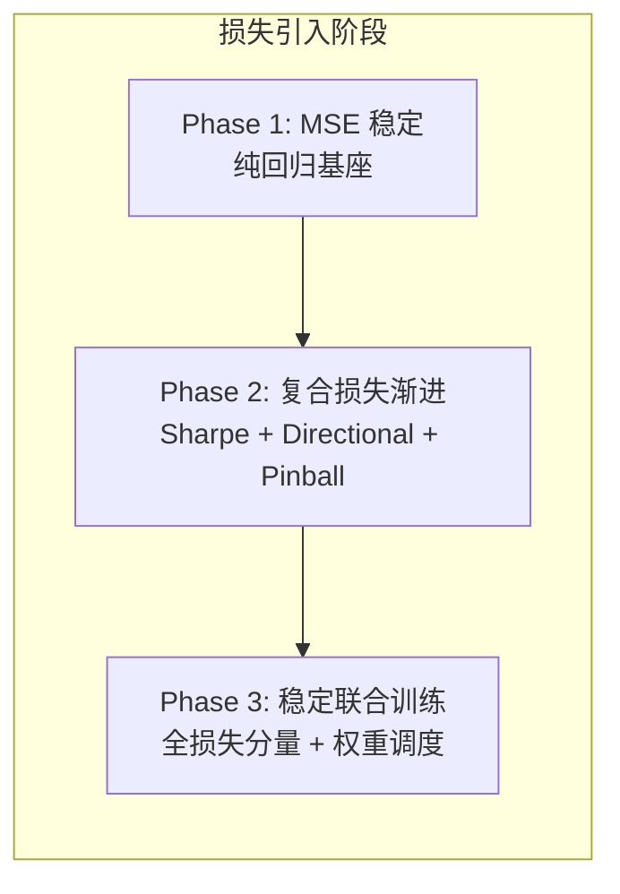

---
tags:
  - MachineLearning
  - LossFunction
  - Regression
  - Classification
  - Optimization
  - 概念性
title: Loss Functions - Foundations
created: 2026-06-01
---

# Loss Functions — Foundations: MSE, MAE, Huber, Cross-Entropy, and Beyond

> [!abstract] Overview
> 损失函数是监督学习的核心——它量化了模型预测与真实标签之间的差异，驱动梯度下降优化。不同任务（回归、分类、排序）需要不同性质的损失函数，而选择不当会导致收敛缓慢、梯度不稳定甚至完全失败。本文系统梳理基础损失函数及其特性，为理解 CTM 的复合损失打下基础。

Related: [[CTM - Loss Functions]] | [[CTM - Training System]] | [[Neural Network]] | [[Decision Trees and GBDT]]

---

## 1. Foundational Loss Functions — Core Principles

### What & Why

损失函数（Loss Function）定义了一个优化问题：给定预测 $\hat{y}$ 和真实值 $y$，损失 $L(y, \hat{y})$ 必须满足：

- **可微性**（或至少 subgradient 存在）——梯度是反向传播的前提
- **一致性** —— 最小化损失应趋近于优化目标（如 accuracy、Sharpe 等）
- **数值稳定性** —— 不应在输入范围内产生极端梯度

不同任务对损失函数的几何性质有根本不同的要求：

| 任务 | 输出空间 | 损失核心需求 | 典型损失 |
|------|---------|-------------|---------|
| **回归** | $\mathbb{R}$（连续值） | Lp 距离度量 | MSE, MAE, Huber |
| **二分类** | $\{0, 1\}$ | 概率校准 + 决策边界 | BCE, Hinge |
| **多分类** | $\{1, \dots, K\}$ | 概率分布拟合 | Categorical Cross-Entropy |
| **排序** | 序数关系 | 相对顺序而非绝对值 | Pairwise Hinge, RankNet, ListNet |

### Mathematical Foundation

#### 回归损失

**MSE（均方误差）**：（也称为 L2 Loss）

$$\text{MSE} = \frac{1}{N} \sum_{i=1}^{N} (y_i - \hat{y}_i)^2$$

$$\frac{\partial \text{MSE}}{\partial \hat{y}_i} = \frac{2}{N} (\hat{y}_i - y_i)$$

梯度与残差成**线性比例**——大残差产生大梯度，加速收敛但对异常值敏感。

**MAE（平均绝对误差）**：（也称为 L1 Loss）

$$\text{MAE} = \frac{1}{N} \sum_{i=1}^{N} |y_i - \hat{y}_i|$$

$$\frac{\partial \text{MAE}}{\partial \hat{y}_i} = \frac{1}{N} \text{sign}(\hat{y}_i - y_i)$$

梯度是分段常数——对异常值鲁棒，但接近最优时梯度不衰减，导致在最优值附近震荡。

**Huber Loss**：结合了 MSE 和 MAE 的优点：

$$\text{Huber}(y, \hat{y}) = \begin{cases}
\frac{1}{2}(y - \hat{y})^2 & \text{if } |y - \hat{y}| \leq \delta \\
\delta \cdot |y - \hat{y}| - \frac{1}{2}\delta^2 & \text{otherwise}
\end{cases}$$

其中 $\delta$ 是阈值，控制 L2 区域到 L1 区域的切换点。Huber 在近零处平滑（像 MSE），在大偏差处线性（像 MAE），是回归任务的**默认选择**。

| 特性 | MSE | MAE | Huber |
|------|-----|-----|-------|
| 异常值敏感度 | 高（二次放大） | 低（线性） | 中等（可调 $\delta$） |
| 最优梯度行为 | 逐渐衰减 | 不衰减（震荡） | 近零衰减，远端稳定 |
| 可微性 | 处处光滑 | 在 $y=\hat{y}$ 不可微 | 处处一阶可微 |
| 收敛速度 | 前期快 | 全程慢 | 综合最优 |
| 适用场景 | 噪声小、需快速收敛 | 异常值多、鲁棒性优先 | **通用回归首选** |

#### 分类损失

**Binary Cross-Entropy（BCE）**：二分类标准损失。

$$\text{BCE} = -\frac{1}{N} \sum_{i=1}^{N} \left[ y_i \log(\hat{y}_i) + (1 - y_i) \log(1 - \hat{y}_i) \right]$$

其中 $\hat{y}_i = \sigma(z_i)$，$\sigma$ 是 sigmoid 函数。

$$\frac{\partial \text{BCE}}{\partial z_i} = \hat{y}_i - y_i$$

BCE 的梯度形式简洁——预测与标签的差值，实际等价于**逻辑回归的梯度**。这一形式确保了概率校准的一致性。

**Categorical Cross-Entropy**：多分类扩展，配合 Softmax 输出：

$$\text{CCE} = -\frac{1}{N} \sum_{i=1}^{N} \sum_{k=1}^{K} y_{i,k} \log(\hat{y}_{i,k})$$

$$\frac{\partial \text{CCE}}{\partial z_{i,k}} = \hat{y}_{i,k} - y_{i,k} \quad (\text{with Softmax})$$

交叉熵损失在概率空间中衡量分布差异，其梯度形式（预测减真实）在所有分类任务中高度一致。

> [!note] 为什么分类不用 MSE？
> MSE 配合 sigmoid 输出会产生饱和梯度——当 $\hat{y}$ 接近 0 或 1 时，sigmoid 导数为零，MSE 梯度被 s'(z) 衰减到消失。BCE 的交叉熵项恰好抵消了 sigmoid 的饱和效应，使得梯度在全区间保持有效。

### Key Design Dimensions & Tradeoffs

| 维度 | 回归 | 分类 | 排序 |
|------|------|------|------|
| **输出层** | Linear（无激活） | Sigmoid / Softmax | Linear + 排序层 |
| **梯度行为** | 与残差成比例 | 与概率差成比例 | 基于对比对 |
| **异常值容忍** | Huber 可调 | Hinge Loss 更鲁棒 | Pairwise 天然鲁棒 |
| **概率校准** | 无需求 | BCE/CCE 自带校准 | 需额外 Platt Scaling |
| **复合需求** | 可加项组合 | 可加项或层次化 | 复杂损失桥接 |

---

## 2. Case Study: CTM Context

### How CTM Builds on These Foundations

CTM 的复合损失不是凭空创造，而是在这些基础损失函数上组合而成：

| 基础损失 | CTM 中的角色 | 转换方式 |
|----------|-------------|---------|
| **MSE** | 回归基座，稳定早期训练 | 直接使用 |
| **BCE** | Directional Loss 的底层形式 | 符号分类转化为 BCE |
| **Pinball (分位数)** | Huber 的思想扩展——分段线性损失 | 非对称 MAE，分位数外线性 |
| **Ranking (可微排序)** | 从排序损失衍生，近似 Spearman IC | Soft ranking + Pearson |
| **Sharpe** | 专有损失，无直接基础对应 | 以 MSE 基座为基础渐进引入 |

**渐进式损失部署**：

CTM 的渐进式引入策略（从 Phase 1 纯 MSE 过渡到 Phase 3 全损失）直接来源于对基础损失函数特性的理解——MSE 提供稳定的逐点梯度，Sharpe 等序列级损失需要等模型有一定预测能力后再加入，否则梯度噪音过大会破坏收敛。

> [!tip] 损失选择的层次
> 从基础损失到复合损失的路径：先用 MSE 做稳定预训练 → 确认回归能力后 → 逐步叠加针对性损失。这个"基础 → 专业"的层次化设计是 [[CTM - Training System]] 的核心原则之一。

### Loss Bridge with GBDT

在 [[CTM - Ensemble and GBDT]] 的 P2 级集成中，CTM 的复合损失通过 Loss Bridge 桥接到 GBDT。每项基础损失的桥接复杂度不同：

| 损失基础 | 桥接方式 | 实现难度 |
|---------|---------|---------|
| MSE | `autograd.grad()` 直接求导 | 低（原生支持） |
| BCE-like Directional | 解析一阶梯度 | 低 |
| Pinball | 解析分段一阶 + 对角黑塞 | 中 |
| Sharpe | 全序列解析梯度 + 黑塞近似 | 高 |
| RankIC | 软排名 + autograd + 常数黑塞 | 高 |

---

## 3. Key Takeaways

### When to Use Each Loss

| 场景 | 推荐损失 | 理由 |
|------|---------|------|
| 通用回归，噪声较小 | MSE | 收敛快，梯度稳定 |
| 回归，异常值多 | Huber ($\delta=1.0$) | 鲁棒性与收敛速度的平衡 |
| 回归，异常值极多 | MAE | 对极端值完全鲁棒 |
| 二分类概率输出 | BCE | 概率校准一致，梯度有效 |
| 多分类概率输出 | CCE | 标准多分类方案 |
| 序数/排序优化 | Pairwise / Listwise Loss | 直接优化排序目标 |
| 复合需求（如量化交易） | 复合损失（MSE + BCE + 排序等） | 单损失无法覆盖多目标 |

### Common Pitfalls to Avoid

- **在分类任务中使用 MSE**：梯度被 sigmoid 饱和效应消除，收敛极慢。如果看到训练 loss 降得极慢，先检查损失函数。
- **Huber $\delta$ 设置不合理**：$\delta$ 过大退化为 MSE，过小退化为 MAE。经验法则：$\delta$ 设为目标变量标准差的 1/4 到 1/2。
- **忽略梯度尺度差异**：复合损失中不同项的梯度尺度可能相差几个量级，需要显式权重的尺度调节（如 CTM 中的 `get_effective_lambda`）。
- **直接优化排名指标**：NDCG、RankIC 等排序指标不可微，必须用软近似或 surrogate loss，不能直接作为损失函数。
- **损失函数与评估指标不一致**：如果评估用 MAE 但训练用 MSE，优化方向与评估目标可能不同步。

### Related Concepts & Further Reading

- [[CTM - Loss Functions]] — CTM 的 5 分量复合损失完整定义
- [[CTM - Training System]] — 渐进式损失调度的训练系统工程
- [[CTM - Ensemble and GBDT]] — Loss Bridge 中损失桥接的实现
- [[Bias-Variance Tradeoff]] — 偏差-方差分解与损失选择的关系
- **Huber, P. (1964)** — Robust Estimation of a Location Parameter（Huber Loss 起源）
- **Friedman, J. (2001)** — Greedy Function Approximation（GBDT 损失框架）
- **Grover et al. (2019)** — Differentiable Sorting and Ranking（软排名理论基础）
