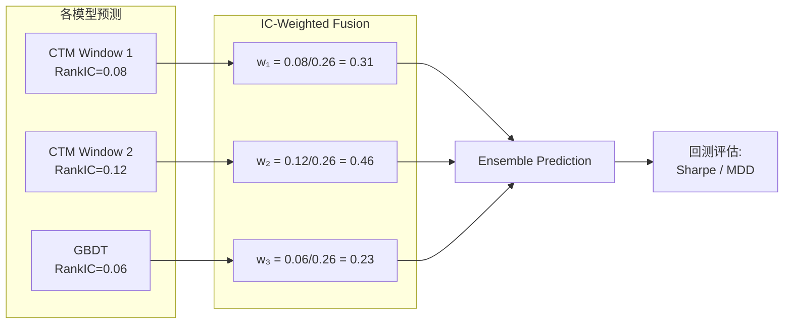

---
tags:
  - MachineLearning
  - Evaluation
  - Classification
  - Regression
  - Ranking
  - 机器学习/评估指标
  - 概念性
title: ML Evaluation Metrics
created: 2026-06-01
---

# ML Evaluation Metrics — Measuring Model Performance Across Domains

> [!abstract] Overview
> 评估指标是衡量模型预测能力的尺度。分类模型看排序和校准，回归模型看偏差和方差，排序模型关注序的一致性，金融模型追求风险调整后的收益。不同指标揭示了模型的不同侧面，选择合适的指标比提升一个百分点更有意义。本文覆盖四类指标的数学定义、行为特性和选择依据，并以 CTM 为例说明在复杂系统中的指标设计。

Related: [[CTM - Ensemble and GBDT]] | [[CTM - Loss Functions]] | [[CTM - Walk-Forward Validation]] | [[CTM - Trading Execution]] | [[Loss Functions - Foundations]]

---

## 1. Evaluation Metrics — Core Principles

### Classification Metrics

分类任务的评估不仅要回答"对了多少"，还要区分不同类型的错误。

**准确率（Accuracy）**

$$\text{Accuracy} = \frac{TP + TN}{TP + TN + FP + FN}$$

简单直观，但**对类别不平衡极度敏感**——95% 负样本时全部预测负类也能得到 95% 准确率。

**精确率（Precision）与召回率（Recall）**

$$\text{Precision} = \frac{TP}{TP + FP} \quad \text{Recall} = \frac{TP}{TP + FN}$$

- Precision：预测为正类中真实正类的比例——"说对的比例"
- Recall：真实正类中被找出的比例——"找到的比例"

两者通常不可兼得，通过 **F1-Score** 调和：

$$F_1 = 2 \cdot \frac{\text{Precision} \cdot \text{Recall}}{\text{Precision} + \text{Recall}}$$

F1 是 Precision 和 Recall 的**调和均值（harmonic mean）**，对极端值敏感——两者都高时 F1 才高。

**AUC-ROC (Area Under the ROC Curve)**

ROC 曲线绘制不同阈值下 **TPR**（真正率 = Recall）和 **FPR**（假正率）的关系：

$$\text{TPR} = \frac{TP}{TP + FN} \quad \text{FPR} = \frac{FP}{FP + TN}$$

AUC-ROC 的数值意义：随机抽取一个正样本和一个负样本，模型将正样本排在负样本之前的概率。AUC = 1 为完美排序，AUC = 0.5 为随机。

| 指标 | 范围 | 不平衡鲁棒性 | 关注点 |
|------|------|-------------|--------|
| Accuracy | $[0, 1]$ | **差** | 整体正确率 |
| Precision | $[0, 1]$ | 中等 | 假正代价 |
| Recall | $[0, 1]$ | 中等 | 漏报代价 |
| F1 | $[0, 1]$ | 中等 | Precision 与 Recall 的权衡 |
| AUC-ROC | $[0.5, 1]$ | **好** | 排序质量（阈值无关） |

### Regression Metrics

回归指标度量预测值 $\hat{y}_i$ 与真实值 $y_i$ 之间的偏差。

**MSE (Mean Squared Error)**

$$\text{MSE} = \frac{1}{n}\sum_{i=1}^{n}(y_i - \hat{y}_i)^2$$

平方误差放大了大偏差的惩罚。单位与原始变量不同（平方单位）。

**MAE (Mean Absolute Error)**

$$\text{MAE} = \frac{1}{n}\sum_{i=1}^{n}|y_i - \hat{y}_i|$$

绝对误差，单位一致，对异常值不如 MSE 敏感。

**R² (Coefficient of Determination)**

$$R^2 = 1 - \frac{\sum (y_i - \hat{y}_i)^2}{\sum (y_i - \bar{y})^2}$$

衡量模型相对于简单均值基线所解释的方差比例。R² = 1 为完美拟合，R² = 0 等价于预测均值，R² < 0 意味着模型比均值更差。

| 指标 | 范围 | 异常值敏感度 | 单位 | 解释性 |
|------|------|-------------|------|--------|
| MSE | $[0, \infty)$ | **高** | 平方单位 | 差 |
| MAE | $[0, \infty)$ | 中等 | 一致 | 好 |
| R² | $(-\infty, 1]$ | 高 | 无量纲 | 非常好（归一化）|

### Ranking Metrics

排序指标关注预测相对顺序的正确性，而非绝对值。在推荐系统、信息检索和量化金融中至关重要。

**Spearman Rank Correlation**

$$\rho = 1 - \frac{6\sum d_i^2}{n(n^2 - 1)}$$

其中 $d_i$ 是第 $i$ 个样本在真实值和预测值中的排序差。Spearman $\rho$ 衡量**单调关系强度**，不要求线性。

**Rank IC (Information Coefficient)**

$$\text{RankIC} = \text{Spearman}(\text{Rank}(\hat{y}), \text{Rank}(y))$$

RankIC 是 Spearman 相关系数在因子评价中的常用名称。正值表示模型预测与真实值排序正相关。

**NDCG (Normalized Discounted Cumulative Gain)**

$$\text{DCG}_k = \sum_{i=1}^{k} \frac{2^{\text{rel}_i} - 1}{\log_2(i + 1)} \quad \text{NDCG}_k = \frac{\text{DCG}_k}{\text{IDCG}_k}$$

NDCG 关注**排序头部**的质量，对排名靠前的结果赋予更高权重。适用于 top-K 推荐和检索场景。

| 指标 | 范围 | 关注点 | 依赖阈值 | 适用场景 |
|------|------|--------|---------|---------|
| Spearman $\rho$ | $[-1, 1]$ | 全局序 | 否 | 因子评价、相关性分析 |
| RankIC | $[-1, 1]$ | 全局序 | 否 | 量化因子、特征筛选 |
| NDCG | $[0, 1]$ | Top-K 序 | 否 | 推荐系统、信息检索 |

### Financial Metrics

金融领域有自己独特的评估体系，关注**风险调整后的收益**而非单纯的预测精度。

**Sharpe Ratio**

$$\text{Sharpe} = \frac{\mathbb{E}[R_p - R_f]}{\sigma(R_p)}$$

衡量单位风险（波动率）所获得的超额收益。Sharpe > 1 通常被视为可接受，> 2 为优秀。

**Max Drawdown (MDD)**

$$\text{MDD} = \max_{t} \left( \frac{\text{Peak}_t - \text{Trough}_t}{\text{Peak}_t} \right)$$

最大回撤衡量从峰值到谷值的最大跌幅，反映策略最坏的损失情况。

| 指标 | 范围 | 衡量对象 | 高值含义 |
|------|------|---------|---------|
| Sharpe Ratio | $(-\infty, \infty)$ | 收益/风险性价比 | 越高越好 |
| Max Drawdown | $[0, 1]$ | 最差场景损失 | 越低越好 |
| Calmar Ratio | $(-\infty, \infty)$ | 年化收益/MDD | 越高越好 |

### Metric Selection Tradeoff

```mermaid
flowchart TD
    Task[任务类型] --> Class[分类]
    Task --> Reg[回归]
    Task --> Rank[排序]
    Task --> Fin[金融]
    
    Class --> ClassImb{类别平衡?}
    ClassImb -->|是| Acc[Accuracy]
    ClassImb -->|否| AUROC[AUC-ROC / F1]
    
    Reg --> Outlier{异常值敏感?}
    Outlier -->|是| MAE[MAE]
    Outlier -->|否| MSE[MSE + R²]
    
    Rank --> Head{关注前几名?}
    Head -->|是| NDCG[NDCG@K]
    Head -->|否| Spearman[Spearman + RankIC]
    
    Fin --> Risk{关注风险?}
    Risk -->|是| Sharpe[Sharpe + MDD]
    Risk -->|否| RankIC[RankIC 即可]
```

> [!note] 指标的选择就是目标函数的选择
> 在机器学习项目中，**评估指标**和**损失函数**不一定相同。评估指标定义"什么是好模型"，损失函数定义"梯度往哪个方向走"。两者一致时（如直接优化 Sharpe 或 RankIC）通常效果最好。见 [[CTM - Loss Functions]]。

---

## 2. Case Study: CTM Implementation

### How CTM Applies These Principles

CTM 是一个从序列预测到交易执行的端到端系统，在多个层次上使用不同的评估指标：

| 层次 | 使用的指标 | 作用 |
|------|-----------|------|
| **模型训练** | RankIC Loss（直接优化）| 梯度通过 Spearman 排序相关性传播 |
| **模型选择** | Validation Sharpe | 早停依据，直接挂钩最终收益 |
| **模型融合** | IC-weighted Ensemble | 用验证集 RankIC 为各模型分配融合权重 |
| **回测评估** | Sharpe、MDD、Calmar Ratio | 完整策略表现评估 |

**RankIC Loss**：CTM 的训练损失直接以 RankIC（Spearman 相关性）为目标：

$$\mathcal{L}_{\text{RankIC}} = 1 - \text{Spearman}(\hat{y}, y)$$

这使模型从训练第一天起就关注**排序质量**而非数值拟合，与金融预测"相对强弱才重要"的特性一致。

**IC-Weighted Fusion**：多个模型（CTM + GBDT + 各窗口）的预测通过验证集 RankIC 加权融合：

$$\hat{y}_{\text{ensemble}} = \sum_{m} \frac{\text{RankIC}_m}{\sum_j \text{RankIC}_j} \cdot \hat{y}_m$$



> [!tip] RankIC 作为统一指标
> 在 CTM 中，RankIC 承担了双重角色——既是训练阶段的损失函数，又是融合阶段的权重依据。这种设计确保了模型选择和模型融合的**目标一致性**：你评估模型的方式就是你优化它的方式。详见 [[CTM - Ensemble and GBDT]]。

---

## 3. Key Takeaways

### When to Use Which Metric

| 场景 | 推荐指标 | 原因 |
|------|---------|------|
| 类别平衡的分类 | Accuracy | 简单直观 |
| 类别不平衡的分类 | AUC-ROC / F1 | 不受负样本主导，关注排序 |
| 回归中的异常值存在 | MAE | 避免异常值主导 MSE |
| 需要可解释的性能度量 | R² | 归一化到 [0,1] 区间，容易理解 |
| 排序/推荐 Top-K | NDCG@K | 关注最重要的头部结果 |
| 金融因子评价 | RankIC | 关注排序质量，不要求精确数值 |
| 量化策略评估 | Sharpe + MDD | 风险和收益同时考量 |
| 模型融合权重 | IC-weighted | 用验证集表现自适应加权 |

### Common Pitfalls to Avoid

- **只看 Accuracy**：在不平衡数据集上产生误导。95% 负样本时 95% 准确率可能毫无价值
- **忽略 R² 的负值含义**：R² 为负说明模型不如均值预测。但很多框架默认上限为 0，可能导致认为"至少不比均值差"
- **过度优化 Sharpe**：Sharpe 对回测中的罕见极值敏感，优化 Sharpe 容易过拟合到噪声。考虑加入 MDD 约束或使用年化 Sharpe 而非总 Sharpe
- **混淆点估计和分布**：MSE 和 MAE 是点估计指标。当预测分布比均值更有价值时（如分位数回归、区间预测），需要专门的指标
- **指标泄露**：融合时如果使用全样本的 RankIC 而非样本外的验证集 RankIC，发生信息泄露。务必在时间序列中使用 walk-forward 进行评估

### Related Concepts & Further Reading

- [[CTM - Ensemble and GBDT]] — IC-weighted 融合的完整实现
- [[CTM - Loss Functions]] — RankIC Loss 作为可微损失的推导
- [[CTM - Walk-Forward Validation]] — 时间序列中防止指标泄漏的验证策略
- [[CTM - Trading Execution]] — 从 RankIC 到实际交易的延迟和执行成本
- [[Loss Functions - Foundations]] — 损失函数与评估指标的关系
- Hull, *Options, Futures, and Other Derivatives* — Sharpe Ratio 的风险调整框架
- Järvelin & Kekäläinen, *IR evaluation methods for retrieving highly relevant documents* (2002) — NDCG 原始论文
