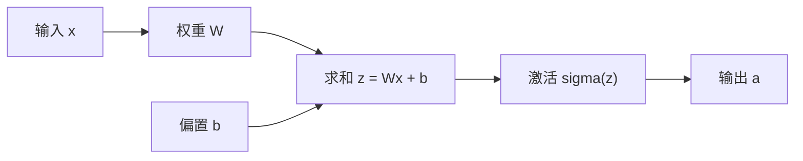
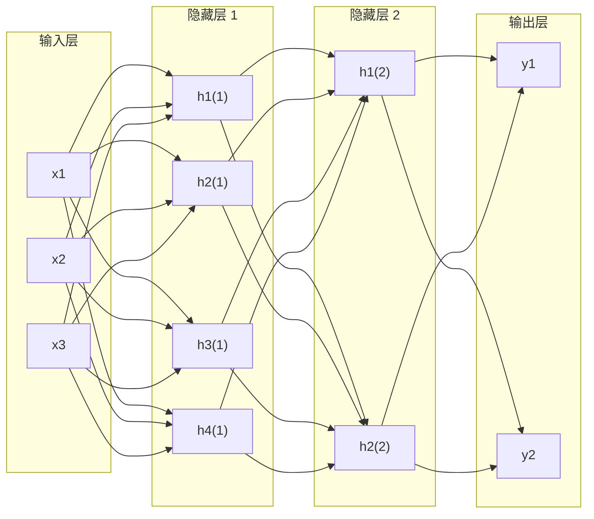

---
tags:
  - MachineLearning
  - DeepLearning
  - Architecture
  - 概念性
title: Neural Network
created: 2025-11-29
modified: 2026-06-01
---

# Neural Network

> [!abstract] Overview
> 神经网络 (Neural Network, NN) 是深度学习的基础构建模块。它模拟生物神经元的信息处理方式，通过多层可微分的非线性变换来学习数据中的复杂模式。本文从生物神经元出发，建立神经网络的数学模型，探讨其核心性质——通用近似定理、深度与宽度的权衡——并对比主要架构变体在 CTM 中的应用。

Related: [[Perceptron and PLA]] | [[CTM - Training System]] | [[Transformer]] | [[Mamba]]

---

## 1. 神经网络原理

### 从生物神经元到数学模型

生物神经元通过树突接收信号，在细胞体内整合，超过阈值后通过轴突传递输出。McCulloch-Pitts 模型 (1943) 将其抽象为一个逻辑单元：

$$y = \mathbb{1}\left(\sum_{i=1}^n w_i x_i + b \geq 0\right)$$

其中 $x_i$ 是输入信号，$w_i$ 是突触权重 (synaptic weight)，$b$ 是偏置 (bias)，$\mathbb{1}(\cdot)$ 是示性函数。

Rosenblatt 的感知机 ([[Perceptron and PLA]], 1958) 首次引入了可学习的权重更新规则，开启了神经网络的学习时代。现代神经元使用可微的激活函数替代示性函数，使整个网络可以通过梯度下降端到端训练。

### 神经元计算

一个神经元的完整计算过程：

$$z = Wx + b$$
$$a = \sigma(z)$$

其中 $W$ 是权重矩阵，$b$ 是偏置向量，$\sigma$ 是激活函数 (activation function)。

### 激活函数

| 激活函数 | 公式 | 值域 | 特点 |
|---------|------|------|------|
| **Sigmoid** | $\sigma(x) = \frac{1}{1+e^{-x}}$ | $(0, 1)$ | 平滑概率输出，梯度饱和 |
| **Tanh** | $\tanh(x) = \frac{e^x - e^{-x}}{e^x + e^{-x}}$ | $(-1, 1)$ | 零中心化，仍存在饱和 |
| **ReLU** | $\text{ReLU}(x) = \max(0, x)$ | $[0, \infty)$ | 非饱和，稀疏激活，Dying ReLU |
| **Leaky ReLU** | $\text{LeakyReLU}(x) = \max(\alpha x, x)$ | $(-\infty, \infty)$ | 缓解 Dying ReLU |
| **GELU** | $\text{GELU}(x) = x \cdot \Phi(x)$ | $(-\infty, \infty)$ | Transformer 标准 |
| **SiLU/Swish** | $\text{SiLU}(x) = x \cdot \sigma(x)$ | $(-\infty, \infty)$ | 自门控，Mamba 使用 |

> [!note] 激活函数的选择原则
> ReLU 及其变体是现代深度网络的默认选择，原因在于其非饱和特性缓解了梯度消失问题。Sigmoid/Tanh 在深层网络中容易导致梯度消失，但在输出层需要概率输出时仍然有用。SiLU 在 Mamba 中被用于门控机制，详见 [[Mamba]]。

---

## 2. 前馈神经网络 (Feedforward Neural Network)

### 网络结构

前馈神经网络 (FFN) 是最基础的神经网络架构，由若干层神经元堆叠而成，信号从输入层向输出层单向传播：

数学上，一个 $L$ 层 FFN 可以表示为函数复合：

$$f(x) = f^{(L)} \circ f^{(L-1)} \circ \cdots \circ f^{(1)}(x)$$

其中第 $l$ 层的计算为：

$$h^{(l)} = \sigma^{(l)}(W^{(l)} h^{(l-1)} + b^{(l)})$$

### 深度 vs 宽度

| 维度 | 深度 (Depth) | 宽度 (Width) |
|------|-------------|-------------|
| 定义 | 网络的层数 $L$ | 每层的神经元数 $n$ |
| 表达力 | 增加深度可以**指数级**减少所需神经元数 | 增加宽度线性增加容量 |
| 训练难度 | 深度网络存在梯度消失/爆炸 | 宽度网络训练更简单 |
| 泛化 | 深度使特征层次化，泛化更好 | 过宽容易过拟合 |
| 参数量 | $O(L \cdot n^2)$ | $O(L \cdot n^2)$ |

> [!tip] 深度与宽度的工程取舍
> 实际问题中，深度和宽度不是二选一的关系。现代实践倾向于"适度深度 + 适度宽度"（如 L=6~96, n=512~4096），配合残差连接 (Residual Connection) 和归一化解决深度训练的困难。Mamba 的宽度/深度解耦设计（[[Mamba]]）在此问题上提供了一个更精细的视角。

---

## 3. 通用近似定理 (Universal Approximation Theorem)

**定理表述**：对于具有线性输出层和至少一个使用"挤压"性质激活函数（如 Sigmoid）的隐藏层的前馈神经网络，只要隐藏层神经元足够多，就可以以任意精度近似定义在 $\mathbb{R}^d$ 有界闭集上的任何连续函数。

$$\forall \epsilon > 0, \exists \text{ NN such that } |f(x) - \text{NN}(x)| < \epsilon, \quad \forall x \in K$$

其中 $K \subset \mathbb{R}^d$ 是有界闭集。

> [!note] 定理的局限
> 通用近似定理保证了**存在性**，但不保证**可学习性**。即使存在一个足够宽的单隐层网络可以近似目标函数，梯度下降也不一定能找到这个最优参数。此外，所需的神经元数量可能指数级大——这正是深度网络的价值所在：深度的层级结构可以指数级降低所需宽度。

### 为什么深度有效？

考虑一个 $L$ 层、每层 $n$ 个神经元的全连接网络。单隐层网络可能需要 $O(\exp(d))$ 个神经元来近似某个函数族，而深度为 $L$ 的网络可能只需要 $O(L^d)$ 个参数。直观地说，深层网络通过**层次化特征提取**——底层学习边缘和纹理，中层学习部件和形状，顶层学习语义概念——实现了参数效率的指数级提升。

---

## 4. 神经网络架构对比

| 架构 | 连接模式 | 核心操作 | 适合任务 | 特性 |
|------|---------|---------|---------|------|
| **FFN** | 全连接 | $Wx + b$ | 分类、回归（固定输入） | 基础构建块，结构简单 |
| **CNN** | 局部连接 | 卷积 (convolution) | 图像、空间数据 | 权重共享，平移不变性 |
| **RNN** | 循环反馈 | 递推 $h_t = f(h_{t-1}, x_t)$ | 序列数据（文本、时序） | 处理变长序列，存在梯度问题 |
| **Transformer** | 自注意力 | Attention($Q,K,V$) | 序列、多模态 | 完全并行，$O(T^2)$ 复杂度 |

> [!note] CNN vs RNN vs Transformer 的演进逻辑
> CNN 通过局部连接和权重共享解决了全连接网络的参数爆炸问题。RNN 通过循环结构解决了变长序列的处理问题。Transformer 通过自注意力解决了 RNN 的并行化限制。Mamba 进一步通过选择性 SSM 在 $O(T)$ 复杂度下实现内容感知能力。每一次架构演进都是在克服前一代的根本瓶颈。

---

## 5. 学习与优化

### 梯度下降与反向传播

神经网络的训练通过**反向传播** (Backpropagation) 计算梯度，配合**梯度下降** (Gradient Descent) 更新参数：

$$\theta_{t+1} = \theta_t - \eta \nabla_\theta L(\theta_t)$$

其中 $\theta$ 是所有参数的集合，$\eta$ 是学习率，$L$ 是损失函数。

反向传播的本质是**链式法则** (Chain Rule) 的工程实现：

$$\frac{\partial L}{\partial W^{(l)}} = \frac{\partial L}{\partial h^{(L)}} \cdot \prod_{k=l+1}^{L} \frac{\partial h^{(k)}}{\partial h^{(k-1)}} \cdot \frac{\partial h^{(l)}}{\partial W^{(l)}}$$

### 梯度消失与爆炸

当网络深度增加时，梯度在反向传播中逐层累积。若每层梯度都小于 1，则梯度趋向于零（梯度消失）；若每层梯度都大于 1，则梯度趋向于无穷（梯度爆炸）。

缓解方法：
- **激活函数选择**：ReLU 替换 Sigmoid/Tanh
- **归一化**：BatchNorm, LayerNorm
- **残差连接**：$x_{l+1} = x_l + F(x_l)$
- **初始化策略**：Xavier, He 初始化
- **梯度裁剪**：对梯度范数设置上限，详见 [[CTM - Training System]]

---

## 6. Case Study: CTM 中的神经网络

CTM (Cross-Time Mamba) 是一个金融时间序列预测模型。尽管其核心是 SSM/Mamba，神经网络的基础知识在 CTM 中无处不在：

| CTM 组件 | 使用的神经网络概念 | 说明 |
|---------|------------------|------|
| **Input Projection** | 线性层 $y = Wx + b$ | 将原始特征映射到模型维度 |
| **Mamba Block** | SiLU 门控 + 线性投影 | 门控机制源自深度学习实践 |
| **RecurrentCTM** | 循环共享权重 | 类似 RNN 的权重复用，见 [[CTM - Training System]] |
| **MLP Head** | 多层前馈网络 | 对 SSM 输出做进一步非线性变换 |
| **Loss Function** | 梯度下降优化 | 端到端训练的核心引擎 |

> [!warning] 从基础到前沿
> CTM 虽是现代架构，但其所有组件——线性投影、激活函数、梯度下降、残差连接、层归一化——都是本节所述基础概念的工程应用。理解神经网络基础是理解任何深度学习系统的前提。

---

## 7. Key Takeaways

### 何时使用神经网络

- **有大量标注数据**：神经网络在大数据场景下优势明显
- **数据有层次化结构**：图像、文本、语音等具有从底层到高层的特征层次
- **问题难以手动设计特征**：端到端学习自动提取特征
- **计算资源充足**：现代神经网络的训练需要 GPU 加速

### 常见陷阱

| 陷阱 | 表现 | 缓解 |
|------|------|------|
| **过拟合** | 训练 loss 低，验证 loss 高 | 正则化、Dropout、早停、数据增强 |
| **梯度消失** | 深层网络训练不动 | ReLU、残差连接、BatchNorm |
| **梯度爆炸** | loss 震荡或溢出 | 梯度裁剪、归一化 |
| **学习率不当** | loss 不下降或震荡 | LR 调度、预热（见 [[CTM - Training System]]） |
| **Dead ReLU** | 神经元永远输出 0 | Leaky ReLU、PReLU、ELU |

### 进一步阅读

- [[Perceptron and PLA]] — 神经网络的起源
- [[CTM - Training System]] — 训练策略的系统化设计
- [[Mamba]] — 状态空间模型的前沿架构
- [[Transformer]] — 现代深度学习的主导架构
- Goodfellow, Bengio, Courville, *Deep Learning* (2016) — 最权威的深度学习教材
- LeCun, Bengio, Hinton, *Deep Learning* (Nature, 2015) — 深度学习宣言
