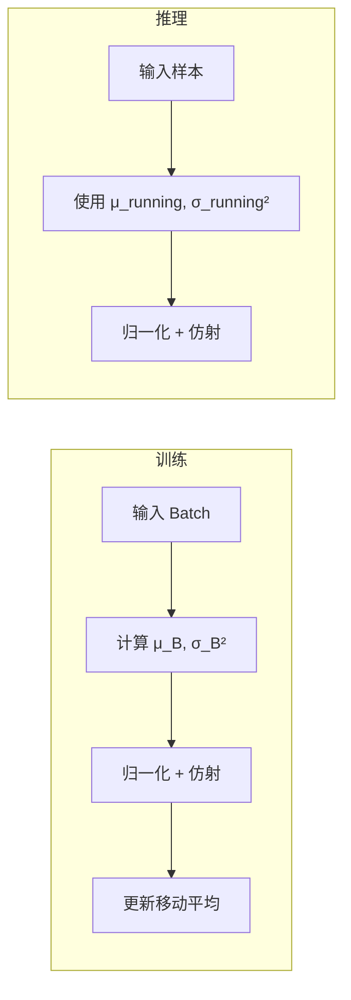
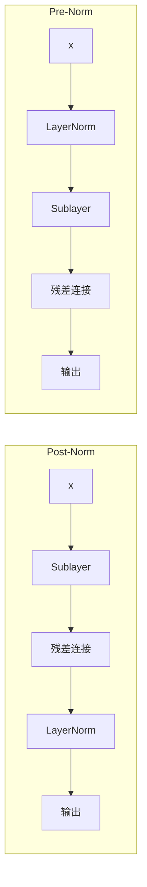

---
tags:
  - MachineLearning
  - DeepLearning
  - TrainingTechnique
  - Normalization
  - Math
  - 概念性
title: Normalization
created: 2026-06-01
---

# Normalization

*Batch Normalization、Layer Normalization 与归一化技术的理论与实践*

> [!abstract] Overview
> 归一化 (Normalization) 是深度学习中不可或缺的组件，它的核心作用是稳定训练过程、加速收敛、并在某些情况下提供正则化效果。从 BatchNorm 到 LayerNorm，每种归一化方法都有其适用的架构和数据场景。理解它们的差异是正确设计深度学习系统的关键。

Related: [[Transformer]] | [[CTM - Training System]] | [[Neural Network]]

---

## 1. Core Principles — Normalization

### Why Normalization Matters

深度网络的训练面临两个密切相关的问题：

- **协变量偏移 (Covariate Shift)**：每层的输入分布随着前一层参数更新而持续变化，导致后层必须不断适应新的分布
- **梯度不稳定**：深层网络中，梯度随层数增加可能指数增长 (爆炸) 或指数衰减 (消失)

归一化通过约束每层的输出分布来解决这些问题：

$$\text{Normalized} = \gamma \cdot \frac{x - \mu}{\sigma} + \beta$$

其中 $\mu$ 和 $\sigma$ 是统计量 (均值和标准差)，$\gamma$ 和 $\beta$ 是可学习的仿射参数 (scale 和 shift)，用于恢复归一化可能损失的表征能力。

> [!note] 仿射参数的作用
> 归一化后数据被限制在零均值单位方差的空间中。但模型可能需要在某些层保留非归一化的分布。$\gamma$ 和 $\beta$ 提供了这种灵活性：如果原始分布对任务最优，模型可以学习 $\gamma = \sigma, \beta = \mu$ 来还原原始分布。

### Batch Normalization

BatchNorm (Ioffe & Szegedy, 2015) 沿着**批量维度** (batch dimension) 计算统计量：

$$\mu_B = \frac{1}{m} \sum_{i=1}^{m} x_i, \quad \sigma_B^2 = \frac{1}{m} \sum_{i=1}^{m} (x_i - \mu_B)^2$$

$$\hat{x}_i = \frac{x_i - \mu_B}{\sqrt{\sigma_B^2 + \epsilon}}, \quad y_i = \gamma \hat{x}_i + \beta$$

| 维度 | 说明 |
|------|------|
| 形状 | $(N, D)$ 中沿 $N$ 计算 |
| 统计范围 | 当前 mini-batch |
| 更新时机 | 每个训练步骤 |

**训练 vs 推理**：这是 BatchNorm 最微妙的设计点。

| 阶段 | 统计量来源 | 行为 |
|------|-----------|------|
| 训练 | 当前 mini-batch 的 $\mu_B, \sigma_B^2$ | 每步不同，引入随机性 (正则化效果) |
| 推理 | 训练期间的**移动平均** $\mu_{\text{running}}, \sigma_{\text{running}}^2$ | 固定，与输入无关 |



**Mini-Batch 依赖性**：BatchNorm 的行为受 batch size 影响显著。

| Batch Size | 统计量可靠性 | 训练稳定性 | 推理行为 |
|-----------|-------------|-----------|---------|
| 大 (>= 64) | 高 | 稳定 | 良好 |
| 中 (16-64) | 中等 | 一般 | 可接受 |
| 小 (< 8) | 差 | 不稳定 | 差 |
| 1 | 无意义 | 无法使用 | 退化 |

> [!warning] BatchNorm 在小 Batch 下的危险
> 当 batch size 很小时，$\mu_B$ 和 $\sigma_B^2$ 的估计方差极大。这不仅影响训练稳定性，还可能导致推理时 $\mu_{\text{running}}$ 和 $\sigma_{\text{running}}^2$ 与真实分布严重偏离。在 batch size = 1 时，$\sigma_B = 0$ 导致归一化崩溃。

**BatchNorm 为什么在视觉任务中有效但在序列任务中受限**：CNN 中每个位置共享同一组统计量，计算稳定。而序列任务中不同时间步的分布可能不同，强行归一化会丢失时间动态信息。

### Layer Normalization

LayerNorm (Ba et al., 2016) 沿着**特征维度** (feature dimension) 计算统计量：

$$\mu_L = \frac{1}{d} \sum_{j=1}^{d} x_j, \quad \sigma_L^2 = \frac{1}{d} \sum_{j=1}^{d} (x_j - \mu_L)^2$$

| 维度 | 说明 |
|------|------|
| 形状 | $(N, T, D)$ 中沿 $D$ 计算 |
| 统计范围 | 单个样本的所有特征 |
| 更新时机 | 每个训练步骤 (无运行时统计量) |

**LayerNorm 与 BatchNorm 的核心差异**：

| 属性 | BatchNorm | LayerNorm |
|------|-----------|-----------|
| 归一化方向 | 跨样本 (沿 batch) | 跨特征 (沿 hidden) |
| 训练/推理一致性 | 不同 (需移动平均) | 相同 (无统计量依赖) |
| Batch Size 敏感度 | 高 | 无 |
| 序列任务适用性 | 差 (时间动态丢失) | 好 (逐时间步独立归一化) |
| RNN/Transformer 表现 | 不稳定 | 稳定 |

**为什么 LayerNorm 是 Transformer 的首选**：

1. **无序列依赖性**：每个时间步独立计算 $\mu_L, \sigma_L^2$，与序列长度和 batch size 无关
2. **训练推理一致**：没有 BatchNorm 中训练用 batch 统计量、推理用移动平均的不一致
3. **梯度稳定性**：LayerNorm 的梯度在输入范围内是线性的，不像 BatchNorm 受 batch 组成变化的影响

### Pre-Norm vs Post-Norm

归一化层在子层中的位置至关重要，衍生出两种主流排布：

| 变体 | 公式 | 效果 |
|------|------|------|
| **Post-Norm** | $\text{LayerNorm}(x + \text{Sublayer}(x))$ | 原始 Transformer 方案 |
| **Pre-Norm** | $x + \text{Sublayer}(\text{LayerNorm}(x))$ | 现代 LLM 标准方案 |



| 属性 | Post-Norm | Pre-Norm |
|------|-----------|----------|
| 训练稳定性 | 差 (需 Warmup) | 好 (无 Warmup 也可) |
| 深层扩展 | 不稳定 (残差路径无归一化) | 稳定 (每层输入已归一化) |
| 最终性能 | 理论上界更高 | 略低于 Post-Norm (充分训练后) |
| Warmup 依赖 | 强依赖 | 几乎不需要 |
| 主流应用 | 原始 Transformer | GPT, LLaMA, Mamba, CTM |

Pre-Norm 的广泛采用是实践经验驱动的：它在深层网络中训练更稳定，对超参数不敏感。

> [!note] Pre-Norm 在 Mamba 中的应用
> [[CTM - Mamba and S6 SSM]] 的 MambaBlock 使用 Pre-Norm 排布：LayerNorm 放在卷积/SSM 子层之前。这使得训练过程无需学习率预热也能稳定收敛，对金融时序这种高噪声场景尤为重要。

### Normalization Family 对比

| 方法 | 归一化维度 | Batch Size 依赖 | 序列任务 | 视觉任务 | 推理一致性 |
|------|-----------|----------------|---------|---------|-----------|
| BatchNorm | 沿 batch | 是 | 差 | 好 | 否 |
| LayerNorm | 沿特征 | 否 | 好 | 一般 | 是 |
| InstanceNorm | 沿空间 | 否 | — | 风格迁移 | 是 |
| GroupNorm | 特征分 group | 弱 | 一般 | 好 (小 batch) | 是 |
| RMSNorm | 沿特征 (无均值) | 否 | 好 | 一般 | 是 |

RMSNorm 是 LayerNorm 的简化变体，去掉了均值归零步骤，只做 $\text{RMS}(x) = \sqrt{\frac{1}{d} \sum x_i^2}$，然后 $x / \text{RMS}(x) \cdot \gamma$。它在 LLaMA 等模型中表现与 LayerNorm 相当但计算更高效。

---

## 2. Case Study: CTM Pre-Norm in MambaBlock

### CTM 的归一化策略

CTM 的 MambaBlock 使用 **Pre-Norm 排布的 LayerNorm**：

```python
class BaseMambaBlock(nn.Module):
    def __init__(self, d_model, d_state, d_conv, dt_rank):
        super().__init__()
        self.norm = nn.LayerNorm(d_model)
        # ... 其他参数

    def forward(self, x):
        residual = x
        x = self.norm(x)                        # Step 1: LayerNorm
        x = self.input_proj(x)                  # Step 2: 卷积 + SSM
        x = self.out_proj(x)
        return x + residual                     # Step 3: 残差连接
```

这种设计的意图很明确：**确保进入 SSM 子层的输入分布稳定**。SSM 对输入的数值范围较为敏感，特别是 $\Delta, B, C$ 参数都依赖输入 $x$ 计算。如果 $x$ 的分布剧烈变化，这些参数的生成也会不稳定。

### 归一化在 CTM 各组件中的作用

| CTM 组件 | 归一化方式 | 原因 |
|---------|-----------|------|
| MambaBlock | LayerNorm (Pre-Norm) | SSM 对输入分布敏感，需稳定输入 |
| RecurrentCTM 迭代 | 每次迭代前独立 LayerNorm | 多次迭代中控制特征范围 |
| MultiAsset Cross-Attention | LayerNorm (Pre-Norm) | 跨资产 $Q$ 和 $K$ 的匹配需稳定分布 |
| MSE / Sharpe Loss Head | 无 (直接线性层) | 输出层通常不需要归一化 |

### 对比：CTM 的 Pre-Norm 与其他选择

| 方案 | CTM 选择 | 其他可能性 | 为什么 CTM 选这个 |
|------|---------|-----------|-----------------|
| 归一化类型 | LayerNorm | BatchNorm / RMSNorm | LayerNorm 无 batch 依赖，适合小 batch 金融数据 |
| 位置 | Pre-Norm | Post-Norm | Pre-Norm 训练稳定，无需 warmup |
| 可学习参数 | 默认初始化 (1, 0) | 其他初始化 | 标准实践，让模型自行调整 |

> [!tip] 金融时序中 LayerNorm 的优势
> CTM 的金融时序数据 batch size 通常较小（高维特征加长序列导致显存受限），BatchNorm 在这种条件下不稳定。LayerNorm 对小 batch 完全不敏感，是自然的选择。

---

## 3. Key Takeaways

### 归一化方法选择指南

| 场景 | 推荐方案 | 原因 |
|------|---------|------|
| 视觉 CNN (大 batch) | BatchNorm | 计算高效，收敛快 |
| 视觉 CNN (小 batch) | GroupNorm + Weight Standardization | 摆脱 batch 依赖 |
| Transformer / 序列模型 | LayerNorm (Pre-Norm) | 无序列依赖，训练稳定 |
| 大模型推理加速 | RMSNorm | 等价于 LayerNorm 但计算更少 |
| 风格迁移 / 图像生成 | InstanceNorm | 保留样本级别对比度 |
| 高噪声小批量金融时序 | LayerNorm (Pre-Norm) | 如 CTM 的设计选择 |

### 常见陷阱

- **BatchNorm 模式切换**：`model.eval()` 时忘记将 BatchNorm 切换到推理模式，使用 batch 统计量而非移动平均，导致推理结果异常
- **Pre-Norm 的位置理解**：Pre-Norm 在残差连接之外，残差路径上的 $x$ 本身未归一化。这在深层网络中导致 $x$ 的范围膨胀，可通过初始化调节
- **LayerNorm 的 $\epsilon$ 被忽略**：$\epsilon$ 过小在 FP16 训练中可能导致除零错误，推荐 $\epsilon = 10^{-5}$ (FP32) 或 $10^{-3}$ (FP16)
- **归一化层的梯度裁剪**：归一化层内部包含除法和开方操作，其梯度可能很大，需要配合梯度裁剪

### 相关概念

- [[Transformer]] — LayerNorm 在 Transformer 中的关键作用
- [[CTM - Mamba and S6 SSM]] — MambaBlock 的 Pre-Norm 设计
- [[CTM - Training System]] — 训练系统中归一化与学习率调度、梯度裁剪的配合
- [[Neural Network]] — 归一化在深度网络中的基础地位
